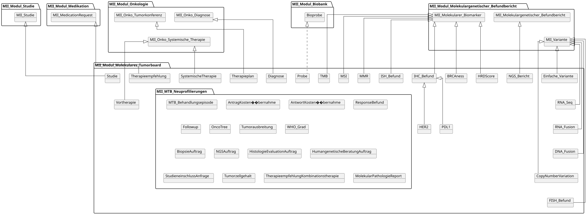
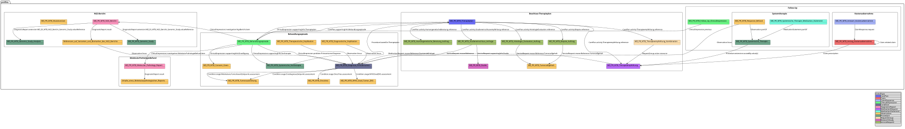

# Anleitung für Implementierende - MII IG Kerndatensatz-Modul Molekulares Tumorboard v2026.0.1

* [**Inhaltsverzeichnis**](toc.md)
* [**Anleitung**](guidance.md)
* **Anleitung für Implementierende**

## Anleitung für Implementierende

Technische Hinweise für DIZ-Implementierende zur Umsetzung der Profile des Moduls **Molekulares Tumorboard** (ETL aus Primärsystemen, FHIR-API, Validierung).

### Profile: Inhalt und Vererbung

Die folgende Übersicht zeigt die Profile des Moduls, ihre Inhalte und ihre Vererbungsbeziehungen. Das Bild kann [einzeln](MII_MTB_Overview.svg) betrachtet und heruntergeladen werden (Bereitstellung als `.svg`).



### Profile: Beziehungen und Referenzen

Die folgende Übersicht stellt die Referenzen der Ressourcen untereinander dar. Die Bilddatei kann zur besseren Darstellung [einzeln](MII-Kerndatensatz-Molekulares-Tumorboard-Beziehungen-und-Referenzen.svg) betrachtet und heruntergeladen werden (Bereitstellung als `.svg`).



### QA und Validierung

Diese Seite dokumentiert den aktuellen Stand der FHIR-Validierung für das MII Modul Molekulares Tumorboard (MTB).

#### Validierungsübersicht

Das Modul wird kontinuierlich gegen den FHIR R4 Standard und die definierten Profile validiert. Da Simplifier keinen öffentlichen QA-Report bereitstellt wie bei klassischen FHIR IG Publisher Builds, dokumentieren wir hier transparent den Validierungsstatus.

#### Bekannte Befunde des Template-Builds (Stand 2026-09)

**Welche Zahl von welchem Terminologieserver stammt, ist hier entscheidend.** Der CI-Build validiert über das Client-Zertifikat der Organisation (der Proxy-Mechanismus des Templates) gegen den **MII-Terminologieserver (SU-TermServ)** und meldet aktuell **91 Fehler**. Ein Build ohne dieses Zertifikat — z. B. lokal — fällt auf den öffentlichen HL7-Server (tx.fhir.org) zurück und meldet **144 Fehler**: die Differenz ist **eine Familie — tx.fhir.org hält die deutschen Terminologie-Inhalte nicht vor, gegen die dieses Modul validiert.** Die Tabelle unten beschreibt diese Nur-Public-TX- Familie; auf dem SU-TermServ tritt nichts davon auf.

| | | |
| :--- | :--- | :--- |
| ATC-Codes (`L01XA02`Carboplatin,`L01DB01`Doxorubicin) „nicht im ValueSet`mii-vs-medikation-atc`" | 24 | das ValueSet des Medikationsmoduls inkludiert BfArM-ATC**pro Jahresversion**(2020–2026); tx.fhir.org führt gar kein BfArM-ATC („Invalid criteria version"), die Expansion scheitert und jede Mitgliedschaftsprüfung schlägt fehl |
| `Condition/PatientKimMusterperson-PrimaryDiagnosis-2`: „kein passendes Profil" +`reasonReference:Primaertumor`„matching slice not found" +`C56.9`nicht im ICD-O-3-Topographie-ValueSet | 30 (4+10+16) | **eine Kaskade**: tx.fhir.org kann ICD-O-3 nicht expandieren, die`bodySite`(`C56.9`) der Diagnose ist nicht validierbar → die Instanz fällt beim Profil-Check durch → der`resolve()`-basierte`Primaertumor`-Slice-Diskriminator der Therapieempfehlungen kann nicht matchen. Instanz und Slices sind korrekt modelliert |
| SNOMED-CT-Edition`…/900000000000207008/version/20250701`„definition not found" | 12 | das Expansion-Manifest (`input/resources/Parameters-expansion-manifest.json`) pinnt die internationale Edition 2025-07-01, die tx.fhir.org nicht ausliefert |
| LOINC-Display-Abweichungen, einzelne Genomics-Reporting-ValueSet-Treffer | <10 | Display-/Versionsdrift zwischen gepinnten Paketen und TX-Server |
| die neun Panel-Genlisten-ValueSets:`$validate-code`je Konzept abgelehnt („must specify either valueSet or url parameter") | bis ~2.486 | der SU-TermServ (Ontoserver) lehnt die Batch-Validierung enumerierter`ValueSet.compose`-Konzepte des IG Publishers ab dem zweiten Konzept ab — für Symbol- wie HGNC-ID-Kodierung gleichermaßen, während die HGNC-Instanz-Kodierungen des Moduls sauber validieren. Die Validierung genau dieser neun Ressourcen ist per IG-Parameter`no-validate`ausgesetzt, bis das Server-Problem behoben ist (upstream gemeldet); die Codes selbst sind verifizierte HGNC-IDs aus dem hgnc_complete_set |

Nichts davon ist ein Defekt der Profile oder Beispiele des Moduls; es sind Fähigkeitslücken des Terminologieservers und werden hier bewusst dokumentiert statt unterdrückt.

#### Terminologie-Server und Validierungskonfiguration

**MII Terminology Server**: [https://termserv.mii.medizininformatik-initiative.de/fhir](https://termserv.mii.medizininformatik-initiative.de/fhir)

**Validierungskonfiguration**: [`advisor.json`](https://github.com/medizininformatik-initiative/kerndatensatzmodul-molekulares-tumorboard/blob/dev/advisor.json)

#### Gefilterte Validierungsmeldungen

Diese Meldungen werden durch [`advisor.json`](https://github.com/medizininformatik-initiative/kerndatensatzmodul-molekulares-tumorboard/blob/dev/advisor.json) unterdrückt:

| | | |
| :--- | :--- | :--- |
| `Terminology_TX_NoValid_16` | ImplementationGuide, StructureDefinition, ValueSet, CodeSystem | Externe Terminologie-Server-Limitation: TX-Server kann bestimmte Codes nicht validieren |
| `UNABLE_TO_INFER_CODESYSTEM` | ImplementationGuide, StructureDefinition, ValueSet, CodeSystem | CodeSystem kann vom Validator nicht automatisch abgeleitet werden |
| `Structural_VAL_Array_Empty` | ImplementationGuide.definition.page | Leeres Array in IG-Seitendefinition (Simplifier-Artefakt) |
| `MSG_DRAFT` | global | Erwartete Warnung für Ressourcen im`draft`-Status während Entwicklungsphase |
| `dom-6` | DomainResource | FHIR-Basisinvariante, bekanntes Validator-Artefakt |
| `eld-20` | ElementDefinition | ElementDefinition-Invariante, bekanntes Validator-Artefakt |
| `LOINC LIST filter` | Observations, Procedures | `There is no declared filter called LIST on code system http://loinc.org`— der CI-TX-Server unterstützt den LOINC`LIST`-Filter nicht (siehe unten) |
| SNOMED-Code`1381317004`dem TX-Server nicht bekannt | SNOMED CT | Neuer SNOMED-CT-Code noch nicht in der TX-Server-Version verfügbar |
| `Reference_REF_CantMatchChoice` | global | Validator kann choice-type Referenzen nicht auflösen (bekannte Limitation) |
| `Validation_VAL_Profile_NoSnapshot` | global | Referenziertes Profil ohne Snapshot (z.B. aus Dependency-Paketen ohne Snapshots) |

#### Profile-spezifische Probleme

| | | | |
| :--- | :--- | :--- | :--- |
| **Genomics Reporting** | Extension | HL7 Genomics Reporting Extensions haben bekannte Validierungswarnungen | 🔵 EXTERNAL |
| **GenomicStudyAnalysis** | Profile Mismatch | Bundle-Validierung kann Profilkette nicht auflösen (siehe unten) | 🔵 EXTERNAL |
| **Immunohistochemistry** | Slicing | code.coding Slicing mit pattern-Diskriminator und ValueSet (siehe unten) | 🔵 EXTERNAL |

#### Profile Mismatch bei Bundle-Validierung

Bei der Validierung von Bundles mit verschachtelten Profil-Referenzen kann der FHIR-Validator `PROFILE_MISMATCH`-Fehler melden, obwohl die Ressourcen korrekt profiliert sind. Dies tritt insbesondere bei der `GenomicStudyAnalysis`-Ressource auf, die über eine Profilkette referenziert wird:

**Profilkette:**

* `MII_PR_MTB_NGS_Bericht` → referenziert `MII_PR_MTB_Genomic_Study`
* `MII_PR_MTB_Genomic_Study` → referenziert `MII_PR_MTB_Genomic_Study_Analysis`
* `MII_PR_MTB_Genomic_Study_Analysis` → basiert auf `MII_PR_MolGen_GenomicStudyAnalysis`

**Fehlermeldung:**

```
PROFILE_MISMATCH: Unable to find a profile match for Procedure/mii-exa-mtb-...-genomic-study-analysis-1

```

**Ursache:** Der FHIR-Validator kann diese mehrstufige Profilkette in Bundle-Kontexten nicht vollständig auflösen, da die Profil-Referenzen über mehrere IG-Pakete hinweg (MTB → MolGen → HL7 Genomics Reporting) verteilt sind.

**Status:** Dies sind Validator-Artefakte und keine tatsächlichen Konformitätsprobleme. Die Profile sind korrekt definiert und die Beispielressourcen konform.

#### Immunohistochemistry code.coding Slicing

Das `MII_PR_MTB_Immunohistochemistry`-Profil verwendet ein Slicing auf `code.coding` mit zwei Slices:

* **spezifisch**: Für spezifische LOINC/SNOMED-Codes (ValueSet-gebunden)
* **generisch**: Für den generischen IHC-Code `1234806008` (fixiert)

**Fehlermeldung:**

```
Slicing cannot be evaluated: Could not match discriminator ($this) for slice spezifisch

```

**Ursache:** Der FHIR-Validator hat Schwierigkeiten, `#pattern`-Diskriminatoren auf `$this` mit ValueSet-gebundenen Slices zu evaluieren, da das Pattern nicht eindeutig aus dem ValueSet abgeleitet werden kann.

**Status:** Die Profilsemantik ist korrekt. Der Validator kann das Slicing nicht vollständig auswerten, aber die Instanzen sind konform.

#### Terminologie-bezogene Probleme

| | | |
| :--- | :--- | :--- |
| **HGNC** | Gene-Symbole nicht auf allen TX-Servern verfügbar | 🔵 EXTERNAL |
| **Oncotree** | Tumor-Klassifikation extern, nicht FHIR-TX-validierbar | 🔵 EXTERNAL |
| **LOINC** | Panel-Codes für Genomics teilweise nicht validierbar;`LIST`-Filter nicht unterstützt (siehe unten) | 🔵 EXTERNAL |
| **SNOMED CT** | Neuere Codes (nach Juli 2025+) nicht auf MII-TX-Servern verfügbar | 🔵 EXTERNAL |

#### LOINC LIST-Filter-Fehler in CI

Die CI-Validierung meldet 14 Fehler der Form:

```
Error from http://127.0.0.1:8090/fhir: Error: There is no declared filter called LIST on code system http://loinc.org

```

**Ursache:** Das `hl7.fhir.uv.genomics-reporting` IG (v3.0.0) verwendet ValueSets mit LOINC `LIST`-Filter-Ausdrücken. Der in der CI eingesetzte Terminologie-Server unterstützt diesen Filter nicht. Dies betrifft alle Ressourcen, die LOINC-Codes aus Genomics-Reporting-ValueSets verwenden.

**Betroffene Ressourcen (14):**

| | |
| :--- | :--- |
| Bundle (Kim Musterperson) | GenomicStudyAnalysis, EinfacheVariante (TP53, PIK3R1), CNVariante (CCNE1) |
| Observation (Einfache Variante) | `value`,`method`,`component[0].value` |
| Observation (Copy Number Variant) | `component[0].value` |
| Observation (RNA Fusion) | `value` |
| Procedure (GenomicStudyAnalysis) | `extension.value` |

**Status:** 🔵 EXTERNAL — Der Fehler liegt im CI-TX-Server, nicht in den Profilen oder Beispielen. Die Meldung wird über `advisor.json` gefiltert.

#### Nicht-validierbare SNOMED CT Codes

Die folgenden SNOMED CT Codes sind korrekt, aber neuer als die auf dem Terminologie-Server verfügbare Version. Sie können daher nicht automatisch validiert werden:

##### In Situ Hybridization (ISH) Methoden

| | | |
| :--- | :--- | :--- |
| `1363313004` | In situ hybridization technique (qualifier value) | ISH Methode (generisch) |
| `1303773004` | Fluorescence in situ hybridization technique (qualifier value) | FISH Methode |
| `787997001` | Chromogenic in situ hybridization (qualifier value) | CISH Methode |
| `787998006` | Silver in situ hybridization (qualifier value) | SISH Methode |

##### In Situ Hybridization Observable Entities

| | | |
| :--- | :--- | :--- |
| `1365744007` | Ratio of erb-b2 receptor tyrosine kinase 2 to chromosome 17 centromere signals per cell in malignant neoplasm of breast in excised tissue specimen by in situ hybridization technique (observable entity) | HER2/CEP17 Ratio ISH |
| `1365743001` | Human epidermal growth factor receptor 2 gene copy number in malignant neoplasm of breast in excised tissue specimen by in situ hybridization technique (observable entity) | HER2 Kopienzahl ISH |
| `1365742006` | Human epidermal growth factor receptor 2/centromeric probe 17 ratio in malignant neoplasm of breast in excised tissue specimen by in situ hybridization technique (observable entity) | HER2/CEP17 Ratio (alternativ) |

##### Weitere neuere SNOMED CT Codes

| | | |
| :--- | :--- | :--- |
| `1234806008` | Observation using immunohistochemistry (observable entity) | IHC Observation (generisch) |
| `12645001` | Gene amplification (finding) | Interpretation ISH |

#### Externe Abhängigkeiten

| | | |
| :--- | :--- | :--- |
| `de.medizininformatikinitiative.kerndatensatz.meta` | 2027.0.0-ballot.rc3 | MII Kerndatensatz Meta |
| `de.medizininformatikinitiative.kerndatensatz.base` | 2027.0.0-ballot.rc1 | MII Kerndatensatz Basis |
| `de.medizininformatikinitiative.kerndatensatz.onkologie` | 2027.0.0-ballot | MII Modul Onkologie |
| `de.medizininformatikinitiative.kerndatensatz.molgen` | 2027.0.0-ballot.rc3 | MII Modul Molekulargenetik |
| `de.medizininformatikinitiative.kerndatensatz.patho` | 2027.0.0-ballot.rc2 | MII Modul Pathologie |
| `de.medizininformatikinitiative.kerndatensatz.medikation` | 2027.0.0-ballot.rc5 | MII Modul Medikation |
| `de.medizininformatikinitiative.kerndatensatz.biobank` | 2027.0.0-ballot.rc2 | MII Modul Biobank |
| `de.medizininformatikinitiative.kerndatensatz.studie` | 2027.0.0-ballot.rc1 | MII Modul Studie |
| `hl7.fhir.uv.genomics-reporting` | 3.0.0 | HL7 Genomics Reporting IG |

Die frühere Abhängigkeit auf `de.medizininformatikinitiative.kerndatensatz.consent` wurde entfernt: Kein Artefakt dieses Moduls konsumiert das Consent-Paket — das Aufklärungs-Profil des Moduls (`mii-pr-mtb-consent-given`) leitet direkt von `Observation` ab.

#### Status-Legende

| | | |
| :--- | :--- | :--- |
| 🔴 | **TODO** | Aktiv zu behebende Fehler |
| 🟡 | **MONITOR** | Beobachten, ggf. Aktion erforderlich |
| 🔵 | **EXTERNAL** | Externes Problem, außerhalb unserer Kontrolle |
| ⚪ | **FILTERED** | Durch advisor.json gefiltert |

#### Continuous Integration

Die FHIR-Validierung läuft automatisch bei jedem Push über GitHub Actions:

* **JAVA_FHIR_VALIDATION**: HL7 FHIR Validator (offiziell)
* **DOTNET_FHIR_VALIDATION**: Firely .NET Validator (alternativ)

🔗 [Aktuelle CI-Runs anzeigen](https://github.com/medizininformatik-initiative/kerndatensatzmodul-molekulares-tumorboard/actions)

Die Validierungsergebnisse inkl. detailliertem Output sind als Artefakte in den Workflow-Runs verfügbar.

#### Wie kann ich helfen?

Wenn Sie zur Verbesserung der Validierung beitragen möchten:

1. **Prüfen Sie**die Issues im GitHub Repository
1. **Suchen Sie**nach einem`TODO`-markierten Fehler, der Sie interessiert
1. **Erstellen Sie**einen Issue oder Pull Request im[GitHub Repository](https://github.com/medizininformatik-initiative/kerndatensatzmodul-molekulares-tumorboard)
1. **Diskutieren Sie**in der MII-Community bei komplexen Validierungsfragen

**Hinweis**: Diese Seite wird manuell gepflegt. Für den aktuellsten technischen Stand siehe die CI-Runs im Repository.

