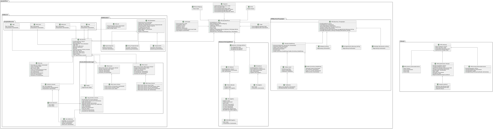

# UML-Diagramme - MII IG Kerndatensatz-Modul Molekulares Tumorboard v2026.0.1

* [**Inhaltsverzeichnis**](toc.md)
* [**Anleitung**](guidance.md)
* **UML-Diagramme**

## UML-Diagramme

 Diese Seite enthält Übersetzungen aus der Originalsprache, in der der Leitfaden verfasst wurde. Informationen zu diesen Übersetzungen und Anweisungen zum Abgeben von Feedback zu den Übersetzungen finden Sie [hier](translationinfo.md). 

UML-Übersichten der Datenmodelle des Moduls **Molekulares Tumorboard** und ihrer Beziehungen.

### UML-Darstellung des logischen Modells

Die Bilddatei ist zur besseren Darstellung auch [direkt](MII_MTB_LM_wo_cardinalities.svg) verfügbar.

