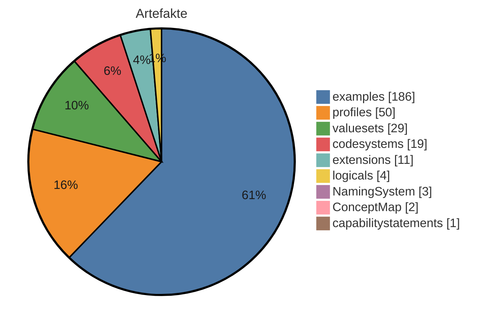
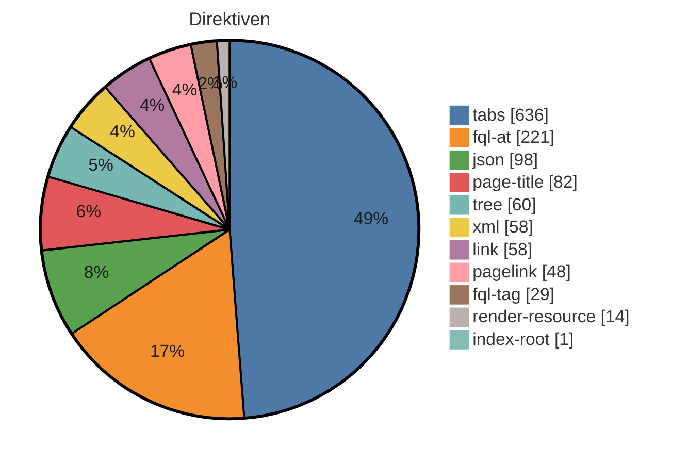

# IG-Statistik — migrated

_Modus: `static` · Stand: 2026-09-03T18:04:27Z · Commit: `6abfe4f`_

## Kennzahlen-Überblick

### Artefakte (Σ 300 publiziert + 5 weitere kanonische Typen)

_Hier wird gezählt, wie viele FHIR-Bausteine (Profile, Extensions, ValueSets usw.) der IG je Typ definiert._

<div align="center">



</div>

<div align="center">

| Typ | Anzahl |
|---|---|
| examples | 186 |
| profiles | 50 |
| valuesets | 29 |
| codesystems | 19 |
| extensions | 11 |
| logicals | 4 |
| NamingSystem | 3 |
| ConceptMap | 2 |
| capabilitystatements | 1 |

</div>

_`ConceptMap`, `NamingSystem`: kanonische Basistyp-Instanzen mit eigener Zeile — KEINE Beispiele; jede braucht in einer Migration eine eigene Seiten-/Menü-Entscheidung._

**⚠ Gegenprobe generiert-vs-deklariert** (`fsh-generated/resources`): `examples` deklariert 186 / generiert 183; `other:EvidenceVariable` deklariert 0 / generiert 2; `profiles` deklariert 50 / generiert 49 — für Seiten-/Menü-Entscheidungen ist die generierte resourceType-Zählung maßgeblich; die FSH-Deklarationstypisierung kennt nur InstanceOf-Namen.

_Interne FSH-Konstrukte (nicht in Σ): 150 rulesets, 2 invariants, 2 mappings._

### Plattform-Direktiven — Σ 1305 (unbekannt: 3)

_Dieser Abschnitt listet die plattformspezifischen Platzhalter in den Erklärseiten, die ein generischer IG Publisher nicht versteht und die daher umgesetzt werden müssen._

<div align="center">



</div>

<div align="center">

| Direktive | Anzahl |
|---|---|
| tabs | 636 |
| fql-at | 221 |
| json | 98 |
| page-title | 82 |
| tree | 60 |
| xml | 58 |
| link | 58 |
| pagelink | 48 |
| fql-tag | 29 |
| render-resource | 14 |
| index-root | 1 |

</div>

## Inhaltsumfang & Repo-Hygiene

_Linguistische Kennzahlen zum Textumfang (Wörter je Seite, Durchschnitt) sowie Hinweise auf inhaltliche Dopplungen und nicht referenzierte Dateien (Dead-Code-Analogie) - hilft, Umfang und Aufräumpotenzial einzuschätzen._

<div align="center">

| Kennzahl | Wert |
|---|---|
| Inhalts-Seiten | 92 |
| Wörter gesamt | 43066 |
| Ø Wörter / Seite | 468,1 |
| Median Wörter / Seite | 385 |
| kürzeste / längste Seite | 20 / 3947 Wörter |
| doppelte Inhaltsblöcke | 79 |
| identische Seiten (Gruppen) | 2 |
| Bilder nicht referenziert | 0 von 3 |
| Beispiele nicht in Narrativen | 149 von 186 |

</div>

_Heuristik: 'nicht referenziert' = Dateiname/Artefaktname kommt in keiner Erklärseite vor. Kein Beweis für Ungenutztheit (Referenz kann über Konfiguration/Build erfolgen)._

## Reife-Komponenten (gezählt)

_Gezählte Reife-Komponenten nebeneinander: Status, Vollständigkeit der Dokumentation, Beispiel-Abdeckung der Profile und Governance-Merkmale. Bewusst kein verdichteter Score und kein Freigabe-Urteil — die Einordnung bleibt menschlich._

<div align="center">

| Komponente | Wert |
|---|---|
| Status | active |
| Doku-Vollständigkeit (Inhalt vs. Stubs) | 75 % |
| Beispiel-Abdeckung Profile | 80 % (40/50) |
| Governance (CI · ig.ini · publication · devcontainer) | 100/100 |

</div>

**Profile ohne Beispiel (10):** `MII_PR_MTB_HISTOCHEMISTRY`, `MII_PR_MTB_IMMUNOHISTOCHEMISTRY_HER2`, `MII_PR_MTB_BIOMARKER_HER2_STATUS`, `MII_PR_MTB_Immunohistochemistry_MSI`, `MII_PR_MTB_Immunohistochemistry_PDL1`, `MII_PR_MTB_Immunohistochemistry_Phosphorylation`, `MII_PR_MTB_Immunohistochemistry_MMR`, `MII_PR_MTB_Biomarker_InSituHybridization`, `MII_PR_MTB_Molekularer_Biomarker`, `MII_PR_MTB_RNA_Seq`

## Strategie: Wiederverwendung, Lock-in & Zukunftssicherheit

_Strategische Kennzahlen: Bindung an die Quellplattform (Lock-in), Anteil standardisierter Terminologie, Wiederverwendung externer Bausteine und Zukunftssicherheit (FHIR-Version, Pflege-Aktivität)._

<div align="center">

| Kennzahl | Wert |
|---|---|
| Hersteller-Lock-in | 100/100 (hoch) · 14,2 Direktiven/Seite |
| Standard-Terminologie-Anteil | 96 % (SNOMED CT, LOINC, ICD-10, UCUM, ATC, ASK) |
| Wiederverwendung externer Profile (Parents) | 74 % (37 von 50 Profil-Parents extern; abstrakte LM-Basistypen ausgeschlossen) |
| FHIR-Version | R4 — aktuell verbreitet |
| Dependency-Veraltung | 0 veraltet (Heuristik) |
| Pflege-Kadenz | 358.1 Commits/Jahr · letzter Commit vor 0 Tagen |

</div>

_Lock-in und Standard-Terminologie-Anteil sind grobe Heuristiken aus Textvorkommen. Heuristik aus CalVer-Jahr; exakt nur via Package-Registry (extern)._

## Risiko & Compliance

_Entscheidungsrelevante Risiken für die Freigabe: Terminologie-Lizenzen, unterdrückte Warnungen, Datenschutz-Substanz, Wissenskonzentration (Bus-Faktor) und Kompatibilitätsbruch zur Vorversion._

<div align="center">

| Risiko | Bewertung |
|---|---|
| Terminologie-Lizenz | Lizenzbedarf möglich — SNOMED CT: lizenzpflichtig (Affiliate/Land), LOINC: frei (Registrierung), ICD-10: frei, UCUM: frei, ATC: eingeschränkt, ASK: frei |
| Unterdrückte QA-Warnungen | 8 (davon 0 breit) → gering |
| Datenschutz-Seite (Substanz) | fehlt/nur Stub (0 Wörter) |
| PII-artige Beispieldaten | ja – prüfen |
| Bus-Faktor (Wissenskonzentration) | 32 % Top-Autor → gering |
| Breaking-Change-Risiko ggü. Vorversion | — (nur per Build/Vorversions-Diff) |

</div>

## Befunde & Einordnung

_Je Themenbereich der gemessene Befund und eine neutrale Einordnung, was er über den Guide aussagt — keine Handlungs- oder Migrationsanweisungen._

<div align="center">

| Bereich | Befund | Einordnung |
|---|---|---|
| Artefakte (FSH) | 300 publiziert, FSH vorhanden | Zählt die publizierten Konformitätsressourcen und ob FSH-Quelltext vorliegt. FSH-Quellen machen den Bestand direkt les-, diff- und weiterverarbeitbar; ohne sie ist nur das generierte JSON/XML die Quelle. |
| Narrative | 92 Inhalts-Seiten, Format target | Anzahl und Format der Erklärseiten (source = Plattformformat, target = IG-Publisher-Format). Das Format bestimmt, welche Werkzeuge die Seiten unverändert verarbeiten können. |
| Direktiven | 1305 (3 unbekannt) | Vorkommen plattformspezifischer Platzhalter/Tags, die nur die Quellplattform interpretiert. Je mehr davon, desto stärker ist die Darstellung an die Plattform gebunden (vgl. Lock-in-Kennzahl). |
| Dependencies | 15 (0 floating) | Deklarierte Paket-Abhängigkeiten und ihr Pinning. Floating-Einträge folgen automatisch neuen Versionen und machen Builds weniger reproduzierbar — der Wert zeigt, wie reproduzierbar der aktuelle Stand ist. |
| Mehrsprachigkeit | FSH-Übersetzung ja, Supplements 0 | Ob Übersetzungen in den FSH-Quellen (translation-Extensions) und/oder als Publisher-Supplements vorliegen. Die beiden Mechanismen decken unterschiedliche Textarten ab; der Wert zeigt den vorhandenen Stand, nicht den Bedarf. |
| Pflichtseiten | 13/13 im Zielformat | Wie viele Seiten des hinterlegten Pflicht-Rasters (mandatory_pages in dieser Datei) im Zielformat existieren. Die Aussagekraft hängt vom Raster ab: Nutzt ein Guide legitim ein anderes Seitenraster, wird das Raster korrigiert — nicht die Seiten als fehlend gewertet. |
| QC-Regeln | 12 definiert | Anzahl der im Projekt definierten Qualitätsregeln (qc/custom.rules.yaml). Statisch wird nur die Definition gezählt; Verletzungen zeigt erst der Qualitätslauf eines Builds. |
| Metadaten/Config | id mii-kerndatensatzmodul-molekulares-tumorboard, v2026.0.1 | Kern-Identität (id, Version) wie in sushi-config.yaml/package.json deklariert; die vollständigen Identitätsfelder stehen im Anhang. |

</div>

## Direktiven-Mapping (Detail)

_Dieser Abschnitt ordnet jedem Direktiven-Typ sein dokumentiertes Standard-Gegenstück im IG-Publisher-Format zu — eine Faktenreferenz, kein Arbeitsauftrag; sortiert nach Häufigkeit._

<div align="center">

| Direktive | Anzahl | Was es tut | Standard-Gegenstück (IG Publisher) |
|---|---|---|---|
| tabs | 636 | Gruppiert mehrere Inhalte (z.B. Darstellung, XML, JSON) in umschaltbare Reiter. | Die einzelnen Reiterinhalte durch die jeweils passenden generierten Anzeige-Fragmente (Struktur, XML, JSON) ersetzen; eine eigene Reiter-Mechanik ist meist nicht nötig. |
| fql-at | 221 | Markiert einen Abfrage-Codeblock in besonderer Schreibweise (mit @-Präfix). | Wie einen normalen Abfrageblock behandeln und durch ein generiertes Tabellen-Fragment oder eine statische Tabelle ersetzen. |
| json | 98 | Zeigt eine Ressource oder ein Beispiel in JSON-Darstellung an. | Durch das vom IG Publisher erzeugte JSON-Anzeige-Fragment ersetzen. |
| page-title | 82 | Setzt an dieser Stelle den Titel der Seite, der aus den Seiteneinstellungen gezogen wird. | Entfällt ersatzlos - Seitentitel und Überschrift steuert man zentral über die Seiten- und Menükonfiguration. |
| tree | 60 | Zeigt die Struktur eines Profils/einer Extension als aufklappbaren Strukturbaum an. | Durch das vom IG Publisher erzeugte Struktur-Fragment ersetzen (Snapshot- oder Differential-Ansicht bzw. Element-Wörterbuch). |
| xml | 58 | Zeigt eine Ressource oder ein Beispiel in XML-Darstellung an. | Durch das vom IG Publisher erzeugte XML-Anzeige-Fragment ersetzen. |
| link | 58 | Erzeugt einen Verweis auf ein einzelnes Artefakt (z.B. dessen Übersichtsseite). | Durch einen normalen Markdown-Link auf die generierte Artefaktseite ersetzen (Form Typ-id.html). |
| pagelink | 48 | Erzeugt einen Verweis auf eine andere Seite oder ein Artefakt anhand eines Namens-Hinweises. | Durch einen normalen Markdown-Link auf die generierte Artefaktseite ersetzen (Form Typ-id.html); der Artefaktname wird in die kleingeschriebene id umgesetzt. |
| fql-tag | 29 | Öffnet einen Abfrageblock, der eine Tabelle aus FHIR-Inhalten erzeugt. | Bei Elementtabellen eines Profils durch das vorgefertigte Element-Wörterbuch-Fragment ersetzen; reine Metadaten (URL, Status, Version) entfallen (im generierten Kopfbereich vorhanden); sonst statische oder vorlagenbasierte Tabelle. |
| render-resource | 14 | Rendert eine vollständige FHIR-Ressource (z.B. ein CapabilityStatement) in die Seite hinein. | Meist entfernen, da der IG Publisher für jedes Artefakt automatisch eine eigene Seite erzeugt; alternativ das passende vorgefertigte Anzeige-Fragment einbinden. |
| index-root | 1 | Erzeugt an dieser Stelle ein automatisches Inhaltsverzeichnis bzw. die Wurzel der Navigationsstruktur. | Entfällt - Navigation und Inhaltsverzeichnis erzeugt der IG Publisher selbst aus der konfigurierten Seitenstruktur. |

</div>

> **3 unbekannte Treffer** ohne bekanntes Standard-Gegenstück – einzeln manuell prüfen (Fundorte im Anhang).

# Anhang: Detailaufschlüsselung

_Im Anhang steht jeder Einzelwert mit seiner Quelle, damit man die Kennzahlen nachvollziehen kann, ohne im Projekt suchen zu müssen._

## Identität & Herkunft

<div align="center">

| Feld | Wert | Quelle |
|---|---|---|
| id | mii-kerndatensatzmodul-molekulares-tumorboard | sushi-config.yaml / package.json |
| canonical | https://www.medizininformatik-initiative.de/fhir/ext/modul-mtb | sushi-config.yaml / package.json |
| packageId | de.medizininformatikinitiative.kerndatensatz.mtb | sushi-config.yaml / package.json |
| name | MII_IG_MTB_DE | sushi-config.yaml / package.json |
| title | MII IG Kerndatensatz-Modul Molekulares Tumorboard | sushi-config.yaml / package.json |
| version | 2026.0.1 | sushi-config.yaml / package.json |
| status | active | sushi-config.yaml / package.json |
| fhirVersion | 4.0.1 | sushi-config.yaml / package.json |
| license | CC0-1.0 | sushi-config.yaml / package.json |
| publisher | Medizininformatik-Initiative | sushi-config.yaml / package.json |
| calver | True | version-Regex |

</div>

## Dependencies

_Die FHIR-Pakete, auf denen der IG aufbaut, samt Version und ob diese fest oder offen angegeben ist._

<div align="center">

| Package | Version | Pin |
|---|---|---|
| de.basisprofil.r4 | 1.5.4 | gepinnt |
| de.medizininformatikinitiative.kerndatensatz.base | 2026.0.0 | gepinnt |
| de.medizininformatikinitiative.kerndatensatz.biobank | 2026.0.0 | gepinnt |
| de.medizininformatikinitiative.kerndatensatz.consent | 2026.0.0 | gepinnt |
| de.medizininformatikinitiative.kerndatensatz.medikation | 2026.0.0 | gepinnt |
| de.medizininformatikinitiative.kerndatensatz.meta | 2026.0.0 | gepinnt |
| de.medizininformatikinitiative.kerndatensatz.molgen | 2026.0.4 | gepinnt |
| de.medizininformatikinitiative.kerndatensatz.onkologie | 2026.0.3 | gepinnt |
| de.medizininformatikinitiative.kerndatensatz.patho | 2026.0.0 | gepinnt |
| de.medizininformatikinitiative.kerndatensatz.studie | 2026.0.2 | gepinnt |
| hl7.fhir.uv.genomics-reporting | 3.0.0 | gepinnt |
| hl7.fhir.uv.crmi | 2.0.0 | gepinnt |
| hl7.fhir.uv.xver-r5.r4 | 0.1.0 | gepinnt |
| hl7.terminology.r4 | 7.3.0 | gepinnt |
| hl7.fhir.uv.extensions.r4 | 5.3.0 | gepinnt |

</div>

## Pre-flight (Migration Gate 0)

- Lizenz-Evidenz: sushi-config.yaml/package.json → CC0-1.0; LICENSE → Creative Commons Legal Code; input/pagecontent/metadata.md → CC0-1.0; input/pagecontent/index.md → CC0 1.0 — **WIDERSPRÜCHLICH**

- Canonical-Raum: 4 außerhalb + 4 id/url-abweichend → special-url-Prognose: 8

- Dependency-Gesundheit: old-style=keine; THO direkt gepinnt=True, Extensions-Pack=True; externe Parents: 15

- Narrative-Quellen: **DUAL** — implementation-guides/ (letzter Commit 2026-04-24T17:27:23+02:00) UND pagecontent+intro-notes (letzter Commit 2026-09-03T19:42:21+02:00); vor der Migration entscheiden, welche Kopie maßgeblich ist (Frische, nicht Rang)

- QA-Baseline: output/qa.json → err=260 warn=4652 (Thu, 03 Sep, 2026 19:51:49 +0200)

## Artefakte (Quelle: input/fsh (FSH-Deklarationen))

_Jedes definierte Artefakt mit Typ, Name und Fundort in den Quelldateien._

<div align="center">

| Typ | Name | InstanceOf | Quelle |
|---|---|---|---|
| Instance | mii-ns-mtb-nct | NamingSystem | input/fsh/NamingSystems.fsh:6 |
| Instance | mii-ns-studie-drks | NamingSystem | input/fsh/NamingSystems.fsh:20 |
| Instance | mii-ns-studie-eudract | NamingSystem | input/fsh/NamingSystems.fsh:34 |
| RuleSet | SupportResource |  | input/fsh/capability-statement.fsh:3 |
| RuleSet | Profile |  | input/fsh/capability-statement.fsh:8 |
| RuleSet | SupportProfile |  | input/fsh/capability-statement.fsh:13 |
| RuleSet | SupportInteraction |  | input/fsh/capability-statement.fsh:19 |
| RuleSet | SupportSearchParam |  | input/fsh/capability-statement.fsh:25 |
| Instance | mii-cps-mtb-capabilitystatement | CapabilityStatement | input/fsh/capability-statement.fsh:33 |
| RuleSet | Header |  | input/fsh/common/Header.fsh:1 |
| RuleSet | PR_Header |  | input/fsh/common/Header.fsh:5 |
| RuleSet | CM_Header |  | input/fsh/common/Header.fsh:10 |
| RuleSet | EX_Header |  | input/fsh/common/Header.fsh:19 |
| RuleSet | CS_Header |  | input/fsh/common/Header.fsh:23 |
| RuleSet | VS_Header |  | input/fsh/common/Header.fsh:27 |
| RuleSet | LM_Header |  | input/fsh/common/Header.fsh:31 |
| RuleSet | Example_Header |  | input/fsh/common/Header.fsh:36 |
| RuleSet | Meta |  | input/fsh/common/Meta.fsh:1 |
| RuleSet | CM_Meta |  | input/fsh/common/Meta.fsh:5 |
| RuleSet | CS_VS_Meta |  | input/fsh/common/Meta.fsh:9 |
| RuleSet | CS_Meta |  | input/fsh/common/Meta.fsh:14 |
| RuleSet | VS_Meta |  | input/fsh/common/Meta.fsh:19 |
| RuleSet | EX_Meta |  | input/fsh/common/Meta.fsh:22 |
| RuleSet | LM_Meta |  | input/fsh/common/Meta.fsh:25 |
| RuleSet | Publisher |  | input/fsh/common/Publisher.fsh:1 |
| RuleSet | SP_Publisher |  | input/fsh/common/Publisher.fsh:6 |
| RuleSet | Status |  | input/fsh/common/Status.fsh:1 |
| RuleSet | Translation |  | input/fsh/common/Translation.fsh:1 |
| RuleSet | Version |  | input/fsh/common/Version.fsh:1 |
| RuleSet | PR_CS_VS_Version |  | input/fsh/common/Version.fsh:4 |
| RuleSet | MetaProfile |  | input/fsh/common/Version.fsh:7 |
| RuleSet | BeschlussPrioritaet |  | input/fsh/examples/aliases-rulesets.fsh:6 |
| RuleSet | BeschlussSubPrioritaet |  | input/fsh/examples/aliases-rulesets.fsh:9 |
| RuleSet | BeschlussEvidenzgrad |  | input/fsh/examples/aliases-rulesets.fsh:12 |
| RuleSet | BeschlussEvidenzPublikation |  | input/fsh/examples/aliases-rulesets.fsh:16 |
| RuleSet | BeschlussEvidenz |  | input/fsh/examples/aliases-rulesets.fsh:20 |
| RuleSet | BeschlussEvidenzZweiPublikationen |  | input/fsh/examples/aliases-rulesets.fsh:24 |
| RuleSet | BeschlussEvidenzZweiQuellen |  | input/fsh/examples/aliases-rulesets.fsh:29 |
| RuleSet | BeschlussEvidenzDreiQuellen |  | input/fsh/examples/aliases-rulesets.fsh:34 |
| Instance | MyHospital | Organization | input/fsh/examples/bundle/addendums.fsh:2 |
| Instance | MyCoverage | Coverage | input/fsh/examples/bundle/addendums.fsh:15 |
| Instance | MyInsurer | Organization | input/fsh/examples/bundle/addendums.fsh:27 |
| Instance | PatientKimMusterperson-PrimaryDiagnosis-2 | mii-pr-onko-diagnose-primaertumor | input/fsh/examples/bundle/external.fsh:1 |
| Instance | mii-exa-onko-allgemeiner-leistungszustand-ecog | mii-pr-onko-allgemeiner-leistungszustand-ecog | input/fsh/examples/bundle/external.fsh:15 |
| RuleSet | BundleResource |  | input/fsh/examples/bundle/mii-exa-mtb-kim-musterperson-bundle.fsh:1 |
| Instance | mii-exa-mtb-kim-musterperson-bundle | Bundle | input/fsh/examples/bundle/mii-exa-mtb-kim-musterperson-bundle.fsh:8 |
| Instance | mii-exa-mtb-kim-tumorzellgehalt-aszites | MII_PR_MTB_Tumorzellgehalt | input/fsh/examples/mii-exa-mtb-kim-musterperson-auftraege.fsh:1 |
| Instance | mii-exa-mtb-kim-humangenetische-beratung-aszites | MII_PR_MTB_Humangenetische_Beratung_Auftrag | input/fsh/examples/mii-exa-mtb-kim-musterperson-auftraege.fsh:12 |
| Instance | mii-exa-mtb-kim-histologie-evaluation-aszites | MII_PR_MTB_Histologie_Evaluation_Auftrag | input/fsh/examples/mii-exa-mtb-kim-musterperson-auftraege.fsh:25 |
| Instance | mii-exa-mtb-kim-rebiopsie-aszites | MII_PR_MTB_Biopsie_Auftrag | input/fsh/examples/mii-exa-mtb-kim-musterperson-auftraege.fsh:38 |
| Instance | mii-exa-mtb-kim-musterperson-behandlungsepisode | MII_PR_MTB_Behandlungsepisode | input/fsh/examples/mii-exa-mtb-kim-musterperson-behandlungsepisode.fsh:2 |
| Instance | mii-exa-mtb-kim-musterperson-aufklaerung | MII_PR_MTB_Consent_Given | input/fsh/examples/mii-exa-mtb-kim-musterperson-behandlungsepisode.fsh:106 |
| Instance | MTBObservationCA125-1 | Observation | input/fsh/examples/mii-exa-mtb-kim-musterperson-cancer-antigene.fsh:1 |
| Instance | MTBObservationCA125-2 | Observation | input/fsh/examples/mii-exa-mtb-kim-musterperson-cancer-antigene.fsh:17 |
| Instance | MTBObservationCA125-3 | Observation | input/fsh/examples/mii-exa-mtb-kim-musterperson-cancer-antigene.fsh:33 |
| Instance | MTBObservationCA125-4 | Observation | input/fsh/examples/mii-exa-mtb-kim-musterperson-cancer-antigene.fsh:49 |
| Instance | MTBObservationCA125-5 | Observation | input/fsh/examples/mii-exa-mtb-kim-musterperson-cancer-antigene.fsh:65 |
| Instance | MTBObservationCA125-6 | Observation | input/fsh/examples/mii-exa-mtb-kim-musterperson-cancer-antigene.fsh:81 |
| Instance | PatientKimMusterperson-MolecularPathologyReport-1 | MII_PR_MTB_Molecular_Pathology_Report | input/fsh/examples/mii-exa-mtb-kim-musterperson-cancer-molpatho.fsh:1 |
| Instance | PatientKimMusterperson-MolecularPathologyReport-2 |  | input/fsh/examples/mii-exa-mtb-kim-musterperson-cancer-molpatho.fsh:14 |
| Instance | PatientKimMusterperson-AscitesSpecimen-2 | MII_PR_Onko_Specimen | input/fsh/examples/mii-exa-mtb-kim-musterperson-cancer-molpatho.fsh:17 |
| Instance | PatientKimMusterperson-MolecularPathologyObservation-0a-Her2neu | MII_PR_MTB_Immunohistochemistry | input/fsh/examples/mii-exa-mtb-kim-musterperson-cancer-molpatho.fsh:26 |
| Instance | PatientKimMusterperson-MolecularPathologyObs-FISH-0a-Her2neu- | MII_PR_MTB_INSITUHYBRIDIZATION_HER2 | input/fsh/examples/mii-exa-mtb-kim-musterperson-cancer-molpatho.fsh:42 |
| Instance | PatientKimMusterperson-MolecularPathologyInterpret-0a-Her2neu | MII_PR_MTB_Immunohistochemistry | input/fsh/examples/mii-exa-mtb-kim-musterperson-cancer-molpatho.fsh:71 |
| Instance | PatientKimMusterperson-MolecularPathologyObservation-0b-Folat-Ra | MII_PR_MTB_Immunohistochemistry | input/fsh/examples/mii-exa-mtb-kim-musterperson-cancer-molpatho.fsh:86 |
| Instance | PatientKimMusterperson-MolecularPathologyObservation-0c-Trop2 | MII_PR_MTB_Immunohistochemistry | input/fsh/examples/mii-exa-mtb-kim-musterperson-cancer-molpatho.fsh:104 |
| Instance | PatientKimMusterperson-MolecularPathologyObservation-1-CA125 | MII_PR_MTB_Immunohistochemistry | input/fsh/examples/mii-exa-mtb-kim-musterperson-cancer-molpatho.fsh:119 |
| Instance | PatientKimMusterperson-MolecularPathologyObservation-2-Pax8 | MII_PR_MTB_Immunohistochemistry | input/fsh/examples/mii-exa-mtb-kim-musterperson-cancer-molpatho.fsh:142 |
| Instance | PatientKimMusterperson-MolecularPathologyObservation-3-WT1 | MII_PR_MTB_Immunohistochemistry | input/fsh/examples/mii-exa-mtb-kim-musterperson-cancer-molpatho.fsh:155 |
| Instance | PatientKimMusterperson-MolecularPathologyObservation-4-ER | MII_PR_MTB_Immunohistochemistry | input/fsh/examples/mii-exa-mtb-kim-musterperson-cancer-molpatho.fsh:172 |
| Instance | PatientKimMusterperson-MolecularPathologyObservation-5-PR | MII_PR_MTB_Immunohistochemistry | input/fsh/examples/mii-exa-mtb-kim-musterperson-cancer-molpatho.fsh:186 |
| Instance | PatientKimMusterperson-MolecularPathologyObservation-6-p53 | MII_PR_MTB_Immunohistochemistry | input/fsh/examples/mii-exa-mtb-kim-musterperson-cancer-molpatho.fsh:200 |
| Instance | PatientKimMusterperson-MolecularPathologyObservation-7-p53 | MII_PR_MTB_Immunohistochemistry | input/fsh/examples/mii-exa-mtb-kim-musterperson-cancer-molpatho.fsh:212 |
| Instance | mii-exa-mtb-kim-diagnose | MII_PR_MTB_Diagnose_Primaertumor | input/fsh/examples/mii-exa-mtb-kim-musterperson-diagnose.fsh:1 |
| Instance | mii-exa-mtb-kim-tumorausbreitung | MII_PR_MTB_Tumorausbreitung | input/fsh/examples/mii-exa-mtb-kim-musterperson-diagnose.fsh:20 |
| Instance | mii-exa-mtb-kim-oncotree | MII_PR_MTB_Oncotree | input/fsh/examples/mii-exa-mtb-kim-musterperson-diagnose.fsh:32 |
| Instance | PatientKimMusterperson | Patient | input/fsh/examples/mii-exa-mtb-kim-musterperson-diagnostik.fsh:1 |
| Instance | PatientKimMusterperson-Procedure-1 | MII_PR_Prozedur_Procedure | input/fsh/examples/mii-exa-mtb-kim-musterperson-diagnostik.fsh:13 |
| Instance | PatientKimMusterperson-Observation-1 | Observation | input/fsh/examples/mii-exa-mtb-kim-musterperson-diagnostik.fsh:26 |
| Instance | PatientKimMusterperson-Observation-2 | Observation | input/fsh/examples/mii-exa-mtb-kim-musterperson-diagnostik.fsh:36 |
| Instance | PatientKimMusterperson-Observation-3 | Observation | input/fsh/examples/mii-exa-mtb-kim-musterperson-diagnostik.fsh:46 |
| Instance | PatientKimMusterperson-Observation-4 | Observation | input/fsh/examples/mii-exa-mtb-kim-musterperson-diagnostik.fsh:56 |
| Instance | PatientKimMusterperson-Procedure-2 | MII_PR_Prozedur_Procedure | input/fsh/examples/mii-exa-mtb-kim-musterperson-diagnostik.fsh:74 |
| Instance | PatientKimMusterperson-Observation-5 | Observation | input/fsh/examples/mii-exa-mtb-kim-musterperson-diagnostik.fsh:87 |
| Instance | PatientKimMusterperson-Observation-6 | Observation | input/fsh/examples/mii-exa-mtb-kim-musterperson-diagnostik.fsh:101 |
| Instance | PatientKimMusterperson-Observation-7 | Observation | input/fsh/examples/mii-exa-mtb-kim-musterperson-diagnostik.fsh:111 |
| Instance | PatientKimMusterperson-Observation-8 | Observation | input/fsh/examples/mii-exa-mtb-kim-musterperson-diagnostik.fsh:121 |
| Instance | PatientKimMusterperson-Procedure-3 | MII_PR_Prozedur_Procedure | input/fsh/examples/mii-exa-mtb-kim-musterperson-diagnostik.fsh:139 |
| Instance | PatientKimMusterperson-Observation-9 | Observation | input/fsh/examples/mii-exa-mtb-kim-musterperson-diagnostik.fsh:152 |
| Instance | PatientKimMusterperson-Observation-10 | Observation | input/fsh/examples/mii-exa-mtb-kim-musterperson-diagnostik.fsh:166 |
| Instance | PatientKimMusterperson-Observation-11 | Observation | input/fsh/examples/mii-exa-mtb-kim-musterperson-diagnostik.fsh:180 |
| Instance | PatientKimMusterperson-Observation-12 | Observation | input/fsh/examples/mii-exa-mtb-kim-musterperson-diagnostik.fsh:190 |
| Instance | PatientKimMusterperson-Observation-13 | Observation | input/fsh/examples/mii-exa-mtb-kim-musterperson-diagnostik.fsh:200 |
| Instance | PatientKimMusterperson-Observation-14 | Observation | input/fsh/examples/mii-exa-mtb-kim-musterperson-diagnostik.fsh:215 |
| Instance | PatientKimMusterperson-Observation-15 | Observation | input/fsh/examples/mii-exa-mtb-kim-musterperson-diagnostik.fsh:229 |
| Instance | PatientKimMusterperson-Procedure-4 | MII_PR_Prozedur_Procedure | input/fsh/examples/mii-exa-mtb-kim-musterperson-diagnostik.fsh:244 |
| Instance | PatientKimMusterperson-Observation-16 | Observation | input/fsh/examples/mii-exa-mtb-kim-musterperson-diagnostik.fsh:257 |
| Instance | PatientKimMusterperson-Observation-17 | Observation | input/fsh/examples/mii-exa-mtb-kim-musterperson-diagnostik.fsh:271 |
| Instance | PatientKimMusterperson-Observation-18 | Observation | input/fsh/examples/mii-exa-mtb-kim-musterperson-diagnostik.fsh:285 |
| Instance | PatientKimMusterperson-Observation-19 | Observation | input/fsh/examples/mii-exa-mtb-kim-musterperson-diagnostik.fsh:296 |
| Instance | PatientKimMusterperson-Procedure-5 | MII_PR_Prozedur_Procedure | input/fsh/examples/mii-exa-mtb-kim-musterperson-diagnostik.fsh:311 |
| Instance | PatientKimMusterperson-Observation-20 | Observation | input/fsh/examples/mii-exa-mtb-kim-musterperson-diagnostik.fsh:324 |
| Instance | PatientKimMusterperson-Observation-21 | Observation | input/fsh/examples/mii-exa-mtb-kim-musterperson-diagnostik.fsh:335 |
| Instance | PatientKimMusterperson-Observation-22 | Observation | input/fsh/examples/mii-exa-mtb-kim-musterperson-diagnostik.fsh:347 |
| Instance | PatientKimMusterperson-Observation-23 | Observation | input/fsh/examples/mii-exa-mtb-kim-musterperson-diagnostik.fsh:359 |
| Instance | PatientKimMusterperson-Procedure-6 | MII_PR_Prozedur_Procedure | input/fsh/examples/mii-exa-mtb-kim-musterperson-diagnostik.fsh:372 |
| Instance | PatientKimMusterperson-Observation-24 | Observation | input/fsh/examples/mii-exa-mtb-kim-musterperson-diagnostik.fsh:385 |
| Instance | PatientKimMusterperson-Observation-25 | Observation | input/fsh/examples/mii-exa-mtb-kim-musterperson-diagnostik.fsh:395 |
| Instance | PatientKimMusterperson-Procedure-7 | MII_PR_Prozedur_Procedure | input/fsh/examples/mii-exa-mtb-kim-musterperson-diagnostik.fsh:412 |
| Instance | PatientKimMusterperson-Observation-26 | Observation | input/fsh/examples/mii-exa-mtb-kim-musterperson-diagnostik.fsh:425 |
| Instance | PatientKimMusterperson-Observation-27 | Observation | input/fsh/examples/mii-exa-mtb-kim-musterperson-diagnostik.fsh:437 |
| Instance | PatientKimMusterperson-Observation-29 | Observation | input/fsh/examples/mii-exa-mtb-kim-musterperson-diagnostik.fsh:451 |
| Instance | PatientKimMusterperson-Observation-30 | Observation | input/fsh/examples/mii-exa-mtb-kim-musterperson-diagnostik.fsh:462 |
| Instance | MII-EXA-MTB-Follow-Up-ClinicalImpression-1 | MII_PR_MTB_Follow_Up_ClinicalImpression | input/fsh/examples/mii-exa-mtb-kim-musterperson-follow-up.fsh:1 |
| Instance | MII-EXA-MTB-Systemische-Therapie-1 | MII_PR_MTB_Systemische_Therapie | input/fsh/examples/mii-exa-mtb-kim-musterperson-follow-up.fsh:17 |
| Instance | MII-EXA-MTB-Systemische-Therapie-Medication-1 | MII_PR_MTB_Systemische_Therapie_Medication_Statement | input/fsh/examples/mii-exa-mtb-kim-musterperson-follow-up.fsh:34 |
| Instance | MII-EXA-MTB-Systemische-Therapie-Medication-2 | MII_PR_MTB_Systemische_Therapie_Medication_Statement | input/fsh/examples/mii-exa-mtb-kim-musterperson-follow-up.fsh:55 |
| Instance | MII-EXA-MTB-Systemische-Therapie-Medication-3 | MII_PR_MTB_Systemische_Therapie_Medication_Statement | input/fsh/examples/mii-exa-mtb-kim-musterperson-follow-up.fsh:77 |
| Instance | MII-EXA-MTB-Response-Befund-1 | MII_PR_MTB_Response_Befund | input/fsh/examples/mii-exa-mtb-kim-musterperson-follow-up.fsh:98 |
| Instance | MII-EXA-MTB-Systemische-Therapie-Medication-4 | MII_PR_MTB_Systemische_Therapie_Medication_Statement | input/fsh/examples/mii-exa-mtb-kim-musterperson-follow-up.fsh:115 |
| Instance | MII-EXA-MTB-Systemische-Therapie-Medication-5 | MII_PR_MTB_Systemische_Therapie_Medication_Statement | input/fsh/examples/mii-exa-mtb-kim-musterperson-follow-up.fsh:136 |
| Instance | MII-EXA-MTB-Systemische-Therapie-Medication-6 | MII_PR_MTB_Systemische_Therapie_Medication_Statement | input/fsh/examples/mii-exa-mtb-kim-musterperson-follow-up.fsh:157 |
| Instance | MII-EXA-MTB-Response-Befund-2 | MII_PR_MTB_Response_Befund | input/fsh/examples/mii-exa-mtb-kim-musterperson-follow-up.fsh:178 |
| Instance | MII-EXA-MTB-Antrag-Kostenuebernahme-1 | MII_PR_MTB_Antrag_Kostenuebernahme | input/fsh/examples/mii-exa-mtb-kim-musterperson-follow-up.fsh:196 |
| Instance | MII-EXA-MTB-Antwort-Kostenuebernahme-1 | MII_PR_MTB_Antwort_Kostenuebernahme | input/fsh/examples/mii-exa-mtb-kim-musterperson-follow-up.fsh:216 |
| Instance | PatientKimMusterperson-Specimen-1 | MII_PR_Patho_Specimen | input/fsh/examples/mii-exa-mtb-kim-musterperson-histologie.fsh:17 |
| RuleSet | SystemTherapyMedicationStatement |  | input/fsh/examples/mii-exa-mtb-kim-musterperson-medikation.fsh:2 |
| Instance | MTBChemo1Procedure | MII_PR_MTB_Systemische_Vortherapie | input/fsh/examples/mii-exa-mtb-kim-musterperson-medikation.fsh:16 |
| Instance | MTBChemo1MedicationStatement1 | MII_PR_Medikation_MedicationStatement | input/fsh/examples/mii-exa-mtb-kim-musterperson-medikation.fsh:34 |
| Instance | MTBChemo1MedicationStatement1-1 | MII_PR_Onko_Systemische_Therapie_Medikation | input/fsh/examples/mii-exa-mtb-kim-musterperson-medikation.fsh:43 |
| Instance | MTBChemo1MedicationStatement1-2 | MII_PR_Onko_Systemische_Therapie_Medikation | input/fsh/examples/mii-exa-mtb-kim-musterperson-medikation.fsh:49 |
| Instance | MTBChemo1MedicationStatement2 | MII_PR_Medikation_MedicationStatement | input/fsh/examples/mii-exa-mtb-kim-musterperson-medikation.fsh:56 |
| Instance | MTBChemo1MedicationStatement2-1 | MII_PR_Onko_Systemische_Therapie_Medikation | input/fsh/examples/mii-exa-mtb-kim-musterperson-medikation.fsh:65 |
| Instance | MTBChemo1MedicationStatement2-2 | MII_PR_Onko_Systemische_Therapie_Medikation | input/fsh/examples/mii-exa-mtb-kim-musterperson-medikation.fsh:71 |
| Instance | MTBChemo1MedicationStatement3 | MII_PR_Medikation_MedicationStatement | input/fsh/examples/mii-exa-mtb-kim-musterperson-medikation.fsh:78 |
| Instance | MTBChemo1MedicationStatement3-1 | MII_PR_Onko_Systemische_Therapie_Medikation | input/fsh/examples/mii-exa-mtb-kim-musterperson-medikation.fsh:87 |
| Instance | MTBChemo1MedicationStatement3-2 | MII_PR_Onko_Systemische_Therapie_Medikation | input/fsh/examples/mii-exa-mtb-kim-musterperson-medikation.fsh:93 |
| Instance | MTBChemo1MedicationStatement4 | MII_PR_Medikation_MedicationStatement | input/fsh/examples/mii-exa-mtb-kim-musterperson-medikation.fsh:100 |
| Instance | MTBChemo1MedicationStatement4-1 | MII_PR_Onko_Systemische_Therapie_Medikation | input/fsh/examples/mii-exa-mtb-kim-musterperson-medikation.fsh:109 |
| Instance | MTBChemo1MedicationStatement4-2 | MII_PR_Onko_Systemische_Therapie_Medikation | input/fsh/examples/mii-exa-mtb-kim-musterperson-medikation.fsh:115 |
| Instance | MTBChemo1MedicationStatement5 | MII_PR_Medikation_MedicationStatement | input/fsh/examples/mii-exa-mtb-kim-musterperson-medikation.fsh:122 |
| Instance | MTBChemo1MedicationStatement5-1 | MII_PR_Onko_Systemische_Therapie_Medikation | input/fsh/examples/mii-exa-mtb-kim-musterperson-medikation.fsh:131 |
| Instance | MTBChemo1MedicationStatement5-2 | MII_PR_Onko_Systemische_Therapie_Medikation | input/fsh/examples/mii-exa-mtb-kim-musterperson-medikation.fsh:137 |
| Instance | MTBChemo1MedicationStatement6 | MII_PR_Medikation_MedicationStatement | input/fsh/examples/mii-exa-mtb-kim-musterperson-medikation.fsh:144 |
| Instance | MTBChemo1MedicationStatement6-1 | MII_PR_Onko_Systemische_Therapie_Medikation | input/fsh/examples/mii-exa-mtb-kim-musterperson-medikation.fsh:153 |
| Instance | MTBChemo1MedicationStatement6-2 | MII_PR_Onko_Systemische_Therapie_Medikation | input/fsh/examples/mii-exa-mtb-kim-musterperson-medikation.fsh:159 |
| Instance | MTBChemo2Procedure | MII_PR_MTB_Systemische_Vortherapie | input/fsh/examples/mii-exa-mtb-kim-musterperson-medikation.fsh:167 |
| Instance | MTBChemo2MedicationStatement1 | MII_PR_Medikation_MedicationStatement | input/fsh/examples/mii-exa-mtb-kim-musterperson-medikation.fsh:188 |
| Instance | MTBChemo2MedicationStatement2 | MII_PR_Medikation_MedicationStatement | input/fsh/examples/mii-exa-mtb-kim-musterperson-medikation.fsh:206 |
| Instance | MTBChemo2MedicationStatement3 | MII_PR_Medikation_MedicationStatement | input/fsh/examples/mii-exa-mtb-kim-musterperson-medikation.fsh:224 |
| Instance | MTBChemo2MedicationStatement4 | MII_PR_Medikation_MedicationStatement | input/fsh/examples/mii-exa-mtb-kim-musterperson-medikation.fsh:242 |
| Instance | MTBChemo2MedicationStatement5 | MII_PR_Medikation_MedicationStatement | input/fsh/examples/mii-exa-mtb-kim-musterperson-medikation.fsh:260 |
| Instance | MTBChemo2MedicationStatement6 | MII_PR_Medikation_MedicationStatement | input/fsh/examples/mii-exa-mtb-kim-musterperson-medikation.fsh:278 |
| Instance | mii-exa-mtb-kim-musterperson-ngs-bericht | MII_PR_MTB_NGS_Bericht | input/fsh/examples/mii-exa-mtb-kim-musterperson-ngs-bericht.fsh:2 |
| Instance | mii-exa-mtb-kim-musterperson-genomic-study | MII_PR_MTB_Genomic_Study | input/fsh/examples/mii-exa-mtb-kim-musterperson-ngs-bericht.fsh:18 |
| Instance | mii-exa-mtb-kim-musterperson-genomic-study-analysis-1 | MII_PR_MTB_Genomic_Study_Analysis | input/fsh/examples/mii-exa-mtb-kim-musterperson-ngs-bericht.fsh:30 |
| Instance | mii-exa-mtb-kim-musterperson-genomic-study-analysis-2 | MII_PR_MTB_Genomic_Study_Analysis | input/fsh/examples/mii-exa-mtb-kim-musterperson-ngs-bericht.fsh:51 |
| Instance | mii-exa-mtb-kim-musterperson-genomic-study-analysis-3 | MII_PR_MTB_Genomic_Study_Analysis | input/fsh/examples/mii-exa-mtb-kim-musterperson-ngs-bericht.fsh:62 |
| Instance | mii-exa-mtb-kim-musterperson-EinfacheVariante-TP53 | MII_PR_MTB_Einfache_Variante | input/fsh/examples/mii-exa-mtb-kim-musterperson-ngs-bericht.fsh:77 |
| Instance | mii-exa-mtb-kim-musterperson-DiagnostischeImplikation-TP53 | MII_PR_MTB_Diagnostische_Implikation | input/fsh/examples/mii-exa-mtb-kim-musterperson-ngs-bericht.fsh:94 |
| Instance | mii-exa-mtb-kim-musterperson-EinfacheVariante-PIK3R1 | MII_PR_MTB_Einfache_Variante | input/fsh/examples/mii-exa-mtb-kim-musterperson-ngs-bericht.fsh:109 |
| Instance | mii-exa-mtb-kim-musterperson-TherapeutischeImplikation-PIK3R1 | MII_PR_MTB_Therapeutische_Implikation | input/fsh/examples/mii-exa-mtb-kim-musterperson-ngs-bericht.fsh:130 |
| Instance | mii-exa-mtb-kim-musterperson-CNVariante-CCNE1 | MII_PR_MTB_Copy_Number_Variant | input/fsh/examples/mii-exa-mtb-kim-musterperson-ngs-bericht.fsh:148 |
| Instance | mii-exa-mtb-study-request-cldn6 | MII_PR_MTB_Studieneinschluss_Anfrage | input/fsh/examples/mii-exa-mtb-kim-musterperson-studienempfehlungen.fsh:7 |
| Instance | mii-exa-mtb-study-cldn6 | MII_PR_MTB_Studie | input/fsh/examples/mii-exa-mtb-kim-musterperson-studienempfehlungen.fsh:19 |
| Instance | mii-exa-mtb-study-cldn6-eligibility-criteria | Group | input/fsh/examples/mii-exa-mtb-kim-musterperson-studienempfehlungen.fsh:73 |
| Instance | mii-exa-mtb-study-cldn6-eligibility-criteria-age-groups | Group | input/fsh/examples/mii-exa-mtb-kim-musterperson-studienempfehlungen.fsh:94 |
| Instance | mii-exa-mtb-study-cldn6-comparison-group-0 | Group | input/fsh/examples/mii-exa-mtb-kim-musterperson-studienempfehlungen.fsh:107 |
| Instance | mii-exa-mtb-study-cldn6-evidence-variable-0 | EvidenceVariable | input/fsh/examples/mii-exa-mtb-kim-musterperson-studienempfehlungen.fsh:119 |
| Instance | mii-exa-mtb-study-cldn6-comparison-group-1 | Group | input/fsh/examples/mii-exa-mtb-kim-musterperson-studienempfehlungen.fsh:129 |
| Instance | mii-exa-mtb-study-cldn6-evidence-variable-1 | EvidenceVariable | input/fsh/examples/mii-exa-mtb-kim-musterperson-studienempfehlungen.fsh:141 |
| Instance | mii-exa-mtb-study-sponsor-biontech | Organization | input/fsh/examples/mii-exa-mtb-kim-musterperson-studienempfehlungen.fsh:151 |
| Instance | mii-exa-mtb-study-investigator-biontech | MII_PR_Studie_Beteiligte_Person | input/fsh/examples/mii-exa-mtb-kim-musterperson-studienempfehlungen.fsh:159 |
| Instance | mii-exa-mtb-study-cldn6-location-0 | Location | input/fsh/examples/mii-exa-mtb-kim-musterperson-studienempfehlungen.fsh:166 |
| Instance | mii-exa-mtb-study-cldn6-location-1 | Location | input/fsh/examples/mii-exa-mtb-kim-musterperson-studienempfehlungen.fsh:179 |
| Instance | mii-exa-mtb-study-cldn6-location-2 | Location | input/fsh/examples/mii-exa-mtb-kim-musterperson-studienempfehlungen.fsh:191 |
| Instance | mii-exa-mtb-study-cldn6-location-3 | Location | input/fsh/examples/mii-exa-mtb-kim-musterperson-studienempfehlungen.fsh:203 |
| Instance | mii-exa-mtb-study-cldn6-location-4 | Location | input/fsh/examples/mii-exa-mtb-kim-musterperson-studienempfehlungen.fsh:215 |
| Instance | mii-exa-mtb-study-cldn6-location-5 | Location | input/fsh/examples/mii-exa-mtb-kim-musterperson-studienempfehlungen.fsh:227 |
| Instance | mii-exa-mtb-study-cldn6-location-6 | Location | input/fsh/examples/mii-exa-mtb-kim-musterperson-studienempfehlungen.fsh:239 |
| Instance | mii-exa-mtb-study-cldn6-location-7 | Location | input/fsh/examples/mii-exa-mtb-kim-musterperson-studienempfehlungen.fsh:251 |
| Instance | mii-exa-mtb-study-cldn6-location-8 | Location | input/fsh/examples/mii-exa-mtb-kim-musterperson-studienempfehlungen.fsh:263 |
| Instance | mii-exa-mtb-study-cldn6-location-9 | Location | input/fsh/examples/mii-exa-mtb-kim-musterperson-studienempfehlungen.fsh:275 |
| Instance | mii-exa-mtb-study-cldn6-location-10 | Location | input/fsh/examples/mii-exa-mtb-kim-musterperson-studienempfehlungen.fsh:287 |
| Instance | mii-exa-mtb-study-cldn6-location-11 | Location | input/fsh/examples/mii-exa-mtb-kim-musterperson-studienempfehlungen.fsh:299 |
| Instance | mii-exa-mtb-study-tedova | MII_PR_MTB_Studie | input/fsh/examples/mii-exa-mtb-kim-musterperson-studienempfehlungen.fsh:315 |
| Instance | mii-exa-mtb-study-request-tedova | MII_PR_MTB_Studieneinschluss_Anfrage | input/fsh/examples/mii-exa-mtb-kim-musterperson-studienempfehlungen.fsh:325 |
| Instance | mii-exa-mtb-study-ccne1 | MII_PR_MTB_Studie | input/fsh/examples/mii-exa-mtb-kim-musterperson-studienempfehlungen.fsh:338 |
| Instance | mii-exa-mtb-study-request-ccne1 | MII_PR_MTB_Studieneinschluss_Anfrage | input/fsh/examples/mii-exa-mtb-kim-musterperson-studienempfehlungen.fsh:346 |
| Instance | mii-exa-mtb-medication-request-mirvetuximab | MII_PR_MTB_Therapieempfehlung | input/fsh/examples/mii-exa-mtb-kim-musterperson-therapieempfehlungen.fsh:5 |
| Instance | mii-exa-mtb-medication-request-trastuzumab-deruxtecan | MII_PR_MTB_Therapieempfehlung | input/fsh/examples/mii-exa-mtb-kim-musterperson-therapieempfehlungen.fsh:36 |
| Instance | mii-exa-mtb-medication-request-adavosertib | MII_PR_MTB_Therapieempfehlung | input/fsh/examples/mii-exa-mtb-kim-musterperson-therapieempfehlungen.fsh:56 |
| Instance | mii-exa-mtb-medication-request-carboplatin | MII_PR_MTB_Therapieempfehlung | input/fsh/examples/mii-exa-mtb-kim-musterperson-therapieempfehlungen.fsh:69 |
| Instance | mii-exa-mtb-request-group-adavosertib-carboplatin | MII_PR_MTB_Therapieempfehlung_Kombination | input/fsh/examples/mii-exa-mtb-kim-musterperson-therapieempfehlungen.fsh:83 |
| Instance | mii-exa-mtb-medication-request-lunresertib | MII_PR_MTB_Therapieempfehlung | input/fsh/examples/mii-exa-mtb-kim-musterperson-therapieempfehlungen.fsh:105 |
| Instance | mii-exa-mtb-medication-request-camonsertib | MII_PR_MTB_Therapieempfehlung | input/fsh/examples/mii-exa-mtb-kim-musterperson-therapieempfehlungen.fsh:118 |
| Instance | mii-exa-mtb-request-group-lunresertib-camonsertib | MII_PR_MTB_Therapieempfehlung_Kombination | input/fsh/examples/mii-exa-mtb-kim-musterperson-therapieempfehlungen.fsh:131 |
| Instance | mii-exa-mtb-medication-request-cobimetinib | MII_PR_MTB_Therapieempfehlung | input/fsh/examples/mii-exa-mtb-kim-musterperson-therapieempfehlungen.fsh:150 |
| Instance | mii-exa-mtb-kim-musterperson-therapieplan | MII_PR_MTB_Therapieplan | input/fsh/examples/mii-exa-mtb-kim-musterperson-therapieplan.fsh:1 |
| RuleSet | Behandlungsepisode |  | input/fsh/logical-model/Behandlungsepisode/Behandlungsepisode.fsh:1 |
| RuleSet | BehandlungsepisodeMapping |  | input/fsh/logical-model/Behandlungsepisode/Behandlungsepisode.fsh:16 |
| RuleSet | Diagnose |  | input/fsh/logical-model/Behandlungsepisode/Diagnose.fsh:1 |
| RuleSet | DiagnoseMapping |  | input/fsh/logical-model/Behandlungsepisode/Diagnose.fsh:12 |
| RuleSet | ECOG |  | input/fsh/logical-model/Behandlungsepisode/ECOG.fsh:1 |
| RuleSet | ECOGMapping |  | input/fsh/logical-model/Behandlungsepisode/ECOG.fsh:6 |
| RuleSet | Einwilligung |  | input/fsh/logical-model/Behandlungsepisode/Einwilligung.fsh:1 |
| RuleSet | EinwilligungMapping |  | input/fsh/logical-model/Behandlungsepisode/Einwilligung.fsh:5 |
| RuleSet | Vortherapie |  | input/fsh/logical-model/Behandlungsepisode/Votherapie.fsh:1 |
| RuleSet | VortherapieMapping |  | input/fsh/logical-model/Behandlungsepisode/Votherapie.fsh:12 |
| RuleSet | BeschlussTherapieplan |  | input/fsh/logical-model/Beschluss-Therapieplan/Beschluss-Therapieplan.fsh:1 |
| RuleSet | BeschlussTherapieplanMapping |  | input/fsh/logical-model/Beschluss-Therapieplan/Beschluss-Therapieplan.fsh:14 |
| RuleSet | EvidenzLevel |  | input/fsh/logical-model/Beschluss-Therapieplan/Evidenz-Level.fsh:1 |
| RuleSet | EvidenzLevelMapping |  | input/fsh/logical-model/Beschluss-Therapieplan/Evidenz-Level.fsh:7 |
| RuleSet | HistologieReevaluationAuftrag |  | input/fsh/logical-model/Beschluss-Therapieplan/Histologie-Reevaluation-Auftrag.fsh:1 |
| RuleSet | HistologieReevaluationAuftragMapping |  | input/fsh/logical-model/Beschluss-Therapieplan/Histologie-Reevaluation-Auftrag.fsh:7 |
| RuleSet | HumangenetischeBeratungAuftrag |  | input/fsh/logical-model/Beschluss-Therapieplan/Humangenetische-Beratung-Auftrag.fsh:1 |
| RuleSet | HumangenetischeBeratungAuftragMapping |  | input/fsh/logical-model/Beschluss-Therapieplan/Humangenetische-Beratung-Auftrag.fsh:6 |
| RuleSet | Publikationen |  | input/fsh/logical-model/Beschluss-Therapieplan/Publikationen.fsh:1 |
| RuleSet | PublikationenMapping |  | input/fsh/logical-model/Beschluss-Therapieplan/Publikationen.fsh:6 |
| RuleSet | RebiopsieAuftrag |  | input/fsh/logical-model/Beschluss-Therapieplan/Rebiopsie-Auftrag.fsh:1 |
| RuleSet | RebiopsieAuftragMapping |  | input/fsh/logical-model/Beschluss-Therapieplan/Rebiopsie-Auftrag.fsh:7 |
| RuleSet | Studieneinschlussempfehlung |  | input/fsh/logical-model/Beschluss-Therapieplan/Studieneinschlussempfehlung.fsh:1 |
| RuleSet | StudieneinschlussempfehlungMapping |  | input/fsh/logical-model/Beschluss-Therapieplan/Studieneinschlussempfehlung.fsh:10 |
| RuleSet | Therapieempfehlungen |  | input/fsh/logical-model/Beschluss-Therapieplan/Therapieempfehlungen.fsh:1 |
| RuleSet | TherapieempfehlungenMapping |  | input/fsh/logical-model/Beschluss-Therapieplan/Therapieempfehlungen.fsh:9 |
| RuleSet | Tumorzellgehalt |  | input/fsh/logical-model/Beschluss-Therapieplan/Tumorzellgehalt.fsh:1 |
| RuleSet | TumorzellgehaltMapping |  | input/fsh/logical-model/Beschluss-Therapieplan/Tumorzellgehalt.fsh:6 |
| RuleSet | AntragKostenuebernahme |  | input/fsh/logical-model/Follow-Up/Antrag-Kostenuebernahme.fsh:1 |
| RuleSet | AntragKostenuebernahmeMapping |  | input/fsh/logical-model/Follow-Up/Antrag-Kostenuebernahme.fsh:8 |
| RuleSet | AntwortKostenuebernahme |  | input/fsh/logical-model/Follow-Up/Antwort-Kostenuebernahme.fsh:1 |
| RuleSet | AntwortKostenuebernahmeMapping |  | input/fsh/logical-model/Follow-Up/Antwort-Kostenuebernahme.fsh:8 |
| RuleSet | FollowUp |  | input/fsh/logical-model/Follow-Up/Follow-Up.fsh:1 |
| RuleSet | FollowUpMapping |  | input/fsh/logical-model/Follow-Up/Follow-Up.fsh:11 |
| RuleSet | ResponseBefund |  | input/fsh/logical-model/Follow-Up/Response-Befund.fsh:1 |
| RuleSet | ResponseBefundMapping |  | input/fsh/logical-model/Follow-Up/Response-Befund.fsh:7 |
| RuleSet | SystemischeTherapie |  | input/fsh/logical-model/Follow-Up/Systemische-Therapie.fsh:1 |
| RuleSet | SystemischeTherapieMapping |  | input/fsh/logical-model/Follow-Up/Systemische-Therapie.fsh:13 |
| Logical | MII_LM_MTB |  | input/fsh/logical-model/Molekulares-Tumorboard.fsh:1 |
| Mapping | MII_MAP_MTB |  | input/fsh/logical-model/Molekulares-Tumorboard.fsh:12 |
| RuleSet | BRCAness |  | input/fsh/logical-model/NGS-Bericht/BRCAness.fsh:1 |
| RuleSet | BRCAnessMapping |  | input/fsh/logical-model/NGS-Bericht/BRCAness.fsh:8 |
| RuleSet | CopyNumberVariant |  | input/fsh/logical-model/NGS-Bericht/Copy-Number-Variante.fsh:1 |
| RuleSet | CopyNumberVariantMapping |  | input/fsh/logical-model/NGS-Bericht/Copy-Number-Variante.fsh:15 |
| RuleSet | DNAFusionPartner |  | input/fsh/logical-model/NGS-Bericht/DNA-Fusion-Partner.fsh:1 |
| RuleSet | DNAFusionPartnerMapping |  | input/fsh/logical-model/NGS-Bericht/DNA-Fusion-Partner.fsh:7 |
| RuleSet | DNAFusion |  | input/fsh/logical-model/NGS-Bericht/DNA-Fusion.fsh:1 |
| RuleSet | DNAFusionMapping |  | input/fsh/logical-model/NGS-Bericht/DNA-Fusion.fsh:7 |
| RuleSet | EinfacheVariante |  | input/fsh/logical-model/NGS-Bericht/Einfache-Variante.fsh:1 |
| RuleSet | EinfacheVarianteMapping |  | input/fsh/logical-model/NGS-Bericht/Einfache-Variante.fsh:18 |
| RuleSet | HRDScore |  | input/fsh/logical-model/NGS-Bericht/HRD-Score.fsh:1 |
| RuleSet | HRDScoreMapping |  | input/fsh/logical-model/NGS-Bericht/HRD-Score.fsh:7 |
| RuleSet | MicroSatelliteInstabilities |  | input/fsh/logical-model/NGS-Bericht/Micro-Satellite-Instabilities.fsh:1 |
| RuleSet | MicroSatelliteInstabilitiesMapping |  | input/fsh/logical-model/NGS-Bericht/Micro-Satellite-Instabilities.fsh:6 |
| RuleSet | Molekularpathologie |  | input/fsh/logical-model/NGS-Bericht/Molekularpathologie.fsh:1 |
| RuleSet | IHCBefund |  | input/fsh/logical-model/NGS-Bericht/Molekularpathologie.fsh:7 |
| RuleSet | ISHBefund |  | input/fsh/logical-model/NGS-Bericht/Molekularpathologie.fsh:13 |
| RuleSet | MolekularpathologieMapping |  | input/fsh/logical-model/NGS-Bericht/Molekularpathologie.fsh:20 |
| RuleSet | IHCBefundMapping |  | input/fsh/logical-model/NGS-Bericht/Molekularpathologie.fsh:25 |
| RuleSet | ISHBefundMapping |  | input/fsh/logical-model/NGS-Bericht/Molekularpathologie.fsh:32 |
| RuleSet | NGSBericht |  | input/fsh/logical-model/NGS-Bericht/NGS-Bericht.fsh:1 |
| RuleSet | NGSBerichtMapping |  | input/fsh/logical-model/NGS-Bericht/NGS-Bericht.fsh:17 |
| RuleSet | Ploidie |  | input/fsh/logical-model/NGS-Bericht/Ploidie.fsh:1 |
| RuleSet | PloidieMapping |  | input/fsh/logical-model/NGS-Bericht/Ploidie.fsh:5 |
| RuleSet | Positionsbereich |  | input/fsh/logical-model/NGS-Bericht/Positionsbereich.fsh:1 |
| RuleSet | PositionsbereichMapping |  | input/fsh/logical-model/NGS-Bericht/Positionsbereich.fsh:6 |
| RuleSet | QC |  | input/fsh/logical-model/NGS-Bericht/QC.fsh:1 |
| RuleSet | QCMapping |  | input/fsh/logical-model/NGS-Bericht/QC.fsh:10 |
| RuleSet | RNAFusionPartner |  | input/fsh/logical-model/NGS-Bericht/RNA-Fusion-Partner.fsh:1 |
| RuleSet | RNAFusionPartnerMapping |  | input/fsh/logical-model/NGS-Bericht/RNA-Fusion-Partner.fsh:7 |
| RuleSet | RNAFusion |  | input/fsh/logical-model/NGS-Bericht/RNA-Fusion.fsh:1 |
| RuleSet | RNAFusionMapping |  | input/fsh/logical-model/NGS-Bericht/RNA-Fusion.fsh:9 |
| RuleSet | RNASeq |  | input/fsh/logical-model/NGS-Bericht/RNA-Seq.fsh:1 |
| RuleSet | RNASeqMapping |  | input/fsh/logical-model/NGS-Bericht/RNA-Seq.fsh:14 |
| RuleSet | TumorMutationalBurden |  | input/fsh/logical-model/NGS-Bericht/Tumor-Mutational-Burden.fsh:1 |
| RuleSet | TumorMutationalBurdenMapping |  | input/fsh/logical-model/NGS-Bericht/Tumor-Mutational-Burden.fsh:7 |
| Logical | DNPM_LM_CarePlan |  | input/fsh/logical-model/dnpm/dnpm-lm-care-plan.fsh:6 |
| Mapping | DNPM_to_MII_FHIR |  | input/fsh/logical-model/dnpm/dnpm-lm-mapping-mii-fhir.fsh:6 |
| Logical | DNPM_LM_NGSReport |  | input/fsh/logical-model/dnpm/dnpm-lm-ngs-report.fsh:7 |
| Logical | DNPM_LM_PatientRecord |  | input/fsh/logical-model/dnpm/dnpm-lm-patient-record.fsh:10 |
| RuleSet | DNPMCoding |  | input/fsh/logical-model/dnpm/dnpm-lm-shared.fsh:6 |
| RuleSet | DNPMReference |  | input/fsh/logical-model/dnpm/dnpm-lm-shared.fsh:13 |
| RuleSet | DNPMPeriod |  | input/fsh/logical-model/dnpm/dnpm-lm-shared.fsh:18 |
| RuleSet | DNPMExternalId |  | input/fsh/logical-model/dnpm/dnpm-lm-shared.fsh:23 |
| RuleSet | DNPMGeneCoding |  | input/fsh/logical-model/dnpm/dnpm-lm-shared.fsh:28 |
| Instance | mii-cm-mtb-therapiestatusgrund-obds | ConceptMap | input/fsh/profiles/Behandlungsepisode/mii-cm-mtb-therapiestatusgrund-obds.fsh:1 |
| Instance | mii-cm-mtb-therapiestatusgrund-sct | ConceptMap | input/fsh/profiles/Behandlungsepisode/mii-cm-mtb-therapiestatusgrund-sct.fsh:1 |
| CodeSystem | MII_CS_MTB_Leitlinienbehandlung_Status |  | input/fsh/profiles/Behandlungsepisode/mii-cs-mtb-leitlinienbehandlung-status.fsh:1 |
| CodeSystem | MII_CS_MTB_Therapiestatusgrund |  | input/fsh/profiles/Behandlungsepisode/mii-cs-mtb-therapiestatusgrund-mvgenomseq.fsh:1 |
| CodeSystem | MII_CS_MTB_Zulassungsstatus |  | input/fsh/profiles/Behandlungsepisode/mii-cs-mtb-zulassungsstatus.fsh:1 |
| Extension | MII_EX_MTB_Leitlinie_Dokumentation |  | input/fsh/profiles/Behandlungsepisode/mii-ex-mtb-leitlinie-dokumentation.fsh:1 |
| Extension | MII_EX_MTB_Leitlinienbehandlung_Status |  | input/fsh/profiles/Behandlungsepisode/mii-ex-mtb-leitlinienbehandlung-status.fsh:1 |
| Instance | mii-exa-mtb-behandlungsepisode-1 | MII_PR_MTB_Behandlungsepisode | input/fsh/profiles/Behandlungsepisode/mii-exa-mtb-behandlungsepisode.fsh:1 |
| Instance | mii-exa-mtb-who-grad-tumor-zns-1 | MII_PR_MTB_WHO_Grad_Tumor_ZNS | input/fsh/profiles/Behandlungsepisode/mii-exa-mtb-who-grad-tumor-zns.fsh:1 |
| Profile | MII_PR_MTB_Behandlungsepisode |  | input/fsh/profiles/Behandlungsepisode/mii-pr-mtb-behandlungsepisode.fsh:1 |
| Profile | MII_PR_MTB_Consent_Given |  | input/fsh/profiles/Behandlungsepisode/mii-pr-mtb-consent-given.fsh:1 |
| Profile | MII_PR_MTB_Diagnose_Primaertumor |  | input/fsh/profiles/Behandlungsepisode/mii-pr-mtb-diagnose.fsh:1 |
| Profile | MII_PR_MTB_Oncotree |  | input/fsh/profiles/Behandlungsepisode/mii-pr-mtb-oncotree.fsh:1 |
| Profile | MII_PR_MTB_Systemische_Vortherapie |  | input/fsh/profiles/Behandlungsepisode/mii-pr-mtb-systemische-vortherapie.fsh:1 |
| Profile | MII_PR_MTB_Tumorausbreitung |  | input/fsh/profiles/Behandlungsepisode/mii-pr-mtb-tumorausbreitung.fsh:1 |
| Profile | MII_PR_MTB_WHO_Grad_Tumor_ZNS |  | input/fsh/profiles/Behandlungsepisode/mii-pr-mtb-who-grad-tumor-zns.fsh:1 |
| ValueSet | MII_VS_MTB_Leitlinienbehandlung_Status |  | input/fsh/profiles/Behandlungsepisode/mii-vs-mtb-leitlinienbehandlung-status.fsh:1 |
| ValueSet | MII_VS_MTB_OncoTree |  | input/fsh/profiles/Behandlungsepisode/mii-vs-mtb-oncotree.fsh:1 |
| ValueSet | MII_VS_MTB_Therapiestatusgrund |  | input/fsh/profiles/Behandlungsepisode/mii-vs-mtb-therapiestatusgrund.fsh:1 |
| ValueSet | MII_VS_MTB_Tumorausbreitung |  | input/fsh/profiles/Behandlungsepisode/mii-vs-mtb-tumorausbreitung.fsh:1 |
| ValueSet | MII_VS_MTB_WHO_Grad_Tumor_ZNS |  | input/fsh/profiles/Behandlungsepisode/mii-vs-mtb-who-grad-tumor-zns.fsh:1 |
| ValueSet | MII_VS_MTB_Zulassungsstatus |  | input/fsh/profiles/Behandlungsepisode/mii-vs-mtb-zulassungsstatus.fsh:1 |
| CodeSystem | MII_CS_MTB_AuftragBegruendung |  | input/fsh/profiles/Beschluss-Therapieplan/mii-cs-mtb-auftrag-begruendung.fsh:1 |
| CodeSystem | MII_CS_MTB_BestimmungsmethodeTumorzellgehalt |  | input/fsh/profiles/Beschluss-Therapieplan/mii-cs-mtb-bestimmungsmethode-tumorzellgehalt.fsh:2 |
| CodeSystem | MII_CS_MTB_Empfehlung_EvidenzgradZusatzverweis |  | input/fsh/profiles/Beschluss-Therapieplan/mii-cs-mtb-empfehlung-evidenzgrad-zusatzverweis.fsh:1 |
| CodeSystem | MII_CS_MTB_Empfehlung_Evidenzgrad |  | input/fsh/profiles/Beschluss-Therapieplan/mii-cs-mtb-empfehlung-evidenzgrad.fsh:1 |
| CodeSystem | MII_CS_MTB_Empfehlung_StatusBegruendung |  | input/fsh/profiles/Beschluss-Therapieplan/mii-cs-mtb-empfehlung-status-begruendung.fsh:1 |
| Extension | MII_EX_MTB_Diagnose |  | input/fsh/profiles/Beschluss-Therapieplan/mii-ex-mtb-diagnose.fsh:2 |
| Extension | MII_EX_MTB_Empfehlung_Publikation |  | input/fsh/profiles/Beschluss-Therapieplan/mii-ex-mtb-empfehlung-evidenzgraduierung-publikation.fsh:1 |
| Extension | MII_EX_MTB_Empfehlung_Evidenzgraduierung |  | input/fsh/profiles/Beschluss-Therapieplan/mii-ex-mtb-empfehlung-evidenzgraduierung.fsh:1 |
| Extension | MII_EX_MTB_Empfehlung_Prioritaet |  | input/fsh/profiles/Beschluss-Therapieplan/mii-ex-mtb-empfehlung-prioritaet.fsh:1 |
| Instance | mii-exa-mtb-patient | Patient | input/fsh/profiles/Beschluss-Therapieplan/mii-exa-mtb-patient.fsh:19 |
| Instance | mii-exa-mtb-therapieempfehlung-dabrafenib | MII_PR_MTB_Therapieempfehlung | input/fsh/profiles/Beschluss-Therapieplan/mii-exa-mtb-therapieempfehlung-dabrafenib.fsh:19 |
| Instance | mii-exa-mtb-therapieempfehlung-kombinationstherapie | MII_PR_MTB_Therapieempfehlung_Kombination | input/fsh/profiles/Beschluss-Therapieplan/mii-exa-mtb-therapieempfehlung-kombinationstherapie.fsh:19 |
| Instance | mii-exa-mtb-therapieempfehlung-trametinib | MII_PR_MTB_Therapieempfehlung | input/fsh/profiles/Beschluss-Therapieplan/mii-exa-mtb-therapieempfehlung-trametinib.fsh:19 |
| Instance | mii-exa-mtb-therapieplan-kombinationstherapie | MII_PR_MTB_Therapieplan | input/fsh/profiles/Beschluss-Therapieplan/mii-exa-mtb-therapieplan-kombinationstherapie.fsh:19 |
| Profile | MII_PR_MTB_Histologie_Evaluation_Auftrag |  | input/fsh/profiles/Beschluss-Therapieplan/mii-pr-mtb-histologie-evaluation-auftrag.fsh:1 |
| Profile | MII_PR_MTB_Humangenetische_Beratung_Auftrag |  | input/fsh/profiles/Beschluss-Therapieplan/mii-pr-mtb-humangenetische-beratung-auftrag.fsh:1 |
| Profile | MII_PR_MTB_Biopsie_Auftrag |  | input/fsh/profiles/Beschluss-Therapieplan/mii-pr-mtb-rebiopsie-auftrag.fsh:1 |
| Profile | MII_PR_MTB_Studie |  | input/fsh/profiles/Beschluss-Therapieplan/mii-pr-mtb-studie.fsh:2 |
| Profile | MII_PR_MTB_Studieneinschluss_Anfrage |  | input/fsh/profiles/Beschluss-Therapieplan/mii-pr-mtb-studieneinschluss-anfrage.fsh:1 |
| Profile | MII_PR_MTB_Therapieempfehlung_Kombination |  | input/fsh/profiles/Beschluss-Therapieplan/mii-pr-mtb-therapieempfehlung-kombination.fsh:1 |
| Profile | MII_PR_MTB_Therapieempfehlung |  | input/fsh/profiles/Beschluss-Therapieplan/mii-pr-mtb-therapieempfehlung.fsh:1 |
| Profile | MII_PR_MTB_Therapieplan |  | input/fsh/profiles/Beschluss-Therapieplan/mii-pr-mtb-therapieplan.fsh:1 |
| Profile | MII_PR_MTB_Tumorzellgehalt |  | input/fsh/profiles/Beschluss-Therapieplan/mii-pr-mtb-tumorzellgehalt.fsh:1 |
| ValueSet | MII_VS_MTB_AuftragBegruendung |  | input/fsh/profiles/Beschluss-Therapieplan/mii-vs-mtb-auftrag-begruendung.fsh:1 |
| ValueSet | MII_VS_MTB_BestimmungsmethodeTumorzellgehalt |  | input/fsh/profiles/Beschluss-Therapieplan/mii-vs-mtb-bestimmungsmethode-tumorzellgehalt.fsh:1 |
| ValueSet | MII_VS_MTB_Empfehlung_EvidenzgradZusatzverweis |  | input/fsh/profiles/Beschluss-Therapieplan/mii-vs-mtb-empfehlung-evidenzgrad-zusatzverweis.fsh:1 |
| ValueSet | MII_VS_MTB_Empfehlung_Evidenzgrad |  | input/fsh/profiles/Beschluss-Therapieplan/mii-vs-mtb-empfehlung-evidenzgrad.fsh:1 |
| ValueSet | MII_VS_MTB_Empfehlung_StatusBegruendung |  | input/fsh/profiles/Beschluss-Therapieplan/mii-vs-mtb-empfehlung-status-begruendung.fsh:1 |
| CodeSystem | MII_CS_MTB_Antrag_Kostenuebernahme_Antragsstadium |  | input/fsh/profiles/Follow-Up/Kostenuebernahme/mii-cs-mtb-antrag-kostenuebernahme-antragsstadium.fsh:1 |
| CodeSystem | MII_CS_MTB_Antwort_Kostenuebernahme_Entscheidung |  | input/fsh/profiles/Follow-Up/Kostenuebernahme/mii-cs-mtb-antwort-kostenuebernahme-antragsstadium.fsh:1 |
| CodeSystem | MII_CS_MTB_Antwort_Kostenuebernahme_Ablehnungsgrund |  | input/fsh/profiles/Follow-Up/Kostenuebernahme/mii-cs-mtb-antwort-kostenuebernahme-antragsstadium.fsh:10 |
| Extension | MII_EX_MTB_Antrag_Kostenuebernahme_Antragsstadium |  | input/fsh/profiles/Follow-Up/Kostenuebernahme/mii-ex-mtb-antrag-kostenuebernahme-antragsstadium.fsh:1 |
| Extension | MII_EX_MTB_Antwort_Kostenuebernahme_Ablehnungsgrund |  | input/fsh/profiles/Follow-Up/Kostenuebernahme/mii-ex-mtb-antwort-kostenuebernahme-ablehnungsgrund.fsh:1 |
| Extension | MII_EX_MTB_Antwort_Kostenuebernahme_Entscheidung |  | input/fsh/profiles/Follow-Up/Kostenuebernahme/mii-ex-mtb-antwort-kostenuebernahme-entscheidung.fsh:1 |
| Instance | MII-EXA-MTB-Antrag-Kostenuebernahme-Beispiel-1 | MII_PR_MTB_Antrag_Kostenuebernahme | input/fsh/profiles/Follow-Up/Kostenuebernahme/mii-exa-mtb-antrag-kostenuebernahme-1.fsh:1 |
| Instance | MII-EXA-MTB-Antwort-Kostenuebernahme-Beispiel-1 | MII_PR_MTB_Antwort_Kostenuebernahme | input/fsh/profiles/Follow-Up/Kostenuebernahme/mii-exa-mtb-antwort-kostenuebernahme-1.fsh:1 |
| Profile | MII_PR_MTB_Antrag_Kostenuebernahme |  | input/fsh/profiles/Follow-Up/Kostenuebernahme/mii-pr-mtb-antrag-kostenuebernahme.fsh:1 |
| Profile | MII_PR_MTB_Antwort_Kostenuebernahme |  | input/fsh/profiles/Follow-Up/Kostenuebernahme/mii-pr-mtb-antwort-kostenuebernahme.fsh:1 |
| ValueSet | MII_VS_MTB_Antrag_Kostenuebernahme_Antragsstadium |  | input/fsh/profiles/Follow-Up/Kostenuebernahme/mii-vs-mtb-antrag-kostenuebernahme-antragsstadium.fsh:1 |
| ValueSet | MII_VS_MTB_Antrag_Kostenuebernahme_Type |  | input/fsh/profiles/Follow-Up/Kostenuebernahme/mii-vs-mtb-antrag-kostenuebernahme-type.fsh:1 |
| ValueSet | MII_VS_MTB_Antwort_Kostenuebernahme_Entscheidung |  | input/fsh/profiles/Follow-Up/Kostenuebernahme/mii-vs-mtb-antwort-kostenuebernahme-antragsstadium.fsh:1 |
| ValueSet | MII_VS_MTB_Antwort_Kostenuebernahme_Ablehnungsgrund |  | input/fsh/profiles/Follow-Up/Kostenuebernahme/mii-vs-mtb-antwort-kostenuebernahme-antragsstadium.fsh:8 |
| CodeSystem | MII_CS_MTB_Response_Befund_Beurteilungsmethode |  | input/fsh/profiles/Follow-Up/Systemtherapie/mii-cs-mtb-beurteilungsmethode.fsh:2 |
| ValueSet | MII_VS_MTB_Beurteilungsmethode |  | input/fsh/profiles/Follow-Up/Systemtherapie/mii-cs-mtb-beurteilungsmethode.fsh:11 |
| CodeSystem | MII_CS_MTB_Dosisdichte |  | input/fsh/profiles/Follow-Up/Systemtherapie/mii-cs-mtb-dosisdichte.fsh:1 |
| ValueSet | MII_VS_MTB_Dosisdichte |  | input/fsh/profiles/Follow-Up/Systemtherapie/mii-cs-mtb-dosisdichte.fsh:12 |
| CodeSystem | MII_CS_MTB_Response_Befund_Beurteilung |  | input/fsh/profiles/Follow-Up/Systemtherapie/mii-cs-mtb-response-befund-beurteilung.fsh:2 |
| ValueSet | MII_VS_MTB_Response_Befund_Beurteilung |  | input/fsh/profiles/Follow-Up/Systemtherapie/mii-cs-mtb-response-befund-beurteilung.fsh:16 |
| Instance | MII-EXA-MTB-Response-Befund-Beispiel-1 | MII_PR_MTB_Response_Befund | input/fsh/profiles/Follow-Up/Systemtherapie/mii-exa-mtb-response-befund-1.fsh:1 |
| Instance | MII-EXA-MTB-Systemische-Therapie-Medication-Beispiel-1 | MII_PR_MTB_Systemische_Therapie_Medication_Statement | input/fsh/profiles/Follow-Up/Systemtherapie/mii-exa-mtb-systemische-therapie-medication-statement-1.fsh:1 |
| Instance | MII-EXA-MTB-Systemtherapie-Beispiel-1 | MII_PR_MTB_Systemische_Therapie | input/fsh/profiles/Follow-Up/Systemtherapie/mii-exa-mtb-systemtherapie-1.fsh:1 |
| Profile | MII_PR_MTB_Response_Befund |  | input/fsh/profiles/Follow-Up/Systemtherapie/mii-pr-mtb-response-befund.fsh:1 |
| Profile | MII_PR_MTB_Systemische_Therapie_Medication_Statement |  | input/fsh/profiles/Follow-Up/Systemtherapie/mii-pr-mtb-systemische-therapie-medication-statement.fsh:1 |
| Profile | MII_PR_MTB_Systemische_Therapie |  | input/fsh/profiles/Follow-Up/Systemtherapie/mii-pr-mtb-systemische-therapie.fsh:1 |
| ValueSet | MII_VS_MTB_Systemische_Therapie_Status |  | input/fsh/profiles/Follow-Up/Systemtherapie/mii-vs-mtb-systemische-therapie-status.fsh:1 |
| CodeSystem | MII_CS_MTB_Follow_Up_Status |  | input/fsh/profiles/Follow-Up/mii-cs-mtb-follow-up-status.fsh:2 |
| Instance | MII-EXA-MTB-Follow-Up-ClinicalImpression-Beispiel-1 | MII_PR_MTB_Follow_Up_ClinicalImpression | input/fsh/profiles/Follow-Up/mii-exa-mtb-follow-up-clinicalimpression.fsh:1 |
| Profile | MII_PR_MTB_Follow_Up_ClinicalImpression |  | input/fsh/profiles/Follow-Up/mii-pr-mtb-follow-up-clinicalimpression.fsh:1 |
| ValueSet | MII_VS_MTB_Follow_Up_Grund_Nicht_Umsetzung |  | input/fsh/profiles/Follow-Up/mii-vs-mtb-follow-up-grund-nicht-umsetzung.fsh:2 |
| ValueSet | MII_VS_MTB_Follow_Up_Status |  | input/fsh/profiles/Follow-Up/mii-vs-mtb-follow-up-status.fsh:2 |
| CodeSystem | MII_CS_MTB_GenomicStudyAnalysis_DeviceFunction |  | input/fsh/profiles/NGS-Bericht/mii-cs-mtb-genomic-analysis-device-function.fsh:1 |
| CodeSystem | MII_CS_MTB_Genomic_Analysis_Method_Type |  | input/fsh/profiles/NGS-Bericht/mii-cs-mtb-genomic-analysis-method-type.fsh:1 |
| CodeSystem | MII_CS_MTB_Molekulare_Biomarker |  | input/fsh/profiles/NGS-Bericht/mii-cs-mtb-molekulare-biomarker.fsh:1 |
| CodeSystem | MII_CS_MTB_MSI_Method_Type |  | input/fsh/profiles/NGS-Bericht/mii-cs-mtb-msi-method-type.fsh:1 |
| Extension | MII_EX_MTB_GenomicStudyAnalysis_QC |  | input/fsh/profiles/NGS-Bericht/mii-ex-mtb-genomic-study-analysis-metrics.fsh:1 |
| Instance | MII-EXA-MTB-BRCAness-1 | MII_PR_MTB_BRCAness | input/fsh/profiles/NGS-Bericht/mii-exa-mtb-brcaness.fsh:1 |
| Instance | MII-EXA-MTB-Copy-Number-Variant-1 | MII_PR_MTB_Copy_Number_Variant | input/fsh/profiles/NGS-Bericht/mii-exa-mtb-copy-number-variant.fsh:1 |
| Instance | MII-EXA-MTB-Diagnostische-Implikation-1 | MII_PR_MTB_Diagnostische_Implikation | input/fsh/profiles/NGS-Bericht/mii-exa-mtb-diagnostische-implikation.fsh:1 |
| Instance | MII-EXA-MTB-DNA-Fusion-1 | MII_PR_MTB_DNA_Fusion | input/fsh/profiles/NGS-Bericht/mii-exa-mtb-dna-fusion.fsh:1 |
| Instance | MII-EXA-MTB-Einfache-Variante | MII_PR_MTB_Einfache_Variante | input/fsh/profiles/NGS-Bericht/mii-exa-mtb-einfache-variante.fsh:1 |
| Instance | MII-EXA-MTB-GenomicStudy-1 | MII_PR_MTB_Genomic_Study | input/fsh/profiles/NGS-Bericht/mii-exa-mtb-genomic-study.fsh:1 |
| Instance | MII-EXA-MTB-GenomicStudyAnalysis-1 | MII_PR_MTB_Genomic_Study_Analysis | input/fsh/profiles/NGS-Bericht/mii-exa-mtb-genomic-study.fsh:12 |
| Instance | MII-EXA-MTB-Device-Sequencer-1 | MII_PR_MTB_Genomic_Study_Device | input/fsh/profiles/NGS-Bericht/mii-exa-mtb-genomic-study.fsh:30 |
| Instance | MII-EXA-MTB-Device-SequencingKit-1 | Device | input/fsh/profiles/NGS-Bericht/mii-exa-mtb-genomic-study.fsh:39 |
| Instance | MII-EXA-MTB-Device-LibraryPreparation-Kit-1 | Device | input/fsh/profiles/NGS-Bericht/mii-exa-mtb-genomic-study.fsh:47 |
| Instance | MII-EXA-MTB-HRD-Score-1 | MII_PR_MTB_HRD_Score | input/fsh/profiles/NGS-Bericht/mii-exa-mtb-hrd-score.fsh:1 |
| Instance | MII-EXA-MTB-Mikrosatelliteninstabilitaet-1 | MII_PR_MTB_Mikrosatelliteninstabilitaet | input/fsh/profiles/NGS-Bericht/mii-exa-mtb-mikrosatelliteninstabilitaet.fsh:1 |
| Instance | MII-EXA-MTB-Mutationslast-1 | MII_PR_MTB_Mutationslast | input/fsh/profiles/NGS-Bericht/mii-exa-mtb-mutationslast.fsh:1 |
| Instance | MII-EXA-MTB-Ploidie-1 | MII_PR_MTB_Ploidie | input/fsh/profiles/NGS-Bericht/mii-exa-mtb-ploidie.fsh:1 |
| Instance | MII-EXA-MTB-RNA-Fusion-1 | MII_PR_MTB_RNA_Fusion | input/fsh/profiles/NGS-Bericht/mii-exa-mtb-rna-fusion.fsh:1 |
| Profile | MII_PR_MTB_BRCAness |  | input/fsh/profiles/NGS-Bericht/mii-pr-mtb-brcaness.fsh:1 |
| Profile | MII_PR_MTB_Copy_Number_Variant |  | input/fsh/profiles/NGS-Bericht/mii-pr-mtb-copy-number-variant.fsh:1 |
| Profile | MII_PR_MTB_Diagnostische_Implikation |  | input/fsh/profiles/NGS-Bericht/mii-pr-mtb-diagnostische-implikation.fsh:1 |
| Profile | MII_PR_MTB_DNA_Fusion |  | input/fsh/profiles/NGS-Bericht/mii-pr-mtb-dna-fusion.fsh:1 |
| Profile | MII_PR_MTB_Einfache_Variante |  | input/fsh/profiles/NGS-Bericht/mii-pr-mtb-einfache-variante.fsh:1 |
| Profile | MII_PR_MTB_Genomic_Study_Analysis |  | input/fsh/profiles/NGS-Bericht/mii-pr-mtb-genomic-study-analysis.fsh:1 |
| Profile | MII_PR_MTB_Genomic_Study_Device |  | input/fsh/profiles/NGS-Bericht/mii-pr-mtb-genomic-study-device.fsh:1 |
| Profile | MII_PR_MTB_Genomic_Study |  | input/fsh/profiles/NGS-Bericht/mii-pr-mtb-genomic-study.fsh:1 |
| Profile | MII_PR_MTB_HISTOCHEMISTRY |  | input/fsh/profiles/NGS-Bericht/mii-pr-mtb-histochemistry.fsh:2 |
| Profile | MII_PR_MTB_HRD_Score |  | input/fsh/profiles/NGS-Bericht/mii-pr-mtb-hrd-score.fsh:1 |
| Profile | MII_PR_MTB_IMMUNOHISTOCHEMISTRY_HER2 |  | input/fsh/profiles/NGS-Bericht/mii-pr-mtb-immunohistochemistry-her2.fsh:1 |
| Profile | MII_PR_MTB_INSITUHYBRIDIZATION_HER2 |  | input/fsh/profiles/NGS-Bericht/mii-pr-mtb-immunohistochemistry-her2.fsh:21 |
| Profile | MII_PR_MTB_BIOMARKER_HER2_STATUS |  | input/fsh/profiles/NGS-Bericht/mii-pr-mtb-immunohistochemistry-her2.fsh:87 |
| Profile | MII_PR_MTB_Immunohistochemistry_MSI |  | input/fsh/profiles/NGS-Bericht/mii-pr-mtb-immunohistochemistry-msi.fsh:1 |
| Profile | MII_PR_MTB_Immunohistochemistry_PDL1 |  | input/fsh/profiles/NGS-Bericht/mii-pr-mtb-immunohistochemistry-pdl1.fsh:1 |
| Profile | MII_PR_MTB_Immunohistochemistry_Phosphorylation |  | input/fsh/profiles/NGS-Bericht/mii-pr-mtb-immunohistochemistry-phosphorylation.fsh:1 |
| Invariant | mii-mtb-ihc-1 |  | input/fsh/profiles/NGS-Bericht/mii-pr-mtb-immunohistochemistry.fsh:1 |
| Profile | MII_PR_MTB_Immunohistochemistry |  | input/fsh/profiles/NGS-Bericht/mii-pr-mtb-immunohistochemistry.fsh:6 |
| Profile | MII_PR_MTB_Immunohistochemistry_MMR |  | input/fsh/profiles/NGS-Bericht/mii-pr-mtb-immunohistochemistry_mmr.fsh:1 |
| Invariant | mii-mtb-ish-1 |  | input/fsh/profiles/NGS-Bericht/mii-pr-mtb-insituhybridization.fsh:4 |
| Profile | MII_PR_MTB_Biomarker_InSituHybridization |  | input/fsh/profiles/NGS-Bericht/mii-pr-mtb-insituhybridization.fsh:9 |
| Profile | MII_PR_MTB_Mikrosatelliteninstabilitaet |  | input/fsh/profiles/NGS-Bericht/mii-pr-mtb-mikrosatelliteninstabilitaet.fsh:1 |
| Profile | MII_PR_MTB_Molecular_Pathology_Report |  | input/fsh/profiles/NGS-Bericht/mii-pr-mtb-molecular-pathology-report.fsh:1 |
| Profile | MII_PR_MTB_Molekularer_Biomarker |  | input/fsh/profiles/NGS-Bericht/mii-pr-mtb-molukularer-biomarker.fsh:2 |
| Profile | MII_PR_MTB_Mutationslast |  | input/fsh/profiles/NGS-Bericht/mii-pr-mtb-mutationslast.fsh:1 |
| Profile | MII_PR_MTB_NGS_Bericht |  | input/fsh/profiles/NGS-Bericht/mii-pr-mtb-ngs-bericht.fsh:1 |
| Extension | MII_EX_MTB_NGS_Bericht_Genomic_Study |  | input/fsh/profiles/NGS-Bericht/mii-pr-mtb-ngs-bericht.fsh:156 |
| Profile | MII_PR_MTB_Ploidie |  | input/fsh/profiles/NGS-Bericht/mii-pr-mtb-ploidie.fsh:1 |
| Profile | MII_PR_MTB_RNA_Fusion |  | input/fsh/profiles/NGS-Bericht/mii-pr-mtb-rna-fusion.fsh:1 |
| Profile | MII_PR_MTB_RNA_Seq |  | input/fsh/profiles/NGS-Bericht/mii-pr-mtb-rna-seq.fsh:1 |
| Profile | MII_PR_MTB_Therapeutische_Implikation |  | input/fsh/profiles/NGS-Bericht/mii-pr-mtb-therapeutische-implikation.fsh:1 |
| ValueSet | MII_VS_MTB_Genomic_Analysis_Method_Type |  | input/fsh/profiles/NGS-Bericht/mii-vs-mtb-genomic-analysis-method-type.fsh:2 |
| ValueSet | MII_VS_MTB_Immunhistochemistry_Specific_Codes |  | input/fsh/profiles/NGS-Bericht/mii-vs-mtb-immunhistochemistry-targets.fsh:1 |
| ValueSet | MII_VS_MTB_ISH_Method |  | input/fsh/profiles/NGS-Bericht/mii-vs-mtb-ish-method.fsh:2 |
| ValueSet | MII_VS_MTB_MMR_Expression |  | input/fsh/profiles/NGS-Bericht/mii-vs-mtb-mmr-expression.fsh:2 |
| ValueSet | MII_VS_MTB_MMR_Proficiency |  | input/fsh/profiles/NGS-Bericht/mii-vs-mtb-mmr-proficiency.fsh:2 |
| ValueSet | MII_VS_MTB_Molekulare_Biomarker |  | input/fsh/profiles/NGS-Bericht/mii-vs-mtb-molekulare-biomarker.fsh:2 |
| ValueSet | MII_VS_MTB_MSI_Method_Type |  | input/fsh/profiles/NGS-Bericht/mii-vs-mtb-msi-method-type.fsh:2 |
| ValueSet | MII_VS_MTB_Microsatellite_Instability |  | input/fsh/profiles/NGS-Bericht/mii-vs-mtb-msi.fsh:2 |
| RuleSet | CRMIVersionPolicyStrict |  | input/fsh/rulesets/crmi.fsh:25 |
| RuleSet | CRMIVersionPolicyStrictInstance |  | input/fsh/rulesets/crmi.fsh:29 |
| RuleSet | CRMICopyrightLabel |  | input/fsh/rulesets/crmi.fsh:39 |
| RuleSet | CRMICopyrightLabelInstance |  | input/fsh/rulesets/crmi.fsh:43 |
| RuleSet | CRMIApprovalDate |  | input/fsh/rulesets/crmi.fsh:50 |
| RuleSet | CRMIApprovalDateInstance |  | input/fsh/rulesets/crmi.fsh:54 |
| RuleSet | CRMIArtifactTopic |  | input/fsh/rulesets/crmi.fsh:64 |
| RuleSet | CRMIArtifactTopicInstance |  | input/fsh/rulesets/crmi.fsh:68 |
| RuleSet | CRMIArtifactContributors |  | input/fsh/rulesets/crmi.fsh:78 |
| RuleSet | CRMIArtifactContributorsInstance |  | input/fsh/rulesets/crmi.fsh:101 |
| RuleSet | CRMIShareableStructureDefinition |  | input/fsh/rulesets/crmi.fsh:126 |
| RuleSet | CRMIPublishableStructureDefinition |  | input/fsh/rulesets/crmi.fsh:129 |
| RuleSet | CRMIKnowledgeCapabilitiesStructureDefinition |  | input/fsh/rulesets/crmi.fsh:132 |
| RuleSet | CRMIArtifactUsageLogicalModel |  | input/fsh/rulesets/crmi.fsh:138 |
| RuleSet | CRMIArtifactUsageProfile |  | input/fsh/rulesets/crmi.fsh:142 |
| RuleSet | CRMIArtifactUsageExtension |  | input/fsh/rulesets/crmi.fsh:146 |
| RuleSet | CRMIShareableCapabilityStatement |  | input/fsh/rulesets/crmi.fsh:152 |
| RuleSet | CRMIPublishableCapabilityStatement |  | input/fsh/rulesets/crmi.fsh:155 |
| RuleSet | CRMIKnowledgeCapabilitiesCapabilityStatement |  | input/fsh/rulesets/crmi.fsh:158 |
| RuleSet | CRMIArtifactUsageCapabilityStatement |  | input/fsh/rulesets/crmi.fsh:164 |
| RuleSet | CRMIShareableCodeSystem |  | input/fsh/rulesets/crmi.fsh:170 |
| RuleSet | CRMIPublishableCodeSystem |  | input/fsh/rulesets/crmi.fsh:173 |
| RuleSet | CRMIKnowledgeCapabilitiesCodeSystem |  | input/fsh/rulesets/crmi.fsh:176 |
| RuleSet | CRMIKnowledgeCapabilitiesCodeSystemPublishable |  | input/fsh/rulesets/crmi.fsh:182 |
| RuleSet | CRMIShareableValueSet |  | input/fsh/rulesets/crmi.fsh:188 |
| RuleSet | CRMIPublishableValueSet |  | input/fsh/rulesets/crmi.fsh:191 |
| RuleSet | CRMIComputableValueSet |  | input/fsh/rulesets/crmi.fsh:194 |
| RuleSet | CRMIKnowledgeCapabilitiesValueSet |  | input/fsh/rulesets/crmi.fsh:197 |
| RuleSet | ExtensionContext |  | input/fsh/rulesets/extension-context.fsh:10 |
| RuleSet | LicenseCodeableCCBY40 |  | input/fsh/rulesets/license-terms.fsh:14 |
| RuleSet | LicenseCodeableCCBY40Instance |  | input/fsh/rulesets/license-terms.fsh:18 |
| RuleSet | LicenseCodeableCC0 |  | input/fsh/rulesets/license-terms.fsh:22 |
| RuleSet | SnomedLicense |  | input/fsh/rulesets/license.fsh:12 |
| RuleSet | TestDataLabel |  | input/fsh/rulesets/test-data-label.fsh:14 |

</div>

## Narrative-Seiten (92 Inhalt / 122 gesamt)

_Die Erklärseiten des IG mit Umfang und der Angabe, ob es sich um Inhalts- oder reine Platzhalterseiten handelt._

<div align="center">

| Datei | Wörter | Format | Stub? |
|---|---|---|---|
| implementation-guides/ImplementationGuide-2026.x-DE/MIIIGModulMTB/AnwendungsflleInformationsmodell/BeschreibungvonSzenarienfrdieAnwendungderModule.page.md | 3947 | source |  |
| input/pagecontent/metadata.md | 2455 | target |  |
| input/translations/de/pagecontent/metadata.md | 2179 | translation |  |
| input/pagecontent/anwendungsszenarien.md | 2143 | target |  |
| input/translations/de/pagecontent/anwendungsszenarien.md | 1901 | translation |  |
| input/pagecontent/implementer-guidance.md | 1360 | target |  |
| input/translations/de/pagecontent/implementer-guidance.md | 1285 | translation |  |
| input/pagecontent/changes.md | 1226 | target |  |
| implementation-guides/ImplementationGuide-2026.x-DE/MIIIGModulMTB/TechnischeImplementierung/QA-Validierung.page.md | 1191 | source |  |
| input/translations/de/pagecontent/changes.md | 1090 | translation |  |
| implementation-guides/ImplementationGuide-2026.x-DE/MIIIGModulMTB/TechnischeImplementierung/Terminologien.page.md | 976 | source |  |
| input/pagecontent/index.md | 765 | target |  |
| input/intro-notes/StructureDefinition-mii-pr-mtb-studie-intro.md | 748 | intro |  |
| input/intro-notes/StructureDefinition-mii-pr-mtb-systemische-vortherapie-intro.md | 742 | intro |  |
| input/intro-notes/StructureDefinition-mii-pr-mtb-therapieplan-intro.md | 725 | intro |  |
| implementation-guides/ImplementationGuide-2026.x-DE/MIIIGModulMTB/TechnischeImplementierung/FHIRProfile/Behandlungsepisode/Therapieplan-MTB-Beschluss/Studieneinschlussempfehlung/Studieneinschluss-Studie-ResearchStudy.page.md | 725 | source |  |
| input/pagecontent/guidance.md | 723 | target |  |
| implementation-guides/ImplementationGuide-2026.x-DE/MIIIGModulMTB/TechnischeImplementierung/FHIRProfile/Behandlungsepisode/Systemische-Vortherapie-Procedure.page.md | 715 | source |  |
| input/intro-notes/StructureDefinition-mii-pr-mtb-rna-fusion-intro.md | 687 | intro |  |
| implementation-guides/ImplementationGuide-2026.x-DE/MIIIGModulMTB/TechnischeImplementierung/FHIRProfile/Behandlungsepisode/Therapieplan-MTB-Beschluss/Therapieplan-CarePlan.page.md | 687 | source |  |
| input/intro-notes/StructureDefinition-mii-pr-mtb-therapieempfehlung-intro.md | 676 | intro |  |
| implementation-guides/ImplementationGuide-2026.x-DE/MIIIGModulMTB/TechnischeImplementierung/FHIRProfile/NGS-Bericht/Variante/RNA-Fusion-Observation.page.md | 676 | source |  |
| input/translations/de/pagecontent/index.md | 673 | translation |  |
| implementation-guides/ImplementationGuide-2026.x-DE/MIIIGModulMTB/TechnischeImplementierung/FHIRProfile/Behandlungsepisode/Therapieplan-MTB-Beschluss/Therapieempfehlung/Therapieempfehlung-MedicationRequest.page.md | 664 | source |  |
| input/intro-notes/StructureDefinition-mii-pr-mtb-tumorzellgehalt-intro.md | 644 | intro |  |
| input/translations/de/pagecontent/guidance.md | 638 | translation |  |
| implementation-guides/ImplementationGuide-2026.x-DE/MIIIGModulMTB/TechnischeImplementierung/FHIRProfile/Behandlungsepisode/Probe/Tumorzellgehalt-Observation.page.md | 631 | source |  |
| implementation-guides/ImplementationGuide-2026.x-DE/MIIIGModulMTB/TechnischeImplementierung/FHIRProfile/Follow-Up/Systemische-Therapie/Systemische-MTB-Therapie-Procedure.page.md | 631 | source |  |
| input/intro-notes/StructureDefinition-mii-pr-mtb-systemische-therapie-intro.md | 630 | intro |  |
| implementation-guides/ImplementationGuide-2026.x-DE/MIIIGModulMTB/TechnischeImplementierung/FHIRProfile/NGS-Bericht/Variante/DNA-Fusion-Observation.page.md | 629 | source |  |
| input/intro-notes/StructureDefinition-mii-pr-mtb-dna-fusion-intro.md | 628 | intro |  |
| input/intro-notes/StructureDefinition-mii-pr-mtb-diagnose-primaertumor-intro.md | 607 | intro |  |
| input/pagecontent/version-history.md | 598 | target |  |
| input/pagecontent/code-systems.md | 597 | target |  |
| input/intro-notes/StructureDefinition-mii-pr-mtb-response-befund-intro.md | 596 | intro |  |
| input/pagecontent/dnpm-transformation.md | 595 | target |  |
| implementation-guides/ImplementationGuide-2026.x-DE/MIIIGModulMTB/TechnischeImplementierung/FHIRProfile/Follow-Up/Systemische-Therapie/Befund-Response/Befund-Response-Observation.page.md | 594 | source |  |
| implementation-guides/ImplementationGuide-2026.x-DE/MIIIGModulMTB/TechnischeImplementierung/FHIRProfile/Behandlungsepisode/Diagnose/Diagnose-Primaertumor-Condition.page.md | 593 | source |  |
| implementation-guides/ImplementationGuide-2026.x-DE/MIIIGModulMTB/TechnischeImplementierung/FHIRProfile/NGS-Bericht/Variante/Copy-Number-Variant-Observation.page.md | 586 | source |  |
| implementation-guides/ImplementationGuide-2026.x-DE/MIIIGModulMTB/ReleaseNotes.page.md | 585 | source |  |
| input/intro-notes/StructureDefinition-mii-pr-mtb-copy-number-variant-intro.md | 575 | intro |  |
| implementation-guides/ImplementationGuide-2026.x-DE/MIIIGModulMTB/TechnischeImplementierung/FHIRProfile/NGS-Bericht/RNA-Seq/RNA-Seq-Observation.page.md | 574 | source |  |
| implementation-guides/ImplementationGuide-2026.x-DE/MIIIGModulMTB/TechnischeImplementierung/DNPM-Transformation.page.md | 571 | source |  |
| input/intro-notes/StructureDefinition-mii-pr-mtb-rna-seq-intro.md | 562 | intro |  |
| input/pagecontent/security-and-privacy.md | 557 | target |  |
| implementation-guides/ImplementationGuide-2026.x-DE/MIIIGModulMTB/TechnischeImplementierung/FHIRProfile/Molekular-Pathologie-Befund/Immunhistochemie/Immunhistochemie-Observation.page.md | 547 | source | ja |
| input/translations/de/pagecontent/version-history.md | 547 | translation |  |
| input/translations/de/pagecontent/dnpm-transformation.md | 546 | translation |  |
| input/translations/de/pagecontent/code-systems.md | 536 | translation |  |
| implementation-guides/ImplementationGuide-2026.x-DE/MIIIGModulMTB/TechnischeImplementierung/FHIRProfile/Behandlungsepisode/Therapieplan-MTB-Beschluss/Studieneinschlussempfehlung/Studieneinschluss-Anfrage-ServiceRequest.page.md | 531 | source |  |
| implementation-guides/ImplementationGuide-2026.x-DE/MIIIGModulMTB/TechnischeImplementierung/FHIRProfile/NGS-Bericht/Variante/Einfache-Variante-Observation.page.md | 527 | source |  |
| implementation-guides/ImplementationGuide-2026.x-DE/MIIIGModulMTB/TechnischeImplementierung/FHIRProfile/Molekular-Pathologie-Befund/In-Situ-Hybridization/In-Situ-Hybridization-Observation.page.md | 519 | source |  |
| input/intro-notes/StructureDefinition-mii-pr-mtb-studieneinschluss-anfrage-intro.md | 514 | intro |  |
| input/intro-notes/StructureDefinition-mii-pr-mtb-einfache-variante-intro.md | 511 | intro |  |
| input/intro-notes/StructureDefinition-mii-pr-mtb-immunohistochemistry-intro.md | 511 | intro |  |
| implementation-guides/ImplementationGuide-2026.x-DE/MIIIGModulMTB/TechnischeImplementierung/FHIRProfile/NGS-Bericht/Genetische-Implikationen/Therapeutische-Implikation-Observation.page.md | 494 | source |  |
| input/intro-notes/StructureDefinition-mii-pr-mtb-insituhybridization-intro.md | 493 | intro |  |
| implementation-guides/ImplementationGuide-2026.x-DE/MIIIGModulMTB/TechnischeImplementierung/FHIRProfile/Molekular-Pathologie-Befund/Immunhistochemie/P-Immunhistochemie-Observation.page.md | 492 | source | ja |
| implementation-guides/ImplementationGuide-2026.x-DE/MIIIGModulMTB/TechnischeImplementierung/FHIRProfile/Follow-Up/Antrag-Kostenuebernahme/Antrag-Kostenuebernahme-Claim/Index.page.md | 476 | source |  |
| input/intro-notes/StructureDefinition-mii-pr-mtb-behandlungsepisode-intro.md | 473 | intro |  |
| implementation-guides/ImplementationGuide-2026.x-DE/MIIIGModulMTB/TechnischeImplementierung/FHIRProfile/Behandlungsepisode/Behandlungsepisode-ClinicalImpression.page.md | 466 | source |  |
| input/translations/de/pagecontent/security-and-privacy.md | 465 | translation |  |
| implementation-guides/ImplementationGuide-2026.x-DE/MIIIGModulMTB/TechnischeImplementierung/FHIRProfile/NGS-Bericht/Molekularer-Biomarker/Mikrosatelliteninstabilitaet-Observation.page.md | 463 | source |  |
| input/intro-notes/StructureDefinition-mii-pr-mtb-immunohistochemistry-phosphorylation-intro.md | 460 | intro |  |
| implementation-guides/ImplementationGuide-2026.x-DE/MIIIGModulMTB/TechnischeImplementierung/FHIRProfile/Follow-Up/Antrag-Kostenuebernahme/Antwort-Kostenuebernahme-ClaimResponse/Index.page.md | 459 | source |  |
| input/intro-notes/StructureDefinition-mii-pr-mtb-therapeutische-implikation-intro.md | 457 | intro |  |
| implementation-guides/ImplementationGuide-2026.x-DE/MIIIGModulMTB/TechnischeImplementierung/FHIRProfile/Molekular-Pathologie-Befund/Immunhistochemie/Immunhistochemie-PDL1-Observation.page.md | 449 | source | ja |
| implementation-guides/ImplementationGuide-2026.x-DE/MIIIGModulMTB/TechnischeImplementierung/FHIRProfile/Follow-Up/Systemische-Therapie/Systemische-Therapie-Medication-Statement-Medication-Statement.page.md | 443 | source |  |
| input/pagecontent/downloads.md | 442 | target |  |
| input/intro-notes/StructureDefinition-mii-pr-mtb-antrag-kostenuebernahme-intro.md | 436 | intro |  |
| input/intro-notes/StructureDefinition-mii-pr-mtb-mikrosatelliteninstabilitaet-intro.md | 434 | intro |  |
| implementation-guides/ImplementationGuide-2026.x-DE/MIIIGModulMTB/TechnischeImplementierung/FHIRProfile/NGS-Bericht/Molekularer-Biomarker/Mutationslast-Observation.page.md | 433 | source |  |
| input/intro-notes/StructureDefinition-mii-pr-mtb-antwort-kostenuebernahme-intro.md | 430 | intro |  |
| implementation-guides/ImplementationGuide-2026.x-DE/MIIIGModulMTB/TechnischeImplementierung/FHIRProfile/NGS-Bericht/Molekularer-Biomarker/HRD-Score-Observation.page.md | 428 | source |  |
| implementation-guides/ImplementationGuide-2026.x-DE/MIIIGModulMTB/TechnischeImplementierung/FHIRProfile/NGS-Bericht/Genetische-Implikationen/Diagnostische-Implikation-Observation.page.md | 427 | source |  |
| input/pagecontent/ImplementationGuide-mii-kerndatensatzmodul-molekulares-tumorboard.md | 423 | target |  |
| input/intro-notes/StructureDefinition-mii-pr-mtb-immunohistochemistry-pdl1-intro.md | 414 | intro |  |
| input/translations/de/pagecontent/downloads.md | 409 | translation |  |
| implementation-guides/ImplementationGuide-2026.x-DE/MIIIGModulMTB/TechnischeImplementierung/FHIRProfile/Behandlungsepisode/Therapieplan-MTB-Beschluss/Weitere-Empfehlungen/Biopsie-Auftrag-ServiceRequest.page.md | 405 | source |  |
| implementation-guides/ImplementationGuide-2026.x-DE/MIIIGModulMTB/TechnischeImplementierung/FHIRProfile/NGS-Bericht/Genomic-Study/Genomics-Study-Analysis-Procedure.page.md | 405 | source |  |
| input/intro-notes/StructureDefinition-mii-pr-mtb-mutationslast-intro.md | 392 | intro |  |
| input/intro-notes/StructureDefinition-mii-pr-mtb-systemtherapie-medication-statement-intro.md | 392 | intro |  |
| implementation-guides/ImplementationGuide-2026.x-DE/MIIIGModulMTB/TechnischeImplementierung/FHIRProfile/NGS-Bericht/Molekularer-Biomarker/BRCAness-Observation.page.md | 388 | source |  |
| implementation-guides/ImplementationGuide-2026.x-DE/MIIIGModulMTB/KontextimGesamtprojektBezgezuanderenModulen.page.md | 387 | source |  |
| implementation-guides/ImplementationGuide-2026.x-DE/MIIIGModulMTB/TechnischeImplementierung/FHIRProfile/Behandlungsepisode/Therapieplan-MTB-Beschluss/Weitere-Empfehlungen/Human-genetische-Beratung-Auftrag-ServiceRequest.page.md | 387 | source |  |
| implementation-guides/ImplementationGuide-2026.x-DE/MIIIGModulMTB/TechnischeImplementierung/FHIRProfile/Follow-Up/Follow-Up-ClinicalImpression.page.md | 383 | source |  |
| implementation-guides/ImplementationGuide-2026.x-DE/MIIIGModulMTB/TechnischeImplementierung/FHIRProfile/Behandlungsepisode/Therapieplan-MTB-Beschluss/Therapieempfehlung/Kombinationstherapie-Empfehlung-RequestGroup.page.md | 380 | source |  |
| input/intro-notes/StructureDefinition-mii-pr-mtb-hrd-score-intro.md | 379 | intro |  |
| input/pagecontent/profiles.md | 378 | target |  |
| implementation-guides/ImplementationGuide-2026.x-DE/MIIIGModulMTB/TechnischeImplementierung/FHIRProfile/Behandlungsepisode/Diagnose/Oncotree-Observation.page.md | 371 | source |  |
| implementation-guides/ImplementationGuide-2026.x-DE/MIIIGModulMTB/TechnischeImplementierung/FHIRProfile/Behandlungsepisode/Therapieplan-MTB-Beschluss/Weitere-Empfehlungen/Histologie-Evaluation-Auftrag-ServiceRequest.page.md | 371 | source |  |
| input/intro-notes/StructureDefinition-mii-pr-mtb-diagnostische-implikation-intro.md | 368 | intro |  |
| input/intro-notes/StructureDefinition-mii-pr-mtb-genomic-study-analysis-intro.md | 367 | intro |  |
| implementation-guides/ImplementationGuide-2026.x-DE/MIIIGModulMTB/TechnischeImplementierung/FHIRProfile/Behandlungsepisode/Diagnose/Tumorausbreitung-Observation.page.md | 367 | source |  |
| implementation-guides/ImplementationGuide-2026.x-DE/MIIIGModulMTB/TechnischeImplementierung/FHIRProfile/Behandlungsepisode/Diagnose/WHO-Grad-ZNS-Observation.page.md | 367 | source |  |
| input/intro-notes/StructureDefinition-mii-pr-mtb-biopsie-auftrag-intro.md | 365 | intro |  |
| implementation-guides/ImplementationGuide-2026.x-DE/MIIIGModulMTB/TechnischeImplementierung/FHIRProfile/NGS-Bericht/Genomic-Study/Genomic-Study-Procedure.page.md | 362 | source |  |
| implementation-guides/ImplementationGuide-2026.x-DE/MIIIGModulMTB/TechnischeImplementierung/FHIRProfile/Molekular-Pathologie-Befund/Immunhistochemie/Immunhistochemie-MMR-MSI-Observation.page.md | 353 | source | ja |
| implementation-guides/ImplementationGuide-2026.x-DE/MIIIGModulMTB/TechnischeImplementierung/FHIRProfile/Behandlungsepisode/Consent-Observation.page.md | 351 | source |  |
| input/translations/de/pagecontent/ImplementationGuide-mii-kerndatensatzmodul-molekulares-tumorboard.md | 344 | translation |  |
| input/intro-notes/StructureDefinition-mii-pr-mtb-follow-up-clinicalimpression-intro.md | 339 | intro |  |
| input/intro-notes/StructureDefinition-mii-pr-mtb-therapieempfehlung-kombination-intro.md | 339 | intro |  |
| input/intro-notes/StructureDefinition-mii-pr-mtb-humangenetische-beratung-auftrag-intro.md | 336 | intro |  |
| input/translations/de/pagecontent/profiles.md | 335 | translation |  |
| implementation-guides/ImplementationGuide-2026.x-DE/MIIIGModulMTB/Kommentierungsphase.page.md | 334 | source |  |
| input/intro-notes/StructureDefinition-mii-pr-mtb-who-grad-tumor-zns-intro.md | 333 | intro |  |
| input/intro-notes/StructureDefinition-mii-pr-mtb-brcaness-intro.md | 329 | intro |  |
| input/intro-notes/StructureDefinition-mii-pr-mtb-tumorausbreitung-intro.md | 324 | intro |  |
| implementation-guides/ImplementationGuide-2026.x-DE/MIIIGModulMTB/TechnischeImplementierung/FHIRProfile/NGS-Bericht/NGS-Bericht-DiagnosticReport.page.md | 322 | source |  |
| input/intro-notes/StructureDefinition-mii-pr-mtb-histologie-evaluation-auftrag-intro.md | 321 | intro |  |
| input/intro-notes/StructureDefinition-mii-pr-mtb-consent-given-intro.md | 320 | intro |  |
| input/intro-notes/StructureDefinition-mii-pr-mtb-oncotree-intro.md | 320 | intro |  |
| input/intro-notes/StructureDefinition-mii-pr-mtb-genomic-study-intro.md | 313 | intro |  |
| input/intro-notes/StructureDefinition-mii-pr-mtb-immunohistochemistry-mmr-intro.md | 302 | intro |  |
| implementation-guides/ImplementationGuide-2026.x-DE/MIIIGModulMTB/TechnischeImplementierung/FHIRProfile/Behandlungsepisode/Extensions/Leitliniendokumentation-Extension.page.md | 299 | source |  |
| implementation-guides/ImplementationGuide-2026.x-DE/MIIIGModulMTB/TechnischeImplementierung/FHIRProfile/NGS-Bericht/Genomic-Study/Genomic-Study-Device-Device.page.md | 299 | source |  |
| implementation-guides/ImplementationGuide-2026.x-DE/MIIIGModulMTB/TechnischeImplementierung/FHIRProfile/Molekular-Pathologie-Befund/Immunhistochemie/Immunhistochemie-HER2-Observation.page.md | 275 | source | ja |
| implementation-guides/ImplementationGuide-2026.x-DE/MIIIGModulMTB/Index.page.md | 273 | source |  |
| implementation-guides/ImplementationGuide-2026.x-DE/MIIIGModulMTB/TechnischeImplementierung/FHIRProfile/NGS-Bericht/Molekularer-Biomarker/Ploidie-Observation.page.md | 270 | source |  |
| implementation-guides/ImplementationGuide-2026.x-DE/MIIIGModulMTB/TechnischeImplementierung/FHIRProfile/NGS-Bericht/Molekularer-Biomarker/Molekularer-Biomarker-Observation.page.md | 269 | source |  |
| input/intro-notes/StructureDefinition-mii-pr-mtb-ngs-bericht-intro.md | 262 | intro |  |
| input/pagecontent/extensions.md | 250 | target |  |
| implementation-guides/ImplementationGuide-2026.x-DE/MIIIGModulMTB/TechnischeImplementierung/FHIRProfile/Molekular-Pathologie-Befund/Molekular-Pathologie-Befund-DiagnosticReport.page.md | 247 | source |  |
| input/translations/de/pagecontent/extensions.md | 218 | translation |  |
| input/intro-notes/StructureDefinition-genomic-study-device-intro.md | 217 | intro |  |
| input/intro-notes/StructureDefinition-mii-pr-mtb-immunohistochemistry-her2-intro.md | 212 | intro |  |
| input/intro-notes/StructureDefinition-mii-pr-mtb-molekularer-biomarker-intro.md | 200 | intro |  |
| input/intro-notes/StructureDefinition-mii-pr-mtb-ploidie-intro.md | 194 | intro |  |
| implementation-guides/ImplementationGuide-2026.x-DE/MIIIGModulMTB/TechnischeImplementierung/FHIRProfile/Behandlungsepisode/Therapieplan-MTB-Beschluss/Therapieempfehlung/Extensions/Publikation-Extension.page.md | 183 | source |  |
| input/intro-notes/StructureDefinition-mii-pr-mtb-molecular-pathology-report-intro.md | 177 | intro |  |
| implementation-guides/ImplementationGuide-2026.x-DE/MIIIGModulMTB/BeschreibungModulModul.page.md | 172 | source |  |
| implementation-guides/ImplementationGuide-2026.x-DE/MIIIGModulMTB/TechnischeImplementierung/FHIRProfile/Behandlungsepisode/Therapieplan-MTB-Beschluss/Therapieempfehlung/Extensions/Prioritaet-Extension.page.md | 170 | source |  |
| input/pagecontent/value-sets.md | 162 | target |  |
| implementation-guides/ImplementationGuide-2026.x-DE/MIIIGModulMTB/TechnischeImplementierung/FHIRProfile/Behandlungsepisode/Extensions/Leitlinienbehandlung-Status-Extension.page.md | 138 | source |  |
| implementation-guides/ImplementationGuide-2026.x-DE/MIIIGModulMTB/TechnischeImplementierung/FHIRProfile/Behandlungsepisode/Therapieplan-MTB-Beschluss/Therapieempfehlung/Extensions/Evidenzgraduierung-Extension.page.md | 135 | source |  |
| input/pagecontent/logical-models.md | 130 | target |  |
| input/pagecontent/capability-statements.md | 126 | target |  |
| implementation-guides/ImplementationGuide-2026.x-DE/MIIIGModulMTB/Referenzen.page.md | 126 | source |  |
| input/translations/de/pagecontent/value-sets.md | 125 | translation |  |
| input/intro-notes/StructureDefinition-mii-ex-mtb-leitlinie-dokumentation-intro.md | 122 | intro |  |
| implementation-guides/ImplementationGuide-2026.x-DE/MIIIGModulMTB/TechnischeImplementierung/FHIRProfile/Molekular-Pathologie-Befund/In-Situ-Hybridization/Index.page.md | 121 | source |  |
| input/intro-notes/StructureDefinition-mii-ex-mtb-empfehlung-publikation-intro.md | 114 | intro |  |
| implementation-guides/ImplementationGuide-2026.x-DE/MIIIGModulMTB/TechnischeImplementierung/FHIRProfile/NGS-Bericht/Genetische-Implikationen/Index.page.md | 110 | source |  |
| input/translations/de/pagecontent/logical-models.md | 107 | translation |  |
| input/translations/de/pagecontent/capability-statements.md | 106 | translation |  |
| implementation-guides/ImplementationGuide-2026.x-DE/MIIIGModulMTB/TechnischeImplementierung/FHIRProfile/Behandlungsepisode/Extensions/Zulassungsstatus-Extension.page.md | 103 | source |  |
| input/pagecontent/translationinfo.md | 99 | target |  |
| implementation-guides/ImplementationGuide-2026.x-DE/MIIIGModulMTB/TechnischeImplementierung/FHIRProfile/Behandlungsepisode/Extensions/Therapielinie-Extension.page.md | 97 | source |  |
| implementation-guides/ImplementationGuide-2026.x-DE/MIIIGModulMTB/TechnischeImplementierung/FHIRProfile/Follow-Up/Antrag-Kostenuebernahme/Antrag-Kostenuebernahme-Claim/Antragsstadium-Extension.page.md | 97 | source |  |
| implementation-guides/ImplementationGuide-2026.x-DE/MIIIGModulMTB/TechnischeImplementierung/FHIRProfile/Follow-Up/Antrag-Kostenuebernahme/Antwort-Kostenuebernahme-ClaimResponse/Ablehnungsgrund-Extension.page.md | 95 | source |  |
| input/intro-notes/StructureDefinition-mii-ex-mtb-empfehlung-prioritaet-intro.md | 94 | intro |  |
| implementation-guides/ImplementationGuide-2026.x-DE/MIIIGModulMTB/TechnischeImplementierung/FHIRProfile/Follow-Up/Antrag-Kostenuebernahme/Antwort-Kostenuebernahme-ClaimResponse/Entscheidung-Extension.page.md | 93 | source |  |
| input/intro-notes/StructureDefinition-mii-ex-mtb-empfehlung-evidenzgraduierung-intro.md | 92 | intro |  |
| input/translations/de/pagecontent/translationinfo.md | 92 | translation |  |
| implementation-guides/ImplementationGuide-2026.x-DE/MIIIGModulMTB/AnwendungsflleInformationsmodell/Datenstzeinkl.Beschreibungen.page.md | 91 | source |  |
| input/intro-notes/StructureDefinition-mii-ex-mtb-leitlinienbehandlung-status-intro.md | 84 | intro |  |
| implementation-guides/ImplementationGuide-2026.x-DE/MIIIGModulMTB/TechnischeImplementierung/CapabilityStatement.page.md | 83 | source |  |
| input/pagecontent/examples.md | 77 | target |  |
| input/translations/de/pagecontent/examples.md | 64 | translation |  |
| input/pagecontent/researcher-guidance.md | 61 | target |  |
| input/pagecontent/uml-diagrams.md | 58 | target |  |
| input/translations/de/pagecontent/researcher-guidance.md | 48 | translation |  |
| input/translations/de/pagecontent/uml-diagrams.md | 44 | translation |  |
| input/intro-notes/StructureDefinition-mii-ex-mtb-antrag-kostenuebernahme-antragsstadium-intro.md | 38 | intro |  |
| implementation-guides/ImplementationGuide-2026.x-DE/MIIIGModulMTB/TechnischeImplementierung/Profile-Beziehungen-und-Referenzen.page.md | 37 | source |  |
| input/intro-notes/StructureDefinition-mii-ex-mtb-antwort-kostenuebernahme-ablehnungsgrund-intro.md | 36 | intro |  |
| input/intro-notes/StructureDefinition-mii-ex-mtb-antwort-kostenuebernahme-entscheidung-intro.md | 35 | intro |  |
| input/intro-notes/StructureDefinition-mii-pr-mtb-biomarker-her2-status-intro.md | 31 | intro |  |
| input/intro-notes/StructureDefinition-mii-pr-mtb-msi-intro.md | 27 | intro |  |
| input/intro-notes/StructureDefinition-mii-pr-mtb-insituhybridization-her2-intro.md | 25 | intro |  |
| implementation-guides/ImplementationGuide-2026.x-DE/MIIIGModulMTB/AnwendungsflleInformationsmodell/UML.page.md | 25 | source |  |
| implementation-guides/ImplementationGuide-2026.x-DE/MIIIGModulMTB/TechnischeImplementierung/FHIRProfile/NGS-Bericht/Molekularer-Biomarker/HER2-Status-Biomarker-Observation.page.md | 23 | source |  |
| implementation-guides/ImplementationGuide-2026.x-DE/MIIIGModulMTB/TechnischeImplementierung/Profile-Inhalt-und-Vererbung.page.md | 23 | source |  |
| implementation-guides/ImplementationGuide-2026.x-DE/MIIIGModulMTB/TechnischeImplementierung/FHIRProfile/NGS-Bericht/Molekularer-Biomarker/MSI-Observation.page.md | 21 | source |  |
| implementation-guides/ImplementationGuide-2026.x-DE/MIIIGModulMTB/TechnischeImplementierung/FHIRProfile/Behandlungsepisode/Therapieplan-MTB-Beschluss/Therapieempfehlung/Kombinationstherapie-Empfehlung-RequestGroup-Alias.page.md | 20 | source |  |
| implementation-guides/ImplementationGuide-2026.x-DE/MIIIGModulMTB/TechnischeImplementierung/FHIRProfile/Molekular-Pathologie-Befund/In-Situ-Hybridization/In-Situ-Hybridization-HER2-Observation.page.md | 19 | source | ja |
| implementation-guides/ImplementationGuide-2026.x-DE/MIIIGModulMTB/TechnischeImplementierung/FHIRProfile/Molekular-Pathologie-Befund/Immunhistochemie/Immunhistochemie-Phosphorylation-Observation.page.md | 16 | source | ja |
| implementation-guides/ImplementationGuide-2026.x-DE/MIIIGModulMTB/AnwendungsflleInformationsmodell/Index.page.md | 13 | source | ja |
| implementation-guides/ImplementationGuide-2026.x-DE/MIIIGModulMTB/TechnischeImplementierung/Index.page.md | 12 | source | ja |
| implementation-guides/ImplementationGuide-2026.x-DE/MIIIGModulMTB/TechnischeImplementierung/FHIRProfile/Follow-Up/Index.page.md | 11 | source | ja |
| implementation-guides/ImplementationGuide-2026.x-DE/MIIIGModulMTB/TechnischeImplementierung/FHIRProfile/Behandlungsepisode/Diagnose/Index.page.md | 8 | source | ja |
| implementation-guides/ImplementationGuide-2026.x-DE/MIIIGModulMTB/TechnischeImplementierung/FHIRProfile/Behandlungsepisode/Index.page.md | 8 | source | ja |
| implementation-guides/ImplementationGuide-2026.x-DE/MIIIGModulMTB/TechnischeImplementierung/FHIRProfile/Index.page.md | 6 | source | ja |
| implementation-guides/ImplementationGuide-2026.x-DE/MIIIGModulMTB/TechnischeImplementierung/FHIRProfile/Behandlungsepisode/Extensions/Index.page.md | 2 | source | ja |
| implementation-guides/ImplementationGuide-2026.x-DE/MIIIGModulMTB/TechnischeImplementierung/FHIRProfile/Behandlungsepisode/Probe/Index.page.md | 2 | source | ja |
| implementation-guides/ImplementationGuide-2026.x-DE/MIIIGModulMTB/TechnischeImplementierung/FHIRProfile/Behandlungsepisode/Therapieplan-MTB-Beschluss/Index.page.md | 2 | source | ja |
| implementation-guides/ImplementationGuide-2026.x-DE/MIIIGModulMTB/TechnischeImplementierung/FHIRProfile/Behandlungsepisode/Therapieplan-MTB-Beschluss/Studieneinschlussempfehlung/Index.page.md | 2 | source | ja |
| implementation-guides/ImplementationGuide-2026.x-DE/MIIIGModulMTB/TechnischeImplementierung/FHIRProfile/Behandlungsepisode/Therapieplan-MTB-Beschluss/Therapieempfehlung/Extensions/Index.page.md | 2 | source | ja |
| implementation-guides/ImplementationGuide-2026.x-DE/MIIIGModulMTB/TechnischeImplementierung/FHIRProfile/Behandlungsepisode/Therapieplan-MTB-Beschluss/Therapieempfehlung/Index.page.md | 2 | source | ja |
| implementation-guides/ImplementationGuide-2026.x-DE/MIIIGModulMTB/TechnischeImplementierung/FHIRProfile/Behandlungsepisode/Therapieplan-MTB-Beschluss/Weitere-Empfehlungen/Index.page.md | 2 | source | ja |
| implementation-guides/ImplementationGuide-2026.x-DE/MIIIGModulMTB/TechnischeImplementierung/FHIRProfile/Follow-Up/Antrag-Kostenuebernahme/Index.page.md | 2 | source | ja |
| implementation-guides/ImplementationGuide-2026.x-DE/MIIIGModulMTB/TechnischeImplementierung/FHIRProfile/Follow-Up/Systemische-Therapie/Befund-Response/Index.page.md | 2 | source | ja |
| implementation-guides/ImplementationGuide-2026.x-DE/MIIIGModulMTB/TechnischeImplementierung/FHIRProfile/Follow-Up/Systemische-Therapie/Index.page.md | 2 | source | ja |
| implementation-guides/ImplementationGuide-2026.x-DE/MIIIGModulMTB/TechnischeImplementierung/FHIRProfile/Molekular-Pathologie-Befund/Immunhistochemie/Index.page.md | 2 | source | ja |
| implementation-guides/ImplementationGuide-2026.x-DE/MIIIGModulMTB/TechnischeImplementierung/FHIRProfile/Molekular-Pathologie-Befund/Index.page.md | 2 | source | ja |
| implementation-guides/ImplementationGuide-2026.x-DE/MIIIGModulMTB/TechnischeImplementierung/FHIRProfile/NGS-Bericht/Genomic-Study/Index.page.md | 2 | source | ja |
| implementation-guides/ImplementationGuide-2026.x-DE/MIIIGModulMTB/TechnischeImplementierung/FHIRProfile/NGS-Bericht/Index.page.md | 2 | source | ja |
| implementation-guides/ImplementationGuide-2026.x-DE/MIIIGModulMTB/TechnischeImplementierung/FHIRProfile/NGS-Bericht/Molekularer-Biomarker/Index.page.md | 2 | source | ja |
| implementation-guides/ImplementationGuide-2026.x-DE/MIIIGModulMTB/TechnischeImplementierung/FHIRProfile/NGS-Bericht/RNA-Seq/Index.page.md | 2 | source | ja |
| implementation-guides/ImplementationGuide-2026.x-DE/MIIIGModulMTB/TechnischeImplementierung/FHIRProfile/NGS-Bericht/Variante/Index.page.md | 2 | source | ja |

</div>

## Direktiven-Fundstellen

_Jede gefundene Direktive mit genauer Fundstelle und Originaltext zur weiteren Bearbeitung._

<div align="center">

| Fundstelle | Direktive | Text (gekürzt) |
|---|---|---|
| implementation-guides/ImplementationGuide-2026.x-DE/MIIIGModulMTB/AnwendungsflleInformationsmodell/BeschreibungvonSzenarienfrdieAnwendungderModule.page.md:83 | tabs | <table class="tbl"> |
| implementation-guides/ImplementationGuide-2026.x-DE/MIIIGModulMTB/AnwendungsflleInformationsmodell/BeschreibungvonSzenarienfrdieAnwendungderModule.page.md:272 | tabs | </table> |
| implementation-guides/ImplementationGuide-2026.x-DE/MIIIGModulMTB/AnwendungsflleInformationsmodell/BeschreibungvonSzenarienfrdieAnwendungderModule.page.md:290 | tabs | <table class="tbl"> |
| implementation-guides/ImplementationGuide-2026.x-DE/MIIIGModulMTB/AnwendungsflleInformationsmodell/BeschreibungvonSzenarienfrdieAnwendungderModule.page.md:429 | tabs | </table> |
| implementation-guides/ImplementationGuide-2026.x-DE/MIIIGModulMTB/AnwendungsflleInformationsmodell/BeschreibungvonSzenarienfrdieAnwendungderModule.page.md:433 | tabs | <table class="tbl"> |
| implementation-guides/ImplementationGuide-2026.x-DE/MIIIGModulMTB/AnwendungsflleInformationsmodell/BeschreibungvonSzenarienfrdieAnwendungderModule.page.md:495 | tabs | </table> |
| implementation-guides/ImplementationGuide-2026.x-DE/MIIIGModulMTB/AnwendungsflleInformationsmodell/BeschreibungvonSzenarienfrdieAnwendungderModule.page.md:499 | tabs | <table class="tbl"> |
| implementation-guides/ImplementationGuide-2026.x-DE/MIIIGModulMTB/AnwendungsflleInformationsmodell/BeschreibungvonSzenarienfrdieAnwendungderModule.page.md:540 | tabs | </table> |
| implementation-guides/ImplementationGuide-2026.x-DE/MIIIGModulMTB/AnwendungsflleInformationsmodell/BeschreibungvonSzenarienfrdieAnwendungderModule.page.md:612 | tabs | <table class="tbl"> |
| implementation-guides/ImplementationGuide-2026.x-DE/MIIIGModulMTB/AnwendungsflleInformationsmodell/BeschreibungvonSzenarienfrdieAnwendungderModule.page.md:847 | tabs | </table> |
| implementation-guides/ImplementationGuide-2026.x-DE/MIIIGModulMTB/AnwendungsflleInformationsmodell/BeschreibungvonSzenarienfrdieAnwendungderModule.page.md:863 | tabs | <table class="tbl"> |
| implementation-guides/ImplementationGuide-2026.x-DE/MIIIGModulMTB/AnwendungsflleInformationsmodell/BeschreibungvonSzenarienfrdieAnwendungderModule.page.md:956 | tabs | </table> |
| implementation-guides/ImplementationGuide-2026.x-DE/MIIIGModulMTB/AnwendungsflleInformationsmodell/BeschreibungvonSzenarienfrdieAnwendungderModule.page.md:962 | tabs | <table class="tbl"> |
| implementation-guides/ImplementationGuide-2026.x-DE/MIIIGModulMTB/AnwendungsflleInformationsmodell/BeschreibungvonSzenarienfrdieAnwendungderModule.page.md:1025 | tabs | </table> |
| implementation-guides/ImplementationGuide-2026.x-DE/MIIIGModulMTB/AnwendungsflleInformationsmodell/BeschreibungvonSzenarienfrdieAnwendungderModule.page.md:1029 | tabs | <table class="tbl"> |
| implementation-guides/ImplementationGuide-2026.x-DE/MIIIGModulMTB/AnwendungsflleInformationsmodell/BeschreibungvonSzenarienfrdieAnwendungderModule.page.md:1070 | tabs | </table> |
| implementation-guides/ImplementationGuide-2026.x-DE/MIIIGModulMTB/AnwendungsflleInformationsmodell/Datenstzeinkl.Beschreibungen.page.md:10 | tree | {{tree:https://www.medizininformatik-initiative.de/fhir/ext/modul-mtb/StructureD |
| implementation-guides/ImplementationGuide-2026.x-DE/MIIIGModulMTB/AnwendungsflleInformationsmodell/Datenstzeinkl.Beschreibungen.page.md:14 | fql-at | @``` |
| implementation-guides/ImplementationGuide-2026.x-DE/MIIIGModulMTB/AnwendungsflleInformationsmodell/UML.page.md:1 | page-title | ## {{page-title}} |
| implementation-guides/ImplementationGuide-2026.x-DE/MIIIGModulMTB/Index.page.md:19 | index-root | {{index:root}} |
| implementation-guides/ImplementationGuide-2026.x-DE/MIIIGModulMTB/Kommentierungsphase.page.md:1 | page-title | ## {{page-title}} |
| implementation-guides/ImplementationGuide-2026.x-DE/MIIIGModulMTB/ReleaseNotes.page.md:6 | page-title | ## {{page-title}} |
| implementation-guides/ImplementationGuide-2026.x-DE/MIIIGModulMTB/ReleaseNotes.page.md:20 | pagelink | - `feat` **QA-Validierung**: Seite vollständig überarbeitet — alle `advisor.json |
| implementation-guides/ImplementationGuide-2026.x-DE/MIIIGModulMTB/ReleaseNotes.page.md:51 | pagelink | - `feat` **{{pagelink:NGSBericht}}**: Strukturierte Erfassung von Next-Generatio |
| implementation-guides/ImplementationGuide-2026.x-DE/MIIIGModulMTB/ReleaseNotes.page.md:52 | pagelink | - `feat` **{{pagelink:GenomicStudy}}**: Integration mit HL7 Genomics Reporting S |
| implementation-guides/ImplementationGuide-2026.x-DE/MIIIGModulMTB/ReleaseNotes.page.md:54 | pagelink | - `feat` **Genomische Varianten**: Profile für SNVs ({{pagelink:EinfacheVariante |
| implementation-guides/ImplementationGuide-2026.x-DE/MIIIGModulMTB/ReleaseNotes.page.md:55 | pagelink | - `feat` **Biomarker**: Mutationslast ({{pagelink:Mutationslast}}), Mikrosatelli |
| implementation-guides/ImplementationGuide-2026.x-DE/MIIIGModulMTB/ReleaseNotes.page.md:59 | pagelink | - `feat` **Immunohistochemie**: Profile für IHC-Färbungen ({{pagelink:Immunohist |
| implementation-guides/ImplementationGuide-2026.x-DE/MIIIGModulMTB/ReleaseNotes.page.md:60 | pagelink | - `feat` **In-Situ-Hybridisierung**: Profile für ISH-Untersuchungen ({{pagelink: |
| implementation-guides/ImplementationGuide-2026.x-DE/MIIIGModulMTB/ReleaseNotes.page.md:61 | pagelink | - `feat` **HER2-Status**: Kombiniertes Biomarker-Profil ({{pagelink:BiomarkerHER |
| implementation-guides/ImplementationGuide-2026.x-DE/MIIIGModulMTB/ReleaseNotes.page.md:62 | pagelink | - `feat` **{{pagelink:MolecularPathologyReport}}**: DiagnosticReport für molekul |
| implementation-guides/ImplementationGuide-2026.x-DE/MIIIGModulMTB/ReleaseNotes.page.md:65 | pagelink | - `feat` **{{pagelink:Behandlungsepisode}}**: ClinicalImpression-basierte Erfass |
| implementation-guides/ImplementationGuide-2026.x-DE/MIIIGModulMTB/ReleaseNotes.page.md:66 | pagelink | - `feat` **Therapieempfehlungen**: Profile für Einzeltherapien ({{pagelink:Thera |
| implementation-guides/ImplementationGuide-2026.x-DE/MIIIGModulMTB/ReleaseNotes.page.md:68 | pagelink | - `feat` **{{pagelink:Therapieplan}}**: CarePlan für strukturierte Therapieplanu |
| implementation-guides/ImplementationGuide-2026.x-DE/MIIIGModulMTB/ReleaseNotes.page.md:69 | pagelink | - `feat` **{{pagelink:SystemischeTherapie}}**: MedicationStatement für durchgefü |
| implementation-guides/ImplementationGuide-2026.x-DE/MIIIGModulMTB/ReleaseNotes.page.md:70 | pagelink | - `feat` **{{pagelink:ResponseBefund}}**: Observation für Therapieansprechen mit |
| implementation-guides/ImplementationGuide-2026.x-DE/MIIIGModulMTB/ReleaseNotes.page.md:71 | pagelink | - `feat` **{{pagelink:FollowUpClinicalImpression}}**: ClinicalImpression für Fol |
| implementation-guides/ImplementationGuide-2026.x-DE/MIIIGModulMTB/ReleaseNotes.page.md:74 | pagelink | - `feat` **{{pagelink:AntragKostenuebernahme}}**: Claim für Kostenübernahme-Antr |
| implementation-guides/ImplementationGuide-2026.x-DE/MIIIGModulMTB/ReleaseNotes.page.md:75 | pagelink | - `feat` **{{pagelink:AntwortKostenuebernahme}}**: ClaimResponse für Krankenvers |
| implementation-guides/ImplementationGuide-2026.x-DE/MIIIGModulMTB/ReleaseNotes.page.md:76 | pagelink | - `feat` **{{pagelink:StudieneinschlussAnfrage}}**: ServiceRequest für Studienei |
| implementation-guides/ImplementationGuide-2026.x-DE/MIIIGModulMTB/ReleaseNotes.page.md:77 | pagelink | - `feat` **{{pagelink:Studie}}**: ResearchStudy-Profil für klinische Studien |
| implementation-guides/ImplementationGuide-2026.x-DE/MIIIGModulMTB/ReleaseNotes.page.md:80 | pagelink | - `feat` **{{pagelink:BiopsieAuftrag}}**: ServiceRequest für Rebiopsie/Neubiopsi |
| implementation-guides/ImplementationGuide-2026.x-DE/MIIIGModulMTB/ReleaseNotes.page.md:81 | pagelink | - `feat` **{{pagelink:HistologieEvaluationAuftrag}}**: ServiceRequest für histol |
| implementation-guides/ImplementationGuide-2026.x-DE/MIIIGModulMTB/ReleaseNotes.page.md:82 | pagelink | - `feat` **{{pagelink:HumangenetischeBeratungAuftrag}}**: ServiceRequest für hum |
| implementation-guides/ImplementationGuide-2026.x-DE/MIIIGModulMTB/ReleaseNotes.page.md:85 | pagelink | - `feat` **{{pagelink:DiagnosePrimaertumor}}**: Condition-Profil mit OncoTree-Ko |
| implementation-guides/ImplementationGuide-2026.x-DE/MIIIGModulMTB/ReleaseNotes.page.md:86 | pagelink | - `feat` **{{pagelink:Tumorzellgehalt}}**: Observation für Tumorzellgehalt mit B |
| implementation-guides/ImplementationGuide-2026.x-DE/MIIIGModulMTB/ReleaseNotes.page.md:87 | pagelink | - `feat` **{{pagelink:DiagnostischeImplikation}}**: Diagnostische Bedeutung geno |
| implementation-guides/ImplementationGuide-2026.x-DE/MIIIGModulMTB/ReleaseNotes.page.md:88 | pagelink | - `feat` **{{pagelink:TherapeutischeImplikation}}**: Therapeutische Bedeutung ge |
| implementation-guides/ImplementationGuide-2026.x-DE/MIIIGModulMTB/ReleaseNotes.page.md:99 | pagelink | - `feat` **QA-Validierung**: Dokumentation bekannter Validierungslimitationen (s |
| implementation-guides/ImplementationGuide-2026.x-DE/MIIIGModulMTB/TechnischeImplementierung/CapabilityStatement.page.md:1 | page-title | ## {{page-title}} |
| implementation-guides/ImplementationGuide-2026.x-DE/MIIIGModulMTB/TechnischeImplementierung/CapabilityStatement.page.md:12 | render-resource | {{render:https://www.medizininformatik-initiative.de/fhir/modul-mtb/CapabilitySt |
| implementation-guides/ImplementationGuide-2026.x-DE/MIIIGModulMTB/TechnischeImplementierung/DNPM-Transformation.page.md:5 | page-title | ## {{page-title}} |
| implementation-guides/ImplementationGuide-2026.x-DE/MIIIGModulMTB/TechnischeImplementierung/DNPM-Transformation.page.md:21 | tree | {{tree:https://dnpm-dip.net/fhir/StructureDefinition/dnpm-lm-patient-record, sna |
| implementation-guides/ImplementationGuide-2026.x-DE/MIIIGModulMTB/TechnischeImplementierung/DNPM-Transformation.page.md:29 | fql-tag | <fql output="table"> |
| implementation-guides/ImplementationGuide-2026.x-DE/MIIIGModulMTB/TechnischeImplementierung/FHIRProfile/Behandlungsepisode/Behandlungsepisode-ClinicalImpression.page.md:7 | page-title | ## {{page-title}} |
| implementation-guides/ImplementationGuide-2026.x-DE/MIIIGModulMTB/TechnischeImplementierung/FHIRProfile/Behandlungsepisode/Behandlungsepisode-ClinicalImpression.page.md:32 | fql-at | @``` |
| implementation-guides/ImplementationGuide-2026.x-DE/MIIIGModulMTB/TechnischeImplementierung/FHIRProfile/Behandlungsepisode/Behandlungsepisode-ClinicalImpression.page.md:47 | tabs | <tabs> |
| implementation-guides/ImplementationGuide-2026.x-DE/MIIIGModulMTB/TechnischeImplementierung/FHIRProfile/Behandlungsepisode/Behandlungsepisode-ClinicalImpression.page.md:48 | tree | <tab title="Darstellung">{{tree, buttons}}</tab> |
| implementation-guides/ImplementationGuide-2026.x-DE/MIIIGModulMTB/TechnischeImplementierung/FHIRProfile/Behandlungsepisode/Behandlungsepisode-ClinicalImpression.page.md:48 | tabs | <tab title="Darstellung">{{tree, buttons}}</tab> |
| implementation-guides/ImplementationGuide-2026.x-DE/MIIIGModulMTB/TechnischeImplementierung/FHIRProfile/Behandlungsepisode/Behandlungsepisode-ClinicalImpression.page.md:49 | tabs | <tab title="Beschreibung"> |
| implementation-guides/ImplementationGuide-2026.x-DE/MIIIGModulMTB/TechnischeImplementierung/FHIRProfile/Behandlungsepisode/Behandlungsepisode-ClinicalImpression.page.md:50 | fql-at | @``` |
| implementation-guides/ImplementationGuide-2026.x-DE/MIIIGModulMTB/TechnischeImplementierung/FHIRProfile/Behandlungsepisode/Behandlungsepisode-ClinicalImpression.page.md:60 | fql-at | @``` |
| implementation-guides/ImplementationGuide-2026.x-DE/MIIIGModulMTB/TechnischeImplementierung/FHIRProfile/Behandlungsepisode/Behandlungsepisode-ClinicalImpression.page.md:74 | tabs | </tab> |
| implementation-guides/ImplementationGuide-2026.x-DE/MIIIGModulMTB/TechnischeImplementierung/FHIRProfile/Behandlungsepisode/Behandlungsepisode-ClinicalImpression.page.md:75 | xml | <tab title="XML">{{xml}}</tab> |
| implementation-guides/ImplementationGuide-2026.x-DE/MIIIGModulMTB/TechnischeImplementierung/FHIRProfile/Behandlungsepisode/Behandlungsepisode-ClinicalImpression.page.md:75 | tabs | <tab title="XML">{{xml}}</tab> |
| implementation-guides/ImplementationGuide-2026.x-DE/MIIIGModulMTB/TechnischeImplementierung/FHIRProfile/Behandlungsepisode/Behandlungsepisode-ClinicalImpression.page.md:76 | json | <tab title="JSON">{{json}}</tab> |
| implementation-guides/ImplementationGuide-2026.x-DE/MIIIGModulMTB/TechnischeImplementierung/FHIRProfile/Behandlungsepisode/Behandlungsepisode-ClinicalImpression.page.md:76 | tabs | <tab title="JSON">{{json}}</tab> |
| implementation-guides/ImplementationGuide-2026.x-DE/MIIIGModulMTB/TechnischeImplementierung/FHIRProfile/Behandlungsepisode/Behandlungsepisode-ClinicalImpression.page.md:77 | link | <tab title="Link">{{link}}</tab> |
| implementation-guides/ImplementationGuide-2026.x-DE/MIIIGModulMTB/TechnischeImplementierung/FHIRProfile/Behandlungsepisode/Behandlungsepisode-ClinicalImpression.page.md:77 | tabs | <tab title="Link">{{link}}</tab> |
| implementation-guides/ImplementationGuide-2026.x-DE/MIIIGModulMTB/TechnischeImplementierung/FHIRProfile/Behandlungsepisode/Behandlungsepisode-ClinicalImpression.page.md:78 | tabs | </tabs> |
| implementation-guides/ImplementationGuide-2026.x-DE/MIIIGModulMTB/TechnischeImplementierung/FHIRProfile/Behandlungsepisode/Behandlungsepisode-ClinicalImpression.page.md:84 | fql-at | @``` |
| implementation-guides/ImplementationGuide-2026.x-DE/MIIIGModulMTB/TechnischeImplementierung/FHIRProfile/Behandlungsepisode/Behandlungsepisode-ClinicalImpression.page.md:157 | pagelink | Beispiel: Beschluss MTB-Fall für Kim Musterperson vom 28.03.2023 (siehe {{pageli |
| implementation-guides/ImplementationGuide-2026.x-DE/MIIIGModulMTB/TechnischeImplementierung/FHIRProfile/Behandlungsepisode/Behandlungsepisode-ClinicalImpression.page.md:159 | tabs | <tabs> |
| implementation-guides/ImplementationGuide-2026.x-DE/MIIIGModulMTB/TechnischeImplementierung/FHIRProfile/Behandlungsepisode/Behandlungsepisode-ClinicalImpression.page.md:160 | tabs | <tab title="Tabelle">{{table:mii-exa-mtb-behandlungsepisode-1}}</tab> |
| implementation-guides/ImplementationGuide-2026.x-DE/MIIIGModulMTB/TechnischeImplementierung/FHIRProfile/Behandlungsepisode/Behandlungsepisode-ClinicalImpression.page.md:161 | json | <tab title="JSON">{{json:mii-exa-mtb-behandlungsepisode-1}}</tab> |
| implementation-guides/ImplementationGuide-2026.x-DE/MIIIGModulMTB/TechnischeImplementierung/FHIRProfile/Behandlungsepisode/Behandlungsepisode-ClinicalImpression.page.md:161 | tabs | <tab title="JSON">{{json:mii-exa-mtb-behandlungsepisode-1}}</tab> |
| implementation-guides/ImplementationGuide-2026.x-DE/MIIIGModulMTB/TechnischeImplementierung/FHIRProfile/Behandlungsepisode/Behandlungsepisode-ClinicalImpression.page.md:162 | tabs | </tabs> |
| implementation-guides/ImplementationGuide-2026.x-DE/MIIIGModulMTB/TechnischeImplementierung/FHIRProfile/Behandlungsepisode/Consent-Observation.page.md:7 | page-title | ## {{page-title}} |
| implementation-guides/ImplementationGuide-2026.x-DE/MIIIGModulMTB/TechnischeImplementierung/FHIRProfile/Behandlungsepisode/Consent-Observation.page.md:23 | fql-at | @``` |
| implementation-guides/ImplementationGuide-2026.x-DE/MIIIGModulMTB/TechnischeImplementierung/FHIRProfile/Behandlungsepisode/Consent-Observation.page.md:38 | tabs | <tabs> |
| implementation-guides/ImplementationGuide-2026.x-DE/MIIIGModulMTB/TechnischeImplementierung/FHIRProfile/Behandlungsepisode/Consent-Observation.page.md:39 | tree | <tab title="Darstellung">{{tree, buttons}}</tab> |
| implementation-guides/ImplementationGuide-2026.x-DE/MIIIGModulMTB/TechnischeImplementierung/FHIRProfile/Behandlungsepisode/Consent-Observation.page.md:39 | tabs | <tab title="Darstellung">{{tree, buttons}}</tab> |
| implementation-guides/ImplementationGuide-2026.x-DE/MIIIGModulMTB/TechnischeImplementierung/FHIRProfile/Behandlungsepisode/Consent-Observation.page.md:40 | tabs | <tab title="Beschreibung"> |
| implementation-guides/ImplementationGuide-2026.x-DE/MIIIGModulMTB/TechnischeImplementierung/FHIRProfile/Behandlungsepisode/Consent-Observation.page.md:41 | fql-at | @``` |
| implementation-guides/ImplementationGuide-2026.x-DE/MIIIGModulMTB/TechnischeImplementierung/FHIRProfile/Behandlungsepisode/Consent-Observation.page.md:51 | fql-at | @``` |
| implementation-guides/ImplementationGuide-2026.x-DE/MIIIGModulMTB/TechnischeImplementierung/FHIRProfile/Behandlungsepisode/Consent-Observation.page.md:65 | tabs | </tab> |
| implementation-guides/ImplementationGuide-2026.x-DE/MIIIGModulMTB/TechnischeImplementierung/FHIRProfile/Behandlungsepisode/Consent-Observation.page.md:66 | xml | <tab title="XML">{{xml}}</tab> |
| implementation-guides/ImplementationGuide-2026.x-DE/MIIIGModulMTB/TechnischeImplementierung/FHIRProfile/Behandlungsepisode/Consent-Observation.page.md:66 | tabs | <tab title="XML">{{xml}}</tab> |
| implementation-guides/ImplementationGuide-2026.x-DE/MIIIGModulMTB/TechnischeImplementierung/FHIRProfile/Behandlungsepisode/Consent-Observation.page.md:67 | json | <tab title="JSON">{{json}}</tab> |
| implementation-guides/ImplementationGuide-2026.x-DE/MIIIGModulMTB/TechnischeImplementierung/FHIRProfile/Behandlungsepisode/Consent-Observation.page.md:67 | tabs | <tab title="JSON">{{json}}</tab> |
| implementation-guides/ImplementationGuide-2026.x-DE/MIIIGModulMTB/TechnischeImplementierung/FHIRProfile/Behandlungsepisode/Consent-Observation.page.md:68 | link | <tab title="Link">{{link}}</tab> |
| implementation-guides/ImplementationGuide-2026.x-DE/MIIIGModulMTB/TechnischeImplementierung/FHIRProfile/Behandlungsepisode/Consent-Observation.page.md:68 | tabs | <tab title="Link">{{link}}</tab> |
| implementation-guides/ImplementationGuide-2026.x-DE/MIIIGModulMTB/TechnischeImplementierung/FHIRProfile/Behandlungsepisode/Consent-Observation.page.md:69 | tabs | </tabs> |
| implementation-guides/ImplementationGuide-2026.x-DE/MIIIGModulMTB/TechnischeImplementierung/FHIRProfile/Behandlungsepisode/Consent-Observation.page.md:75 | fql-at | @``` |
| implementation-guides/ImplementationGuide-2026.x-DE/MIIIGModulMTB/TechnischeImplementierung/FHIRProfile/Behandlungsepisode/Consent-Observation.page.md:147 | tabs | <tabs> |
| implementation-guides/ImplementationGuide-2026.x-DE/MIIIGModulMTB/TechnischeImplementierung/FHIRProfile/Behandlungsepisode/Consent-Observation.page.md:148 | tabs | <tab title="Tabelle">{{table:mii-exa-mtb-kim-musterperson-aufklaerung}}</tab> |
| implementation-guides/ImplementationGuide-2026.x-DE/MIIIGModulMTB/TechnischeImplementierung/FHIRProfile/Behandlungsepisode/Consent-Observation.page.md:149 | json | <tab title="JSON">{{json:mii-exa-mtb-kim-musterperson-aufklaerung}}</tab> |
| implementation-guides/ImplementationGuide-2026.x-DE/MIIIGModulMTB/TechnischeImplementierung/FHIRProfile/Behandlungsepisode/Consent-Observation.page.md:149 | tabs | <tab title="JSON">{{json:mii-exa-mtb-kim-musterperson-aufklaerung}}</tab> |
| implementation-guides/ImplementationGuide-2026.x-DE/MIIIGModulMTB/TechnischeImplementierung/FHIRProfile/Behandlungsepisode/Consent-Observation.page.md:150 | tabs | </tabs> |
| implementation-guides/ImplementationGuide-2026.x-DE/MIIIGModulMTB/TechnischeImplementierung/FHIRProfile/Behandlungsepisode/Diagnose/Diagnose-Primaertumor-Condition.page.md:7 | page-title | ## {{page-title}} |
| implementation-guides/ImplementationGuide-2026.x-DE/MIIIGModulMTB/TechnischeImplementierung/FHIRProfile/Behandlungsepisode/Diagnose/Diagnose-Primaertumor-Condition.page.md:33 | fql-at | @``` |
| implementation-guides/ImplementationGuide-2026.x-DE/MIIIGModulMTB/TechnischeImplementierung/FHIRProfile/Behandlungsepisode/Diagnose/Diagnose-Primaertumor-Condition.page.md:48 | tabs | <tabs> |
| implementation-guides/ImplementationGuide-2026.x-DE/MIIIGModulMTB/TechnischeImplementierung/FHIRProfile/Behandlungsepisode/Diagnose/Diagnose-Primaertumor-Condition.page.md:49 | tree | <tab title="Darstellung">{{tree, buttons}}</tab> |
| implementation-guides/ImplementationGuide-2026.x-DE/MIIIGModulMTB/TechnischeImplementierung/FHIRProfile/Behandlungsepisode/Diagnose/Diagnose-Primaertumor-Condition.page.md:49 | tabs | <tab title="Darstellung">{{tree, buttons}}</tab> |
| implementation-guides/ImplementationGuide-2026.x-DE/MIIIGModulMTB/TechnischeImplementierung/FHIRProfile/Behandlungsepisode/Diagnose/Diagnose-Primaertumor-Condition.page.md:50 | tabs | <tab title="Beschreibung"> |
| implementation-guides/ImplementationGuide-2026.x-DE/MIIIGModulMTB/TechnischeImplementierung/FHIRProfile/Behandlungsepisode/Diagnose/Diagnose-Primaertumor-Condition.page.md:51 | fql-at | @``` |
| implementation-guides/ImplementationGuide-2026.x-DE/MIIIGModulMTB/TechnischeImplementierung/FHIRProfile/Behandlungsepisode/Diagnose/Diagnose-Primaertumor-Condition.page.md:61 | fql-at | @``` |
| implementation-guides/ImplementationGuide-2026.x-DE/MIIIGModulMTB/TechnischeImplementierung/FHIRProfile/Behandlungsepisode/Diagnose/Diagnose-Primaertumor-Condition.page.md:75 | tabs | </tab> |
| implementation-guides/ImplementationGuide-2026.x-DE/MIIIGModulMTB/TechnischeImplementierung/FHIRProfile/Behandlungsepisode/Diagnose/Diagnose-Primaertumor-Condition.page.md:76 | xml | <tab title="XML">{{xml}}</tab> |
| implementation-guides/ImplementationGuide-2026.x-DE/MIIIGModulMTB/TechnischeImplementierung/FHIRProfile/Behandlungsepisode/Diagnose/Diagnose-Primaertumor-Condition.page.md:76 | tabs | <tab title="XML">{{xml}}</tab> |
| implementation-guides/ImplementationGuide-2026.x-DE/MIIIGModulMTB/TechnischeImplementierung/FHIRProfile/Behandlungsepisode/Diagnose/Diagnose-Primaertumor-Condition.page.md:77 | json | <tab title="JSON">{{json}}</tab> |
| implementation-guides/ImplementationGuide-2026.x-DE/MIIIGModulMTB/TechnischeImplementierung/FHIRProfile/Behandlungsepisode/Diagnose/Diagnose-Primaertumor-Condition.page.md:77 | tabs | <tab title="JSON">{{json}}</tab> |
| implementation-guides/ImplementationGuide-2026.x-DE/MIIIGModulMTB/TechnischeImplementierung/FHIRProfile/Behandlungsepisode/Diagnose/Diagnose-Primaertumor-Condition.page.md:78 | link | <tab title="Link">{{link}}</tab> |
| implementation-guides/ImplementationGuide-2026.x-DE/MIIIGModulMTB/TechnischeImplementierung/FHIRProfile/Behandlungsepisode/Diagnose/Diagnose-Primaertumor-Condition.page.md:78 | tabs | <tab title="Link">{{link}}</tab> |
| implementation-guides/ImplementationGuide-2026.x-DE/MIIIGModulMTB/TechnischeImplementierung/FHIRProfile/Behandlungsepisode/Diagnose/Diagnose-Primaertumor-Condition.page.md:79 | tabs | </tabs> |
| implementation-guides/ImplementationGuide-2026.x-DE/MIIIGModulMTB/TechnischeImplementierung/FHIRProfile/Behandlungsepisode/Diagnose/Diagnose-Primaertumor-Condition.page.md:86 | fql-at | @``` |
| implementation-guides/ImplementationGuide-2026.x-DE/MIIIGModulMTB/TechnischeImplementierung/FHIRProfile/Behandlungsepisode/Diagnose/Diagnose-Primaertumor-Condition.page.md:192 | pagelink | Beispiel: Beschluss MTB-Fall für Kim Musterperson vom 28.03.2023 (siehe {{pageli |
| implementation-guides/ImplementationGuide-2026.x-DE/MIIIGModulMTB/TechnischeImplementierung/FHIRProfile/Behandlungsepisode/Diagnose/Diagnose-Primaertumor-Condition.page.md:194 | tabs | <tabs> |
| implementation-guides/ImplementationGuide-2026.x-DE/MIIIGModulMTB/TechnischeImplementierung/FHIRProfile/Behandlungsepisode/Diagnose/Diagnose-Primaertumor-Condition.page.md:195 | tabs | <tab title="Tabelle">{{table:mii-exa-mtb-kim-diagnose}}</tab> |
| implementation-guides/ImplementationGuide-2026.x-DE/MIIIGModulMTB/TechnischeImplementierung/FHIRProfile/Behandlungsepisode/Diagnose/Diagnose-Primaertumor-Condition.page.md:196 | json | <tab title="JSON">{{json:mii-exa-mtb-kim-diagnose}}</tab> |
| implementation-guides/ImplementationGuide-2026.x-DE/MIIIGModulMTB/TechnischeImplementierung/FHIRProfile/Behandlungsepisode/Diagnose/Diagnose-Primaertumor-Condition.page.md:196 | tabs | <tab title="JSON">{{json:mii-exa-mtb-kim-diagnose}}</tab> |
| implementation-guides/ImplementationGuide-2026.x-DE/MIIIGModulMTB/TechnischeImplementierung/FHIRProfile/Behandlungsepisode/Diagnose/Diagnose-Primaertumor-Condition.page.md:197 | tabs | </tabs> |
| implementation-guides/ImplementationGuide-2026.x-DE/MIIIGModulMTB/TechnischeImplementierung/FHIRProfile/Behandlungsepisode/Diagnose/Index.page.md:1 | page-title | ## {{page-title}} |
| implementation-guides/ImplementationGuide-2026.x-DE/MIIIGModulMTB/TechnischeImplementierung/FHIRProfile/Behandlungsepisode/Diagnose/Oncotree-Observation.page.md:7 | page-title | ## {{page-title}} |
| implementation-guides/ImplementationGuide-2026.x-DE/MIIIGModulMTB/TechnischeImplementierung/FHIRProfile/Behandlungsepisode/Diagnose/Oncotree-Observation.page.md:23 | fql-at | @``` |
| implementation-guides/ImplementationGuide-2026.x-DE/MIIIGModulMTB/TechnischeImplementierung/FHIRProfile/Behandlungsepisode/Diagnose/Oncotree-Observation.page.md:38 | tabs | <tabs> |
| implementation-guides/ImplementationGuide-2026.x-DE/MIIIGModulMTB/TechnischeImplementierung/FHIRProfile/Behandlungsepisode/Diagnose/Oncotree-Observation.page.md:39 | tree | <tab title="Darstellung">{{tree, buttons}}</tab> |
| implementation-guides/ImplementationGuide-2026.x-DE/MIIIGModulMTB/TechnischeImplementierung/FHIRProfile/Behandlungsepisode/Diagnose/Oncotree-Observation.page.md:39 | tabs | <tab title="Darstellung">{{tree, buttons}}</tab> |
| implementation-guides/ImplementationGuide-2026.x-DE/MIIIGModulMTB/TechnischeImplementierung/FHIRProfile/Behandlungsepisode/Diagnose/Oncotree-Observation.page.md:40 | tabs | <tab title="Beschreibung"> |
| implementation-guides/ImplementationGuide-2026.x-DE/MIIIGModulMTB/TechnischeImplementierung/FHIRProfile/Behandlungsepisode/Diagnose/Oncotree-Observation.page.md:41 | fql-at | @``` |
| implementation-guides/ImplementationGuide-2026.x-DE/MIIIGModulMTB/TechnischeImplementierung/FHIRProfile/Behandlungsepisode/Diagnose/Oncotree-Observation.page.md:51 | fql-at | @``` |
| implementation-guides/ImplementationGuide-2026.x-DE/MIIIGModulMTB/TechnischeImplementierung/FHIRProfile/Behandlungsepisode/Diagnose/Oncotree-Observation.page.md:65 | tabs | </tab> |
| implementation-guides/ImplementationGuide-2026.x-DE/MIIIGModulMTB/TechnischeImplementierung/FHIRProfile/Behandlungsepisode/Diagnose/Oncotree-Observation.page.md:66 | xml | <tab title="XML">{{xml}}</tab> |
| implementation-guides/ImplementationGuide-2026.x-DE/MIIIGModulMTB/TechnischeImplementierung/FHIRProfile/Behandlungsepisode/Diagnose/Oncotree-Observation.page.md:66 | tabs | <tab title="XML">{{xml}}</tab> |
| implementation-guides/ImplementationGuide-2026.x-DE/MIIIGModulMTB/TechnischeImplementierung/FHIRProfile/Behandlungsepisode/Diagnose/Oncotree-Observation.page.md:67 | json | <tab title="JSON">{{json}}</tab> |
| implementation-guides/ImplementationGuide-2026.x-DE/MIIIGModulMTB/TechnischeImplementierung/FHIRProfile/Behandlungsepisode/Diagnose/Oncotree-Observation.page.md:67 | tabs | <tab title="JSON">{{json}}</tab> |
| implementation-guides/ImplementationGuide-2026.x-DE/MIIIGModulMTB/TechnischeImplementierung/FHIRProfile/Behandlungsepisode/Diagnose/Oncotree-Observation.page.md:68 | link | <tab title="Link">{{link}}</tab> |
| implementation-guides/ImplementationGuide-2026.x-DE/MIIIGModulMTB/TechnischeImplementierung/FHIRProfile/Behandlungsepisode/Diagnose/Oncotree-Observation.page.md:68 | tabs | <tab title="Link">{{link}}</tab> |
| implementation-guides/ImplementationGuide-2026.x-DE/MIIIGModulMTB/TechnischeImplementierung/FHIRProfile/Behandlungsepisode/Diagnose/Oncotree-Observation.page.md:69 | tabs | </tabs> |
| implementation-guides/ImplementationGuide-2026.x-DE/MIIIGModulMTB/TechnischeImplementierung/FHIRProfile/Behandlungsepisode/Diagnose/Oncotree-Observation.page.md:75 | fql-at | @``` |
| implementation-guides/ImplementationGuide-2026.x-DE/MIIIGModulMTB/TechnischeImplementierung/FHIRProfile/Behandlungsepisode/Diagnose/Oncotree-Observation.page.md:147 | pagelink | Beispiel: Beschluss MTB-Fall für Kim Musterperson vom 28.03.2023 (siehe {{pageli |
| implementation-guides/ImplementationGuide-2026.x-DE/MIIIGModulMTB/TechnischeImplementierung/FHIRProfile/Behandlungsepisode/Diagnose/Oncotree-Observation.page.md:149 | tabs | <tabs> |
| implementation-guides/ImplementationGuide-2026.x-DE/MIIIGModulMTB/TechnischeImplementierung/FHIRProfile/Behandlungsepisode/Diagnose/Oncotree-Observation.page.md:150 | tabs | <tab title="Tabelle">{{table:mii-exa-mtb-kim-oncotree}}</tab> |
| implementation-guides/ImplementationGuide-2026.x-DE/MIIIGModulMTB/TechnischeImplementierung/FHIRProfile/Behandlungsepisode/Diagnose/Oncotree-Observation.page.md:151 | json | <tab title="JSON">{{json:mii-exa-mtb-kim-oncotree}}</tab> |
| implementation-guides/ImplementationGuide-2026.x-DE/MIIIGModulMTB/TechnischeImplementierung/FHIRProfile/Behandlungsepisode/Diagnose/Oncotree-Observation.page.md:151 | tabs | <tab title="JSON">{{json:mii-exa-mtb-kim-oncotree}}</tab> |
| implementation-guides/ImplementationGuide-2026.x-DE/MIIIGModulMTB/TechnischeImplementierung/FHIRProfile/Behandlungsepisode/Diagnose/Oncotree-Observation.page.md:152 | tabs | </tabs> |
| implementation-guides/ImplementationGuide-2026.x-DE/MIIIGModulMTB/TechnischeImplementierung/FHIRProfile/Behandlungsepisode/Diagnose/Oncotree-Observation.page.md:156 | render-resource | {{render:mii-vs-mtb-oncotree}} |
| implementation-guides/ImplementationGuide-2026.x-DE/MIIIGModulMTB/TechnischeImplementierung/FHIRProfile/Behandlungsepisode/Diagnose/Tumorausbreitung-Observation.page.md:7 | page-title | ## {{page-title}} |
| implementation-guides/ImplementationGuide-2026.x-DE/MIIIGModulMTB/TechnischeImplementierung/FHIRProfile/Behandlungsepisode/Diagnose/Tumorausbreitung-Observation.page.md:19 | fql-at | @``` |
| implementation-guides/ImplementationGuide-2026.x-DE/MIIIGModulMTB/TechnischeImplementierung/FHIRProfile/Behandlungsepisode/Diagnose/Tumorausbreitung-Observation.page.md:34 | tabs | <tabs> |
| implementation-guides/ImplementationGuide-2026.x-DE/MIIIGModulMTB/TechnischeImplementierung/FHIRProfile/Behandlungsepisode/Diagnose/Tumorausbreitung-Observation.page.md:35 | tree | <tab title="Darstellung">{{tree, buttons}}</tab> |
| implementation-guides/ImplementationGuide-2026.x-DE/MIIIGModulMTB/TechnischeImplementierung/FHIRProfile/Behandlungsepisode/Diagnose/Tumorausbreitung-Observation.page.md:35 | tabs | <tab title="Darstellung">{{tree, buttons}}</tab> |
| implementation-guides/ImplementationGuide-2026.x-DE/MIIIGModulMTB/TechnischeImplementierung/FHIRProfile/Behandlungsepisode/Diagnose/Tumorausbreitung-Observation.page.md:36 | tabs | <tab title="Beschreibung"> |
| implementation-guides/ImplementationGuide-2026.x-DE/MIIIGModulMTB/TechnischeImplementierung/FHIRProfile/Behandlungsepisode/Diagnose/Tumorausbreitung-Observation.page.md:37 | fql-at | @``` |
| implementation-guides/ImplementationGuide-2026.x-DE/MIIIGModulMTB/TechnischeImplementierung/FHIRProfile/Behandlungsepisode/Diagnose/Tumorausbreitung-Observation.page.md:47 | fql-at | @``` |
| implementation-guides/ImplementationGuide-2026.x-DE/MIIIGModulMTB/TechnischeImplementierung/FHIRProfile/Behandlungsepisode/Diagnose/Tumorausbreitung-Observation.page.md:61 | tabs | </tab> |
| implementation-guides/ImplementationGuide-2026.x-DE/MIIIGModulMTB/TechnischeImplementierung/FHIRProfile/Behandlungsepisode/Diagnose/Tumorausbreitung-Observation.page.md:62 | xml | <tab title="XML">{{xml}}</tab> |
| implementation-guides/ImplementationGuide-2026.x-DE/MIIIGModulMTB/TechnischeImplementierung/FHIRProfile/Behandlungsepisode/Diagnose/Tumorausbreitung-Observation.page.md:62 | tabs | <tab title="XML">{{xml}}</tab> |
| implementation-guides/ImplementationGuide-2026.x-DE/MIIIGModulMTB/TechnischeImplementierung/FHIRProfile/Behandlungsepisode/Diagnose/Tumorausbreitung-Observation.page.md:63 | json | <tab title="JSON">{{json}}</tab> |
| implementation-guides/ImplementationGuide-2026.x-DE/MIIIGModulMTB/TechnischeImplementierung/FHIRProfile/Behandlungsepisode/Diagnose/Tumorausbreitung-Observation.page.md:63 | tabs | <tab title="JSON">{{json}}</tab> |
| implementation-guides/ImplementationGuide-2026.x-DE/MIIIGModulMTB/TechnischeImplementierung/FHIRProfile/Behandlungsepisode/Diagnose/Tumorausbreitung-Observation.page.md:64 | link | <tab title="Link">{{link}}</tab> |
| implementation-guides/ImplementationGuide-2026.x-DE/MIIIGModulMTB/TechnischeImplementierung/FHIRProfile/Behandlungsepisode/Diagnose/Tumorausbreitung-Observation.page.md:64 | tabs | <tab title="Link">{{link}}</tab> |
| implementation-guides/ImplementationGuide-2026.x-DE/MIIIGModulMTB/TechnischeImplementierung/FHIRProfile/Behandlungsepisode/Diagnose/Tumorausbreitung-Observation.page.md:65 | tabs | </tabs> |
| implementation-guides/ImplementationGuide-2026.x-DE/MIIIGModulMTB/TechnischeImplementierung/FHIRProfile/Behandlungsepisode/Diagnose/Tumorausbreitung-Observation.page.md:71 | fql-at | @``` |
| implementation-guides/ImplementationGuide-2026.x-DE/MIIIGModulMTB/TechnischeImplementierung/FHIRProfile/Behandlungsepisode/Diagnose/Tumorausbreitung-Observation.page.md:159 | pagelink | Beispiel: Beschluss MTB-Fall für Kim Musterperson vom 28.03.2023 (siehe {{pageli |
| implementation-guides/ImplementationGuide-2026.x-DE/MIIIGModulMTB/TechnischeImplementierung/FHIRProfile/Behandlungsepisode/Diagnose/Tumorausbreitung-Observation.page.md:161 | tabs | <tabs> |
| implementation-guides/ImplementationGuide-2026.x-DE/MIIIGModulMTB/TechnischeImplementierung/FHIRProfile/Behandlungsepisode/Diagnose/Tumorausbreitung-Observation.page.md:162 | tabs | <tab title="Tabelle">{{table:mii-exa-mtb-kim-tumorausbreitung}}</tab> |
| implementation-guides/ImplementationGuide-2026.x-DE/MIIIGModulMTB/TechnischeImplementierung/FHIRProfile/Behandlungsepisode/Diagnose/Tumorausbreitung-Observation.page.md:163 | json | <tab title="JSON">{{json:mii-exa-mtb-kim-tumorausbreitung}}</tab> |
| implementation-guides/ImplementationGuide-2026.x-DE/MIIIGModulMTB/TechnischeImplementierung/FHIRProfile/Behandlungsepisode/Diagnose/Tumorausbreitung-Observation.page.md:163 | tabs | <tab title="JSON">{{json:mii-exa-mtb-kim-tumorausbreitung}}</tab> |
| implementation-guides/ImplementationGuide-2026.x-DE/MIIIGModulMTB/TechnischeImplementierung/FHIRProfile/Behandlungsepisode/Diagnose/Tumorausbreitung-Observation.page.md:164 | tabs | </tabs> |
| implementation-guides/ImplementationGuide-2026.x-DE/MIIIGModulMTB/TechnischeImplementierung/FHIRProfile/Behandlungsepisode/Diagnose/Tumorausbreitung-Observation.page.md:168 | render-resource | {{render:mii-vs-mtb-tumorausbreitung}} |
| implementation-guides/ImplementationGuide-2026.x-DE/MIIIGModulMTB/TechnischeImplementierung/FHIRProfile/Behandlungsepisode/Diagnose/WHO-Grad-ZNS-Observation.page.md:7 | page-title | ## {{page-title}} |
| implementation-guides/ImplementationGuide-2026.x-DE/MIIIGModulMTB/TechnischeImplementierung/FHIRProfile/Behandlungsepisode/Diagnose/WHO-Grad-ZNS-Observation.page.md:27 | fql-at | @``` |
| implementation-guides/ImplementationGuide-2026.x-DE/MIIIGModulMTB/TechnischeImplementierung/FHIRProfile/Behandlungsepisode/Diagnose/WHO-Grad-ZNS-Observation.page.md:42 | tabs | <tabs> |
| implementation-guides/ImplementationGuide-2026.x-DE/MIIIGModulMTB/TechnischeImplementierung/FHIRProfile/Behandlungsepisode/Diagnose/WHO-Grad-ZNS-Observation.page.md:43 | tree | <tab title="Darstellung">{{tree, buttons}}</tab> |
| implementation-guides/ImplementationGuide-2026.x-DE/MIIIGModulMTB/TechnischeImplementierung/FHIRProfile/Behandlungsepisode/Diagnose/WHO-Grad-ZNS-Observation.page.md:43 | tabs | <tab title="Darstellung">{{tree, buttons}}</tab> |
| implementation-guides/ImplementationGuide-2026.x-DE/MIIIGModulMTB/TechnischeImplementierung/FHIRProfile/Behandlungsepisode/Diagnose/WHO-Grad-ZNS-Observation.page.md:44 | tabs | <tab title="Beschreibung"> |
| implementation-guides/ImplementationGuide-2026.x-DE/MIIIGModulMTB/TechnischeImplementierung/FHIRProfile/Behandlungsepisode/Diagnose/WHO-Grad-ZNS-Observation.page.md:45 | fql-at | @``` |
| implementation-guides/ImplementationGuide-2026.x-DE/MIIIGModulMTB/TechnischeImplementierung/FHIRProfile/Behandlungsepisode/Diagnose/WHO-Grad-ZNS-Observation.page.md:55 | fql-at | @``` |
| implementation-guides/ImplementationGuide-2026.x-DE/MIIIGModulMTB/TechnischeImplementierung/FHIRProfile/Behandlungsepisode/Diagnose/WHO-Grad-ZNS-Observation.page.md:69 | tabs | </tab> |
| implementation-guides/ImplementationGuide-2026.x-DE/MIIIGModulMTB/TechnischeImplementierung/FHIRProfile/Behandlungsepisode/Diagnose/WHO-Grad-ZNS-Observation.page.md:70 | xml | <tab title="XML">{{xml}}</tab> |
| implementation-guides/ImplementationGuide-2026.x-DE/MIIIGModulMTB/TechnischeImplementierung/FHIRProfile/Behandlungsepisode/Diagnose/WHO-Grad-ZNS-Observation.page.md:70 | tabs | <tab title="XML">{{xml}}</tab> |
| implementation-guides/ImplementationGuide-2026.x-DE/MIIIGModulMTB/TechnischeImplementierung/FHIRProfile/Behandlungsepisode/Diagnose/WHO-Grad-ZNS-Observation.page.md:71 | json | <tab title="JSON">{{json}}</tab> |
| implementation-guides/ImplementationGuide-2026.x-DE/MIIIGModulMTB/TechnischeImplementierung/FHIRProfile/Behandlungsepisode/Diagnose/WHO-Grad-ZNS-Observation.page.md:71 | tabs | <tab title="JSON">{{json}}</tab> |
| implementation-guides/ImplementationGuide-2026.x-DE/MIIIGModulMTB/TechnischeImplementierung/FHIRProfile/Behandlungsepisode/Diagnose/WHO-Grad-ZNS-Observation.page.md:72 | link | <tab title="Link">{{link}}</tab> |
| implementation-guides/ImplementationGuide-2026.x-DE/MIIIGModulMTB/TechnischeImplementierung/FHIRProfile/Behandlungsepisode/Diagnose/WHO-Grad-ZNS-Observation.page.md:72 | tabs | <tab title="Link">{{link}}</tab> |
| implementation-guides/ImplementationGuide-2026.x-DE/MIIIGModulMTB/TechnischeImplementierung/FHIRProfile/Behandlungsepisode/Diagnose/WHO-Grad-ZNS-Observation.page.md:73 | tabs | </tabs> |
| implementation-guides/ImplementationGuide-2026.x-DE/MIIIGModulMTB/TechnischeImplementierung/FHIRProfile/Behandlungsepisode/Diagnose/WHO-Grad-ZNS-Observation.page.md:79 | fql-at | @``` |
| implementation-guides/ImplementationGuide-2026.x-DE/MIIIGModulMTB/TechnischeImplementierung/FHIRProfile/Behandlungsepisode/Diagnose/WHO-Grad-ZNS-Observation.page.md:151 | tabs | <tabs> |
| implementation-guides/ImplementationGuide-2026.x-DE/MIIIGModulMTB/TechnischeImplementierung/FHIRProfile/Behandlungsepisode/Diagnose/WHO-Grad-ZNS-Observation.page.md:152 | tabs | <tab title="Tabelle">{{table:mii-exa-mtb-who-grad-tumor-zns}}</tab> |
| implementation-guides/ImplementationGuide-2026.x-DE/MIIIGModulMTB/TechnischeImplementierung/FHIRProfile/Behandlungsepisode/Diagnose/WHO-Grad-ZNS-Observation.page.md:153 | json | <tab title="JSON">{{json:mii-exa-mtb-who-grad-tumor-zns}}</tab> |
| implementation-guides/ImplementationGuide-2026.x-DE/MIIIGModulMTB/TechnischeImplementierung/FHIRProfile/Behandlungsepisode/Diagnose/WHO-Grad-ZNS-Observation.page.md:153 | tabs | <tab title="JSON">{{json:mii-exa-mtb-who-grad-tumor-zns}}</tab> |
| implementation-guides/ImplementationGuide-2026.x-DE/MIIIGModulMTB/TechnischeImplementierung/FHIRProfile/Behandlungsepisode/Diagnose/WHO-Grad-ZNS-Observation.page.md:154 | tabs | </tabs> |
| implementation-guides/ImplementationGuide-2026.x-DE/MIIIGModulMTB/TechnischeImplementierung/FHIRProfile/Behandlungsepisode/Diagnose/WHO-Grad-ZNS-Observation.page.md:158 | render-resource | {{render:mii-vs-mtb-who-grad-tumor-zns}} |
| implementation-guides/ImplementationGuide-2026.x-DE/MIIIGModulMTB/TechnischeImplementierung/FHIRProfile/Behandlungsepisode/Extensions/Index.page.md:1 | page-title | ## {{page-title}} |
| implementation-guides/ImplementationGuide-2026.x-DE/MIIIGModulMTB/TechnischeImplementierung/FHIRProfile/Behandlungsepisode/Extensions/Leitlinienbehandlung-Status-Extension.page.md:17 | fql-at | @``` |
| implementation-guides/ImplementationGuide-2026.x-DE/MIIIGModulMTB/TechnischeImplementierung/FHIRProfile/Behandlungsepisode/Extensions/Leitlinienbehandlung-Status-Extension.page.md:32 | tabs | <tabs> |
| implementation-guides/ImplementationGuide-2026.x-DE/MIIIGModulMTB/TechnischeImplementierung/FHIRProfile/Behandlungsepisode/Extensions/Leitlinienbehandlung-Status-Extension.page.md:33 | tree | <tab title="Darstellung">{{tree:https://www.medizininformatik-initiative.de/fhir |
| implementation-guides/ImplementationGuide-2026.x-DE/MIIIGModulMTB/TechnischeImplementierung/FHIRProfile/Behandlungsepisode/Extensions/Leitlinienbehandlung-Status-Extension.page.md:33 | tabs | <tab title="Darstellung">{{tree:https://www.medizininformatik-initiative.de/fhir |
| implementation-guides/ImplementationGuide-2026.x-DE/MIIIGModulMTB/TechnischeImplementierung/FHIRProfile/Behandlungsepisode/Extensions/Leitlinienbehandlung-Status-Extension.page.md:34 | tabs | <tab title="Beschreibung"> |
| implementation-guides/ImplementationGuide-2026.x-DE/MIIIGModulMTB/TechnischeImplementierung/FHIRProfile/Behandlungsepisode/Extensions/Leitlinienbehandlung-Status-Extension.page.md:35 | fql-at | @``` |
| implementation-guides/ImplementationGuide-2026.x-DE/MIIIGModulMTB/TechnischeImplementierung/FHIRProfile/Behandlungsepisode/Extensions/Leitlinienbehandlung-Status-Extension.page.md:45 | fql-at | @``` |
| implementation-guides/ImplementationGuide-2026.x-DE/MIIIGModulMTB/TechnischeImplementierung/FHIRProfile/Behandlungsepisode/Extensions/Leitlinienbehandlung-Status-Extension.page.md:59 | tabs | </tab> |
| implementation-guides/ImplementationGuide-2026.x-DE/MIIIGModulMTB/TechnischeImplementierung/FHIRProfile/Behandlungsepisode/Extensions/Leitlinienbehandlung-Status-Extension.page.md:60 | xml | <tab title="XML">{{xml}}</tab> |
| implementation-guides/ImplementationGuide-2026.x-DE/MIIIGModulMTB/TechnischeImplementierung/FHIRProfile/Behandlungsepisode/Extensions/Leitlinienbehandlung-Status-Extension.page.md:60 | tabs | <tab title="XML">{{xml}}</tab> |
| implementation-guides/ImplementationGuide-2026.x-DE/MIIIGModulMTB/TechnischeImplementierung/FHIRProfile/Behandlungsepisode/Extensions/Leitlinienbehandlung-Status-Extension.page.md:61 | json | <tab title="JSON">{{json}}</tab> |
| implementation-guides/ImplementationGuide-2026.x-DE/MIIIGModulMTB/TechnischeImplementierung/FHIRProfile/Behandlungsepisode/Extensions/Leitlinienbehandlung-Status-Extension.page.md:61 | tabs | <tab title="JSON">{{json}}</tab> |
| implementation-guides/ImplementationGuide-2026.x-DE/MIIIGModulMTB/TechnischeImplementierung/FHIRProfile/Behandlungsepisode/Extensions/Leitlinienbehandlung-Status-Extension.page.md:62 | link | <tab title="Link">{{link}}</tab> |
| implementation-guides/ImplementationGuide-2026.x-DE/MIIIGModulMTB/TechnischeImplementierung/FHIRProfile/Behandlungsepisode/Extensions/Leitlinienbehandlung-Status-Extension.page.md:62 | tabs | <tab title="Link">{{link}}</tab> |
| implementation-guides/ImplementationGuide-2026.x-DE/MIIIGModulMTB/TechnischeImplementierung/FHIRProfile/Behandlungsepisode/Extensions/Leitlinienbehandlung-Status-Extension.page.md:63 | tabs | </tabs> |
| implementation-guides/ImplementationGuide-2026.x-DE/MIIIGModulMTB/TechnischeImplementierung/FHIRProfile/Behandlungsepisode/Extensions/Leitlinienbehandlung-Status-Extension.page.md:67 | render-resource | {{render:mii-cs-mtb-leitlinienbehandlung-status}} |
| implementation-guides/ImplementationGuide-2026.x-DE/MIIIGModulMTB/TechnischeImplementierung/FHIRProfile/Behandlungsepisode/Extensions/Leitliniendokumentation-Extension.page.md:21 | fql-at | @``` |
| implementation-guides/ImplementationGuide-2026.x-DE/MIIIGModulMTB/TechnischeImplementierung/FHIRProfile/Behandlungsepisode/Extensions/Leitliniendokumentation-Extension.page.md:38 | tabs | <tabs> |
| implementation-guides/ImplementationGuide-2026.x-DE/MIIIGModulMTB/TechnischeImplementierung/FHIRProfile/Behandlungsepisode/Extensions/Leitliniendokumentation-Extension.page.md:39 | tree | <tab title="Darstellung">{{tree:https://www.medizininformatik-initiative.de/fhir |
| implementation-guides/ImplementationGuide-2026.x-DE/MIIIGModulMTB/TechnischeImplementierung/FHIRProfile/Behandlungsepisode/Extensions/Leitliniendokumentation-Extension.page.md:39 | tabs | <tab title="Darstellung">{{tree:https://www.medizininformatik-initiative.de/fhir |
| implementation-guides/ImplementationGuide-2026.x-DE/MIIIGModulMTB/TechnischeImplementierung/FHIRProfile/Behandlungsepisode/Extensions/Leitliniendokumentation-Extension.page.md:40 | tabs | <tab title="Beschreibung"> |
| implementation-guides/ImplementationGuide-2026.x-DE/MIIIGModulMTB/TechnischeImplementierung/FHIRProfile/Behandlungsepisode/Extensions/Leitliniendokumentation-Extension.page.md:41 | fql-at | @``` |
| implementation-guides/ImplementationGuide-2026.x-DE/MIIIGModulMTB/TechnischeImplementierung/FHIRProfile/Behandlungsepisode/Extensions/Leitliniendokumentation-Extension.page.md:51 | fql-at | @``` |
| implementation-guides/ImplementationGuide-2026.x-DE/MIIIGModulMTB/TechnischeImplementierung/FHIRProfile/Behandlungsepisode/Extensions/Leitliniendokumentation-Extension.page.md:65 | tabs | </tab> |
| implementation-guides/ImplementationGuide-2026.x-DE/MIIIGModulMTB/TechnischeImplementierung/FHIRProfile/Behandlungsepisode/Extensions/Leitliniendokumentation-Extension.page.md:66 | xml | <tab title="XML">{{xml}}</tab> |
| implementation-guides/ImplementationGuide-2026.x-DE/MIIIGModulMTB/TechnischeImplementierung/FHIRProfile/Behandlungsepisode/Extensions/Leitliniendokumentation-Extension.page.md:66 | tabs | <tab title="XML">{{xml}}</tab> |
| implementation-guides/ImplementationGuide-2026.x-DE/MIIIGModulMTB/TechnischeImplementierung/FHIRProfile/Behandlungsepisode/Extensions/Leitliniendokumentation-Extension.page.md:67 | json | <tab title="JSON">{{json}}</tab> |
| implementation-guides/ImplementationGuide-2026.x-DE/MIIIGModulMTB/TechnischeImplementierung/FHIRProfile/Behandlungsepisode/Extensions/Leitliniendokumentation-Extension.page.md:67 | tabs | <tab title="JSON">{{json}}</tab> |
| implementation-guides/ImplementationGuide-2026.x-DE/MIIIGModulMTB/TechnischeImplementierung/FHIRProfile/Behandlungsepisode/Extensions/Leitliniendokumentation-Extension.page.md:68 | link | <tab title="Link">{{link}}</tab> |
| implementation-guides/ImplementationGuide-2026.x-DE/MIIIGModulMTB/TechnischeImplementierung/FHIRProfile/Behandlungsepisode/Extensions/Leitliniendokumentation-Extension.page.md:68 | tabs | <tab title="Link">{{link}}</tab> |
| implementation-guides/ImplementationGuide-2026.x-DE/MIIIGModulMTB/TechnischeImplementierung/FHIRProfile/Behandlungsepisode/Extensions/Leitliniendokumentation-Extension.page.md:69 | tabs | </tabs> |
| implementation-guides/ImplementationGuide-2026.x-DE/MIIIGModulMTB/TechnischeImplementierung/FHIRProfile/Behandlungsepisode/Extensions/Leitliniendokumentation-Extension.page.md:76 | fql-at | @``` |
| implementation-guides/ImplementationGuide-2026.x-DE/MIIIGModulMTB/TechnischeImplementierung/FHIRProfile/Behandlungsepisode/Extensions/Leitliniendokumentation-Extension.page.md:89 | tabs | <tabs> |
| implementation-guides/ImplementationGuide-2026.x-DE/MIIIGModulMTB/TechnischeImplementierung/FHIRProfile/Behandlungsepisode/Extensions/Leitliniendokumentation-Extension.page.md:90 | tree | <tab title="Darstellung">{{tree:https://www.medizininformatik-initiative.de/fhir |
| implementation-guides/ImplementationGuide-2026.x-DE/MIIIGModulMTB/TechnischeImplementierung/FHIRProfile/Behandlungsepisode/Extensions/Leitliniendokumentation-Extension.page.md:90 | tabs | <tab title="Darstellung">{{tree:https://www.medizininformatik-initiative.de/fhir |
| implementation-guides/ImplementationGuide-2026.x-DE/MIIIGModulMTB/TechnischeImplementierung/FHIRProfile/Behandlungsepisode/Extensions/Leitliniendokumentation-Extension.page.md:91 | tabs | <tab title="Beschreibung"> |
| implementation-guides/ImplementationGuide-2026.x-DE/MIIIGModulMTB/TechnischeImplementierung/FHIRProfile/Behandlungsepisode/Extensions/Leitliniendokumentation-Extension.page.md:92 | fql-at | @``` |
| implementation-guides/ImplementationGuide-2026.x-DE/MIIIGModulMTB/TechnischeImplementierung/FHIRProfile/Behandlungsepisode/Extensions/Leitliniendokumentation-Extension.page.md:102 | fql-at | @``` |
| implementation-guides/ImplementationGuide-2026.x-DE/MIIIGModulMTB/TechnischeImplementierung/FHIRProfile/Behandlungsepisode/Extensions/Leitliniendokumentation-Extension.page.md:116 | tabs | </tab> |
| implementation-guides/ImplementationGuide-2026.x-DE/MIIIGModulMTB/TechnischeImplementierung/FHIRProfile/Behandlungsepisode/Extensions/Leitliniendokumentation-Extension.page.md:117 | xml | <tab title="XML">{{xml}}</tab> |
| implementation-guides/ImplementationGuide-2026.x-DE/MIIIGModulMTB/TechnischeImplementierung/FHIRProfile/Behandlungsepisode/Extensions/Leitliniendokumentation-Extension.page.md:117 | tabs | <tab title="XML">{{xml}}</tab> |
| implementation-guides/ImplementationGuide-2026.x-DE/MIIIGModulMTB/TechnischeImplementierung/FHIRProfile/Behandlungsepisode/Extensions/Leitliniendokumentation-Extension.page.md:118 | json | <tab title="JSON">{{json}}</tab> |
| implementation-guides/ImplementationGuide-2026.x-DE/MIIIGModulMTB/TechnischeImplementierung/FHIRProfile/Behandlungsepisode/Extensions/Leitliniendokumentation-Extension.page.md:118 | tabs | <tab title="JSON">{{json}}</tab> |
| implementation-guides/ImplementationGuide-2026.x-DE/MIIIGModulMTB/TechnischeImplementierung/FHIRProfile/Behandlungsepisode/Extensions/Leitliniendokumentation-Extension.page.md:119 | link | <tab title="Link">{{link}}</tab> |
| implementation-guides/ImplementationGuide-2026.x-DE/MIIIGModulMTB/TechnischeImplementierung/FHIRProfile/Behandlungsepisode/Extensions/Leitliniendokumentation-Extension.page.md:119 | tabs | <tab title="Link">{{link}}</tab> |
| implementation-guides/ImplementationGuide-2026.x-DE/MIIIGModulMTB/TechnischeImplementierung/FHIRProfile/Behandlungsepisode/Extensions/Leitliniendokumentation-Extension.page.md:120 | tabs | </tabs> |
| implementation-guides/ImplementationGuide-2026.x-DE/MIIIGModulMTB/TechnischeImplementierung/FHIRProfile/Behandlungsepisode/Extensions/Leitliniendokumentation-Extension.page.md:126 | fql-at | @``` |
| implementation-guides/ImplementationGuide-2026.x-DE/MIIIGModulMTB/TechnischeImplementierung/FHIRProfile/Behandlungsepisode/Extensions/Leitliniendokumentation-Extension.page.md:139 | tabs | <tabs> |
| implementation-guides/ImplementationGuide-2026.x-DE/MIIIGModulMTB/TechnischeImplementierung/FHIRProfile/Behandlungsepisode/Extensions/Leitliniendokumentation-Extension.page.md:140 | tree | <tab title="Darstellung">{{tree:https://www.medizininformatik-initiative.de/fhir |
| implementation-guides/ImplementationGuide-2026.x-DE/MIIIGModulMTB/TechnischeImplementierung/FHIRProfile/Behandlungsepisode/Extensions/Leitliniendokumentation-Extension.page.md:140 | tabs | <tab title="Darstellung">{{tree:https://www.medizininformatik-initiative.de/fhir |
| implementation-guides/ImplementationGuide-2026.x-DE/MIIIGModulMTB/TechnischeImplementierung/FHIRProfile/Behandlungsepisode/Extensions/Leitliniendokumentation-Extension.page.md:141 | tabs | <tab title="Beschreibung"> |
| implementation-guides/ImplementationGuide-2026.x-DE/MIIIGModulMTB/TechnischeImplementierung/FHIRProfile/Behandlungsepisode/Extensions/Leitliniendokumentation-Extension.page.md:142 | fql-at | @``` |
| implementation-guides/ImplementationGuide-2026.x-DE/MIIIGModulMTB/TechnischeImplementierung/FHIRProfile/Behandlungsepisode/Extensions/Leitliniendokumentation-Extension.page.md:152 | fql-at | @``` |
| implementation-guides/ImplementationGuide-2026.x-DE/MIIIGModulMTB/TechnischeImplementierung/FHIRProfile/Behandlungsepisode/Extensions/Leitliniendokumentation-Extension.page.md:166 | tabs | </tab> |
| implementation-guides/ImplementationGuide-2026.x-DE/MIIIGModulMTB/TechnischeImplementierung/FHIRProfile/Behandlungsepisode/Extensions/Leitliniendokumentation-Extension.page.md:167 | xml | <tab title="XML">{{xml}}</tab> |
| implementation-guides/ImplementationGuide-2026.x-DE/MIIIGModulMTB/TechnischeImplementierung/FHIRProfile/Behandlungsepisode/Extensions/Leitliniendokumentation-Extension.page.md:167 | tabs | <tab title="XML">{{xml}}</tab> |
| implementation-guides/ImplementationGuide-2026.x-DE/MIIIGModulMTB/TechnischeImplementierung/FHIRProfile/Behandlungsepisode/Extensions/Leitliniendokumentation-Extension.page.md:168 | json | <tab title="JSON">{{json}}</tab> |
| implementation-guides/ImplementationGuide-2026.x-DE/MIIIGModulMTB/TechnischeImplementierung/FHIRProfile/Behandlungsepisode/Extensions/Leitliniendokumentation-Extension.page.md:168 | tabs | <tab title="JSON">{{json}}</tab> |
| implementation-guides/ImplementationGuide-2026.x-DE/MIIIGModulMTB/TechnischeImplementierung/FHIRProfile/Behandlungsepisode/Extensions/Leitliniendokumentation-Extension.page.md:169 | link | <tab title="Link">{{link}}</tab> |
| implementation-guides/ImplementationGuide-2026.x-DE/MIIIGModulMTB/TechnischeImplementierung/FHIRProfile/Behandlungsepisode/Extensions/Leitliniendokumentation-Extension.page.md:169 | tabs | <tab title="Link">{{link}}</tab> |
| implementation-guides/ImplementationGuide-2026.x-DE/MIIIGModulMTB/TechnischeImplementierung/FHIRProfile/Behandlungsepisode/Extensions/Leitliniendokumentation-Extension.page.md:170 | tabs | </tabs> |
| implementation-guides/ImplementationGuide-2026.x-DE/MIIIGModulMTB/TechnischeImplementierung/FHIRProfile/Behandlungsepisode/Extensions/Leitliniendokumentation-Extension.page.md:175 | render-resource | {{render:mii-cs-mtb-zulassungsstatus}} |
| implementation-guides/ImplementationGuide-2026.x-DE/MIIIGModulMTB/TechnischeImplementierung/FHIRProfile/Behandlungsepisode/Extensions/Therapielinie-Extension.page.md:15 | fql-at | @``` |
| implementation-guides/ImplementationGuide-2026.x-DE/MIIIGModulMTB/TechnischeImplementierung/FHIRProfile/Behandlungsepisode/Extensions/Therapielinie-Extension.page.md:30 | tabs | <tabs> |
| implementation-guides/ImplementationGuide-2026.x-DE/MIIIGModulMTB/TechnischeImplementierung/FHIRProfile/Behandlungsepisode/Extensions/Therapielinie-Extension.page.md:31 | tree | <tab title="Darstellung">{{tree:https://www.medizininformatik-initiative.de/fhir |
| implementation-guides/ImplementationGuide-2026.x-DE/MIIIGModulMTB/TechnischeImplementierung/FHIRProfile/Behandlungsepisode/Extensions/Therapielinie-Extension.page.md:31 | tabs | <tab title="Darstellung">{{tree:https://www.medizininformatik-initiative.de/fhir |
| implementation-guides/ImplementationGuide-2026.x-DE/MIIIGModulMTB/TechnischeImplementierung/FHIRProfile/Behandlungsepisode/Extensions/Therapielinie-Extension.page.md:32 | tabs | <tab title="Beschreibung"> |
| implementation-guides/ImplementationGuide-2026.x-DE/MIIIGModulMTB/TechnischeImplementierung/FHIRProfile/Behandlungsepisode/Extensions/Therapielinie-Extension.page.md:33 | fql-at | @``` |
| implementation-guides/ImplementationGuide-2026.x-DE/MIIIGModulMTB/TechnischeImplementierung/FHIRProfile/Behandlungsepisode/Extensions/Therapielinie-Extension.page.md:43 | fql-at | @``` |
| implementation-guides/ImplementationGuide-2026.x-DE/MIIIGModulMTB/TechnischeImplementierung/FHIRProfile/Behandlungsepisode/Extensions/Therapielinie-Extension.page.md:57 | tabs | </tab> |
| implementation-guides/ImplementationGuide-2026.x-DE/MIIIGModulMTB/TechnischeImplementierung/FHIRProfile/Behandlungsepisode/Extensions/Therapielinie-Extension.page.md:58 | xml | <tab title="XML">{{xml}}</tab> |
| implementation-guides/ImplementationGuide-2026.x-DE/MIIIGModulMTB/TechnischeImplementierung/FHIRProfile/Behandlungsepisode/Extensions/Therapielinie-Extension.page.md:58 | tabs | <tab title="XML">{{xml}}</tab> |
| implementation-guides/ImplementationGuide-2026.x-DE/MIIIGModulMTB/TechnischeImplementierung/FHIRProfile/Behandlungsepisode/Extensions/Therapielinie-Extension.page.md:59 | json | <tab title="JSON">{{json}}</tab> |
| implementation-guides/ImplementationGuide-2026.x-DE/MIIIGModulMTB/TechnischeImplementierung/FHIRProfile/Behandlungsepisode/Extensions/Therapielinie-Extension.page.md:59 | tabs | <tab title="JSON">{{json}}</tab> |
| implementation-guides/ImplementationGuide-2026.x-DE/MIIIGModulMTB/TechnischeImplementierung/FHIRProfile/Behandlungsepisode/Extensions/Therapielinie-Extension.page.md:60 | link | <tab title="Link">{{link}}</tab> |
| implementation-guides/ImplementationGuide-2026.x-DE/MIIIGModulMTB/TechnischeImplementierung/FHIRProfile/Behandlungsepisode/Extensions/Therapielinie-Extension.page.md:60 | tabs | <tab title="Link">{{link}}</tab> |
| implementation-guides/ImplementationGuide-2026.x-DE/MIIIGModulMTB/TechnischeImplementierung/FHIRProfile/Behandlungsepisode/Extensions/Therapielinie-Extension.page.md:61 | tabs | </tabs> |
| implementation-guides/ImplementationGuide-2026.x-DE/MIIIGModulMTB/TechnischeImplementierung/FHIRProfile/Behandlungsepisode/Extensions/Zulassungsstatus-Extension.page.md:15 | fql-at | @``` |
| implementation-guides/ImplementationGuide-2026.x-DE/MIIIGModulMTB/TechnischeImplementierung/FHIRProfile/Behandlungsepisode/Extensions/Zulassungsstatus-Extension.page.md:30 | tabs | <tabs> |
| implementation-guides/ImplementationGuide-2026.x-DE/MIIIGModulMTB/TechnischeImplementierung/FHIRProfile/Behandlungsepisode/Extensions/Zulassungsstatus-Extension.page.md:31 | tree | <tab title="Darstellung">{{tree:https://www.medizininformatik-initiative.de/fhir |
| implementation-guides/ImplementationGuide-2026.x-DE/MIIIGModulMTB/TechnischeImplementierung/FHIRProfile/Behandlungsepisode/Extensions/Zulassungsstatus-Extension.page.md:31 | tabs | <tab title="Darstellung">{{tree:https://www.medizininformatik-initiative.de/fhir |
| implementation-guides/ImplementationGuide-2026.x-DE/MIIIGModulMTB/TechnischeImplementierung/FHIRProfile/Behandlungsepisode/Extensions/Zulassungsstatus-Extension.page.md:32 | tabs | <tab title="Beschreibung"> |
| implementation-guides/ImplementationGuide-2026.x-DE/MIIIGModulMTB/TechnischeImplementierung/FHIRProfile/Behandlungsepisode/Extensions/Zulassungsstatus-Extension.page.md:33 | fql-at | @``` |
| implementation-guides/ImplementationGuide-2026.x-DE/MIIIGModulMTB/TechnischeImplementierung/FHIRProfile/Behandlungsepisode/Extensions/Zulassungsstatus-Extension.page.md:43 | fql-at | @``` |
| implementation-guides/ImplementationGuide-2026.x-DE/MIIIGModulMTB/TechnischeImplementierung/FHIRProfile/Behandlungsepisode/Extensions/Zulassungsstatus-Extension.page.md:57 | tabs | </tab> |
| implementation-guides/ImplementationGuide-2026.x-DE/MIIIGModulMTB/TechnischeImplementierung/FHIRProfile/Behandlungsepisode/Extensions/Zulassungsstatus-Extension.page.md:58 | xml | <tab title="XML">{{xml}}</tab> |
| implementation-guides/ImplementationGuide-2026.x-DE/MIIIGModulMTB/TechnischeImplementierung/FHIRProfile/Behandlungsepisode/Extensions/Zulassungsstatus-Extension.page.md:58 | tabs | <tab title="XML">{{xml}}</tab> |
| implementation-guides/ImplementationGuide-2026.x-DE/MIIIGModulMTB/TechnischeImplementierung/FHIRProfile/Behandlungsepisode/Extensions/Zulassungsstatus-Extension.page.md:59 | json | <tab title="JSON">{{json}}</tab> |
| implementation-guides/ImplementationGuide-2026.x-DE/MIIIGModulMTB/TechnischeImplementierung/FHIRProfile/Behandlungsepisode/Extensions/Zulassungsstatus-Extension.page.md:59 | tabs | <tab title="JSON">{{json}}</tab> |
| implementation-guides/ImplementationGuide-2026.x-DE/MIIIGModulMTB/TechnischeImplementierung/FHIRProfile/Behandlungsepisode/Extensions/Zulassungsstatus-Extension.page.md:60 | link | <tab title="Link">{{link}}</tab> |
| implementation-guides/ImplementationGuide-2026.x-DE/MIIIGModulMTB/TechnischeImplementierung/FHIRProfile/Behandlungsepisode/Extensions/Zulassungsstatus-Extension.page.md:60 | tabs | <tab title="Link">{{link}}</tab> |
| implementation-guides/ImplementationGuide-2026.x-DE/MIIIGModulMTB/TechnischeImplementierung/FHIRProfile/Behandlungsepisode/Extensions/Zulassungsstatus-Extension.page.md:61 | tabs | </tabs> |
| implementation-guides/ImplementationGuide-2026.x-DE/MIIIGModulMTB/TechnischeImplementierung/FHIRProfile/Behandlungsepisode/Extensions/Zulassungsstatus-Extension.page.md:65 | render-resource | {{render:mii-cs-mtb-zulassungsstatus}} |
| implementation-guides/ImplementationGuide-2026.x-DE/MIIIGModulMTB/TechnischeImplementierung/FHIRProfile/Behandlungsepisode/Index.page.md:1 | page-title | ## {{page-title}} |
| implementation-guides/ImplementationGuide-2026.x-DE/MIIIGModulMTB/TechnischeImplementierung/FHIRProfile/Behandlungsepisode/Probe/Index.page.md:1 | page-title | ## {{page-title}} |
| implementation-guides/ImplementationGuide-2026.x-DE/MIIIGModulMTB/TechnischeImplementierung/FHIRProfile/Behandlungsepisode/Probe/Tumorzellgehalt-Observation.page.md:7 | page-title | ## {{page-title}} |
| implementation-guides/ImplementationGuide-2026.x-DE/MIIIGModulMTB/TechnischeImplementierung/FHIRProfile/Behandlungsepisode/Probe/Tumorzellgehalt-Observation.page.md:29 | fql-at | @``` |
| implementation-guides/ImplementationGuide-2026.x-DE/MIIIGModulMTB/TechnischeImplementierung/FHIRProfile/Behandlungsepisode/Probe/Tumorzellgehalt-Observation.page.md:44 | tabs | <tabs> |
| implementation-guides/ImplementationGuide-2026.x-DE/MIIIGModulMTB/TechnischeImplementierung/FHIRProfile/Behandlungsepisode/Probe/Tumorzellgehalt-Observation.page.md:45 | tree | <tab title="Darstellung">{{tree:https://www.medizininformatik-initiative.de/fhir |
| implementation-guides/ImplementationGuide-2026.x-DE/MIIIGModulMTB/TechnischeImplementierung/FHIRProfile/Behandlungsepisode/Probe/Tumorzellgehalt-Observation.page.md:45 | tabs | <tab title="Darstellung">{{tree:https://www.medizininformatik-initiative.de/fhir |
| implementation-guides/ImplementationGuide-2026.x-DE/MIIIGModulMTB/TechnischeImplementierung/FHIRProfile/Behandlungsepisode/Probe/Tumorzellgehalt-Observation.page.md:46 | tabs | <tab title="Beschreibung"> |
| implementation-guides/ImplementationGuide-2026.x-DE/MIIIGModulMTB/TechnischeImplementierung/FHIRProfile/Behandlungsepisode/Probe/Tumorzellgehalt-Observation.page.md:47 | fql-at | @``` |
| implementation-guides/ImplementationGuide-2026.x-DE/MIIIGModulMTB/TechnischeImplementierung/FHIRProfile/Behandlungsepisode/Probe/Tumorzellgehalt-Observation.page.md:57 | fql-at | @``` |
| implementation-guides/ImplementationGuide-2026.x-DE/MIIIGModulMTB/TechnischeImplementierung/FHIRProfile/Behandlungsepisode/Probe/Tumorzellgehalt-Observation.page.md:71 | tabs | </tab> |
| implementation-guides/ImplementationGuide-2026.x-DE/MIIIGModulMTB/TechnischeImplementierung/FHIRProfile/Behandlungsepisode/Probe/Tumorzellgehalt-Observation.page.md:72 | xml | <tab title="XML">{{xml}}</tab> |
| implementation-guides/ImplementationGuide-2026.x-DE/MIIIGModulMTB/TechnischeImplementierung/FHIRProfile/Behandlungsepisode/Probe/Tumorzellgehalt-Observation.page.md:72 | tabs | <tab title="XML">{{xml}}</tab> |
| implementation-guides/ImplementationGuide-2026.x-DE/MIIIGModulMTB/TechnischeImplementierung/FHIRProfile/Behandlungsepisode/Probe/Tumorzellgehalt-Observation.page.md:73 | json | <tab title="JSON">{{json}}</tab> |
| implementation-guides/ImplementationGuide-2026.x-DE/MIIIGModulMTB/TechnischeImplementierung/FHIRProfile/Behandlungsepisode/Probe/Tumorzellgehalt-Observation.page.md:73 | tabs | <tab title="JSON">{{json}}</tab> |
| implementation-guides/ImplementationGuide-2026.x-DE/MIIIGModulMTB/TechnischeImplementierung/FHIRProfile/Behandlungsepisode/Probe/Tumorzellgehalt-Observation.page.md:74 | link | <tab title="Link">{{link}}</tab> |
| implementation-guides/ImplementationGuide-2026.x-DE/MIIIGModulMTB/TechnischeImplementierung/FHIRProfile/Behandlungsepisode/Probe/Tumorzellgehalt-Observation.page.md:74 | tabs | <tab title="Link">{{link}}</tab> |
| implementation-guides/ImplementationGuide-2026.x-DE/MIIIGModulMTB/TechnischeImplementierung/FHIRProfile/Behandlungsepisode/Probe/Tumorzellgehalt-Observation.page.md:75 | tabs | </tabs> |
| implementation-guides/ImplementationGuide-2026.x-DE/MIIIGModulMTB/TechnischeImplementierung/FHIRProfile/Behandlungsepisode/Probe/Tumorzellgehalt-Observation.page.md:81 | fql-at | @``` |
| implementation-guides/ImplementationGuide-2026.x-DE/MIIIGModulMTB/TechnischeImplementierung/FHIRProfile/Behandlungsepisode/Probe/Tumorzellgehalt-Observation.page.md:226 | pagelink | Beispiel: Beschluss MTB-Fall für Kim Musterperson vom 28.03.2023 (siehe {{pageli |
| implementation-guides/ImplementationGuide-2026.x-DE/MIIIGModulMTB/TechnischeImplementierung/FHIRProfile/Behandlungsepisode/Probe/Tumorzellgehalt-Observation.page.md:228 | tabs | <tabs> |
| implementation-guides/ImplementationGuide-2026.x-DE/MIIIGModulMTB/TechnischeImplementierung/FHIRProfile/Behandlungsepisode/Probe/Tumorzellgehalt-Observation.page.md:229 | tabs | <tab title="Tabelle">{{table:mii-exa-mtb-kim-tumorzellgehalt-aszites}}</tab> |
| implementation-guides/ImplementationGuide-2026.x-DE/MIIIGModulMTB/TechnischeImplementierung/FHIRProfile/Behandlungsepisode/Probe/Tumorzellgehalt-Observation.page.md:230 | json | <tab title="JSON">{{json:mii-exa-mtb-kim-tumorzellgehalt-aszites}}</tab> |
| implementation-guides/ImplementationGuide-2026.x-DE/MIIIGModulMTB/TechnischeImplementierung/FHIRProfile/Behandlungsepisode/Probe/Tumorzellgehalt-Observation.page.md:230 | tabs | <tab title="JSON">{{json:mii-exa-mtb-kim-tumorzellgehalt-aszites}}</tab> |
| implementation-guides/ImplementationGuide-2026.x-DE/MIIIGModulMTB/TechnischeImplementierung/FHIRProfile/Behandlungsepisode/Probe/Tumorzellgehalt-Observation.page.md:231 | tabs | </tabs> |
| implementation-guides/ImplementationGuide-2026.x-DE/MIIIGModulMTB/TechnischeImplementierung/FHIRProfile/Behandlungsepisode/Probe/Tumorzellgehalt-Observation.page.md:235 | render-resource | {{render:mii-cs-mtb-bestimmungsmethode-tumorzellgehalt}} |
| implementation-guides/ImplementationGuide-2026.x-DE/MIIIGModulMTB/TechnischeImplementierung/FHIRProfile/Behandlungsepisode/Systemische-Vortherapie-Procedure.page.md:7 | page-title | ## {{page-title}} |
| implementation-guides/ImplementationGuide-2026.x-DE/MIIIGModulMTB/TechnischeImplementierung/FHIRProfile/Behandlungsepisode/Systemische-Vortherapie-Procedure.page.md:27 | fql-at | @``` |
| implementation-guides/ImplementationGuide-2026.x-DE/MIIIGModulMTB/TechnischeImplementierung/FHIRProfile/Behandlungsepisode/Systemische-Vortherapie-Procedure.page.md:42 | tabs | <tabs> |
| implementation-guides/ImplementationGuide-2026.x-DE/MIIIGModulMTB/TechnischeImplementierung/FHIRProfile/Behandlungsepisode/Systemische-Vortherapie-Procedure.page.md:43 | tree | <tab title="Darstellung">{{tree, buttons}}</tab> |
| implementation-guides/ImplementationGuide-2026.x-DE/MIIIGModulMTB/TechnischeImplementierung/FHIRProfile/Behandlungsepisode/Systemische-Vortherapie-Procedure.page.md:43 | tabs | <tab title="Darstellung">{{tree, buttons}}</tab> |
| implementation-guides/ImplementationGuide-2026.x-DE/MIIIGModulMTB/TechnischeImplementierung/FHIRProfile/Behandlungsepisode/Systemische-Vortherapie-Procedure.page.md:44 | tabs | <tab title="Beschreibung"> |
| implementation-guides/ImplementationGuide-2026.x-DE/MIIIGModulMTB/TechnischeImplementierung/FHIRProfile/Behandlungsepisode/Systemische-Vortherapie-Procedure.page.md:45 | fql-at | @``` |
| implementation-guides/ImplementationGuide-2026.x-DE/MIIIGModulMTB/TechnischeImplementierung/FHIRProfile/Behandlungsepisode/Systemische-Vortherapie-Procedure.page.md:55 | fql-at | @``` |
| implementation-guides/ImplementationGuide-2026.x-DE/MIIIGModulMTB/TechnischeImplementierung/FHIRProfile/Behandlungsepisode/Systemische-Vortherapie-Procedure.page.md:69 | tabs | </tab> |
| implementation-guides/ImplementationGuide-2026.x-DE/MIIIGModulMTB/TechnischeImplementierung/FHIRProfile/Behandlungsepisode/Systemische-Vortherapie-Procedure.page.md:70 | xml | <tab title="XML">{{xml}}</tab> |
| implementation-guides/ImplementationGuide-2026.x-DE/MIIIGModulMTB/TechnischeImplementierung/FHIRProfile/Behandlungsepisode/Systemische-Vortherapie-Procedure.page.md:70 | tabs | <tab title="XML">{{xml}}</tab> |
| implementation-guides/ImplementationGuide-2026.x-DE/MIIIGModulMTB/TechnischeImplementierung/FHIRProfile/Behandlungsepisode/Systemische-Vortherapie-Procedure.page.md:71 | json | <tab title="JSON">{{json}}</tab> |
| implementation-guides/ImplementationGuide-2026.x-DE/MIIIGModulMTB/TechnischeImplementierung/FHIRProfile/Behandlungsepisode/Systemische-Vortherapie-Procedure.page.md:71 | tabs | <tab title="JSON">{{json}}</tab> |
| implementation-guides/ImplementationGuide-2026.x-DE/MIIIGModulMTB/TechnischeImplementierung/FHIRProfile/Behandlungsepisode/Systemische-Vortherapie-Procedure.page.md:72 | link | <tab title="Link">{{link}}</tab> |
| implementation-guides/ImplementationGuide-2026.x-DE/MIIIGModulMTB/TechnischeImplementierung/FHIRProfile/Behandlungsepisode/Systemische-Vortherapie-Procedure.page.md:72 | tabs | <tab title="Link">{{link}}</tab> |
| implementation-guides/ImplementationGuide-2026.x-DE/MIIIGModulMTB/TechnischeImplementierung/FHIRProfile/Behandlungsepisode/Systemische-Vortherapie-Procedure.page.md:73 | tabs | </tabs> |
| implementation-guides/ImplementationGuide-2026.x-DE/MIIIGModulMTB/TechnischeImplementierung/FHIRProfile/Behandlungsepisode/Systemische-Vortherapie-Procedure.page.md:79 | fql-at | @``` |
| implementation-guides/ImplementationGuide-2026.x-DE/MIIIGModulMTB/TechnischeImplementierung/FHIRProfile/Behandlungsepisode/Systemische-Vortherapie-Procedure.page.md:256 | pagelink | Beispiel: Beschluss MTB-Fall für Kim Musterperson vom 28.03.2023 (siehe {{pageli |
| implementation-guides/ImplementationGuide-2026.x-DE/MIIIGModulMTB/TechnischeImplementierung/FHIRProfile/Behandlungsepisode/Systemische-Vortherapie-Procedure.page.md:258 | tabs | <tabs> |
| implementation-guides/ImplementationGuide-2026.x-DE/MIIIGModulMTB/TechnischeImplementierung/FHIRProfile/Behandlungsepisode/Systemische-Vortherapie-Procedure.page.md:259 | tabs | <tab title="Tabelle">{{table:MTBChemo1Procedure}}</tab> |
| implementation-guides/ImplementationGuide-2026.x-DE/MIIIGModulMTB/TechnischeImplementierung/FHIRProfile/Behandlungsepisode/Systemische-Vortherapie-Procedure.page.md:260 | json | <tab title="JSON">{{json:MTBChemo1Procedure}}</tab> |
| implementation-guides/ImplementationGuide-2026.x-DE/MIIIGModulMTB/TechnischeImplementierung/FHIRProfile/Behandlungsepisode/Systemische-Vortherapie-Procedure.page.md:260 | tabs | <tab title="JSON">{{json:MTBChemo1Procedure}}</tab> |
| implementation-guides/ImplementationGuide-2026.x-DE/MIIIGModulMTB/TechnischeImplementierung/FHIRProfile/Behandlungsepisode/Systemische-Vortherapie-Procedure.page.md:261 | tabs | </tabs> |
| implementation-guides/ImplementationGuide-2026.x-DE/MIIIGModulMTB/TechnischeImplementierung/FHIRProfile/Behandlungsepisode/Systemische-Vortherapie-Procedure.page.md:265 | render-resource | {{render:mii-cs-mtb-therapiestatusgrund}} |
| implementation-guides/ImplementationGuide-2026.x-DE/MIIIGModulMTB/TechnischeImplementierung/FHIRProfile/Behandlungsepisode/Therapieplan-MTB-Beschluss/Index.page.md:1 | page-title | ## {{page-title}} |
| implementation-guides/ImplementationGuide-2026.x-DE/MIIIGModulMTB/TechnischeImplementierung/FHIRProfile/Behandlungsepisode/Therapieplan-MTB-Beschluss/Studieneinschlussempfehlung/Index.page.md:1 | page-title | ## {{page-title}} |
| implementation-guides/ImplementationGuide-2026.x-DE/MIIIGModulMTB/TechnischeImplementierung/FHIRProfile/Behandlungsepisode/Therapieplan-MTB-Beschluss/Studieneinschlussempfehlung/Studieneinschluss-Anfrage-ServiceRequest.page.md:7 | page-title | ## {{page-title}} |
| implementation-guides/ImplementationGuide-2026.x-DE/MIIIGModulMTB/TechnischeImplementierung/FHIRProfile/Behandlungsepisode/Therapieplan-MTB-Beschluss/Studieneinschlussempfehlung/Studieneinschluss-Anfrage-ServiceRequest.page.md:28 | pagelink | *Hinweis: Die Statusangabe sollte mit der des beschlossenen Therapieplans (siehe |
| implementation-guides/ImplementationGuide-2026.x-DE/MIIIGModulMTB/TechnischeImplementierung/FHIRProfile/Behandlungsepisode/Therapieplan-MTB-Beschluss/Studieneinschlussempfehlung/Studieneinschluss-Anfrage-ServiceRequest.page.md:42 | fql-at | @``` |
| implementation-guides/ImplementationGuide-2026.x-DE/MIIIGModulMTB/TechnischeImplementierung/FHIRProfile/Behandlungsepisode/Therapieplan-MTB-Beschluss/Studieneinschlussempfehlung/Studieneinschluss-Anfrage-ServiceRequest.page.md:57 | tabs | <tabs> |
| implementation-guides/ImplementationGuide-2026.x-DE/MIIIGModulMTB/TechnischeImplementierung/FHIRProfile/Behandlungsepisode/Therapieplan-MTB-Beschluss/Studieneinschlussempfehlung/Studieneinschluss-Anfrage-ServiceRequest.page.md:58 | tree | <tab title="Darstellung">{{tree, buttons}}</tab> |
| implementation-guides/ImplementationGuide-2026.x-DE/MIIIGModulMTB/TechnischeImplementierung/FHIRProfile/Behandlungsepisode/Therapieplan-MTB-Beschluss/Studieneinschlussempfehlung/Studieneinschluss-Anfrage-ServiceRequest.page.md:58 | tabs | <tab title="Darstellung">{{tree, buttons}}</tab> |
| implementation-guides/ImplementationGuide-2026.x-DE/MIIIGModulMTB/TechnischeImplementierung/FHIRProfile/Behandlungsepisode/Therapieplan-MTB-Beschluss/Studieneinschlussempfehlung/Studieneinschluss-Anfrage-ServiceRequest.page.md:59 | tabs | <tab title="Beschreibung"> |
| implementation-guides/ImplementationGuide-2026.x-DE/MIIIGModulMTB/TechnischeImplementierung/FHIRProfile/Behandlungsepisode/Therapieplan-MTB-Beschluss/Studieneinschlussempfehlung/Studieneinschluss-Anfrage-ServiceRequest.page.md:60 | fql-at | @``` |
| implementation-guides/ImplementationGuide-2026.x-DE/MIIIGModulMTB/TechnischeImplementierung/FHIRProfile/Behandlungsepisode/Therapieplan-MTB-Beschluss/Studieneinschlussempfehlung/Studieneinschluss-Anfrage-ServiceRequest.page.md:70 | fql-at | @``` |
| implementation-guides/ImplementationGuide-2026.x-DE/MIIIGModulMTB/TechnischeImplementierung/FHIRProfile/Behandlungsepisode/Therapieplan-MTB-Beschluss/Studieneinschlussempfehlung/Studieneinschluss-Anfrage-ServiceRequest.page.md:84 | tabs | </tab> |
| implementation-guides/ImplementationGuide-2026.x-DE/MIIIGModulMTB/TechnischeImplementierung/FHIRProfile/Behandlungsepisode/Therapieplan-MTB-Beschluss/Studieneinschlussempfehlung/Studieneinschluss-Anfrage-ServiceRequest.page.md:85 | xml | <tab title="XML">{{xml}}</tab> |
| implementation-guides/ImplementationGuide-2026.x-DE/MIIIGModulMTB/TechnischeImplementierung/FHIRProfile/Behandlungsepisode/Therapieplan-MTB-Beschluss/Studieneinschlussempfehlung/Studieneinschluss-Anfrage-ServiceRequest.page.md:85 | tabs | <tab title="XML">{{xml}}</tab> |
| implementation-guides/ImplementationGuide-2026.x-DE/MIIIGModulMTB/TechnischeImplementierung/FHIRProfile/Behandlungsepisode/Therapieplan-MTB-Beschluss/Studieneinschlussempfehlung/Studieneinschluss-Anfrage-ServiceRequest.page.md:86 | json | <tab title="JSON">{{json}}</tab> |
| implementation-guides/ImplementationGuide-2026.x-DE/MIIIGModulMTB/TechnischeImplementierung/FHIRProfile/Behandlungsepisode/Therapieplan-MTB-Beschluss/Studieneinschlussempfehlung/Studieneinschluss-Anfrage-ServiceRequest.page.md:86 | tabs | <tab title="JSON">{{json}}</tab> |
| implementation-guides/ImplementationGuide-2026.x-DE/MIIIGModulMTB/TechnischeImplementierung/FHIRProfile/Behandlungsepisode/Therapieplan-MTB-Beschluss/Studieneinschlussempfehlung/Studieneinschluss-Anfrage-ServiceRequest.page.md:87 | link | <tab title="Link">{{link}}</tab> |
| implementation-guides/ImplementationGuide-2026.x-DE/MIIIGModulMTB/TechnischeImplementierung/FHIRProfile/Behandlungsepisode/Therapieplan-MTB-Beschluss/Studieneinschlussempfehlung/Studieneinschluss-Anfrage-ServiceRequest.page.md:87 | tabs | <tab title="Link">{{link}}</tab> |
| implementation-guides/ImplementationGuide-2026.x-DE/MIIIGModulMTB/TechnischeImplementierung/FHIRProfile/Behandlungsepisode/Therapieplan-MTB-Beschluss/Studieneinschlussempfehlung/Studieneinschluss-Anfrage-ServiceRequest.page.md:88 | tabs | </tabs> |
| implementation-guides/ImplementationGuide-2026.x-DE/MIIIGModulMTB/TechnischeImplementierung/FHIRProfile/Behandlungsepisode/Therapieplan-MTB-Beschluss/Studieneinschlussempfehlung/Studieneinschluss-Anfrage-ServiceRequest.page.md:94 | fql-at | @``` |
| implementation-guides/ImplementationGuide-2026.x-DE/MIIIGModulMTB/TechnischeImplementierung/FHIRProfile/Behandlungsepisode/Therapieplan-MTB-Beschluss/Studieneinschlussempfehlung/Studieneinschluss-Anfrage-ServiceRequest.page.md:192 | pagelink | Beispiel: Studieneinschlussanfrage für Kim Musterperson vom 28.03.2023 (siehe {{ |
| implementation-guides/ImplementationGuide-2026.x-DE/MIIIGModulMTB/TechnischeImplementierung/FHIRProfile/Behandlungsepisode/Therapieplan-MTB-Beschluss/Studieneinschlussempfehlung/Studieneinschluss-Anfrage-ServiceRequest.page.md:194 | tabs | <tabs> |
| implementation-guides/ImplementationGuide-2026.x-DE/MIIIGModulMTB/TechnischeImplementierung/FHIRProfile/Behandlungsepisode/Therapieplan-MTB-Beschluss/Studieneinschlussempfehlung/Studieneinschluss-Anfrage-ServiceRequest.page.md:195 | tabs | <tab title="Tabelle">{{table:mii-exa-mtb-study-request-cldn6}}</tab> |
| implementation-guides/ImplementationGuide-2026.x-DE/MIIIGModulMTB/TechnischeImplementierung/FHIRProfile/Behandlungsepisode/Therapieplan-MTB-Beschluss/Studieneinschlussempfehlung/Studieneinschluss-Anfrage-ServiceRequest.page.md:196 | json | <tab title="JSON">{{json:mii-exa-mtb-study-request-cldn6}}</tab> |
| implementation-guides/ImplementationGuide-2026.x-DE/MIIIGModulMTB/TechnischeImplementierung/FHIRProfile/Behandlungsepisode/Therapieplan-MTB-Beschluss/Studieneinschlussempfehlung/Studieneinschluss-Anfrage-ServiceRequest.page.md:196 | tabs | <tab title="JSON">{{json:mii-exa-mtb-study-request-cldn6}}</tab> |
| implementation-guides/ImplementationGuide-2026.x-DE/MIIIGModulMTB/TechnischeImplementierung/FHIRProfile/Behandlungsepisode/Therapieplan-MTB-Beschluss/Studieneinschlussempfehlung/Studieneinschluss-Anfrage-ServiceRequest.page.md:197 | tabs | </tabs> |
| implementation-guides/ImplementationGuide-2026.x-DE/MIIIGModulMTB/TechnischeImplementierung/FHIRProfile/Behandlungsepisode/Therapieplan-MTB-Beschluss/Studieneinschlussempfehlung/Studieneinschluss-Studie-ResearchStudy.page.md:7 | page-title | ## {{page-title}} |
| implementation-guides/ImplementationGuide-2026.x-DE/MIIIGModulMTB/TechnischeImplementierung/FHIRProfile/Behandlungsepisode/Therapieplan-MTB-Beschluss/Studieneinschlussempfehlung/Studieneinschluss-Studie-ResearchStudy.page.md:29 | fql-at | @``` |
| implementation-guides/ImplementationGuide-2026.x-DE/MIIIGModulMTB/TechnischeImplementierung/FHIRProfile/Behandlungsepisode/Therapieplan-MTB-Beschluss/Studieneinschlussempfehlung/Studieneinschluss-Studie-ResearchStudy.page.md:44 | tabs | <tabs> |
| implementation-guides/ImplementationGuide-2026.x-DE/MIIIGModulMTB/TechnischeImplementierung/FHIRProfile/Behandlungsepisode/Therapieplan-MTB-Beschluss/Studieneinschlussempfehlung/Studieneinschluss-Studie-ResearchStudy.page.md:45 | tree | <tab title="Darstellung">{{tree, buttons}}</tab> |
| implementation-guides/ImplementationGuide-2026.x-DE/MIIIGModulMTB/TechnischeImplementierung/FHIRProfile/Behandlungsepisode/Therapieplan-MTB-Beschluss/Studieneinschlussempfehlung/Studieneinschluss-Studie-ResearchStudy.page.md:45 | tabs | <tab title="Darstellung">{{tree, buttons}}</tab> |
| implementation-guides/ImplementationGuide-2026.x-DE/MIIIGModulMTB/TechnischeImplementierung/FHIRProfile/Behandlungsepisode/Therapieplan-MTB-Beschluss/Studieneinschlussempfehlung/Studieneinschluss-Studie-ResearchStudy.page.md:46 | tabs | <tab title="Beschreibung"> |
| implementation-guides/ImplementationGuide-2026.x-DE/MIIIGModulMTB/TechnischeImplementierung/FHIRProfile/Behandlungsepisode/Therapieplan-MTB-Beschluss/Studieneinschlussempfehlung/Studieneinschluss-Studie-ResearchStudy.page.md:47 | fql-at | @``` |
| implementation-guides/ImplementationGuide-2026.x-DE/MIIIGModulMTB/TechnischeImplementierung/FHIRProfile/Behandlungsepisode/Therapieplan-MTB-Beschluss/Studieneinschlussempfehlung/Studieneinschluss-Studie-ResearchStudy.page.md:57 | fql-at | @``` |
| implementation-guides/ImplementationGuide-2026.x-DE/MIIIGModulMTB/TechnischeImplementierung/FHIRProfile/Behandlungsepisode/Therapieplan-MTB-Beschluss/Studieneinschlussempfehlung/Studieneinschluss-Studie-ResearchStudy.page.md:71 | tabs | </tab> |
| implementation-guides/ImplementationGuide-2026.x-DE/MIIIGModulMTB/TechnischeImplementierung/FHIRProfile/Behandlungsepisode/Therapieplan-MTB-Beschluss/Studieneinschlussempfehlung/Studieneinschluss-Studie-ResearchStudy.page.md:72 | xml | <tab title="XML">{{xml}}</tab> |
| implementation-guides/ImplementationGuide-2026.x-DE/MIIIGModulMTB/TechnischeImplementierung/FHIRProfile/Behandlungsepisode/Therapieplan-MTB-Beschluss/Studieneinschlussempfehlung/Studieneinschluss-Studie-ResearchStudy.page.md:72 | tabs | <tab title="XML">{{xml}}</tab> |
| implementation-guides/ImplementationGuide-2026.x-DE/MIIIGModulMTB/TechnischeImplementierung/FHIRProfile/Behandlungsepisode/Therapieplan-MTB-Beschluss/Studieneinschlussempfehlung/Studieneinschluss-Studie-ResearchStudy.page.md:73 | json | <tab title="JSON">{{json}}</tab> |
| implementation-guides/ImplementationGuide-2026.x-DE/MIIIGModulMTB/TechnischeImplementierung/FHIRProfile/Behandlungsepisode/Therapieplan-MTB-Beschluss/Studieneinschlussempfehlung/Studieneinschluss-Studie-ResearchStudy.page.md:73 | tabs | <tab title="JSON">{{json}}</tab> |
| implementation-guides/ImplementationGuide-2026.x-DE/MIIIGModulMTB/TechnischeImplementierung/FHIRProfile/Behandlungsepisode/Therapieplan-MTB-Beschluss/Studieneinschlussempfehlung/Studieneinschluss-Studie-ResearchStudy.page.md:74 | link | <tab title="Link">{{link}}</tab> |
| implementation-guides/ImplementationGuide-2026.x-DE/MIIIGModulMTB/TechnischeImplementierung/FHIRProfile/Behandlungsepisode/Therapieplan-MTB-Beschluss/Studieneinschlussempfehlung/Studieneinschluss-Studie-ResearchStudy.page.md:74 | tabs | <tab title="Link">{{link}}</tab> |
| implementation-guides/ImplementationGuide-2026.x-DE/MIIIGModulMTB/TechnischeImplementierung/FHIRProfile/Behandlungsepisode/Therapieplan-MTB-Beschluss/Studieneinschlussempfehlung/Studieneinschluss-Studie-ResearchStudy.page.md:75 | tabs | </tabs> |
| implementation-guides/ImplementationGuide-2026.x-DE/MIIIGModulMTB/TechnischeImplementierung/FHIRProfile/Behandlungsepisode/Therapieplan-MTB-Beschluss/Studieneinschlussempfehlung/Studieneinschluss-Studie-ResearchStudy.page.md:81 | fql-at | @``` |
| implementation-guides/ImplementationGuide-2026.x-DE/MIIIGModulMTB/TechnischeImplementierung/FHIRProfile/Behandlungsepisode/Therapieplan-MTB-Beschluss/Studieneinschlussempfehlung/Studieneinschluss-Studie-ResearchStudy.page.md:245 | pagelink | Beispiel: Empfohlene Studie für Kim Musterperson vom 28.03.2023 (siehe {{pagelin |
| implementation-guides/ImplementationGuide-2026.x-DE/MIIIGModulMTB/TechnischeImplementierung/FHIRProfile/Behandlungsepisode/Therapieplan-MTB-Beschluss/Studieneinschlussempfehlung/Studieneinschluss-Studie-ResearchStudy.page.md:247 | tabs | <tabs> |
| implementation-guides/ImplementationGuide-2026.x-DE/MIIIGModulMTB/TechnischeImplementierung/FHIRProfile/Behandlungsepisode/Therapieplan-MTB-Beschluss/Studieneinschlussempfehlung/Studieneinschluss-Studie-ResearchStudy.page.md:248 | tabs | <tab title="Tabelle">{{table:ResearchStudy/mii-exa-mtb-study-cldn6}}</tab> |
| implementation-guides/ImplementationGuide-2026.x-DE/MIIIGModulMTB/TechnischeImplementierung/FHIRProfile/Behandlungsepisode/Therapieplan-MTB-Beschluss/Studieneinschlussempfehlung/Studieneinschluss-Studie-ResearchStudy.page.md:249 | json | <tab title="JSON">{{json:ResearchStudy/mii-exa-mtb-study-cldn6}}</tab> |
| implementation-guides/ImplementationGuide-2026.x-DE/MIIIGModulMTB/TechnischeImplementierung/FHIRProfile/Behandlungsepisode/Therapieplan-MTB-Beschluss/Studieneinschlussempfehlung/Studieneinschluss-Studie-ResearchStudy.page.md:249 | tabs | <tab title="JSON">{{json:ResearchStudy/mii-exa-mtb-study-cldn6}}</tab> |
| implementation-guides/ImplementationGuide-2026.x-DE/MIIIGModulMTB/TechnischeImplementierung/FHIRProfile/Behandlungsepisode/Therapieplan-MTB-Beschluss/Studieneinschlussempfehlung/Studieneinschluss-Studie-ResearchStudy.page.md:250 | tabs | </tabs> |
| implementation-guides/ImplementationGuide-2026.x-DE/MIIIGModulMTB/TechnischeImplementierung/FHIRProfile/Behandlungsepisode/Therapieplan-MTB-Beschluss/Therapieempfehlung/Extensions/Evidenzgraduierung-Extension.page.md:17 | fql-at | @``` |
| implementation-guides/ImplementationGuide-2026.x-DE/MIIIGModulMTB/TechnischeImplementierung/FHIRProfile/Behandlungsepisode/Therapieplan-MTB-Beschluss/Therapieempfehlung/Extensions/Evidenzgraduierung-Extension.page.md:32 | tabs | <tabs> |
| implementation-guides/ImplementationGuide-2026.x-DE/MIIIGModulMTB/TechnischeImplementierung/FHIRProfile/Behandlungsepisode/Therapieplan-MTB-Beschluss/Therapieempfehlung/Extensions/Evidenzgraduierung-Extension.page.md:33 | tree | <tab title="Darstellung">{{tree:https://www.medizininformatik-initiative.de/fhir |
| implementation-guides/ImplementationGuide-2026.x-DE/MIIIGModulMTB/TechnischeImplementierung/FHIRProfile/Behandlungsepisode/Therapieplan-MTB-Beschluss/Therapieempfehlung/Extensions/Evidenzgraduierung-Extension.page.md:33 | tabs | <tab title="Darstellung">{{tree:https://www.medizininformatik-initiative.de/fhir |
| implementation-guides/ImplementationGuide-2026.x-DE/MIIIGModulMTB/TechnischeImplementierung/FHIRProfile/Behandlungsepisode/Therapieplan-MTB-Beschluss/Therapieempfehlung/Extensions/Evidenzgraduierung-Extension.page.md:34 | tabs | <tab title="Beschreibung"> |
| implementation-guides/ImplementationGuide-2026.x-DE/MIIIGModulMTB/TechnischeImplementierung/FHIRProfile/Behandlungsepisode/Therapieplan-MTB-Beschluss/Therapieempfehlung/Extensions/Evidenzgraduierung-Extension.page.md:35 | fql-at | @``` |
| implementation-guides/ImplementationGuide-2026.x-DE/MIIIGModulMTB/TechnischeImplementierung/FHIRProfile/Behandlungsepisode/Therapieplan-MTB-Beschluss/Therapieempfehlung/Extensions/Evidenzgraduierung-Extension.page.md:45 | fql-at | @``` |
| implementation-guides/ImplementationGuide-2026.x-DE/MIIIGModulMTB/TechnischeImplementierung/FHIRProfile/Behandlungsepisode/Therapieplan-MTB-Beschluss/Therapieempfehlung/Extensions/Evidenzgraduierung-Extension.page.md:59 | tabs | </tab> |
| implementation-guides/ImplementationGuide-2026.x-DE/MIIIGModulMTB/TechnischeImplementierung/FHIRProfile/Behandlungsepisode/Therapieplan-MTB-Beschluss/Therapieempfehlung/Extensions/Evidenzgraduierung-Extension.page.md:60 | xml | <tab title="XML">{{xml}}</tab> |
| implementation-guides/ImplementationGuide-2026.x-DE/MIIIGModulMTB/TechnischeImplementierung/FHIRProfile/Behandlungsepisode/Therapieplan-MTB-Beschluss/Therapieempfehlung/Extensions/Evidenzgraduierung-Extension.page.md:60 | tabs | <tab title="XML">{{xml}}</tab> |
| implementation-guides/ImplementationGuide-2026.x-DE/MIIIGModulMTB/TechnischeImplementierung/FHIRProfile/Behandlungsepisode/Therapieplan-MTB-Beschluss/Therapieempfehlung/Extensions/Evidenzgraduierung-Extension.page.md:61 | json | <tab title="JSON">{{json}}</tab> |
| implementation-guides/ImplementationGuide-2026.x-DE/MIIIGModulMTB/TechnischeImplementierung/FHIRProfile/Behandlungsepisode/Therapieplan-MTB-Beschluss/Therapieempfehlung/Extensions/Evidenzgraduierung-Extension.page.md:61 | tabs | <tab title="JSON">{{json}}</tab> |
| implementation-guides/ImplementationGuide-2026.x-DE/MIIIGModulMTB/TechnischeImplementierung/FHIRProfile/Behandlungsepisode/Therapieplan-MTB-Beschluss/Therapieempfehlung/Extensions/Evidenzgraduierung-Extension.page.md:62 | link | <tab title="Link">{{link}}</tab> |
| implementation-guides/ImplementationGuide-2026.x-DE/MIIIGModulMTB/TechnischeImplementierung/FHIRProfile/Behandlungsepisode/Therapieplan-MTB-Beschluss/Therapieempfehlung/Extensions/Evidenzgraduierung-Extension.page.md:62 | tabs | <tab title="Link">{{link}}</tab> |
| implementation-guides/ImplementationGuide-2026.x-DE/MIIIGModulMTB/TechnischeImplementierung/FHIRProfile/Behandlungsepisode/Therapieplan-MTB-Beschluss/Therapieempfehlung/Extensions/Evidenzgraduierung-Extension.page.md:63 | tabs | </tabs> |
| implementation-guides/ImplementationGuide-2026.x-DE/MIIIGModulMTB/TechnischeImplementierung/FHIRProfile/Behandlungsepisode/Therapieplan-MTB-Beschluss/Therapieempfehlung/Extensions/Evidenzgraduierung-Extension.page.md:67 | render-resource | {{render:mii-cs-mtb-empfehlung-evidenzgrad-nct}} |
| implementation-guides/ImplementationGuide-2026.x-DE/MIIIGModulMTB/TechnischeImplementierung/FHIRProfile/Behandlungsepisode/Therapieplan-MTB-Beschluss/Therapieempfehlung/Extensions/Evidenzgraduierung-Extension.page.md:69 | render-resource | {{render:mii-cs-mtb-empfehlung-evidenzgrad-zusatzverweis}} |
| implementation-guides/ImplementationGuide-2026.x-DE/MIIIGModulMTB/TechnischeImplementierung/FHIRProfile/Behandlungsepisode/Therapieplan-MTB-Beschluss/Therapieempfehlung/Extensions/Index.page.md:1 | page-title | ## {{page-title}} |
| implementation-guides/ImplementationGuide-2026.x-DE/MIIIGModulMTB/TechnischeImplementierung/FHIRProfile/Behandlungsepisode/Therapieplan-MTB-Beschluss/Therapieempfehlung/Extensions/Prioritaet-Extension.page.md:15 | fql-at | @``` |
| implementation-guides/ImplementationGuide-2026.x-DE/MIIIGModulMTB/TechnischeImplementierung/FHIRProfile/Behandlungsepisode/Therapieplan-MTB-Beschluss/Therapieempfehlung/Extensions/Prioritaet-Extension.page.md:30 | tabs | <tabs> |
| implementation-guides/ImplementationGuide-2026.x-DE/MIIIGModulMTB/TechnischeImplementierung/FHIRProfile/Behandlungsepisode/Therapieplan-MTB-Beschluss/Therapieempfehlung/Extensions/Prioritaet-Extension.page.md:31 | tree | <tab title="Darstellung">{{tree:https://www.medizininformatik-initiative.de/fhir |
| implementation-guides/ImplementationGuide-2026.x-DE/MIIIGModulMTB/TechnischeImplementierung/FHIRProfile/Behandlungsepisode/Therapieplan-MTB-Beschluss/Therapieempfehlung/Extensions/Prioritaet-Extension.page.md:31 | tabs | <tab title="Darstellung">{{tree:https://www.medizininformatik-initiative.de/fhir |
| implementation-guides/ImplementationGuide-2026.x-DE/MIIIGModulMTB/TechnischeImplementierung/FHIRProfile/Behandlungsepisode/Therapieplan-MTB-Beschluss/Therapieempfehlung/Extensions/Prioritaet-Extension.page.md:32 | tabs | <tab title="Beschreibung"> |
| implementation-guides/ImplementationGuide-2026.x-DE/MIIIGModulMTB/TechnischeImplementierung/FHIRProfile/Behandlungsepisode/Therapieplan-MTB-Beschluss/Therapieempfehlung/Extensions/Prioritaet-Extension.page.md:33 | fql-at | @``` |
| implementation-guides/ImplementationGuide-2026.x-DE/MIIIGModulMTB/TechnischeImplementierung/FHIRProfile/Behandlungsepisode/Therapieplan-MTB-Beschluss/Therapieempfehlung/Extensions/Prioritaet-Extension.page.md:43 | fql-at | @``` |
| implementation-guides/ImplementationGuide-2026.x-DE/MIIIGModulMTB/TechnischeImplementierung/FHIRProfile/Behandlungsepisode/Therapieplan-MTB-Beschluss/Therapieempfehlung/Extensions/Prioritaet-Extension.page.md:57 | tabs | </tab> |
| implementation-guides/ImplementationGuide-2026.x-DE/MIIIGModulMTB/TechnischeImplementierung/FHIRProfile/Behandlungsepisode/Therapieplan-MTB-Beschluss/Therapieempfehlung/Extensions/Prioritaet-Extension.page.md:58 | xml | <tab title="XML">{{xml}}</tab> |
| implementation-guides/ImplementationGuide-2026.x-DE/MIIIGModulMTB/TechnischeImplementierung/FHIRProfile/Behandlungsepisode/Therapieplan-MTB-Beschluss/Therapieempfehlung/Extensions/Prioritaet-Extension.page.md:58 | tabs | <tab title="XML">{{xml}}</tab> |
| implementation-guides/ImplementationGuide-2026.x-DE/MIIIGModulMTB/TechnischeImplementierung/FHIRProfile/Behandlungsepisode/Therapieplan-MTB-Beschluss/Therapieempfehlung/Extensions/Prioritaet-Extension.page.md:59 | json | <tab title="JSON">{{json}}</tab> |
| implementation-guides/ImplementationGuide-2026.x-DE/MIIIGModulMTB/TechnischeImplementierung/FHIRProfile/Behandlungsepisode/Therapieplan-MTB-Beschluss/Therapieempfehlung/Extensions/Prioritaet-Extension.page.md:59 | tabs | <tab title="JSON">{{json}}</tab> |
| implementation-guides/ImplementationGuide-2026.x-DE/MIIIGModulMTB/TechnischeImplementierung/FHIRProfile/Behandlungsepisode/Therapieplan-MTB-Beschluss/Therapieempfehlung/Extensions/Prioritaet-Extension.page.md:60 | link | <tab title="Link">{{link}}</tab> |
| implementation-guides/ImplementationGuide-2026.x-DE/MIIIGModulMTB/TechnischeImplementierung/FHIRProfile/Behandlungsepisode/Therapieplan-MTB-Beschluss/Therapieempfehlung/Extensions/Prioritaet-Extension.page.md:60 | tabs | <tab title="Link">{{link}}</tab> |
| implementation-guides/ImplementationGuide-2026.x-DE/MIIIGModulMTB/TechnischeImplementierung/FHIRProfile/Behandlungsepisode/Therapieplan-MTB-Beschluss/Therapieempfehlung/Extensions/Prioritaet-Extension.page.md:61 | tabs | </tabs> |
| implementation-guides/ImplementationGuide-2026.x-DE/MIIIGModulMTB/TechnischeImplementierung/FHIRProfile/Behandlungsepisode/Therapieplan-MTB-Beschluss/Therapieempfehlung/Extensions/Prioritaet-Extension.page.md:67 | fql-at | @``` |
| implementation-guides/ImplementationGuide-2026.x-DE/MIIIGModulMTB/TechnischeImplementierung/FHIRProfile/Behandlungsepisode/Therapieplan-MTB-Beschluss/Therapieempfehlung/Extensions/Publikation-Extension.page.md:15 | fql-at | @``` |
| implementation-guides/ImplementationGuide-2026.x-DE/MIIIGModulMTB/TechnischeImplementierung/FHIRProfile/Behandlungsepisode/Therapieplan-MTB-Beschluss/Therapieempfehlung/Extensions/Publikation-Extension.page.md:30 | tabs | <tabs> |
| implementation-guides/ImplementationGuide-2026.x-DE/MIIIGModulMTB/TechnischeImplementierung/FHIRProfile/Behandlungsepisode/Therapieplan-MTB-Beschluss/Therapieempfehlung/Extensions/Publikation-Extension.page.md:31 | tree | <tab title="Darstellung">{{tree, buttons}}</tab> |
| implementation-guides/ImplementationGuide-2026.x-DE/MIIIGModulMTB/TechnischeImplementierung/FHIRProfile/Behandlungsepisode/Therapieplan-MTB-Beschluss/Therapieempfehlung/Extensions/Publikation-Extension.page.md:31 | tabs | <tab title="Darstellung">{{tree, buttons}}</tab> |
| implementation-guides/ImplementationGuide-2026.x-DE/MIIIGModulMTB/TechnischeImplementierung/FHIRProfile/Behandlungsepisode/Therapieplan-MTB-Beschluss/Therapieempfehlung/Extensions/Publikation-Extension.page.md:32 | tabs | <tab title="Beschreibung"> |
| implementation-guides/ImplementationGuide-2026.x-DE/MIIIGModulMTB/TechnischeImplementierung/FHIRProfile/Behandlungsepisode/Therapieplan-MTB-Beschluss/Therapieempfehlung/Extensions/Publikation-Extension.page.md:33 | fql-at | @``` |
| implementation-guides/ImplementationGuide-2026.x-DE/MIIIGModulMTB/TechnischeImplementierung/FHIRProfile/Behandlungsepisode/Therapieplan-MTB-Beschluss/Therapieempfehlung/Extensions/Publikation-Extension.page.md:43 | fql-at | @``` |
| implementation-guides/ImplementationGuide-2026.x-DE/MIIIGModulMTB/TechnischeImplementierung/FHIRProfile/Behandlungsepisode/Therapieplan-MTB-Beschluss/Therapieempfehlung/Extensions/Publikation-Extension.page.md:57 | tabs | </tab> |
| implementation-guides/ImplementationGuide-2026.x-DE/MIIIGModulMTB/TechnischeImplementierung/FHIRProfile/Behandlungsepisode/Therapieplan-MTB-Beschluss/Therapieempfehlung/Extensions/Publikation-Extension.page.md:58 | xml | <tab title="XML">{{xml}}</tab> |
| implementation-guides/ImplementationGuide-2026.x-DE/MIIIGModulMTB/TechnischeImplementierung/FHIRProfile/Behandlungsepisode/Therapieplan-MTB-Beschluss/Therapieempfehlung/Extensions/Publikation-Extension.page.md:58 | tabs | <tab title="XML">{{xml}}</tab> |
| implementation-guides/ImplementationGuide-2026.x-DE/MIIIGModulMTB/TechnischeImplementierung/FHIRProfile/Behandlungsepisode/Therapieplan-MTB-Beschluss/Therapieempfehlung/Extensions/Publikation-Extension.page.md:59 | json | <tab title="JSON">{{json}}</tab> |
| implementation-guides/ImplementationGuide-2026.x-DE/MIIIGModulMTB/TechnischeImplementierung/FHIRProfile/Behandlungsepisode/Therapieplan-MTB-Beschluss/Therapieempfehlung/Extensions/Publikation-Extension.page.md:59 | tabs | <tab title="JSON">{{json}}</tab> |
| implementation-guides/ImplementationGuide-2026.x-DE/MIIIGModulMTB/TechnischeImplementierung/FHIRProfile/Behandlungsepisode/Therapieplan-MTB-Beschluss/Therapieempfehlung/Extensions/Publikation-Extension.page.md:60 | link | <tab title="Link">{{link}}</tab> |
| implementation-guides/ImplementationGuide-2026.x-DE/MIIIGModulMTB/TechnischeImplementierung/FHIRProfile/Behandlungsepisode/Therapieplan-MTB-Beschluss/Therapieempfehlung/Extensions/Publikation-Extension.page.md:60 | tabs | <tab title="Link">{{link}}</tab> |
| implementation-guides/ImplementationGuide-2026.x-DE/MIIIGModulMTB/TechnischeImplementierung/FHIRProfile/Behandlungsepisode/Therapieplan-MTB-Beschluss/Therapieempfehlung/Extensions/Publikation-Extension.page.md:61 | tabs | </tabs> |
| implementation-guides/ImplementationGuide-2026.x-DE/MIIIGModulMTB/TechnischeImplementierung/FHIRProfile/Behandlungsepisode/Therapieplan-MTB-Beschluss/Therapieempfehlung/Extensions/Publikation-Extension.page.md:67 | fql-at | @``` |
| implementation-guides/ImplementationGuide-2026.x-DE/MIIIGModulMTB/TechnischeImplementierung/FHIRProfile/Behandlungsepisode/Therapieplan-MTB-Beschluss/Therapieempfehlung/Index.page.md:1 | page-title | ## {{page-title}} |
| implementation-guides/ImplementationGuide-2026.x-DE/MIIIGModulMTB/TechnischeImplementierung/FHIRProfile/Behandlungsepisode/Therapieplan-MTB-Beschluss/Therapieempfehlung/Kombinationstherapie-Empfehlung-RequestGroup-Alias.page.md:7 | page-title | ## {{page-title}} |
| implementation-guides/ImplementationGuide-2026.x-DE/MIIIGModulMTB/TechnischeImplementierung/FHIRProfile/Behandlungsepisode/Therapieplan-MTB-Beschluss/Therapieempfehlung/Kombinationstherapie-Empfehlung-RequestGroup-Alias.page.md:15 | pagelink | Siehe auch: {{pagelink:TherapieempfehlungKombination}} |
| implementation-guides/ImplementationGuide-2026.x-DE/MIIIGModulMTB/TechnischeImplementierung/FHIRProfile/Behandlungsepisode/Therapieplan-MTB-Beschluss/Therapieempfehlung/Kombinationstherapie-Empfehlung-RequestGroup.page.md:7 | page-title | ## {{page-title}} |
| implementation-guides/ImplementationGuide-2026.x-DE/MIIIGModulMTB/TechnischeImplementierung/FHIRProfile/Behandlungsepisode/Therapieplan-MTB-Beschluss/Therapieempfehlung/Kombinationstherapie-Empfehlung-RequestGroup.page.md:27 | pagelink | *Hinweis: Die Statusangabe sollte mit der des beschlossenen Therapieplans (siehe |
| implementation-guides/ImplementationGuide-2026.x-DE/MIIIGModulMTB/TechnischeImplementierung/FHIRProfile/Behandlungsepisode/Therapieplan-MTB-Beschluss/Therapieempfehlung/Kombinationstherapie-Empfehlung-RequestGroup.page.md:33 | fql-at | @``` |
| implementation-guides/ImplementationGuide-2026.x-DE/MIIIGModulMTB/TechnischeImplementierung/FHIRProfile/Behandlungsepisode/Therapieplan-MTB-Beschluss/Therapieempfehlung/Kombinationstherapie-Empfehlung-RequestGroup.page.md:48 | tabs | <tabs> |
| implementation-guides/ImplementationGuide-2026.x-DE/MIIIGModulMTB/TechnischeImplementierung/FHIRProfile/Behandlungsepisode/Therapieplan-MTB-Beschluss/Therapieempfehlung/Kombinationstherapie-Empfehlung-RequestGroup.page.md:49 | tree | <tab title="Darstellung">{{tree, buttons}}</tab> |
| implementation-guides/ImplementationGuide-2026.x-DE/MIIIGModulMTB/TechnischeImplementierung/FHIRProfile/Behandlungsepisode/Therapieplan-MTB-Beschluss/Therapieempfehlung/Kombinationstherapie-Empfehlung-RequestGroup.page.md:49 | tabs | <tab title="Darstellung">{{tree, buttons}}</tab> |
| implementation-guides/ImplementationGuide-2026.x-DE/MIIIGModulMTB/TechnischeImplementierung/FHIRProfile/Behandlungsepisode/Therapieplan-MTB-Beschluss/Therapieempfehlung/Kombinationstherapie-Empfehlung-RequestGroup.page.md:50 | tabs | <tab title="Beschreibung"> |
| implementation-guides/ImplementationGuide-2026.x-DE/MIIIGModulMTB/TechnischeImplementierung/FHIRProfile/Behandlungsepisode/Therapieplan-MTB-Beschluss/Therapieempfehlung/Kombinationstherapie-Empfehlung-RequestGroup.page.md:51 | fql-at | @``` |
| implementation-guides/ImplementationGuide-2026.x-DE/MIIIGModulMTB/TechnischeImplementierung/FHIRProfile/Behandlungsepisode/Therapieplan-MTB-Beschluss/Therapieempfehlung/Kombinationstherapie-Empfehlung-RequestGroup.page.md:61 | fql-at | @``` |
| implementation-guides/ImplementationGuide-2026.x-DE/MIIIGModulMTB/TechnischeImplementierung/FHIRProfile/Behandlungsepisode/Therapieplan-MTB-Beschluss/Therapieempfehlung/Kombinationstherapie-Empfehlung-RequestGroup.page.md:75 | tabs | </tab> |
| implementation-guides/ImplementationGuide-2026.x-DE/MIIIGModulMTB/TechnischeImplementierung/FHIRProfile/Behandlungsepisode/Therapieplan-MTB-Beschluss/Therapieempfehlung/Kombinationstherapie-Empfehlung-RequestGroup.page.md:76 | xml | <tab title="XML">{{xml}}</tab> |
| implementation-guides/ImplementationGuide-2026.x-DE/MIIIGModulMTB/TechnischeImplementierung/FHIRProfile/Behandlungsepisode/Therapieplan-MTB-Beschluss/Therapieempfehlung/Kombinationstherapie-Empfehlung-RequestGroup.page.md:76 | tabs | <tab title="XML">{{xml}}</tab> |
| implementation-guides/ImplementationGuide-2026.x-DE/MIIIGModulMTB/TechnischeImplementierung/FHIRProfile/Behandlungsepisode/Therapieplan-MTB-Beschluss/Therapieempfehlung/Kombinationstherapie-Empfehlung-RequestGroup.page.md:77 | json | <tab title="JSON">{{json}}</tab> |
| implementation-guides/ImplementationGuide-2026.x-DE/MIIIGModulMTB/TechnischeImplementierung/FHIRProfile/Behandlungsepisode/Therapieplan-MTB-Beschluss/Therapieempfehlung/Kombinationstherapie-Empfehlung-RequestGroup.page.md:77 | tabs | <tab title="JSON">{{json}}</tab> |
| implementation-guides/ImplementationGuide-2026.x-DE/MIIIGModulMTB/TechnischeImplementierung/FHIRProfile/Behandlungsepisode/Therapieplan-MTB-Beschluss/Therapieempfehlung/Kombinationstherapie-Empfehlung-RequestGroup.page.md:78 | link | <tab title="Link">{{link}}</tab> |
| implementation-guides/ImplementationGuide-2026.x-DE/MIIIGModulMTB/TechnischeImplementierung/FHIRProfile/Behandlungsepisode/Therapieplan-MTB-Beschluss/Therapieempfehlung/Kombinationstherapie-Empfehlung-RequestGroup.page.md:78 | tabs | <tab title="Link">{{link}}</tab> |
| implementation-guides/ImplementationGuide-2026.x-DE/MIIIGModulMTB/TechnischeImplementierung/FHIRProfile/Behandlungsepisode/Therapieplan-MTB-Beschluss/Therapieempfehlung/Kombinationstherapie-Empfehlung-RequestGroup.page.md:79 | tabs | </tabs> |
| implementation-guides/ImplementationGuide-2026.x-DE/MIIIGModulMTB/TechnischeImplementierung/FHIRProfile/Behandlungsepisode/Therapieplan-MTB-Beschluss/Therapieempfehlung/Kombinationstherapie-Empfehlung-RequestGroup.page.md:145 | pagelink | Beispiel: Empfehlung einer Kombinationstherapie bestehend aus Dabrafenib und Tra |
| implementation-guides/ImplementationGuide-2026.x-DE/MIIIGModulMTB/TechnischeImplementierung/FHIRProfile/Behandlungsepisode/Therapieplan-MTB-Beschluss/Therapieempfehlung/Kombinationstherapie-Empfehlung-RequestGroup.page.md:147 | tabs | <tabs> |
| implementation-guides/ImplementationGuide-2026.x-DE/MIIIGModulMTB/TechnischeImplementierung/FHIRProfile/Behandlungsepisode/Therapieplan-MTB-Beschluss/Therapieempfehlung/Kombinationstherapie-Empfehlung-RequestGroup.page.md:148 | tabs | <tab title="Tabelle">{{table:mii-exa-mtb-therapieempfehlung-kombinationstherapie |
| implementation-guides/ImplementationGuide-2026.x-DE/MIIIGModulMTB/TechnischeImplementierung/FHIRProfile/Behandlungsepisode/Therapieplan-MTB-Beschluss/Therapieempfehlung/Kombinationstherapie-Empfehlung-RequestGroup.page.md:149 | json | <tab title="JSON">{{json:mii-exa-mtb-therapieempfehlung-kombinationstherapie}}</ |
| implementation-guides/ImplementationGuide-2026.x-DE/MIIIGModulMTB/TechnischeImplementierung/FHIRProfile/Behandlungsepisode/Therapieplan-MTB-Beschluss/Therapieempfehlung/Kombinationstherapie-Empfehlung-RequestGroup.page.md:149 | tabs | <tab title="JSON">{{json:mii-exa-mtb-therapieempfehlung-kombinationstherapie}}</ |
| implementation-guides/ImplementationGuide-2026.x-DE/MIIIGModulMTB/TechnischeImplementierung/FHIRProfile/Behandlungsepisode/Therapieplan-MTB-Beschluss/Therapieempfehlung/Kombinationstherapie-Empfehlung-RequestGroup.page.md:150 | tabs | </tabs> |
| implementation-guides/ImplementationGuide-2026.x-DE/MIIIGModulMTB/TechnischeImplementierung/FHIRProfile/Behandlungsepisode/Therapieplan-MTB-Beschluss/Therapieempfehlung/Kombinationstherapie-Empfehlung-RequestGroup.page.md:154 | tabs | <tabs> |
| implementation-guides/ImplementationGuide-2026.x-DE/MIIIGModulMTB/TechnischeImplementierung/FHIRProfile/Behandlungsepisode/Therapieplan-MTB-Beschluss/Therapieempfehlung/Kombinationstherapie-Empfehlung-RequestGroup.page.md:155 | tabs | <tab title="Dabrafenib Tabelle">{{table:mii-exa-mtb-therapieempfehlung-dabrafeni |
| implementation-guides/ImplementationGuide-2026.x-DE/MIIIGModulMTB/TechnischeImplementierung/FHIRProfile/Behandlungsepisode/Therapieplan-MTB-Beschluss/Therapieempfehlung/Kombinationstherapie-Empfehlung-RequestGroup.page.md:156 | json | <tab title="Dabrafenib JSON">{{json:mii-exa-mtb-therapieempfehlung-dabrafenib}}< |
| implementation-guides/ImplementationGuide-2026.x-DE/MIIIGModulMTB/TechnischeImplementierung/FHIRProfile/Behandlungsepisode/Therapieplan-MTB-Beschluss/Therapieempfehlung/Kombinationstherapie-Empfehlung-RequestGroup.page.md:156 | tabs | <tab title="Dabrafenib JSON">{{json:mii-exa-mtb-therapieempfehlung-dabrafenib}}< |
| implementation-guides/ImplementationGuide-2026.x-DE/MIIIGModulMTB/TechnischeImplementierung/FHIRProfile/Behandlungsepisode/Therapieplan-MTB-Beschluss/Therapieempfehlung/Kombinationstherapie-Empfehlung-RequestGroup.page.md:157 | tabs | <tab title="Trametinib Tabelle">{{table:mii-exa-mtb-therapieempfehlung-trametini |
| implementation-guides/ImplementationGuide-2026.x-DE/MIIIGModulMTB/TechnischeImplementierung/FHIRProfile/Behandlungsepisode/Therapieplan-MTB-Beschluss/Therapieempfehlung/Kombinationstherapie-Empfehlung-RequestGroup.page.md:158 | json | <tab title="Trametinib JSON">{{json:mii-exa-mtb-therapieempfehlung-trametinib}}< |
| implementation-guides/ImplementationGuide-2026.x-DE/MIIIGModulMTB/TechnischeImplementierung/FHIRProfile/Behandlungsepisode/Therapieplan-MTB-Beschluss/Therapieempfehlung/Kombinationstherapie-Empfehlung-RequestGroup.page.md:158 | tabs | <tab title="Trametinib JSON">{{json:mii-exa-mtb-therapieempfehlung-trametinib}}< |
| implementation-guides/ImplementationGuide-2026.x-DE/MIIIGModulMTB/TechnischeImplementierung/FHIRProfile/Behandlungsepisode/Therapieplan-MTB-Beschluss/Therapieempfehlung/Kombinationstherapie-Empfehlung-RequestGroup.page.md:159 | tabs | </tabs> |
| implementation-guides/ImplementationGuide-2026.x-DE/MIIIGModulMTB/TechnischeImplementierung/FHIRProfile/Behandlungsepisode/Therapieplan-MTB-Beschluss/Therapieempfehlung/Kombinationstherapie-Empfehlung-RequestGroup.page.md:163 | tabs | <tabs> |
| implementation-guides/ImplementationGuide-2026.x-DE/MIIIGModulMTB/TechnischeImplementierung/FHIRProfile/Behandlungsepisode/Therapieplan-MTB-Beschluss/Therapieempfehlung/Kombinationstherapie-Empfehlung-RequestGroup.page.md:164 | tabs | <tab title="Dabrafenib Tabelle">{{table:mii-exa-mtb-medikation-dabrafenib}}</tab |
| implementation-guides/ImplementationGuide-2026.x-DE/MIIIGModulMTB/TechnischeImplementierung/FHIRProfile/Behandlungsepisode/Therapieplan-MTB-Beschluss/Therapieempfehlung/Kombinationstherapie-Empfehlung-RequestGroup.page.md:165 | json | <tab title="Dabrafenib JSON">{{json:mii-exa-mtb-medikation-dabrafenib}}</tab> |
| implementation-guides/ImplementationGuide-2026.x-DE/MIIIGModulMTB/TechnischeImplementierung/FHIRProfile/Behandlungsepisode/Therapieplan-MTB-Beschluss/Therapieempfehlung/Kombinationstherapie-Empfehlung-RequestGroup.page.md:165 | tabs | <tab title="Dabrafenib JSON">{{json:mii-exa-mtb-medikation-dabrafenib}}</tab> |
| implementation-guides/ImplementationGuide-2026.x-DE/MIIIGModulMTB/TechnischeImplementierung/FHIRProfile/Behandlungsepisode/Therapieplan-MTB-Beschluss/Therapieempfehlung/Kombinationstherapie-Empfehlung-RequestGroup.page.md:166 | tabs | <tab title="Trametinib Tabelle">{{table:mii-exa-mtb-medikation-trametinib}}</tab |
| implementation-guides/ImplementationGuide-2026.x-DE/MIIIGModulMTB/TechnischeImplementierung/FHIRProfile/Behandlungsepisode/Therapieplan-MTB-Beschluss/Therapieempfehlung/Kombinationstherapie-Empfehlung-RequestGroup.page.md:167 | json | <tab title="Trametinib JSON">{{json:mii-exa-mtb-medikation-trametinib}}</tab> |
| implementation-guides/ImplementationGuide-2026.x-DE/MIIIGModulMTB/TechnischeImplementierung/FHIRProfile/Behandlungsepisode/Therapieplan-MTB-Beschluss/Therapieempfehlung/Kombinationstherapie-Empfehlung-RequestGroup.page.md:167 | tabs | <tab title="Trametinib JSON">{{json:mii-exa-mtb-medikation-trametinib}}</tab> |
| implementation-guides/ImplementationGuide-2026.x-DE/MIIIGModulMTB/TechnischeImplementierung/FHIRProfile/Behandlungsepisode/Therapieplan-MTB-Beschluss/Therapieempfehlung/Kombinationstherapie-Empfehlung-RequestGroup.page.md:168 | tabs | </tabs> |
| implementation-guides/ImplementationGuide-2026.x-DE/MIIIGModulMTB/TechnischeImplementierung/FHIRProfile/Behandlungsepisode/Therapieplan-MTB-Beschluss/Therapieempfehlung/Therapieempfehlung-MedicationRequest.page.md:7 | page-title | ## {{page-title}} |
| implementation-guides/ImplementationGuide-2026.x-DE/MIIIGModulMTB/TechnischeImplementierung/FHIRProfile/Behandlungsepisode/Therapieplan-MTB-Beschluss/Therapieempfehlung/Therapieempfehlung-MedicationRequest.page.md:33 | pagelink | *Hinweis: Die Statusangabe sollte mit der des beschlossenen Therapieplans (siehe |
| implementation-guides/ImplementationGuide-2026.x-DE/MIIIGModulMTB/TechnischeImplementierung/FHIRProfile/Behandlungsepisode/Therapieplan-MTB-Beschluss/Therapieempfehlung/Therapieempfehlung-MedicationRequest.page.md:47 | fql-at | @``` |
| implementation-guides/ImplementationGuide-2026.x-DE/MIIIGModulMTB/TechnischeImplementierung/FHIRProfile/Behandlungsepisode/Therapieplan-MTB-Beschluss/Therapieempfehlung/Therapieempfehlung-MedicationRequest.page.md:62 | tabs | <tabs> |
| implementation-guides/ImplementationGuide-2026.x-DE/MIIIGModulMTB/TechnischeImplementierung/FHIRProfile/Behandlungsepisode/Therapieplan-MTB-Beschluss/Therapieempfehlung/Therapieempfehlung-MedicationRequest.page.md:63 | tree | <tab title="Darstellung">{{tree, buttons}}</tab> |
| implementation-guides/ImplementationGuide-2026.x-DE/MIIIGModulMTB/TechnischeImplementierung/FHIRProfile/Behandlungsepisode/Therapieplan-MTB-Beschluss/Therapieempfehlung/Therapieempfehlung-MedicationRequest.page.md:63 | tabs | <tab title="Darstellung">{{tree, buttons}}</tab> |
| implementation-guides/ImplementationGuide-2026.x-DE/MIIIGModulMTB/TechnischeImplementierung/FHIRProfile/Behandlungsepisode/Therapieplan-MTB-Beschluss/Therapieempfehlung/Therapieempfehlung-MedicationRequest.page.md:64 | tabs | <tab title="Beschreibung"> |
| implementation-guides/ImplementationGuide-2026.x-DE/MIIIGModulMTB/TechnischeImplementierung/FHIRProfile/Behandlungsepisode/Therapieplan-MTB-Beschluss/Therapieempfehlung/Therapieempfehlung-MedicationRequest.page.md:65 | fql-at | @``` |
| implementation-guides/ImplementationGuide-2026.x-DE/MIIIGModulMTB/TechnischeImplementierung/FHIRProfile/Behandlungsepisode/Therapieplan-MTB-Beschluss/Therapieempfehlung/Therapieempfehlung-MedicationRequest.page.md:75 | fql-at | @``` |
| implementation-guides/ImplementationGuide-2026.x-DE/MIIIGModulMTB/TechnischeImplementierung/FHIRProfile/Behandlungsepisode/Therapieplan-MTB-Beschluss/Therapieempfehlung/Therapieempfehlung-MedicationRequest.page.md:89 | tabs | </tab> |
| implementation-guides/ImplementationGuide-2026.x-DE/MIIIGModulMTB/TechnischeImplementierung/FHIRProfile/Behandlungsepisode/Therapieplan-MTB-Beschluss/Therapieempfehlung/Therapieempfehlung-MedicationRequest.page.md:90 | xml | <tab title="XML">{{xml}}</tab> |
| implementation-guides/ImplementationGuide-2026.x-DE/MIIIGModulMTB/TechnischeImplementierung/FHIRProfile/Behandlungsepisode/Therapieplan-MTB-Beschluss/Therapieempfehlung/Therapieempfehlung-MedicationRequest.page.md:90 | tabs | <tab title="XML">{{xml}}</tab> |
| implementation-guides/ImplementationGuide-2026.x-DE/MIIIGModulMTB/TechnischeImplementierung/FHIRProfile/Behandlungsepisode/Therapieplan-MTB-Beschluss/Therapieempfehlung/Therapieempfehlung-MedicationRequest.page.md:91 | json | <tab title="JSON">{{json}}</tab> |
| implementation-guides/ImplementationGuide-2026.x-DE/MIIIGModulMTB/TechnischeImplementierung/FHIRProfile/Behandlungsepisode/Therapieplan-MTB-Beschluss/Therapieempfehlung/Therapieempfehlung-MedicationRequest.page.md:91 | tabs | <tab title="JSON">{{json}}</tab> |
| implementation-guides/ImplementationGuide-2026.x-DE/MIIIGModulMTB/TechnischeImplementierung/FHIRProfile/Behandlungsepisode/Therapieplan-MTB-Beschluss/Therapieempfehlung/Therapieempfehlung-MedicationRequest.page.md:92 | link | <tab title="Link">{{link}}</tab> |
| implementation-guides/ImplementationGuide-2026.x-DE/MIIIGModulMTB/TechnischeImplementierung/FHIRProfile/Behandlungsepisode/Therapieplan-MTB-Beschluss/Therapieempfehlung/Therapieempfehlung-MedicationRequest.page.md:92 | tabs | <tab title="Link">{{link}}</tab> |
| implementation-guides/ImplementationGuide-2026.x-DE/MIIIGModulMTB/TechnischeImplementierung/FHIRProfile/Behandlungsepisode/Therapieplan-MTB-Beschluss/Therapieempfehlung/Therapieempfehlung-MedicationRequest.page.md:93 | tabs | </tabs> |
| implementation-guides/ImplementationGuide-2026.x-DE/MIIIGModulMTB/TechnischeImplementierung/FHIRProfile/Behandlungsepisode/Therapieplan-MTB-Beschluss/Therapieempfehlung/Therapieempfehlung-MedicationRequest.page.md:99 | fql-at | @``` |
| implementation-guides/ImplementationGuide-2026.x-DE/MIIIGModulMTB/TechnischeImplementierung/FHIRProfile/Behandlungsepisode/Therapieplan-MTB-Beschluss/Therapieempfehlung/Therapieempfehlung-MedicationRequest.page.md:212 | pagelink | Beispiel: Empfehlung einer systemischen Therapie mit Mirvetuximab Soravtansine f |
| implementation-guides/ImplementationGuide-2026.x-DE/MIIIGModulMTB/TechnischeImplementierung/FHIRProfile/Behandlungsepisode/Therapieplan-MTB-Beschluss/Therapieempfehlung/Therapieempfehlung-MedicationRequest.page.md:214 | tabs | <tabs> |
| implementation-guides/ImplementationGuide-2026.x-DE/MIIIGModulMTB/TechnischeImplementierung/FHIRProfile/Behandlungsepisode/Therapieplan-MTB-Beschluss/Therapieempfehlung/Therapieempfehlung-MedicationRequest.page.md:215 | tabs | <tab title="Tabelle">{{table:mii-exa-mtb-medication-request-mirvetuximab}}</tab> |
| implementation-guides/ImplementationGuide-2026.x-DE/MIIIGModulMTB/TechnischeImplementierung/FHIRProfile/Behandlungsepisode/Therapieplan-MTB-Beschluss/Therapieempfehlung/Therapieempfehlung-MedicationRequest.page.md:216 | json | <tab title="JSON">{{json:mii-exa-mtb-medication-request-mirvetuximab}}</tab> |
| implementation-guides/ImplementationGuide-2026.x-DE/MIIIGModulMTB/TechnischeImplementierung/FHIRProfile/Behandlungsepisode/Therapieplan-MTB-Beschluss/Therapieempfehlung/Therapieempfehlung-MedicationRequest.page.md:216 | tabs | <tab title="JSON">{{json:mii-exa-mtb-medication-request-mirvetuximab}}</tab> |
| implementation-guides/ImplementationGuide-2026.x-DE/MIIIGModulMTB/TechnischeImplementierung/FHIRProfile/Behandlungsepisode/Therapieplan-MTB-Beschluss/Therapieempfehlung/Therapieempfehlung-MedicationRequest.page.md:217 | tabs | </tabs> |
| implementation-guides/ImplementationGuide-2026.x-DE/MIIIGModulMTB/TechnischeImplementierung/FHIRProfile/Behandlungsepisode/Therapieplan-MTB-Beschluss/Therapieplan-CarePlan.page.md:7 | page-title | ## {{page-title}} |
| implementation-guides/ImplementationGuide-2026.x-DE/MIIIGModulMTB/TechnischeImplementierung/FHIRProfile/Behandlungsepisode/Therapieplan-MTB-Beschluss/Therapieplan-CarePlan.page.md:37 | fql-at | @``` |
| implementation-guides/ImplementationGuide-2026.x-DE/MIIIGModulMTB/TechnischeImplementierung/FHIRProfile/Behandlungsepisode/Therapieplan-MTB-Beschluss/Therapieplan-CarePlan.page.md:52 | tabs | <tabs> |
| implementation-guides/ImplementationGuide-2026.x-DE/MIIIGModulMTB/TechnischeImplementierung/FHIRProfile/Behandlungsepisode/Therapieplan-MTB-Beschluss/Therapieplan-CarePlan.page.md:53 | tree | <tab title="Darstellung">{{tree, buttons}}</tab> |
| implementation-guides/ImplementationGuide-2026.x-DE/MIIIGModulMTB/TechnischeImplementierung/FHIRProfile/Behandlungsepisode/Therapieplan-MTB-Beschluss/Therapieplan-CarePlan.page.md:53 | tabs | <tab title="Darstellung">{{tree, buttons}}</tab> |
| implementation-guides/ImplementationGuide-2026.x-DE/MIIIGModulMTB/TechnischeImplementierung/FHIRProfile/Behandlungsepisode/Therapieplan-MTB-Beschluss/Therapieplan-CarePlan.page.md:54 | tabs | <tab title="Beschreibung"> |
| implementation-guides/ImplementationGuide-2026.x-DE/MIIIGModulMTB/TechnischeImplementierung/FHIRProfile/Behandlungsepisode/Therapieplan-MTB-Beschluss/Therapieplan-CarePlan.page.md:55 | fql-at | @``` |
| implementation-guides/ImplementationGuide-2026.x-DE/MIIIGModulMTB/TechnischeImplementierung/FHIRProfile/Behandlungsepisode/Therapieplan-MTB-Beschluss/Therapieplan-CarePlan.page.md:65 | fql-at | @``` |
| implementation-guides/ImplementationGuide-2026.x-DE/MIIIGModulMTB/TechnischeImplementierung/FHIRProfile/Behandlungsepisode/Therapieplan-MTB-Beschluss/Therapieplan-CarePlan.page.md:79 | tabs | </tab> |
| implementation-guides/ImplementationGuide-2026.x-DE/MIIIGModulMTB/TechnischeImplementierung/FHIRProfile/Behandlungsepisode/Therapieplan-MTB-Beschluss/Therapieplan-CarePlan.page.md:80 | xml | <tab title="XML">{{xml}}</tab> |
| implementation-guides/ImplementationGuide-2026.x-DE/MIIIGModulMTB/TechnischeImplementierung/FHIRProfile/Behandlungsepisode/Therapieplan-MTB-Beschluss/Therapieplan-CarePlan.page.md:80 | tabs | <tab title="XML">{{xml}}</tab> |
| implementation-guides/ImplementationGuide-2026.x-DE/MIIIGModulMTB/TechnischeImplementierung/FHIRProfile/Behandlungsepisode/Therapieplan-MTB-Beschluss/Therapieplan-CarePlan.page.md:81 | json | <tab title="JSON">{{json}}</tab> |
| implementation-guides/ImplementationGuide-2026.x-DE/MIIIGModulMTB/TechnischeImplementierung/FHIRProfile/Behandlungsepisode/Therapieplan-MTB-Beschluss/Therapieplan-CarePlan.page.md:81 | tabs | <tab title="JSON">{{json}}</tab> |
| implementation-guides/ImplementationGuide-2026.x-DE/MIIIGModulMTB/TechnischeImplementierung/FHIRProfile/Behandlungsepisode/Therapieplan-MTB-Beschluss/Therapieplan-CarePlan.page.md:82 | link | <tab title="Link">{{link}}</tab> |
| implementation-guides/ImplementationGuide-2026.x-DE/MIIIGModulMTB/TechnischeImplementierung/FHIRProfile/Behandlungsepisode/Therapieplan-MTB-Beschluss/Therapieplan-CarePlan.page.md:82 | tabs | <tab title="Link">{{link}}</tab> |
| implementation-guides/ImplementationGuide-2026.x-DE/MIIIGModulMTB/TechnischeImplementierung/FHIRProfile/Behandlungsepisode/Therapieplan-MTB-Beschluss/Therapieplan-CarePlan.page.md:83 | tabs | </tabs> |
| implementation-guides/ImplementationGuide-2026.x-DE/MIIIGModulMTB/TechnischeImplementierung/FHIRProfile/Behandlungsepisode/Therapieplan-MTB-Beschluss/Therapieplan-CarePlan.page.md:89 | fql-at | @``` |
| implementation-guides/ImplementationGuide-2026.x-DE/MIIIGModulMTB/TechnischeImplementierung/FHIRProfile/Behandlungsepisode/Therapieplan-MTB-Beschluss/Therapieplan-CarePlan.page.md:236 | pagelink | Beispiel: Beschluss MTB-Fall für Kim Musterperson vom 28.03.2023 (siehe {{pageli |
| implementation-guides/ImplementationGuide-2026.x-DE/MIIIGModulMTB/TechnischeImplementierung/FHIRProfile/Behandlungsepisode/Therapieplan-MTB-Beschluss/Therapieplan-CarePlan.page.md:238 | tabs | <tabs> |
| implementation-guides/ImplementationGuide-2026.x-DE/MIIIGModulMTB/TechnischeImplementierung/FHIRProfile/Behandlungsepisode/Therapieplan-MTB-Beschluss/Therapieplan-CarePlan.page.md:239 | tabs | <tab title="Tabelle">{{table:mii-exa-mtb-kim-musterperson-therapieplan}}</tab> |
| implementation-guides/ImplementationGuide-2026.x-DE/MIIIGModulMTB/TechnischeImplementierung/FHIRProfile/Behandlungsepisode/Therapieplan-MTB-Beschluss/Therapieplan-CarePlan.page.md:240 | json | <tab title="JSON">{{json:mii-exa-mtb-kim-musterperson-therapieplan}}</tab> |
| implementation-guides/ImplementationGuide-2026.x-DE/MIIIGModulMTB/TechnischeImplementierung/FHIRProfile/Behandlungsepisode/Therapieplan-MTB-Beschluss/Therapieplan-CarePlan.page.md:240 | tabs | <tab title="JSON">{{json:mii-exa-mtb-kim-musterperson-therapieplan}}</tab> |
| implementation-guides/ImplementationGuide-2026.x-DE/MIIIGModulMTB/TechnischeImplementierung/FHIRProfile/Behandlungsepisode/Therapieplan-MTB-Beschluss/Therapieplan-CarePlan.page.md:241 | tabs | </tabs> |
| implementation-guides/ImplementationGuide-2026.x-DE/MIIIGModulMTB/TechnischeImplementierung/FHIRProfile/Behandlungsepisode/Therapieplan-MTB-Beschluss/Weitere-Empfehlungen/Biopsie-Auftrag-ServiceRequest.page.md:7 | page-title | ## {{page-title}} |
| implementation-guides/ImplementationGuide-2026.x-DE/MIIIGModulMTB/TechnischeImplementierung/FHIRProfile/Behandlungsepisode/Therapieplan-MTB-Beschluss/Weitere-Empfehlungen/Biopsie-Auftrag-ServiceRequest.page.md:31 | pagelink | *Hinweis: Die Statusangabe sollte mit der des beschlossenen Therapieplans (siehe |
| implementation-guides/ImplementationGuide-2026.x-DE/MIIIGModulMTB/TechnischeImplementierung/FHIRProfile/Behandlungsepisode/Therapieplan-MTB-Beschluss/Weitere-Empfehlungen/Biopsie-Auftrag-ServiceRequest.page.md:37 | fql-at | @``` |
| implementation-guides/ImplementationGuide-2026.x-DE/MIIIGModulMTB/TechnischeImplementierung/FHIRProfile/Behandlungsepisode/Therapieplan-MTB-Beschluss/Weitere-Empfehlungen/Biopsie-Auftrag-ServiceRequest.page.md:52 | tabs | <tabs> |
| implementation-guides/ImplementationGuide-2026.x-DE/MIIIGModulMTB/TechnischeImplementierung/FHIRProfile/Behandlungsepisode/Therapieplan-MTB-Beschluss/Weitere-Empfehlungen/Biopsie-Auftrag-ServiceRequest.page.md:53 | tree | <tab title="Darstellung">{{tree, buttons}}</tab> |
| implementation-guides/ImplementationGuide-2026.x-DE/MIIIGModulMTB/TechnischeImplementierung/FHIRProfile/Behandlungsepisode/Therapieplan-MTB-Beschluss/Weitere-Empfehlungen/Biopsie-Auftrag-ServiceRequest.page.md:53 | tabs | <tab title="Darstellung">{{tree, buttons}}</tab> |
| implementation-guides/ImplementationGuide-2026.x-DE/MIIIGModulMTB/TechnischeImplementierung/FHIRProfile/Behandlungsepisode/Therapieplan-MTB-Beschluss/Weitere-Empfehlungen/Biopsie-Auftrag-ServiceRequest.page.md:54 | tabs | <tab title="Beschreibung"> |
| implementation-guides/ImplementationGuide-2026.x-DE/MIIIGModulMTB/TechnischeImplementierung/FHIRProfile/Behandlungsepisode/Therapieplan-MTB-Beschluss/Weitere-Empfehlungen/Biopsie-Auftrag-ServiceRequest.page.md:55 | fql-at | @``` |
| implementation-guides/ImplementationGuide-2026.x-DE/MIIIGModulMTB/TechnischeImplementierung/FHIRProfile/Behandlungsepisode/Therapieplan-MTB-Beschluss/Weitere-Empfehlungen/Biopsie-Auftrag-ServiceRequest.page.md:65 | fql-at | @``` |
| implementation-guides/ImplementationGuide-2026.x-DE/MIIIGModulMTB/TechnischeImplementierung/FHIRProfile/Behandlungsepisode/Therapieplan-MTB-Beschluss/Weitere-Empfehlungen/Biopsie-Auftrag-ServiceRequest.page.md:79 | tabs | </tab> |
| implementation-guides/ImplementationGuide-2026.x-DE/MIIIGModulMTB/TechnischeImplementierung/FHIRProfile/Behandlungsepisode/Therapieplan-MTB-Beschluss/Weitere-Empfehlungen/Biopsie-Auftrag-ServiceRequest.page.md:80 | xml | <tab title="XML">{{xml}}</tab> |
| implementation-guides/ImplementationGuide-2026.x-DE/MIIIGModulMTB/TechnischeImplementierung/FHIRProfile/Behandlungsepisode/Therapieplan-MTB-Beschluss/Weitere-Empfehlungen/Biopsie-Auftrag-ServiceRequest.page.md:80 | tabs | <tab title="XML">{{xml}}</tab> |
| implementation-guides/ImplementationGuide-2026.x-DE/MIIIGModulMTB/TechnischeImplementierung/FHIRProfile/Behandlungsepisode/Therapieplan-MTB-Beschluss/Weitere-Empfehlungen/Biopsie-Auftrag-ServiceRequest.page.md:81 | json | <tab title="JSON">{{json}}</tab> |
| implementation-guides/ImplementationGuide-2026.x-DE/MIIIGModulMTB/TechnischeImplementierung/FHIRProfile/Behandlungsepisode/Therapieplan-MTB-Beschluss/Weitere-Empfehlungen/Biopsie-Auftrag-ServiceRequest.page.md:81 | tabs | <tab title="JSON">{{json}}</tab> |
| implementation-guides/ImplementationGuide-2026.x-DE/MIIIGModulMTB/TechnischeImplementierung/FHIRProfile/Behandlungsepisode/Therapieplan-MTB-Beschluss/Weitere-Empfehlungen/Biopsie-Auftrag-ServiceRequest.page.md:82 | link | <tab title="Link">{{link}}</tab> |
| implementation-guides/ImplementationGuide-2026.x-DE/MIIIGModulMTB/TechnischeImplementierung/FHIRProfile/Behandlungsepisode/Therapieplan-MTB-Beschluss/Weitere-Empfehlungen/Biopsie-Auftrag-ServiceRequest.page.md:82 | tabs | <tab title="Link">{{link}}</tab> |
| implementation-guides/ImplementationGuide-2026.x-DE/MIIIGModulMTB/TechnischeImplementierung/FHIRProfile/Behandlungsepisode/Therapieplan-MTB-Beschluss/Weitere-Empfehlungen/Biopsie-Auftrag-ServiceRequest.page.md:83 | tabs | </tabs> |
| implementation-guides/ImplementationGuide-2026.x-DE/MIIIGModulMTB/TechnischeImplementierung/FHIRProfile/Behandlungsepisode/Therapieplan-MTB-Beschluss/Weitere-Empfehlungen/Biopsie-Auftrag-ServiceRequest.page.md:90 | fql-at | @``` |
| implementation-guides/ImplementationGuide-2026.x-DE/MIIIGModulMTB/TechnischeImplementierung/FHIRProfile/Behandlungsepisode/Therapieplan-MTB-Beschluss/Weitere-Empfehlungen/Biopsie-Auftrag-ServiceRequest.page.md:160 | pagelink | Beispiel: Rebiopsie-Auftrag für Kim Musterperson vom 28.03.2023 (siehe {{pagelin |
| implementation-guides/ImplementationGuide-2026.x-DE/MIIIGModulMTB/TechnischeImplementierung/FHIRProfile/Behandlungsepisode/Therapieplan-MTB-Beschluss/Weitere-Empfehlungen/Biopsie-Auftrag-ServiceRequest.page.md:162 | tabs | <tabs> |
| implementation-guides/ImplementationGuide-2026.x-DE/MIIIGModulMTB/TechnischeImplementierung/FHIRProfile/Behandlungsepisode/Therapieplan-MTB-Beschluss/Weitere-Empfehlungen/Biopsie-Auftrag-ServiceRequest.page.md:163 | tabs | <tab title="Tabelle">{{table:mii-exa-mtb-kim-rebiopsie-aszites}}</tab> |
| implementation-guides/ImplementationGuide-2026.x-DE/MIIIGModulMTB/TechnischeImplementierung/FHIRProfile/Behandlungsepisode/Therapieplan-MTB-Beschluss/Weitere-Empfehlungen/Biopsie-Auftrag-ServiceRequest.page.md:164 | json | <tab title="JSON">{{json:mii-exa-mtb-kim-rebiopsie-aszites}}</tab> |
| implementation-guides/ImplementationGuide-2026.x-DE/MIIIGModulMTB/TechnischeImplementierung/FHIRProfile/Behandlungsepisode/Therapieplan-MTB-Beschluss/Weitere-Empfehlungen/Biopsie-Auftrag-ServiceRequest.page.md:164 | tabs | <tab title="JSON">{{json:mii-exa-mtb-kim-rebiopsie-aszites}}</tab> |
| implementation-guides/ImplementationGuide-2026.x-DE/MIIIGModulMTB/TechnischeImplementierung/FHIRProfile/Behandlungsepisode/Therapieplan-MTB-Beschluss/Weitere-Empfehlungen/Biopsie-Auftrag-ServiceRequest.page.md:165 | tabs | </tabs> |
| implementation-guides/ImplementationGuide-2026.x-DE/MIIIGModulMTB/TechnischeImplementierung/FHIRProfile/Behandlungsepisode/Therapieplan-MTB-Beschluss/Weitere-Empfehlungen/Histologie-Evaluation-Auftrag-ServiceRequest.page.md:7 | page-title | ## {{page-title}} |
| implementation-guides/ImplementationGuide-2026.x-DE/MIIIGModulMTB/TechnischeImplementierung/FHIRProfile/Behandlungsepisode/Therapieplan-MTB-Beschluss/Weitere-Empfehlungen/Histologie-Evaluation-Auftrag-ServiceRequest.page.md:29 | pagelink | *Hinweis: Die Statusangabe sollte mit der des beschlossenen Therapieplans (siehe |
| implementation-guides/ImplementationGuide-2026.x-DE/MIIIGModulMTB/TechnischeImplementierung/FHIRProfile/Behandlungsepisode/Therapieplan-MTB-Beschluss/Weitere-Empfehlungen/Histologie-Evaluation-Auftrag-ServiceRequest.page.md:35 | fql-at | @``` |
| implementation-guides/ImplementationGuide-2026.x-DE/MIIIGModulMTB/TechnischeImplementierung/FHIRProfile/Behandlungsepisode/Therapieplan-MTB-Beschluss/Weitere-Empfehlungen/Histologie-Evaluation-Auftrag-ServiceRequest.page.md:50 | tabs | <tabs> |
| implementation-guides/ImplementationGuide-2026.x-DE/MIIIGModulMTB/TechnischeImplementierung/FHIRProfile/Behandlungsepisode/Therapieplan-MTB-Beschluss/Weitere-Empfehlungen/Histologie-Evaluation-Auftrag-ServiceRequest.page.md:51 | tree | <tab title="Darstellung">{{tree, buttons}}</tab> |
| implementation-guides/ImplementationGuide-2026.x-DE/MIIIGModulMTB/TechnischeImplementierung/FHIRProfile/Behandlungsepisode/Therapieplan-MTB-Beschluss/Weitere-Empfehlungen/Histologie-Evaluation-Auftrag-ServiceRequest.page.md:51 | tabs | <tab title="Darstellung">{{tree, buttons}}</tab> |
| implementation-guides/ImplementationGuide-2026.x-DE/MIIIGModulMTB/TechnischeImplementierung/FHIRProfile/Behandlungsepisode/Therapieplan-MTB-Beschluss/Weitere-Empfehlungen/Histologie-Evaluation-Auftrag-ServiceRequest.page.md:52 | tabs | <tab title="Beschreibung"> |
| implementation-guides/ImplementationGuide-2026.x-DE/MIIIGModulMTB/TechnischeImplementierung/FHIRProfile/Behandlungsepisode/Therapieplan-MTB-Beschluss/Weitere-Empfehlungen/Histologie-Evaluation-Auftrag-ServiceRequest.page.md:53 | fql-at | @``` |
| implementation-guides/ImplementationGuide-2026.x-DE/MIIIGModulMTB/TechnischeImplementierung/FHIRProfile/Behandlungsepisode/Therapieplan-MTB-Beschluss/Weitere-Empfehlungen/Histologie-Evaluation-Auftrag-ServiceRequest.page.md:63 | fql-at | @``` |
| implementation-guides/ImplementationGuide-2026.x-DE/MIIIGModulMTB/TechnischeImplementierung/FHIRProfile/Behandlungsepisode/Therapieplan-MTB-Beschluss/Weitere-Empfehlungen/Histologie-Evaluation-Auftrag-ServiceRequest.page.md:77 | tabs | </tab> |
| implementation-guides/ImplementationGuide-2026.x-DE/MIIIGModulMTB/TechnischeImplementierung/FHIRProfile/Behandlungsepisode/Therapieplan-MTB-Beschluss/Weitere-Empfehlungen/Histologie-Evaluation-Auftrag-ServiceRequest.page.md:78 | xml | <tab title="XML">{{xml}}</tab> |
| implementation-guides/ImplementationGuide-2026.x-DE/MIIIGModulMTB/TechnischeImplementierung/FHIRProfile/Behandlungsepisode/Therapieplan-MTB-Beschluss/Weitere-Empfehlungen/Histologie-Evaluation-Auftrag-ServiceRequest.page.md:78 | tabs | <tab title="XML">{{xml}}</tab> |
| implementation-guides/ImplementationGuide-2026.x-DE/MIIIGModulMTB/TechnischeImplementierung/FHIRProfile/Behandlungsepisode/Therapieplan-MTB-Beschluss/Weitere-Empfehlungen/Histologie-Evaluation-Auftrag-ServiceRequest.page.md:79 | json | <tab title="JSON">{{json}}</tab> |
| implementation-guides/ImplementationGuide-2026.x-DE/MIIIGModulMTB/TechnischeImplementierung/FHIRProfile/Behandlungsepisode/Therapieplan-MTB-Beschluss/Weitere-Empfehlungen/Histologie-Evaluation-Auftrag-ServiceRequest.page.md:79 | tabs | <tab title="JSON">{{json}}</tab> |
| implementation-guides/ImplementationGuide-2026.x-DE/MIIIGModulMTB/TechnischeImplementierung/FHIRProfile/Behandlungsepisode/Therapieplan-MTB-Beschluss/Weitere-Empfehlungen/Histologie-Evaluation-Auftrag-ServiceRequest.page.md:80 | link | <tab title="Link">{{link}}</tab> |
| implementation-guides/ImplementationGuide-2026.x-DE/MIIIGModulMTB/TechnischeImplementierung/FHIRProfile/Behandlungsepisode/Therapieplan-MTB-Beschluss/Weitere-Empfehlungen/Histologie-Evaluation-Auftrag-ServiceRequest.page.md:80 | tabs | <tab title="Link">{{link}}</tab> |
| implementation-guides/ImplementationGuide-2026.x-DE/MIIIGModulMTB/TechnischeImplementierung/FHIRProfile/Behandlungsepisode/Therapieplan-MTB-Beschluss/Weitere-Empfehlungen/Histologie-Evaluation-Auftrag-ServiceRequest.page.md:81 | tabs | </tabs> |
| implementation-guides/ImplementationGuide-2026.x-DE/MIIIGModulMTB/TechnischeImplementierung/FHIRProfile/Behandlungsepisode/Therapieplan-MTB-Beschluss/Weitere-Empfehlungen/Histologie-Evaluation-Auftrag-ServiceRequest.page.md:88 | fql-at | @``` |
| implementation-guides/ImplementationGuide-2026.x-DE/MIIIGModulMTB/TechnischeImplementierung/FHIRProfile/Behandlungsepisode/Therapieplan-MTB-Beschluss/Weitere-Empfehlungen/Histologie-Evaluation-Auftrag-ServiceRequest.page.md:156 | pagelink | Beispiel: Auftrag zur histologischen Evaluation für Kim Musterperson vom 28.03.2 |
| implementation-guides/ImplementationGuide-2026.x-DE/MIIIGModulMTB/TechnischeImplementierung/FHIRProfile/Behandlungsepisode/Therapieplan-MTB-Beschluss/Weitere-Empfehlungen/Histologie-Evaluation-Auftrag-ServiceRequest.page.md:158 | tabs | <tabs> |
| implementation-guides/ImplementationGuide-2026.x-DE/MIIIGModulMTB/TechnischeImplementierung/FHIRProfile/Behandlungsepisode/Therapieplan-MTB-Beschluss/Weitere-Empfehlungen/Histologie-Evaluation-Auftrag-ServiceRequest.page.md:159 | tabs | <tab title="Tabelle">{{table:mii-exa-mtb-kim-histologie-evaluation-aszites}}</ta |
| implementation-guides/ImplementationGuide-2026.x-DE/MIIIGModulMTB/TechnischeImplementierung/FHIRProfile/Behandlungsepisode/Therapieplan-MTB-Beschluss/Weitere-Empfehlungen/Histologie-Evaluation-Auftrag-ServiceRequest.page.md:160 | json | <tab title="JSON">{{json:mii-exa-mtb-kim-histologie-evaluation-aszites}}</tab> |
| implementation-guides/ImplementationGuide-2026.x-DE/MIIIGModulMTB/TechnischeImplementierung/FHIRProfile/Behandlungsepisode/Therapieplan-MTB-Beschluss/Weitere-Empfehlungen/Histologie-Evaluation-Auftrag-ServiceRequest.page.md:160 | tabs | <tab title="JSON">{{json:mii-exa-mtb-kim-histologie-evaluation-aszites}}</tab> |
| implementation-guides/ImplementationGuide-2026.x-DE/MIIIGModulMTB/TechnischeImplementierung/FHIRProfile/Behandlungsepisode/Therapieplan-MTB-Beschluss/Weitere-Empfehlungen/Histologie-Evaluation-Auftrag-ServiceRequest.page.md:161 | tabs | </tabs> |
| implementation-guides/ImplementationGuide-2026.x-DE/MIIIGModulMTB/TechnischeImplementierung/FHIRProfile/Behandlungsepisode/Therapieplan-MTB-Beschluss/Weitere-Empfehlungen/Human-genetische-Beratung-Auftrag-ServiceRequest.page.md:7 | page-title | ## {{page-title}} |
| implementation-guides/ImplementationGuide-2026.x-DE/MIIIGModulMTB/TechnischeImplementierung/FHIRProfile/Behandlungsepisode/Therapieplan-MTB-Beschluss/Weitere-Empfehlungen/Human-genetische-Beratung-Auftrag-ServiceRequest.page.md:29 | pagelink | *Hinweis: Die Statusangabe sollte mit der des beschlossenen Therapieplans (siehe |
| implementation-guides/ImplementationGuide-2026.x-DE/MIIIGModulMTB/TechnischeImplementierung/FHIRProfile/Behandlungsepisode/Therapieplan-MTB-Beschluss/Weitere-Empfehlungen/Human-genetische-Beratung-Auftrag-ServiceRequest.page.md:35 | fql-at | @``` |
| implementation-guides/ImplementationGuide-2026.x-DE/MIIIGModulMTB/TechnischeImplementierung/FHIRProfile/Behandlungsepisode/Therapieplan-MTB-Beschluss/Weitere-Empfehlungen/Human-genetische-Beratung-Auftrag-ServiceRequest.page.md:50 | tabs | <tabs> |
| implementation-guides/ImplementationGuide-2026.x-DE/MIIIGModulMTB/TechnischeImplementierung/FHIRProfile/Behandlungsepisode/Therapieplan-MTB-Beschluss/Weitere-Empfehlungen/Human-genetische-Beratung-Auftrag-ServiceRequest.page.md:51 | tree | <tab title="Darstellung">{{tree, buttons}}</tab> |
| implementation-guides/ImplementationGuide-2026.x-DE/MIIIGModulMTB/TechnischeImplementierung/FHIRProfile/Behandlungsepisode/Therapieplan-MTB-Beschluss/Weitere-Empfehlungen/Human-genetische-Beratung-Auftrag-ServiceRequest.page.md:51 | tabs | <tab title="Darstellung">{{tree, buttons}}</tab> |
| implementation-guides/ImplementationGuide-2026.x-DE/MIIIGModulMTB/TechnischeImplementierung/FHIRProfile/Behandlungsepisode/Therapieplan-MTB-Beschluss/Weitere-Empfehlungen/Human-genetische-Beratung-Auftrag-ServiceRequest.page.md:52 | tabs | <tab title="Beschreibung"> |
| implementation-guides/ImplementationGuide-2026.x-DE/MIIIGModulMTB/TechnischeImplementierung/FHIRProfile/Behandlungsepisode/Therapieplan-MTB-Beschluss/Weitere-Empfehlungen/Human-genetische-Beratung-Auftrag-ServiceRequest.page.md:53 | fql-at | @``` |
| implementation-guides/ImplementationGuide-2026.x-DE/MIIIGModulMTB/TechnischeImplementierung/FHIRProfile/Behandlungsepisode/Therapieplan-MTB-Beschluss/Weitere-Empfehlungen/Human-genetische-Beratung-Auftrag-ServiceRequest.page.md:63 | fql-at | @``` |
| implementation-guides/ImplementationGuide-2026.x-DE/MIIIGModulMTB/TechnischeImplementierung/FHIRProfile/Behandlungsepisode/Therapieplan-MTB-Beschluss/Weitere-Empfehlungen/Human-genetische-Beratung-Auftrag-ServiceRequest.page.md:77 | tabs | </tab> |
| implementation-guides/ImplementationGuide-2026.x-DE/MIIIGModulMTB/TechnischeImplementierung/FHIRProfile/Behandlungsepisode/Therapieplan-MTB-Beschluss/Weitere-Empfehlungen/Human-genetische-Beratung-Auftrag-ServiceRequest.page.md:78 | xml | <tab title="XML">{{xml}}</tab> |
| implementation-guides/ImplementationGuide-2026.x-DE/MIIIGModulMTB/TechnischeImplementierung/FHIRProfile/Behandlungsepisode/Therapieplan-MTB-Beschluss/Weitere-Empfehlungen/Human-genetische-Beratung-Auftrag-ServiceRequest.page.md:78 | tabs | <tab title="XML">{{xml}}</tab> |
| implementation-guides/ImplementationGuide-2026.x-DE/MIIIGModulMTB/TechnischeImplementierung/FHIRProfile/Behandlungsepisode/Therapieplan-MTB-Beschluss/Weitere-Empfehlungen/Human-genetische-Beratung-Auftrag-ServiceRequest.page.md:79 | json | <tab title="JSON">{{json}}</tab> |
| implementation-guides/ImplementationGuide-2026.x-DE/MIIIGModulMTB/TechnischeImplementierung/FHIRProfile/Behandlungsepisode/Therapieplan-MTB-Beschluss/Weitere-Empfehlungen/Human-genetische-Beratung-Auftrag-ServiceRequest.page.md:79 | tabs | <tab title="JSON">{{json}}</tab> |
| implementation-guides/ImplementationGuide-2026.x-DE/MIIIGModulMTB/TechnischeImplementierung/FHIRProfile/Behandlungsepisode/Therapieplan-MTB-Beschluss/Weitere-Empfehlungen/Human-genetische-Beratung-Auftrag-ServiceRequest.page.md:80 | link | <tab title="Link">{{link}}</tab> |
| implementation-guides/ImplementationGuide-2026.x-DE/MIIIGModulMTB/TechnischeImplementierung/FHIRProfile/Behandlungsepisode/Therapieplan-MTB-Beschluss/Weitere-Empfehlungen/Human-genetische-Beratung-Auftrag-ServiceRequest.page.md:80 | tabs | <tab title="Link">{{link}}</tab> |
| implementation-guides/ImplementationGuide-2026.x-DE/MIIIGModulMTB/TechnischeImplementierung/FHIRProfile/Behandlungsepisode/Therapieplan-MTB-Beschluss/Weitere-Empfehlungen/Human-genetische-Beratung-Auftrag-ServiceRequest.page.md:81 | tabs | </tabs> |
| implementation-guides/ImplementationGuide-2026.x-DE/MIIIGModulMTB/TechnischeImplementierung/FHIRProfile/Behandlungsepisode/Therapieplan-MTB-Beschluss/Weitere-Empfehlungen/Human-genetische-Beratung-Auftrag-ServiceRequest.page.md:88 | fql-at | @``` |
| implementation-guides/ImplementationGuide-2026.x-DE/MIIIGModulMTB/TechnischeImplementierung/FHIRProfile/Behandlungsepisode/Therapieplan-MTB-Beschluss/Weitere-Empfehlungen/Human-genetische-Beratung-Auftrag-ServiceRequest.page.md:158 | pagelink | Beispiel: Auftrag zur Human-genetischen Beratung für Kim Musterperson vom 28.03. |
| implementation-guides/ImplementationGuide-2026.x-DE/MIIIGModulMTB/TechnischeImplementierung/FHIRProfile/Behandlungsepisode/Therapieplan-MTB-Beschluss/Weitere-Empfehlungen/Human-genetische-Beratung-Auftrag-ServiceRequest.page.md:160 | tabs | <tabs> |
| implementation-guides/ImplementationGuide-2026.x-DE/MIIIGModulMTB/TechnischeImplementierung/FHIRProfile/Behandlungsepisode/Therapieplan-MTB-Beschluss/Weitere-Empfehlungen/Human-genetische-Beratung-Auftrag-ServiceRequest.page.md:161 | tabs | <tab title="Tabelle">{{table:mii-exa-mtb-kim-humangenetische-beratung-aszites}}< |
| implementation-guides/ImplementationGuide-2026.x-DE/MIIIGModulMTB/TechnischeImplementierung/FHIRProfile/Behandlungsepisode/Therapieplan-MTB-Beschluss/Weitere-Empfehlungen/Human-genetische-Beratung-Auftrag-ServiceRequest.page.md:162 | json | <tab title="JSON">{{json:mii-exa-mtb-kim-humangenetische-beratung-aszites}}</tab |
| implementation-guides/ImplementationGuide-2026.x-DE/MIIIGModulMTB/TechnischeImplementierung/FHIRProfile/Behandlungsepisode/Therapieplan-MTB-Beschluss/Weitere-Empfehlungen/Human-genetische-Beratung-Auftrag-ServiceRequest.page.md:162 | tabs | <tab title="JSON">{{json:mii-exa-mtb-kim-humangenetische-beratung-aszites}}</tab |
| implementation-guides/ImplementationGuide-2026.x-DE/MIIIGModulMTB/TechnischeImplementierung/FHIRProfile/Behandlungsepisode/Therapieplan-MTB-Beschluss/Weitere-Empfehlungen/Human-genetische-Beratung-Auftrag-ServiceRequest.page.md:163 | tabs | </tabs> |
| implementation-guides/ImplementationGuide-2026.x-DE/MIIIGModulMTB/TechnischeImplementierung/FHIRProfile/Behandlungsepisode/Therapieplan-MTB-Beschluss/Weitere-Empfehlungen/Index.page.md:1 | page-title | ## {{page-title}} |
| implementation-guides/ImplementationGuide-2026.x-DE/MIIIGModulMTB/TechnischeImplementierung/FHIRProfile/Follow-Up/Antrag-Kostenuebernahme/Antrag-Kostenuebernahme-Claim/Antragsstadium-Extension.page.md:15 | fql-at | @``` |
| implementation-guides/ImplementationGuide-2026.x-DE/MIIIGModulMTB/TechnischeImplementierung/FHIRProfile/Follow-Up/Antrag-Kostenuebernahme/Antrag-Kostenuebernahme-Claim/Antragsstadium-Extension.page.md:30 | tabs | <tabs> |
| implementation-guides/ImplementationGuide-2026.x-DE/MIIIGModulMTB/TechnischeImplementierung/FHIRProfile/Follow-Up/Antrag-Kostenuebernahme/Antrag-Kostenuebernahme-Claim/Antragsstadium-Extension.page.md:31 | tree | <tab title="Darstellung">{{tree:https://www.medizininformatik-initiative.de/fhir |
| implementation-guides/ImplementationGuide-2026.x-DE/MIIIGModulMTB/TechnischeImplementierung/FHIRProfile/Follow-Up/Antrag-Kostenuebernahme/Antrag-Kostenuebernahme-Claim/Antragsstadium-Extension.page.md:31 | tabs | <tab title="Darstellung">{{tree:https://www.medizininformatik-initiative.de/fhir |
| implementation-guides/ImplementationGuide-2026.x-DE/MIIIGModulMTB/TechnischeImplementierung/FHIRProfile/Follow-Up/Antrag-Kostenuebernahme/Antrag-Kostenuebernahme-Claim/Antragsstadium-Extension.page.md:32 | tabs | <tab title="Beschreibung"> |
| implementation-guides/ImplementationGuide-2026.x-DE/MIIIGModulMTB/TechnischeImplementierung/FHIRProfile/Follow-Up/Antrag-Kostenuebernahme/Antrag-Kostenuebernahme-Claim/Antragsstadium-Extension.page.md:33 | fql-at | @``` |
| implementation-guides/ImplementationGuide-2026.x-DE/MIIIGModulMTB/TechnischeImplementierung/FHIRProfile/Follow-Up/Antrag-Kostenuebernahme/Antrag-Kostenuebernahme-Claim/Antragsstadium-Extension.page.md:43 | fql-at | @``` |
| implementation-guides/ImplementationGuide-2026.x-DE/MIIIGModulMTB/TechnischeImplementierung/FHIRProfile/Follow-Up/Antrag-Kostenuebernahme/Antrag-Kostenuebernahme-Claim/Antragsstadium-Extension.page.md:57 | tabs | </tab> |
| implementation-guides/ImplementationGuide-2026.x-DE/MIIIGModulMTB/TechnischeImplementierung/FHIRProfile/Follow-Up/Antrag-Kostenuebernahme/Antrag-Kostenuebernahme-Claim/Antragsstadium-Extension.page.md:58 | xml | <tab title="XML">{{xml}}</tab> |
| implementation-guides/ImplementationGuide-2026.x-DE/MIIIGModulMTB/TechnischeImplementierung/FHIRProfile/Follow-Up/Antrag-Kostenuebernahme/Antrag-Kostenuebernahme-Claim/Antragsstadium-Extension.page.md:58 | tabs | <tab title="XML">{{xml}}</tab> |
| implementation-guides/ImplementationGuide-2026.x-DE/MIIIGModulMTB/TechnischeImplementierung/FHIRProfile/Follow-Up/Antrag-Kostenuebernahme/Antrag-Kostenuebernahme-Claim/Antragsstadium-Extension.page.md:59 | json | <tab title="JSON">{{json}}</tab> |
| implementation-guides/ImplementationGuide-2026.x-DE/MIIIGModulMTB/TechnischeImplementierung/FHIRProfile/Follow-Up/Antrag-Kostenuebernahme/Antrag-Kostenuebernahme-Claim/Antragsstadium-Extension.page.md:59 | tabs | <tab title="JSON">{{json}}</tab> |
| implementation-guides/ImplementationGuide-2026.x-DE/MIIIGModulMTB/TechnischeImplementierung/FHIRProfile/Follow-Up/Antrag-Kostenuebernahme/Antrag-Kostenuebernahme-Claim/Antragsstadium-Extension.page.md:60 | link | <tab title="Link">{{link}}</tab> |
| implementation-guides/ImplementationGuide-2026.x-DE/MIIIGModulMTB/TechnischeImplementierung/FHIRProfile/Follow-Up/Antrag-Kostenuebernahme/Antrag-Kostenuebernahme-Claim/Antragsstadium-Extension.page.md:60 | tabs | <tab title="Link">{{link}}</tab> |
| implementation-guides/ImplementationGuide-2026.x-DE/MIIIGModulMTB/TechnischeImplementierung/FHIRProfile/Follow-Up/Antrag-Kostenuebernahme/Antrag-Kostenuebernahme-Claim/Antragsstadium-Extension.page.md:61 | tabs | </tabs> |
| implementation-guides/ImplementationGuide-2026.x-DE/MIIIGModulMTB/TechnischeImplementierung/FHIRProfile/Follow-Up/Antrag-Kostenuebernahme/Antrag-Kostenuebernahme-Claim/Antragsstadium-Extension.page.md:65 | render-resource | {{render:mii-cs-mtb-antrag-kostenuebernahme-antragsstadium}} |
| implementation-guides/ImplementationGuide-2026.x-DE/MIIIGModulMTB/TechnischeImplementierung/FHIRProfile/Follow-Up/Antrag-Kostenuebernahme/Antrag-Kostenuebernahme-Claim/Index.page.md:7 | page-title | ## {{page-title}} |
| implementation-guides/ImplementationGuide-2026.x-DE/MIIIGModulMTB/TechnischeImplementierung/FHIRProfile/Follow-Up/Antrag-Kostenuebernahme/Antrag-Kostenuebernahme-Claim/Index.page.md:26 | fql-at | @``` |
| implementation-guides/ImplementationGuide-2026.x-DE/MIIIGModulMTB/TechnischeImplementierung/FHIRProfile/Follow-Up/Antrag-Kostenuebernahme/Antrag-Kostenuebernahme-Claim/Index.page.md:42 | tabs | <tabs> |
| implementation-guides/ImplementationGuide-2026.x-DE/MIIIGModulMTB/TechnischeImplementierung/FHIRProfile/Follow-Up/Antrag-Kostenuebernahme/Antrag-Kostenuebernahme-Claim/Index.page.md:43 | tree | <tab title="Darstellung">{{tree, buttons}}</tab> |
| implementation-guides/ImplementationGuide-2026.x-DE/MIIIGModulMTB/TechnischeImplementierung/FHIRProfile/Follow-Up/Antrag-Kostenuebernahme/Antrag-Kostenuebernahme-Claim/Index.page.md:43 | tabs | <tab title="Darstellung">{{tree, buttons}}</tab> |
| implementation-guides/ImplementationGuide-2026.x-DE/MIIIGModulMTB/TechnischeImplementierung/FHIRProfile/Follow-Up/Antrag-Kostenuebernahme/Antrag-Kostenuebernahme-Claim/Index.page.md:44 | tabs | <tab title="Beschreibung"> |
| implementation-guides/ImplementationGuide-2026.x-DE/MIIIGModulMTB/TechnischeImplementierung/FHIRProfile/Follow-Up/Antrag-Kostenuebernahme/Antrag-Kostenuebernahme-Claim/Index.page.md:45 | fql-at | @``` |
| implementation-guides/ImplementationGuide-2026.x-DE/MIIIGModulMTB/TechnischeImplementierung/FHIRProfile/Follow-Up/Antrag-Kostenuebernahme/Antrag-Kostenuebernahme-Claim/Index.page.md:55 | fql-at | @``` |
| implementation-guides/ImplementationGuide-2026.x-DE/MIIIGModulMTB/TechnischeImplementierung/FHIRProfile/Follow-Up/Antrag-Kostenuebernahme/Antrag-Kostenuebernahme-Claim/Index.page.md:69 | tabs | </tab> |
| implementation-guides/ImplementationGuide-2026.x-DE/MIIIGModulMTB/TechnischeImplementierung/FHIRProfile/Follow-Up/Antrag-Kostenuebernahme/Antrag-Kostenuebernahme-Claim/Index.page.md:70 | xml | <tab title="XML">{{xml}}</tab> |
| implementation-guides/ImplementationGuide-2026.x-DE/MIIIGModulMTB/TechnischeImplementierung/FHIRProfile/Follow-Up/Antrag-Kostenuebernahme/Antrag-Kostenuebernahme-Claim/Index.page.md:70 | tabs | <tab title="XML">{{xml}}</tab> |
| implementation-guides/ImplementationGuide-2026.x-DE/MIIIGModulMTB/TechnischeImplementierung/FHIRProfile/Follow-Up/Antrag-Kostenuebernahme/Antrag-Kostenuebernahme-Claim/Index.page.md:71 | json | <tab title="JSON">{{json}}</tab> |
| implementation-guides/ImplementationGuide-2026.x-DE/MIIIGModulMTB/TechnischeImplementierung/FHIRProfile/Follow-Up/Antrag-Kostenuebernahme/Antrag-Kostenuebernahme-Claim/Index.page.md:71 | tabs | <tab title="JSON">{{json}}</tab> |
| implementation-guides/ImplementationGuide-2026.x-DE/MIIIGModulMTB/TechnischeImplementierung/FHIRProfile/Follow-Up/Antrag-Kostenuebernahme/Antrag-Kostenuebernahme-Claim/Index.page.md:72 | link | <tab title="Link">{{link}}</tab> |
| implementation-guides/ImplementationGuide-2026.x-DE/MIIIGModulMTB/TechnischeImplementierung/FHIRProfile/Follow-Up/Antrag-Kostenuebernahme/Antrag-Kostenuebernahme-Claim/Index.page.md:72 | tabs | <tab title="Link">{{link}}</tab> |
| implementation-guides/ImplementationGuide-2026.x-DE/MIIIGModulMTB/TechnischeImplementierung/FHIRProfile/Follow-Up/Antrag-Kostenuebernahme/Antrag-Kostenuebernahme-Claim/Index.page.md:73 | tabs | </tabs> |
| implementation-guides/ImplementationGuide-2026.x-DE/MIIIGModulMTB/TechnischeImplementierung/FHIRProfile/Follow-Up/Antrag-Kostenuebernahme/Antrag-Kostenuebernahme-Claim/Index.page.md:79 | fql-at | @``` |
| implementation-guides/ImplementationGuide-2026.x-DE/MIIIGModulMTB/TechnischeImplementierung/FHIRProfile/Follow-Up/Antrag-Kostenuebernahme/Antrag-Kostenuebernahme-Claim/Index.page.md:187 | tabs | <tabs> |
| implementation-guides/ImplementationGuide-2026.x-DE/MIIIGModulMTB/TechnischeImplementierung/FHIRProfile/Follow-Up/Antrag-Kostenuebernahme/Antrag-Kostenuebernahme-Claim/Index.page.md:188 | tabs | <tab title="Tabelle">{{table: Claim/MII-EXA-MTB-Antrag-Kostenuebernahme-Beispiel |
| implementation-guides/ImplementationGuide-2026.x-DE/MIIIGModulMTB/TechnischeImplementierung/FHIRProfile/Follow-Up/Antrag-Kostenuebernahme/Antrag-Kostenuebernahme-Claim/Index.page.md:189 | json | <tab title="JSON">{{json: Claim/MII-EXA-MTB-Antrag-Kostenuebernahme-Beispiel-1}} |
| implementation-guides/ImplementationGuide-2026.x-DE/MIIIGModulMTB/TechnischeImplementierung/FHIRProfile/Follow-Up/Antrag-Kostenuebernahme/Antrag-Kostenuebernahme-Claim/Index.page.md:189 | tabs | <tab title="JSON">{{json: Claim/MII-EXA-MTB-Antrag-Kostenuebernahme-Beispiel-1}} |
| implementation-guides/ImplementationGuide-2026.x-DE/MIIIGModulMTB/TechnischeImplementierung/FHIRProfile/Follow-Up/Antrag-Kostenuebernahme/Antrag-Kostenuebernahme-Claim/Index.page.md:190 | tabs | </tabs> |
| implementation-guides/ImplementationGuide-2026.x-DE/MIIIGModulMTB/TechnischeImplementierung/FHIRProfile/Follow-Up/Antrag-Kostenuebernahme/Antwort-Kostenuebernahme-ClaimResponse/Ablehnungsgrund-Extension.page.md:15 | fql-at | @``` |
| implementation-guides/ImplementationGuide-2026.x-DE/MIIIGModulMTB/TechnischeImplementierung/FHIRProfile/Follow-Up/Antrag-Kostenuebernahme/Antwort-Kostenuebernahme-ClaimResponse/Ablehnungsgrund-Extension.page.md:30 | tabs | <tabs> |
| implementation-guides/ImplementationGuide-2026.x-DE/MIIIGModulMTB/TechnischeImplementierung/FHIRProfile/Follow-Up/Antrag-Kostenuebernahme/Antwort-Kostenuebernahme-ClaimResponse/Ablehnungsgrund-Extension.page.md:31 | tree | <tab title="Darstellung">{{tree:https://www.medizininformatik-initiative.de/fhir |
| implementation-guides/ImplementationGuide-2026.x-DE/MIIIGModulMTB/TechnischeImplementierung/FHIRProfile/Follow-Up/Antrag-Kostenuebernahme/Antwort-Kostenuebernahme-ClaimResponse/Ablehnungsgrund-Extension.page.md:31 | tabs | <tab title="Darstellung">{{tree:https://www.medizininformatik-initiative.de/fhir |
| implementation-guides/ImplementationGuide-2026.x-DE/MIIIGModulMTB/TechnischeImplementierung/FHIRProfile/Follow-Up/Antrag-Kostenuebernahme/Antwort-Kostenuebernahme-ClaimResponse/Ablehnungsgrund-Extension.page.md:32 | tabs | <tab title="Beschreibung"> |
| implementation-guides/ImplementationGuide-2026.x-DE/MIIIGModulMTB/TechnischeImplementierung/FHIRProfile/Follow-Up/Antrag-Kostenuebernahme/Antwort-Kostenuebernahme-ClaimResponse/Ablehnungsgrund-Extension.page.md:33 | fql-at | @``` |
| implementation-guides/ImplementationGuide-2026.x-DE/MIIIGModulMTB/TechnischeImplementierung/FHIRProfile/Follow-Up/Antrag-Kostenuebernahme/Antwort-Kostenuebernahme-ClaimResponse/Ablehnungsgrund-Extension.page.md:43 | fql-at | @``` |
| implementation-guides/ImplementationGuide-2026.x-DE/MIIIGModulMTB/TechnischeImplementierung/FHIRProfile/Follow-Up/Antrag-Kostenuebernahme/Antwort-Kostenuebernahme-ClaimResponse/Ablehnungsgrund-Extension.page.md:57 | tabs | </tab> |
| implementation-guides/ImplementationGuide-2026.x-DE/MIIIGModulMTB/TechnischeImplementierung/FHIRProfile/Follow-Up/Antrag-Kostenuebernahme/Antwort-Kostenuebernahme-ClaimResponse/Ablehnungsgrund-Extension.page.md:58 | xml | <tab title="XML">{{xml}}</tab> |
| implementation-guides/ImplementationGuide-2026.x-DE/MIIIGModulMTB/TechnischeImplementierung/FHIRProfile/Follow-Up/Antrag-Kostenuebernahme/Antwort-Kostenuebernahme-ClaimResponse/Ablehnungsgrund-Extension.page.md:58 | tabs | <tab title="XML">{{xml}}</tab> |
| implementation-guides/ImplementationGuide-2026.x-DE/MIIIGModulMTB/TechnischeImplementierung/FHIRProfile/Follow-Up/Antrag-Kostenuebernahme/Antwort-Kostenuebernahme-ClaimResponse/Ablehnungsgrund-Extension.page.md:59 | json | <tab title="JSON">{{json}}</tab> |
| implementation-guides/ImplementationGuide-2026.x-DE/MIIIGModulMTB/TechnischeImplementierung/FHIRProfile/Follow-Up/Antrag-Kostenuebernahme/Antwort-Kostenuebernahme-ClaimResponse/Ablehnungsgrund-Extension.page.md:59 | tabs | <tab title="JSON">{{json}}</tab> |
| implementation-guides/ImplementationGuide-2026.x-DE/MIIIGModulMTB/TechnischeImplementierung/FHIRProfile/Follow-Up/Antrag-Kostenuebernahme/Antwort-Kostenuebernahme-ClaimResponse/Ablehnungsgrund-Extension.page.md:60 | link | <tab title="Link">{{link}}</tab> |
| implementation-guides/ImplementationGuide-2026.x-DE/MIIIGModulMTB/TechnischeImplementierung/FHIRProfile/Follow-Up/Antrag-Kostenuebernahme/Antwort-Kostenuebernahme-ClaimResponse/Ablehnungsgrund-Extension.page.md:60 | tabs | <tab title="Link">{{link}}</tab> |
| implementation-guides/ImplementationGuide-2026.x-DE/MIIIGModulMTB/TechnischeImplementierung/FHIRProfile/Follow-Up/Antrag-Kostenuebernahme/Antwort-Kostenuebernahme-ClaimResponse/Ablehnungsgrund-Extension.page.md:61 | tabs | </tabs> |
| implementation-guides/ImplementationGuide-2026.x-DE/MIIIGModulMTB/TechnischeImplementierung/FHIRProfile/Follow-Up/Antrag-Kostenuebernahme/Antwort-Kostenuebernahme-ClaimResponse/Ablehnungsgrund-Extension.page.md:65 | render-resource | {{render:mii-cs-mtb-antwort-kostenuebernahme-ablehnungsgrund}} |
| implementation-guides/ImplementationGuide-2026.x-DE/MIIIGModulMTB/TechnischeImplementierung/FHIRProfile/Follow-Up/Antrag-Kostenuebernahme/Antwort-Kostenuebernahme-ClaimResponse/Entscheidung-Extension.page.md:15 | fql-at | @``` |
| implementation-guides/ImplementationGuide-2026.x-DE/MIIIGModulMTB/TechnischeImplementierung/FHIRProfile/Follow-Up/Antrag-Kostenuebernahme/Antwort-Kostenuebernahme-ClaimResponse/Entscheidung-Extension.page.md:30 | tabs | <tabs> |
| implementation-guides/ImplementationGuide-2026.x-DE/MIIIGModulMTB/TechnischeImplementierung/FHIRProfile/Follow-Up/Antrag-Kostenuebernahme/Antwort-Kostenuebernahme-ClaimResponse/Entscheidung-Extension.page.md:31 | tree | <tab title="Darstellung">{{tree:https://www.medizininformatik-initiative.de/fhir |
| implementation-guides/ImplementationGuide-2026.x-DE/MIIIGModulMTB/TechnischeImplementierung/FHIRProfile/Follow-Up/Antrag-Kostenuebernahme/Antwort-Kostenuebernahme-ClaimResponse/Entscheidung-Extension.page.md:31 | tabs | <tab title="Darstellung">{{tree:https://www.medizininformatik-initiative.de/fhir |
| implementation-guides/ImplementationGuide-2026.x-DE/MIIIGModulMTB/TechnischeImplementierung/FHIRProfile/Follow-Up/Antrag-Kostenuebernahme/Antwort-Kostenuebernahme-ClaimResponse/Entscheidung-Extension.page.md:32 | tabs | <tab title="Beschreibung"> |
| implementation-guides/ImplementationGuide-2026.x-DE/MIIIGModulMTB/TechnischeImplementierung/FHIRProfile/Follow-Up/Antrag-Kostenuebernahme/Antwort-Kostenuebernahme-ClaimResponse/Entscheidung-Extension.page.md:33 | fql-at | @``` |
| implementation-guides/ImplementationGuide-2026.x-DE/MIIIGModulMTB/TechnischeImplementierung/FHIRProfile/Follow-Up/Antrag-Kostenuebernahme/Antwort-Kostenuebernahme-ClaimResponse/Entscheidung-Extension.page.md:43 | fql-at | @``` |
| implementation-guides/ImplementationGuide-2026.x-DE/MIIIGModulMTB/TechnischeImplementierung/FHIRProfile/Follow-Up/Antrag-Kostenuebernahme/Antwort-Kostenuebernahme-ClaimResponse/Entscheidung-Extension.page.md:57 | tabs | </tab> |
| implementation-guides/ImplementationGuide-2026.x-DE/MIIIGModulMTB/TechnischeImplementierung/FHIRProfile/Follow-Up/Antrag-Kostenuebernahme/Antwort-Kostenuebernahme-ClaimResponse/Entscheidung-Extension.page.md:58 | xml | <tab title="XML">{{xml}}</tab> |
| implementation-guides/ImplementationGuide-2026.x-DE/MIIIGModulMTB/TechnischeImplementierung/FHIRProfile/Follow-Up/Antrag-Kostenuebernahme/Antwort-Kostenuebernahme-ClaimResponse/Entscheidung-Extension.page.md:58 | tabs | <tab title="XML">{{xml}}</tab> |
| implementation-guides/ImplementationGuide-2026.x-DE/MIIIGModulMTB/TechnischeImplementierung/FHIRProfile/Follow-Up/Antrag-Kostenuebernahme/Antwort-Kostenuebernahme-ClaimResponse/Entscheidung-Extension.page.md:59 | json | <tab title="JSON">{{json}}</tab> |
| implementation-guides/ImplementationGuide-2026.x-DE/MIIIGModulMTB/TechnischeImplementierung/FHIRProfile/Follow-Up/Antrag-Kostenuebernahme/Antwort-Kostenuebernahme-ClaimResponse/Entscheidung-Extension.page.md:59 | tabs | <tab title="JSON">{{json}}</tab> |
| implementation-guides/ImplementationGuide-2026.x-DE/MIIIGModulMTB/TechnischeImplementierung/FHIRProfile/Follow-Up/Antrag-Kostenuebernahme/Antwort-Kostenuebernahme-ClaimResponse/Entscheidung-Extension.page.md:60 | link | <tab title="Link">{{link}}</tab> |
| implementation-guides/ImplementationGuide-2026.x-DE/MIIIGModulMTB/TechnischeImplementierung/FHIRProfile/Follow-Up/Antrag-Kostenuebernahme/Antwort-Kostenuebernahme-ClaimResponse/Entscheidung-Extension.page.md:60 | tabs | <tab title="Link">{{link}}</tab> |
| implementation-guides/ImplementationGuide-2026.x-DE/MIIIGModulMTB/TechnischeImplementierung/FHIRProfile/Follow-Up/Antrag-Kostenuebernahme/Antwort-Kostenuebernahme-ClaimResponse/Entscheidung-Extension.page.md:61 | tabs | </tabs> |
| implementation-guides/ImplementationGuide-2026.x-DE/MIIIGModulMTB/TechnischeImplementierung/FHIRProfile/Follow-Up/Antrag-Kostenuebernahme/Antwort-Kostenuebernahme-ClaimResponse/Entscheidung-Extension.page.md:65 | render-resource | {{render:mii-cs-mtb-antwort-kostenuebernahme-entscheidung}} |
| implementation-guides/ImplementationGuide-2026.x-DE/MIIIGModulMTB/TechnischeImplementierung/FHIRProfile/Follow-Up/Antrag-Kostenuebernahme/Antwort-Kostenuebernahme-ClaimResponse/Index.page.md:7 | page-title | ## {{page-title}} |
| implementation-guides/ImplementationGuide-2026.x-DE/MIIIGModulMTB/TechnischeImplementierung/FHIRProfile/Follow-Up/Antrag-Kostenuebernahme/Antwort-Kostenuebernahme-ClaimResponse/Index.page.md:29 | fql-at | @``` |
| implementation-guides/ImplementationGuide-2026.x-DE/MIIIGModulMTB/TechnischeImplementierung/FHIRProfile/Follow-Up/Antrag-Kostenuebernahme/Antwort-Kostenuebernahme-ClaimResponse/Index.page.md:45 | tabs | <tabs> |
| implementation-guides/ImplementationGuide-2026.x-DE/MIIIGModulMTB/TechnischeImplementierung/FHIRProfile/Follow-Up/Antrag-Kostenuebernahme/Antwort-Kostenuebernahme-ClaimResponse/Index.page.md:46 | tree | <tab title="Darstellung">{{tree, buttons}}</tab> |
| implementation-guides/ImplementationGuide-2026.x-DE/MIIIGModulMTB/TechnischeImplementierung/FHIRProfile/Follow-Up/Antrag-Kostenuebernahme/Antwort-Kostenuebernahme-ClaimResponse/Index.page.md:46 | tabs | <tab title="Darstellung">{{tree, buttons}}</tab> |
| implementation-guides/ImplementationGuide-2026.x-DE/MIIIGModulMTB/TechnischeImplementierung/FHIRProfile/Follow-Up/Antrag-Kostenuebernahme/Antwort-Kostenuebernahme-ClaimResponse/Index.page.md:47 | tabs | <tab title="Beschreibung"> |
| implementation-guides/ImplementationGuide-2026.x-DE/MIIIGModulMTB/TechnischeImplementierung/FHIRProfile/Follow-Up/Antrag-Kostenuebernahme/Antwort-Kostenuebernahme-ClaimResponse/Index.page.md:48 | fql-at | @``` |
| implementation-guides/ImplementationGuide-2026.x-DE/MIIIGModulMTB/TechnischeImplementierung/FHIRProfile/Follow-Up/Antrag-Kostenuebernahme/Antwort-Kostenuebernahme-ClaimResponse/Index.page.md:58 | fql-at | @``` |
| implementation-guides/ImplementationGuide-2026.x-DE/MIIIGModulMTB/TechnischeImplementierung/FHIRProfile/Follow-Up/Antrag-Kostenuebernahme/Antwort-Kostenuebernahme-ClaimResponse/Index.page.md:72 | tabs | </tab> |
| implementation-guides/ImplementationGuide-2026.x-DE/MIIIGModulMTB/TechnischeImplementierung/FHIRProfile/Follow-Up/Antrag-Kostenuebernahme/Antwort-Kostenuebernahme-ClaimResponse/Index.page.md:73 | xml | <tab title="XML">{{xml}}</tab> |
| implementation-guides/ImplementationGuide-2026.x-DE/MIIIGModulMTB/TechnischeImplementierung/FHIRProfile/Follow-Up/Antrag-Kostenuebernahme/Antwort-Kostenuebernahme-ClaimResponse/Index.page.md:73 | tabs | <tab title="XML">{{xml}}</tab> |
| implementation-guides/ImplementationGuide-2026.x-DE/MIIIGModulMTB/TechnischeImplementierung/FHIRProfile/Follow-Up/Antrag-Kostenuebernahme/Antwort-Kostenuebernahme-ClaimResponse/Index.page.md:74 | json | <tab title="JSON">{{json}}</tab> |
| implementation-guides/ImplementationGuide-2026.x-DE/MIIIGModulMTB/TechnischeImplementierung/FHIRProfile/Follow-Up/Antrag-Kostenuebernahme/Antwort-Kostenuebernahme-ClaimResponse/Index.page.md:74 | tabs | <tab title="JSON">{{json}}</tab> |
| implementation-guides/ImplementationGuide-2026.x-DE/MIIIGModulMTB/TechnischeImplementierung/FHIRProfile/Follow-Up/Antrag-Kostenuebernahme/Antwort-Kostenuebernahme-ClaimResponse/Index.page.md:75 | link | <tab title="Link">{{link}}</tab> |
| implementation-guides/ImplementationGuide-2026.x-DE/MIIIGModulMTB/TechnischeImplementierung/FHIRProfile/Follow-Up/Antrag-Kostenuebernahme/Antwort-Kostenuebernahme-ClaimResponse/Index.page.md:75 | tabs | <tab title="Link">{{link}}</tab> |
| implementation-guides/ImplementationGuide-2026.x-DE/MIIIGModulMTB/TechnischeImplementierung/FHIRProfile/Follow-Up/Antrag-Kostenuebernahme/Antwort-Kostenuebernahme-ClaimResponse/Index.page.md:76 | tabs | </tabs> |
| implementation-guides/ImplementationGuide-2026.x-DE/MIIIGModulMTB/TechnischeImplementierung/FHIRProfile/Follow-Up/Antrag-Kostenuebernahme/Antwort-Kostenuebernahme-ClaimResponse/Index.page.md:82 | fql-at | @``` |
| implementation-guides/ImplementationGuide-2026.x-DE/MIIIGModulMTB/TechnischeImplementierung/FHIRProfile/Follow-Up/Antrag-Kostenuebernahme/Antwort-Kostenuebernahme-ClaimResponse/Index.page.md:168 | tabs | <tabs> |
| implementation-guides/ImplementationGuide-2026.x-DE/MIIIGModulMTB/TechnischeImplementierung/FHIRProfile/Follow-Up/Antrag-Kostenuebernahme/Antwort-Kostenuebernahme-ClaimResponse/Index.page.md:169 | tabs | <tab title="Tabelle">{{table: ClaimResponse/MII-EXA-MTB-Antwort-Kostenuebernahme |
| implementation-guides/ImplementationGuide-2026.x-DE/MIIIGModulMTB/TechnischeImplementierung/FHIRProfile/Follow-Up/Antrag-Kostenuebernahme/Antwort-Kostenuebernahme-ClaimResponse/Index.page.md:170 | json | <tab title="JSON">{{json: ClaimResponse/MII-EXA-MTB-Antwort-Kostenuebernahme-Bei |
| implementation-guides/ImplementationGuide-2026.x-DE/MIIIGModulMTB/TechnischeImplementierung/FHIRProfile/Follow-Up/Antrag-Kostenuebernahme/Antwort-Kostenuebernahme-ClaimResponse/Index.page.md:170 | tabs | <tab title="JSON">{{json: ClaimResponse/MII-EXA-MTB-Antwort-Kostenuebernahme-Bei |
| implementation-guides/ImplementationGuide-2026.x-DE/MIIIGModulMTB/TechnischeImplementierung/FHIRProfile/Follow-Up/Antrag-Kostenuebernahme/Antwort-Kostenuebernahme-ClaimResponse/Index.page.md:171 | tabs | </tabs> |
| implementation-guides/ImplementationGuide-2026.x-DE/MIIIGModulMTB/TechnischeImplementierung/FHIRProfile/Follow-Up/Antrag-Kostenuebernahme/Index.page.md:1 | page-title | ## {{page-title}} |
| implementation-guides/ImplementationGuide-2026.x-DE/MIIIGModulMTB/TechnischeImplementierung/FHIRProfile/Follow-Up/Follow-Up-ClinicalImpression.page.md:7 | page-title | ## {{page-title}} |
| implementation-guides/ImplementationGuide-2026.x-DE/MIIIGModulMTB/TechnischeImplementierung/FHIRProfile/Follow-Up/Follow-Up-ClinicalImpression.page.md:27 | fql-at | @``` |
| implementation-guides/ImplementationGuide-2026.x-DE/MIIIGModulMTB/TechnischeImplementierung/FHIRProfile/Follow-Up/Follow-Up-ClinicalImpression.page.md:43 | tabs | <tabs> |
| implementation-guides/ImplementationGuide-2026.x-DE/MIIIGModulMTB/TechnischeImplementierung/FHIRProfile/Follow-Up/Follow-Up-ClinicalImpression.page.md:44 | tree | <tab title="Darstellung">{{tree, buttons}}</tab> |
| implementation-guides/ImplementationGuide-2026.x-DE/MIIIGModulMTB/TechnischeImplementierung/FHIRProfile/Follow-Up/Follow-Up-ClinicalImpression.page.md:44 | tabs | <tab title="Darstellung">{{tree, buttons}}</tab> |
| implementation-guides/ImplementationGuide-2026.x-DE/MIIIGModulMTB/TechnischeImplementierung/FHIRProfile/Follow-Up/Follow-Up-ClinicalImpression.page.md:45 | tabs | <tab title="Beschreibung"> |
| implementation-guides/ImplementationGuide-2026.x-DE/MIIIGModulMTB/TechnischeImplementierung/FHIRProfile/Follow-Up/Follow-Up-ClinicalImpression.page.md:46 | fql-at | @``` |
| implementation-guides/ImplementationGuide-2026.x-DE/MIIIGModulMTB/TechnischeImplementierung/FHIRProfile/Follow-Up/Follow-Up-ClinicalImpression.page.md:56 | fql-at | @``` |
| implementation-guides/ImplementationGuide-2026.x-DE/MIIIGModulMTB/TechnischeImplementierung/FHIRProfile/Follow-Up/Follow-Up-ClinicalImpression.page.md:70 | tabs | </tab> |
| implementation-guides/ImplementationGuide-2026.x-DE/MIIIGModulMTB/TechnischeImplementierung/FHIRProfile/Follow-Up/Follow-Up-ClinicalImpression.page.md:71 | xml | <tab title="XML">{{xml}}</tab> |
| implementation-guides/ImplementationGuide-2026.x-DE/MIIIGModulMTB/TechnischeImplementierung/FHIRProfile/Follow-Up/Follow-Up-ClinicalImpression.page.md:71 | tabs | <tab title="XML">{{xml}}</tab> |
| implementation-guides/ImplementationGuide-2026.x-DE/MIIIGModulMTB/TechnischeImplementierung/FHIRProfile/Follow-Up/Follow-Up-ClinicalImpression.page.md:72 | json | <tab title="JSON">{{json}}</tab> |
| implementation-guides/ImplementationGuide-2026.x-DE/MIIIGModulMTB/TechnischeImplementierung/FHIRProfile/Follow-Up/Follow-Up-ClinicalImpression.page.md:72 | tabs | <tab title="JSON">{{json}}</tab> |
| implementation-guides/ImplementationGuide-2026.x-DE/MIIIGModulMTB/TechnischeImplementierung/FHIRProfile/Follow-Up/Follow-Up-ClinicalImpression.page.md:73 | link | <tab title="Link">{{link}}</tab> |
| implementation-guides/ImplementationGuide-2026.x-DE/MIIIGModulMTB/TechnischeImplementierung/FHIRProfile/Follow-Up/Follow-Up-ClinicalImpression.page.md:73 | tabs | <tab title="Link">{{link}}</tab> |
| implementation-guides/ImplementationGuide-2026.x-DE/MIIIGModulMTB/TechnischeImplementierung/FHIRProfile/Follow-Up/Follow-Up-ClinicalImpression.page.md:74 | tabs | </tabs> |
| implementation-guides/ImplementationGuide-2026.x-DE/MIIIGModulMTB/TechnischeImplementierung/FHIRProfile/Follow-Up/Follow-Up-ClinicalImpression.page.md:80 | fql-at | @``` |
| implementation-guides/ImplementationGuide-2026.x-DE/MIIIGModulMTB/TechnischeImplementierung/FHIRProfile/Follow-Up/Follow-Up-ClinicalImpression.page.md:166 | tabs | <tabs> |
| implementation-guides/ImplementationGuide-2026.x-DE/MIIIGModulMTB/TechnischeImplementierung/FHIRProfile/Follow-Up/Follow-Up-ClinicalImpression.page.md:167 | tabs | <tab title="Tabelle">{{table:MII-EXA-MTB-Follow-Up-ClinicalImpression-Beispiel-1 |
| implementation-guides/ImplementationGuide-2026.x-DE/MIIIGModulMTB/TechnischeImplementierung/FHIRProfile/Follow-Up/Follow-Up-ClinicalImpression.page.md:168 | json | <tab title="JSON">{{json:MII-EXA-MTB-Follow-Up-ClinicalImpression-Beispiel-1}}</ |
| implementation-guides/ImplementationGuide-2026.x-DE/MIIIGModulMTB/TechnischeImplementierung/FHIRProfile/Follow-Up/Follow-Up-ClinicalImpression.page.md:168 | tabs | <tab title="JSON">{{json:MII-EXA-MTB-Follow-Up-ClinicalImpression-Beispiel-1}}</ |
| implementation-guides/ImplementationGuide-2026.x-DE/MIIIGModulMTB/TechnischeImplementierung/FHIRProfile/Follow-Up/Follow-Up-ClinicalImpression.page.md:169 | tabs | </tabs> |
| implementation-guides/ImplementationGuide-2026.x-DE/MIIIGModulMTB/TechnischeImplementierung/FHIRProfile/Follow-Up/Index.page.md:5 | page-title | ## {{page-title}} |
| implementation-guides/ImplementationGuide-2026.x-DE/MIIIGModulMTB/TechnischeImplementierung/FHIRProfile/Follow-Up/Systemische-Therapie/Befund-Response/Befund-Response-Observation.page.md:7 | page-title | ## {{page-title}} |
| implementation-guides/ImplementationGuide-2026.x-DE/MIIIGModulMTB/TechnischeImplementierung/FHIRProfile/Follow-Up/Systemische-Therapie/Befund-Response/Befund-Response-Observation.page.md:36 | fql-at | @``` |
| implementation-guides/ImplementationGuide-2026.x-DE/MIIIGModulMTB/TechnischeImplementierung/FHIRProfile/Follow-Up/Systemische-Therapie/Befund-Response/Befund-Response-Observation.page.md:52 | tabs | <tabs> |
| implementation-guides/ImplementationGuide-2026.x-DE/MIIIGModulMTB/TechnischeImplementierung/FHIRProfile/Follow-Up/Systemische-Therapie/Befund-Response/Befund-Response-Observation.page.md:53 | tree | <tab title="Darstellung">{{tree, buttons}}</tab> |
| implementation-guides/ImplementationGuide-2026.x-DE/MIIIGModulMTB/TechnischeImplementierung/FHIRProfile/Follow-Up/Systemische-Therapie/Befund-Response/Befund-Response-Observation.page.md:53 | tabs | <tab title="Darstellung">{{tree, buttons}}</tab> |
| implementation-guides/ImplementationGuide-2026.x-DE/MIIIGModulMTB/TechnischeImplementierung/FHIRProfile/Follow-Up/Systemische-Therapie/Befund-Response/Befund-Response-Observation.page.md:54 | tabs | <tab title="Beschreibung"> |
| implementation-guides/ImplementationGuide-2026.x-DE/MIIIGModulMTB/TechnischeImplementierung/FHIRProfile/Follow-Up/Systemische-Therapie/Befund-Response/Befund-Response-Observation.page.md:55 | fql-at | @``` |
| implementation-guides/ImplementationGuide-2026.x-DE/MIIIGModulMTB/TechnischeImplementierung/FHIRProfile/Follow-Up/Systemische-Therapie/Befund-Response/Befund-Response-Observation.page.md:65 | fql-at | @``` |
| implementation-guides/ImplementationGuide-2026.x-DE/MIIIGModulMTB/TechnischeImplementierung/FHIRProfile/Follow-Up/Systemische-Therapie/Befund-Response/Befund-Response-Observation.page.md:79 | tabs | </tab> |
| implementation-guides/ImplementationGuide-2026.x-DE/MIIIGModulMTB/TechnischeImplementierung/FHIRProfile/Follow-Up/Systemische-Therapie/Befund-Response/Befund-Response-Observation.page.md:80 | xml | <tab title="XML">{{xml}}</tab> |
| implementation-guides/ImplementationGuide-2026.x-DE/MIIIGModulMTB/TechnischeImplementierung/FHIRProfile/Follow-Up/Systemische-Therapie/Befund-Response/Befund-Response-Observation.page.md:80 | tabs | <tab title="XML">{{xml}}</tab> |
| implementation-guides/ImplementationGuide-2026.x-DE/MIIIGModulMTB/TechnischeImplementierung/FHIRProfile/Follow-Up/Systemische-Therapie/Befund-Response/Befund-Response-Observation.page.md:81 | json | <tab title="JSON">{{json}}</tab> |
| implementation-guides/ImplementationGuide-2026.x-DE/MIIIGModulMTB/TechnischeImplementierung/FHIRProfile/Follow-Up/Systemische-Therapie/Befund-Response/Befund-Response-Observation.page.md:81 | tabs | <tab title="JSON">{{json}}</tab> |
| implementation-guides/ImplementationGuide-2026.x-DE/MIIIGModulMTB/TechnischeImplementierung/FHIRProfile/Follow-Up/Systemische-Therapie/Befund-Response/Befund-Response-Observation.page.md:82 | link | <tab title="Link">{{link}}</tab> |
| implementation-guides/ImplementationGuide-2026.x-DE/MIIIGModulMTB/TechnischeImplementierung/FHIRProfile/Follow-Up/Systemische-Therapie/Befund-Response/Befund-Response-Observation.page.md:82 | tabs | <tab title="Link">{{link}}</tab> |
| implementation-guides/ImplementationGuide-2026.x-DE/MIIIGModulMTB/TechnischeImplementierung/FHIRProfile/Follow-Up/Systemische-Therapie/Befund-Response/Befund-Response-Observation.page.md:83 | tabs | </tabs> |
| implementation-guides/ImplementationGuide-2026.x-DE/MIIIGModulMTB/TechnischeImplementierung/FHIRProfile/Follow-Up/Systemische-Therapie/Befund-Response/Befund-Response-Observation.page.md:89 | fql-at | @``` |
| implementation-guides/ImplementationGuide-2026.x-DE/MIIIGModulMTB/TechnischeImplementierung/FHIRProfile/Follow-Up/Systemische-Therapie/Befund-Response/Befund-Response-Observation.page.md:222 | tabs | <tabs> |
| implementation-guides/ImplementationGuide-2026.x-DE/MIIIGModulMTB/TechnischeImplementierung/FHIRProfile/Follow-Up/Systemische-Therapie/Befund-Response/Befund-Response-Observation.page.md:223 | tabs | <tab title="Tabelle">{{table: MII-EXA-MTB-Response-Befund-Beispiel-1}}</tab> |
| implementation-guides/ImplementationGuide-2026.x-DE/MIIIGModulMTB/TechnischeImplementierung/FHIRProfile/Follow-Up/Systemische-Therapie/Befund-Response/Befund-Response-Observation.page.md:224 | json | <tab title="JSON">{{json: MII-EXA-MTB-Response-Befund-Beispiel-1}}</tab> |
| implementation-guides/ImplementationGuide-2026.x-DE/MIIIGModulMTB/TechnischeImplementierung/FHIRProfile/Follow-Up/Systemische-Therapie/Befund-Response/Befund-Response-Observation.page.md:224 | tabs | <tab title="JSON">{{json: MII-EXA-MTB-Response-Befund-Beispiel-1}}</tab> |
| implementation-guides/ImplementationGuide-2026.x-DE/MIIIGModulMTB/TechnischeImplementierung/FHIRProfile/Follow-Up/Systemische-Therapie/Befund-Response/Befund-Response-Observation.page.md:225 | tabs | </tabs> |
| implementation-guides/ImplementationGuide-2026.x-DE/MIIIGModulMTB/TechnischeImplementierung/FHIRProfile/Follow-Up/Systemische-Therapie/Befund-Response/Index.page.md:1 | page-title | ## {{page-title}} |
| implementation-guides/ImplementationGuide-2026.x-DE/MIIIGModulMTB/TechnischeImplementierung/FHIRProfile/Follow-Up/Systemische-Therapie/Index.page.md:1 | page-title | ## {{page-title}} |
| implementation-guides/ImplementationGuide-2026.x-DE/MIIIGModulMTB/TechnischeImplementierung/FHIRProfile/Follow-Up/Systemische-Therapie/Systemische-MTB-Therapie-Procedure.page.md:7 | page-title | ## {{page-title}} |
| implementation-guides/ImplementationGuide-2026.x-DE/MIIIGModulMTB/TechnischeImplementierung/FHIRProfile/Follow-Up/Systemische-Therapie/Systemische-MTB-Therapie-Procedure.page.md:27 | fql-at | @``` |
| implementation-guides/ImplementationGuide-2026.x-DE/MIIIGModulMTB/TechnischeImplementierung/FHIRProfile/Follow-Up/Systemische-Therapie/Systemische-MTB-Therapie-Procedure.page.md:43 | tabs | <tabs> |
| implementation-guides/ImplementationGuide-2026.x-DE/MIIIGModulMTB/TechnischeImplementierung/FHIRProfile/Follow-Up/Systemische-Therapie/Systemische-MTB-Therapie-Procedure.page.md:44 | tree | <tab title="Darstellung">{{tree, buttons}}</tab> |
| implementation-guides/ImplementationGuide-2026.x-DE/MIIIGModulMTB/TechnischeImplementierung/FHIRProfile/Follow-Up/Systemische-Therapie/Systemische-MTB-Therapie-Procedure.page.md:44 | tabs | <tab title="Darstellung">{{tree, buttons}}</tab> |
| implementation-guides/ImplementationGuide-2026.x-DE/MIIIGModulMTB/TechnischeImplementierung/FHIRProfile/Follow-Up/Systemische-Therapie/Systemische-MTB-Therapie-Procedure.page.md:45 | tabs | <tab title="Beschreibung"> |
| implementation-guides/ImplementationGuide-2026.x-DE/MIIIGModulMTB/TechnischeImplementierung/FHIRProfile/Follow-Up/Systemische-Therapie/Systemische-MTB-Therapie-Procedure.page.md:46 | fql-at | @``` |
| implementation-guides/ImplementationGuide-2026.x-DE/MIIIGModulMTB/TechnischeImplementierung/FHIRProfile/Follow-Up/Systemische-Therapie/Systemische-MTB-Therapie-Procedure.page.md:56 | fql-at | @``` |
| implementation-guides/ImplementationGuide-2026.x-DE/MIIIGModulMTB/TechnischeImplementierung/FHIRProfile/Follow-Up/Systemische-Therapie/Systemische-MTB-Therapie-Procedure.page.md:70 | tabs | </tab> |
| implementation-guides/ImplementationGuide-2026.x-DE/MIIIGModulMTB/TechnischeImplementierung/FHIRProfile/Follow-Up/Systemische-Therapie/Systemische-MTB-Therapie-Procedure.page.md:71 | xml | <tab title="XML">{{xml}}</tab> |
| implementation-guides/ImplementationGuide-2026.x-DE/MIIIGModulMTB/TechnischeImplementierung/FHIRProfile/Follow-Up/Systemische-Therapie/Systemische-MTB-Therapie-Procedure.page.md:71 | tabs | <tab title="XML">{{xml}}</tab> |
| implementation-guides/ImplementationGuide-2026.x-DE/MIIIGModulMTB/TechnischeImplementierung/FHIRProfile/Follow-Up/Systemische-Therapie/Systemische-MTB-Therapie-Procedure.page.md:72 | json | <tab title="JSON">{{json}}</tab> |
| implementation-guides/ImplementationGuide-2026.x-DE/MIIIGModulMTB/TechnischeImplementierung/FHIRProfile/Follow-Up/Systemische-Therapie/Systemische-MTB-Therapie-Procedure.page.md:72 | tabs | <tab title="JSON">{{json}}</tab> |
| implementation-guides/ImplementationGuide-2026.x-DE/MIIIGModulMTB/TechnischeImplementierung/FHIRProfile/Follow-Up/Systemische-Therapie/Systemische-MTB-Therapie-Procedure.page.md:73 | link | <tab title="Link">{{link}}</tab> |
| implementation-guides/ImplementationGuide-2026.x-DE/MIIIGModulMTB/TechnischeImplementierung/FHIRProfile/Follow-Up/Systemische-Therapie/Systemische-MTB-Therapie-Procedure.page.md:73 | tabs | <tab title="Link">{{link}}</tab> |
| implementation-guides/ImplementationGuide-2026.x-DE/MIIIGModulMTB/TechnischeImplementierung/FHIRProfile/Follow-Up/Systemische-Therapie/Systemische-MTB-Therapie-Procedure.page.md:74 | tabs | </tabs> |
| implementation-guides/ImplementationGuide-2026.x-DE/MIIIGModulMTB/TechnischeImplementierung/FHIRProfile/Follow-Up/Systemische-Therapie/Systemische-MTB-Therapie-Procedure.page.md:80 | fql-at | @``` |
| implementation-guides/ImplementationGuide-2026.x-DE/MIIIGModulMTB/TechnischeImplementierung/FHIRProfile/Follow-Up/Systemische-Therapie/Systemische-MTB-Therapie-Procedure.page.md:240 | tabs | <tabs> |
| implementation-guides/ImplementationGuide-2026.x-DE/MIIIGModulMTB/TechnischeImplementierung/FHIRProfile/Follow-Up/Systemische-Therapie/Systemische-MTB-Therapie-Procedure.page.md:241 | tabs | <tab title="Tabelle">{{table:MII-EXA-MTB-Systemtherapie-Beispiel-1}}</tab> |
| implementation-guides/ImplementationGuide-2026.x-DE/MIIIGModulMTB/TechnischeImplementierung/FHIRProfile/Follow-Up/Systemische-Therapie/Systemische-MTB-Therapie-Procedure.page.md:242 | json | <tab title="JSON">{{json:MII-EXA-MTB-Systemtherapie-Beispiel-1}}</tab> |
| implementation-guides/ImplementationGuide-2026.x-DE/MIIIGModulMTB/TechnischeImplementierung/FHIRProfile/Follow-Up/Systemische-Therapie/Systemische-MTB-Therapie-Procedure.page.md:242 | tabs | <tab title="JSON">{{json:MII-EXA-MTB-Systemtherapie-Beispiel-1}}</tab> |
| implementation-guides/ImplementationGuide-2026.x-DE/MIIIGModulMTB/TechnischeImplementierung/FHIRProfile/Follow-Up/Systemische-Therapie/Systemische-MTB-Therapie-Procedure.page.md:243 | tabs | </tabs> |
| implementation-guides/ImplementationGuide-2026.x-DE/MIIIGModulMTB/TechnischeImplementierung/FHIRProfile/Follow-Up/Systemische-Therapie/Systemische-Therapie-Medication-Statement-Medication-Statement.page.md:7 | page-title | ## {{page-title}} |
| implementation-guides/ImplementationGuide-2026.x-DE/MIIIGModulMTB/TechnischeImplementierung/FHIRProfile/Follow-Up/Systemische-Therapie/Systemische-Therapie-Medication-Statement-Medication-Statement.page.md:24 | fql-at | @``` |
| implementation-guides/ImplementationGuide-2026.x-DE/MIIIGModulMTB/TechnischeImplementierung/FHIRProfile/Follow-Up/Systemische-Therapie/Systemische-Therapie-Medication-Statement-Medication-Statement.page.md:40 | tabs | <tabs> |
| implementation-guides/ImplementationGuide-2026.x-DE/MIIIGModulMTB/TechnischeImplementierung/FHIRProfile/Follow-Up/Systemische-Therapie/Systemische-Therapie-Medication-Statement-Medication-Statement.page.md:41 | tree | <tab title="Darstellung">{{tree, buttons}}</tab> |
| implementation-guides/ImplementationGuide-2026.x-DE/MIIIGModulMTB/TechnischeImplementierung/FHIRProfile/Follow-Up/Systemische-Therapie/Systemische-Therapie-Medication-Statement-Medication-Statement.page.md:41 | tabs | <tab title="Darstellung">{{tree, buttons}}</tab> |
| implementation-guides/ImplementationGuide-2026.x-DE/MIIIGModulMTB/TechnischeImplementierung/FHIRProfile/Follow-Up/Systemische-Therapie/Systemische-Therapie-Medication-Statement-Medication-Statement.page.md:42 | tabs | <tab title="Beschreibung"> |
| implementation-guides/ImplementationGuide-2026.x-DE/MIIIGModulMTB/TechnischeImplementierung/FHIRProfile/Follow-Up/Systemische-Therapie/Systemische-Therapie-Medication-Statement-Medication-Statement.page.md:43 | fql-at | @``` |
| implementation-guides/ImplementationGuide-2026.x-DE/MIIIGModulMTB/TechnischeImplementierung/FHIRProfile/Follow-Up/Systemische-Therapie/Systemische-Therapie-Medication-Statement-Medication-Statement.page.md:53 | fql-at | @``` |
| implementation-guides/ImplementationGuide-2026.x-DE/MIIIGModulMTB/TechnischeImplementierung/FHIRProfile/Follow-Up/Systemische-Therapie/Systemische-Therapie-Medication-Statement-Medication-Statement.page.md:67 | tabs | </tab> |
| implementation-guides/ImplementationGuide-2026.x-DE/MIIIGModulMTB/TechnischeImplementierung/FHIRProfile/Follow-Up/Systemische-Therapie/Systemische-Therapie-Medication-Statement-Medication-Statement.page.md:68 | xml | <tab title="XML">{{xml}}</tab> |
| implementation-guides/ImplementationGuide-2026.x-DE/MIIIGModulMTB/TechnischeImplementierung/FHIRProfile/Follow-Up/Systemische-Therapie/Systemische-Therapie-Medication-Statement-Medication-Statement.page.md:68 | tabs | <tab title="XML">{{xml}}</tab> |
| implementation-guides/ImplementationGuide-2026.x-DE/MIIIGModulMTB/TechnischeImplementierung/FHIRProfile/Follow-Up/Systemische-Therapie/Systemische-Therapie-Medication-Statement-Medication-Statement.page.md:69 | json | <tab title="JSON">{{json}}</tab> |
| implementation-guides/ImplementationGuide-2026.x-DE/MIIIGModulMTB/TechnischeImplementierung/FHIRProfile/Follow-Up/Systemische-Therapie/Systemische-Therapie-Medication-Statement-Medication-Statement.page.md:69 | tabs | <tab title="JSON">{{json}}</tab> |
| implementation-guides/ImplementationGuide-2026.x-DE/MIIIGModulMTB/TechnischeImplementierung/FHIRProfile/Follow-Up/Systemische-Therapie/Systemische-Therapie-Medication-Statement-Medication-Statement.page.md:70 | link | <tab title="Link">{{link}}</tab> |
| implementation-guides/ImplementationGuide-2026.x-DE/MIIIGModulMTB/TechnischeImplementierung/FHIRProfile/Follow-Up/Systemische-Therapie/Systemische-Therapie-Medication-Statement-Medication-Statement.page.md:70 | tabs | <tab title="Link">{{link}}</tab> |
| implementation-guides/ImplementationGuide-2026.x-DE/MIIIGModulMTB/TechnischeImplementierung/FHIRProfile/Follow-Up/Systemische-Therapie/Systemische-Therapie-Medication-Statement-Medication-Statement.page.md:71 | tabs | </tabs> |
| implementation-guides/ImplementationGuide-2026.x-DE/MIIIGModulMTB/TechnischeImplementierung/FHIRProfile/Follow-Up/Systemische-Therapie/Systemische-Therapie-Medication-Statement-Medication-Statement.page.md:77 | fql-at | @``` |
| implementation-guides/ImplementationGuide-2026.x-DE/MIIIGModulMTB/TechnischeImplementierung/FHIRProfile/Follow-Up/Systemische-Therapie/Systemische-Therapie-Medication-Statement-Medication-Statement.page.md:181 | tabs | <tabs> |
| implementation-guides/ImplementationGuide-2026.x-DE/MIIIGModulMTB/TechnischeImplementierung/FHIRProfile/Follow-Up/Systemische-Therapie/Systemische-Therapie-Medication-Statement-Medication-Statement.page.md:182 | tabs | <tab title="Tabelle">{{table: MedicationStatement/MII-EXA-MTB-Systemische-Therap |
| implementation-guides/ImplementationGuide-2026.x-DE/MIIIGModulMTB/TechnischeImplementierung/FHIRProfile/Follow-Up/Systemische-Therapie/Systemische-Therapie-Medication-Statement-Medication-Statement.page.md:183 | json | <tab title="JSON">{{json: MedicationStatement/MII-EXA-MTB-Systemische-Therapie-M |
| implementation-guides/ImplementationGuide-2026.x-DE/MIIIGModulMTB/TechnischeImplementierung/FHIRProfile/Follow-Up/Systemische-Therapie/Systemische-Therapie-Medication-Statement-Medication-Statement.page.md:183 | tabs | <tab title="JSON">{{json: MedicationStatement/MII-EXA-MTB-Systemische-Therapie-M |
| implementation-guides/ImplementationGuide-2026.x-DE/MIIIGModulMTB/TechnischeImplementierung/FHIRProfile/Follow-Up/Systemische-Therapie/Systemische-Therapie-Medication-Statement-Medication-Statement.page.md:184 | tabs | </tabs> |
| implementation-guides/ImplementationGuide-2026.x-DE/MIIIGModulMTB/TechnischeImplementierung/FHIRProfile/Molekular-Pathologie-Befund/Immunhistochemie/Immunhistochemie-HER2-Observation.page.md:7 | page-title | ## {{page-title}} |
| implementation-guides/ImplementationGuide-2026.x-DE/MIIIGModulMTB/TechnischeImplementierung/FHIRProfile/Molekular-Pathologie-Befund/Immunhistochemie/Immunhistochemie-HER2-Observation.page.md:23 | fql-at | @``` |
| implementation-guides/ImplementationGuide-2026.x-DE/MIIIGModulMTB/TechnischeImplementierung/FHIRProfile/Molekular-Pathologie-Befund/Immunhistochemie/Immunhistochemie-HER2-Observation.page.md:38 | tabs | <tabs> |
| implementation-guides/ImplementationGuide-2026.x-DE/MIIIGModulMTB/TechnischeImplementierung/FHIRProfile/Molekular-Pathologie-Befund/Immunhistochemie/Immunhistochemie-HER2-Observation.page.md:39 | tree | <tab title="Darstellung">{{tree, buttons}}</tab> |
| implementation-guides/ImplementationGuide-2026.x-DE/MIIIGModulMTB/TechnischeImplementierung/FHIRProfile/Molekular-Pathologie-Befund/Immunhistochemie/Immunhistochemie-HER2-Observation.page.md:39 | tabs | <tab title="Darstellung">{{tree, buttons}}</tab> |
| implementation-guides/ImplementationGuide-2026.x-DE/MIIIGModulMTB/TechnischeImplementierung/FHIRProfile/Molekular-Pathologie-Befund/Immunhistochemie/Immunhistochemie-HER2-Observation.page.md:40 | tabs | <tab title="Beschreibung"> |
| implementation-guides/ImplementationGuide-2026.x-DE/MIIIGModulMTB/TechnischeImplementierung/FHIRProfile/Molekular-Pathologie-Befund/Immunhistochemie/Immunhistochemie-HER2-Observation.page.md:41 | fql-at | @``` |
| implementation-guides/ImplementationGuide-2026.x-DE/MIIIGModulMTB/TechnischeImplementierung/FHIRProfile/Molekular-Pathologie-Befund/Immunhistochemie/Immunhistochemie-HER2-Observation.page.md:51 | fql-at | @``` |
| implementation-guides/ImplementationGuide-2026.x-DE/MIIIGModulMTB/TechnischeImplementierung/FHIRProfile/Molekular-Pathologie-Befund/Immunhistochemie/Immunhistochemie-HER2-Observation.page.md:65 | tabs | </tab> |
| implementation-guides/ImplementationGuide-2026.x-DE/MIIIGModulMTB/TechnischeImplementierung/FHIRProfile/Molekular-Pathologie-Befund/Immunhistochemie/Immunhistochemie-HER2-Observation.page.md:66 | xml | <tab title="XML">{{xml}}</tab> |
| implementation-guides/ImplementationGuide-2026.x-DE/MIIIGModulMTB/TechnischeImplementierung/FHIRProfile/Molekular-Pathologie-Befund/Immunhistochemie/Immunhistochemie-HER2-Observation.page.md:66 | tabs | <tab title="XML">{{xml}}</tab> |
| implementation-guides/ImplementationGuide-2026.x-DE/MIIIGModulMTB/TechnischeImplementierung/FHIRProfile/Molekular-Pathologie-Befund/Immunhistochemie/Immunhistochemie-HER2-Observation.page.md:67 | json | <tab title="JSON">{{json}}</tab> |
| implementation-guides/ImplementationGuide-2026.x-DE/MIIIGModulMTB/TechnischeImplementierung/FHIRProfile/Molekular-Pathologie-Befund/Immunhistochemie/Immunhistochemie-HER2-Observation.page.md:67 | tabs | <tab title="JSON">{{json}}</tab> |
| implementation-guides/ImplementationGuide-2026.x-DE/MIIIGModulMTB/TechnischeImplementierung/FHIRProfile/Molekular-Pathologie-Befund/Immunhistochemie/Immunhistochemie-HER2-Observation.page.md:68 | link | <tab title="Link">{{link}}</tab> |
| implementation-guides/ImplementationGuide-2026.x-DE/MIIIGModulMTB/TechnischeImplementierung/FHIRProfile/Molekular-Pathologie-Befund/Immunhistochemie/Immunhistochemie-HER2-Observation.page.md:68 | tabs | <tab title="Link">{{link}}</tab> |
| implementation-guides/ImplementationGuide-2026.x-DE/MIIIGModulMTB/TechnischeImplementierung/FHIRProfile/Molekular-Pathologie-Befund/Immunhistochemie/Immunhistochemie-HER2-Observation.page.md:69 | tabs | </tabs> |
| implementation-guides/ImplementationGuide-2026.x-DE/MIIIGModulMTB/TechnischeImplementierung/FHIRProfile/Molekular-Pathologie-Befund/Immunhistochemie/Immunhistochemie-HER2-Observation.page.md:76 | fql-at | @``` |
| implementation-guides/ImplementationGuide-2026.x-DE/MIIIGModulMTB/TechnischeImplementierung/FHIRProfile/Molekular-Pathologie-Befund/Immunhistochemie/Immunhistochemie-MMR-MSI-Observation.page.md:7 | page-title | ## {{page-title}} |
| implementation-guides/ImplementationGuide-2026.x-DE/MIIIGModulMTB/TechnischeImplementierung/FHIRProfile/Molekular-Pathologie-Befund/Immunhistochemie/Immunhistochemie-MMR-MSI-Observation.page.md:23 | fql-at | @``` |
| implementation-guides/ImplementationGuide-2026.x-DE/MIIIGModulMTB/TechnischeImplementierung/FHIRProfile/Molekular-Pathologie-Befund/Immunhistochemie/Immunhistochemie-MMR-MSI-Observation.page.md:38 | tabs | <tabs> |
| implementation-guides/ImplementationGuide-2026.x-DE/MIIIGModulMTB/TechnischeImplementierung/FHIRProfile/Molekular-Pathologie-Befund/Immunhistochemie/Immunhistochemie-MMR-MSI-Observation.page.md:39 | tree | <tab title="Darstellung">{{tree, buttons}}</tab> |
| implementation-guides/ImplementationGuide-2026.x-DE/MIIIGModulMTB/TechnischeImplementierung/FHIRProfile/Molekular-Pathologie-Befund/Immunhistochemie/Immunhistochemie-MMR-MSI-Observation.page.md:39 | tabs | <tab title="Darstellung">{{tree, buttons}}</tab> |
| implementation-guides/ImplementationGuide-2026.x-DE/MIIIGModulMTB/TechnischeImplementierung/FHIRProfile/Molekular-Pathologie-Befund/Immunhistochemie/Immunhistochemie-MMR-MSI-Observation.page.md:40 | tabs | <tab title="Beschreibung"> |
| implementation-guides/ImplementationGuide-2026.x-DE/MIIIGModulMTB/TechnischeImplementierung/FHIRProfile/Molekular-Pathologie-Befund/Immunhistochemie/Immunhistochemie-MMR-MSI-Observation.page.md:41 | fql-at | @``` |
| implementation-guides/ImplementationGuide-2026.x-DE/MIIIGModulMTB/TechnischeImplementierung/FHIRProfile/Molekular-Pathologie-Befund/Immunhistochemie/Immunhistochemie-MMR-MSI-Observation.page.md:51 | fql-at | @``` |
| implementation-guides/ImplementationGuide-2026.x-DE/MIIIGModulMTB/TechnischeImplementierung/FHIRProfile/Molekular-Pathologie-Befund/Immunhistochemie/Immunhistochemie-MMR-MSI-Observation.page.md:65 | tabs | </tab> |
| implementation-guides/ImplementationGuide-2026.x-DE/MIIIGModulMTB/TechnischeImplementierung/FHIRProfile/Molekular-Pathologie-Befund/Immunhistochemie/Immunhistochemie-MMR-MSI-Observation.page.md:66 | xml | <tab title="XML">{{xml}}</tab> |
| implementation-guides/ImplementationGuide-2026.x-DE/MIIIGModulMTB/TechnischeImplementierung/FHIRProfile/Molekular-Pathologie-Befund/Immunhistochemie/Immunhistochemie-MMR-MSI-Observation.page.md:66 | tabs | <tab title="XML">{{xml}}</tab> |
| implementation-guides/ImplementationGuide-2026.x-DE/MIIIGModulMTB/TechnischeImplementierung/FHIRProfile/Molekular-Pathologie-Befund/Immunhistochemie/Immunhistochemie-MMR-MSI-Observation.page.md:67 | json | <tab title="JSON">{{json}}</tab> |
| implementation-guides/ImplementationGuide-2026.x-DE/MIIIGModulMTB/TechnischeImplementierung/FHIRProfile/Molekular-Pathologie-Befund/Immunhistochemie/Immunhistochemie-MMR-MSI-Observation.page.md:67 | tabs | <tab title="JSON">{{json}}</tab> |
| implementation-guides/ImplementationGuide-2026.x-DE/MIIIGModulMTB/TechnischeImplementierung/FHIRProfile/Molekular-Pathologie-Befund/Immunhistochemie/Immunhistochemie-MMR-MSI-Observation.page.md:68 | link | <tab title="Link">{{link}}</tab> |
| implementation-guides/ImplementationGuide-2026.x-DE/MIIIGModulMTB/TechnischeImplementierung/FHIRProfile/Molekular-Pathologie-Befund/Immunhistochemie/Immunhistochemie-MMR-MSI-Observation.page.md:68 | tabs | <tab title="Link">{{link}}</tab> |
| implementation-guides/ImplementationGuide-2026.x-DE/MIIIGModulMTB/TechnischeImplementierung/FHIRProfile/Molekular-Pathologie-Befund/Immunhistochemie/Immunhistochemie-MMR-MSI-Observation.page.md:69 | tabs | </tabs> |
| implementation-guides/ImplementationGuide-2026.x-DE/MIIIGModulMTB/TechnischeImplementierung/FHIRProfile/Molekular-Pathologie-Befund/Immunhistochemie/Immunhistochemie-MMR-MSI-Observation.page.md:76 | fql-at | @``` |
| implementation-guides/ImplementationGuide-2026.x-DE/MIIIGModulMTB/TechnischeImplementierung/FHIRProfile/Molekular-Pathologie-Befund/Immunhistochemie/Immunhistochemie-Observation.page.md:7 | page-title | ## {{page-title}} |
| implementation-guides/ImplementationGuide-2026.x-DE/MIIIGModulMTB/TechnischeImplementierung/FHIRProfile/Molekular-Pathologie-Befund/Immunhistochemie/Immunhistochemie-Observation.page.md:40 | fql-at | @``` |
| implementation-guides/ImplementationGuide-2026.x-DE/MIIIGModulMTB/TechnischeImplementierung/FHIRProfile/Molekular-Pathologie-Befund/Immunhistochemie/Immunhistochemie-Observation.page.md:55 | tabs | <tabs> |
| implementation-guides/ImplementationGuide-2026.x-DE/MIIIGModulMTB/TechnischeImplementierung/FHIRProfile/Molekular-Pathologie-Befund/Immunhistochemie/Immunhistochemie-Observation.page.md:56 | tree | <tab title="Darstellung">{{tree, buttons}}</tab> |
| implementation-guides/ImplementationGuide-2026.x-DE/MIIIGModulMTB/TechnischeImplementierung/FHIRProfile/Molekular-Pathologie-Befund/Immunhistochemie/Immunhistochemie-Observation.page.md:56 | tabs | <tab title="Darstellung">{{tree, buttons}}</tab> |
| implementation-guides/ImplementationGuide-2026.x-DE/MIIIGModulMTB/TechnischeImplementierung/FHIRProfile/Molekular-Pathologie-Befund/Immunhistochemie/Immunhistochemie-Observation.page.md:57 | tabs | <tab title="Beschreibung"> |
| implementation-guides/ImplementationGuide-2026.x-DE/MIIIGModulMTB/TechnischeImplementierung/FHIRProfile/Molekular-Pathologie-Befund/Immunhistochemie/Immunhistochemie-Observation.page.md:58 | fql-at | @``` |
| implementation-guides/ImplementationGuide-2026.x-DE/MIIIGModulMTB/TechnischeImplementierung/FHIRProfile/Molekular-Pathologie-Befund/Immunhistochemie/Immunhistochemie-Observation.page.md:68 | fql-at | @``` |
| implementation-guides/ImplementationGuide-2026.x-DE/MIIIGModulMTB/TechnischeImplementierung/FHIRProfile/Molekular-Pathologie-Befund/Immunhistochemie/Immunhistochemie-Observation.page.md:82 | tabs | </tab> |
| implementation-guides/ImplementationGuide-2026.x-DE/MIIIGModulMTB/TechnischeImplementierung/FHIRProfile/Molekular-Pathologie-Befund/Immunhistochemie/Immunhistochemie-Observation.page.md:83 | xml | <tab title="XML">{{xml}}</tab> |
| implementation-guides/ImplementationGuide-2026.x-DE/MIIIGModulMTB/TechnischeImplementierung/FHIRProfile/Molekular-Pathologie-Befund/Immunhistochemie/Immunhistochemie-Observation.page.md:83 | tabs | <tab title="XML">{{xml}}</tab> |
| implementation-guides/ImplementationGuide-2026.x-DE/MIIIGModulMTB/TechnischeImplementierung/FHIRProfile/Molekular-Pathologie-Befund/Immunhistochemie/Immunhistochemie-Observation.page.md:84 | json | <tab title="JSON">{{json}}</tab> |
| implementation-guides/ImplementationGuide-2026.x-DE/MIIIGModulMTB/TechnischeImplementierung/FHIRProfile/Molekular-Pathologie-Befund/Immunhistochemie/Immunhistochemie-Observation.page.md:84 | tabs | <tab title="JSON">{{json}}</tab> |
| implementation-guides/ImplementationGuide-2026.x-DE/MIIIGModulMTB/TechnischeImplementierung/FHIRProfile/Molekular-Pathologie-Befund/Immunhistochemie/Immunhistochemie-Observation.page.md:85 | link | <tab title="Link">{{link}}</tab> |
| implementation-guides/ImplementationGuide-2026.x-DE/MIIIGModulMTB/TechnischeImplementierung/FHIRProfile/Molekular-Pathologie-Befund/Immunhistochemie/Immunhistochemie-Observation.page.md:85 | tabs | <tab title="Link">{{link}}</tab> |
| implementation-guides/ImplementationGuide-2026.x-DE/MIIIGModulMTB/TechnischeImplementierung/FHIRProfile/Molekular-Pathologie-Befund/Immunhistochemie/Immunhistochemie-Observation.page.md:86 | tabs | </tabs> |
| implementation-guides/ImplementationGuide-2026.x-DE/MIIIGModulMTB/TechnischeImplementierung/FHIRProfile/Molekular-Pathologie-Befund/Immunhistochemie/Immunhistochemie-Observation.page.md:93 | fql-at | @``` |
| implementation-guides/ImplementationGuide-2026.x-DE/MIIIGModulMTB/TechnischeImplementierung/FHIRProfile/Molekular-Pathologie-Befund/Immunhistochemie/Immunhistochemie-PDL1-Observation.page.md:7 | page-title | ## {{page-title}} |
| implementation-guides/ImplementationGuide-2026.x-DE/MIIIGModulMTB/TechnischeImplementierung/FHIRProfile/Molekular-Pathologie-Befund/Immunhistochemie/Immunhistochemie-PDL1-Observation.page.md:32 | fql-at | @``` |
| implementation-guides/ImplementationGuide-2026.x-DE/MIIIGModulMTB/TechnischeImplementierung/FHIRProfile/Molekular-Pathologie-Befund/Immunhistochemie/Immunhistochemie-PDL1-Observation.page.md:47 | tabs | <tabs> |
| implementation-guides/ImplementationGuide-2026.x-DE/MIIIGModulMTB/TechnischeImplementierung/FHIRProfile/Molekular-Pathologie-Befund/Immunhistochemie/Immunhistochemie-PDL1-Observation.page.md:48 | tree | <tab title="Darstellung">{{tree, buttons}}</tab> |
| implementation-guides/ImplementationGuide-2026.x-DE/MIIIGModulMTB/TechnischeImplementierung/FHIRProfile/Molekular-Pathologie-Befund/Immunhistochemie/Immunhistochemie-PDL1-Observation.page.md:48 | tabs | <tab title="Darstellung">{{tree, buttons}}</tab> |
| implementation-guides/ImplementationGuide-2026.x-DE/MIIIGModulMTB/TechnischeImplementierung/FHIRProfile/Molekular-Pathologie-Befund/Immunhistochemie/Immunhistochemie-PDL1-Observation.page.md:49 | tabs | <tab title="Beschreibung"> |
| implementation-guides/ImplementationGuide-2026.x-DE/MIIIGModulMTB/TechnischeImplementierung/FHIRProfile/Molekular-Pathologie-Befund/Immunhistochemie/Immunhistochemie-PDL1-Observation.page.md:50 | fql-at | @``` |
| implementation-guides/ImplementationGuide-2026.x-DE/MIIIGModulMTB/TechnischeImplementierung/FHIRProfile/Molekular-Pathologie-Befund/Immunhistochemie/Immunhistochemie-PDL1-Observation.page.md:60 | fql-at | @``` |
| implementation-guides/ImplementationGuide-2026.x-DE/MIIIGModulMTB/TechnischeImplementierung/FHIRProfile/Molekular-Pathologie-Befund/Immunhistochemie/Immunhistochemie-PDL1-Observation.page.md:74 | tabs | </tab> |
| implementation-guides/ImplementationGuide-2026.x-DE/MIIIGModulMTB/TechnischeImplementierung/FHIRProfile/Molekular-Pathologie-Befund/Immunhistochemie/Immunhistochemie-PDL1-Observation.page.md:75 | xml | <tab title="XML">{{xml}}</tab> |
| implementation-guides/ImplementationGuide-2026.x-DE/MIIIGModulMTB/TechnischeImplementierung/FHIRProfile/Molekular-Pathologie-Befund/Immunhistochemie/Immunhistochemie-PDL1-Observation.page.md:75 | tabs | <tab title="XML">{{xml}}</tab> |
| implementation-guides/ImplementationGuide-2026.x-DE/MIIIGModulMTB/TechnischeImplementierung/FHIRProfile/Molekular-Pathologie-Befund/Immunhistochemie/Immunhistochemie-PDL1-Observation.page.md:76 | json | <tab title="JSON">{{json}}</tab> |
| implementation-guides/ImplementationGuide-2026.x-DE/MIIIGModulMTB/TechnischeImplementierung/FHIRProfile/Molekular-Pathologie-Befund/Immunhistochemie/Immunhistochemie-PDL1-Observation.page.md:76 | tabs | <tab title="JSON">{{json}}</tab> |
| implementation-guides/ImplementationGuide-2026.x-DE/MIIIGModulMTB/TechnischeImplementierung/FHIRProfile/Molekular-Pathologie-Befund/Immunhistochemie/Immunhistochemie-PDL1-Observation.page.md:77 | link | <tab title="Link">{{link}}</tab> |
| implementation-guides/ImplementationGuide-2026.x-DE/MIIIGModulMTB/TechnischeImplementierung/FHIRProfile/Molekular-Pathologie-Befund/Immunhistochemie/Immunhistochemie-PDL1-Observation.page.md:77 | tabs | <tab title="Link">{{link}}</tab> |
| implementation-guides/ImplementationGuide-2026.x-DE/MIIIGModulMTB/TechnischeImplementierung/FHIRProfile/Molekular-Pathologie-Befund/Immunhistochemie/Immunhistochemie-PDL1-Observation.page.md:78 | tabs | </tabs> |
| implementation-guides/ImplementationGuide-2026.x-DE/MIIIGModulMTB/TechnischeImplementierung/FHIRProfile/Molekular-Pathologie-Befund/Immunhistochemie/Immunhistochemie-PDL1-Observation.page.md:85 | fql-at | @``` |
| implementation-guides/ImplementationGuide-2026.x-DE/MIIIGModulMTB/TechnischeImplementierung/FHIRProfile/Molekular-Pathologie-Befund/Immunhistochemie/Immunhistochemie-Phosphorylation-Observation.page.md:7 | page-title | ## {{page-title}} |
| implementation-guides/ImplementationGuide-2026.x-DE/MIIIGModulMTB/TechnischeImplementierung/FHIRProfile/Molekular-Pathologie-Befund/Immunhistochemie/Index.page.md:1 | page-title | ## {{page-title}} |
| implementation-guides/ImplementationGuide-2026.x-DE/MIIIGModulMTB/TechnischeImplementierung/FHIRProfile/Molekular-Pathologie-Befund/Immunhistochemie/P-Immunhistochemie-Observation.page.md:7 | page-title | ## {{page-title}} |
| implementation-guides/ImplementationGuide-2026.x-DE/MIIIGModulMTB/TechnischeImplementierung/FHIRProfile/Molekular-Pathologie-Befund/Immunhistochemie/P-Immunhistochemie-Observation.page.md:40 | fql-at | @``` |
| implementation-guides/ImplementationGuide-2026.x-DE/MIIIGModulMTB/TechnischeImplementierung/FHIRProfile/Molekular-Pathologie-Befund/Immunhistochemie/P-Immunhistochemie-Observation.page.md:55 | tabs | <tabs> |
| implementation-guides/ImplementationGuide-2026.x-DE/MIIIGModulMTB/TechnischeImplementierung/FHIRProfile/Molekular-Pathologie-Befund/Immunhistochemie/P-Immunhistochemie-Observation.page.md:56 | tree | <tab title="Darstellung">{{tree, buttons}}</tab> |
| implementation-guides/ImplementationGuide-2026.x-DE/MIIIGModulMTB/TechnischeImplementierung/FHIRProfile/Molekular-Pathologie-Befund/Immunhistochemie/P-Immunhistochemie-Observation.page.md:56 | tabs | <tab title="Darstellung">{{tree, buttons}}</tab> |
| implementation-guides/ImplementationGuide-2026.x-DE/MIIIGModulMTB/TechnischeImplementierung/FHIRProfile/Molekular-Pathologie-Befund/Immunhistochemie/P-Immunhistochemie-Observation.page.md:57 | tabs | <tab title="Beschreibung"> |
| implementation-guides/ImplementationGuide-2026.x-DE/MIIIGModulMTB/TechnischeImplementierung/FHIRProfile/Molekular-Pathologie-Befund/Immunhistochemie/P-Immunhistochemie-Observation.page.md:58 | fql-at | @``` |
| implementation-guides/ImplementationGuide-2026.x-DE/MIIIGModulMTB/TechnischeImplementierung/FHIRProfile/Molekular-Pathologie-Befund/Immunhistochemie/P-Immunhistochemie-Observation.page.md:68 | fql-at | @``` |
| implementation-guides/ImplementationGuide-2026.x-DE/MIIIGModulMTB/TechnischeImplementierung/FHIRProfile/Molekular-Pathologie-Befund/Immunhistochemie/P-Immunhistochemie-Observation.page.md:82 | tabs | </tab> |
| implementation-guides/ImplementationGuide-2026.x-DE/MIIIGModulMTB/TechnischeImplementierung/FHIRProfile/Molekular-Pathologie-Befund/Immunhistochemie/P-Immunhistochemie-Observation.page.md:83 | xml | <tab title="XML">{{xml}}</tab> |
| implementation-guides/ImplementationGuide-2026.x-DE/MIIIGModulMTB/TechnischeImplementierung/FHIRProfile/Molekular-Pathologie-Befund/Immunhistochemie/P-Immunhistochemie-Observation.page.md:83 | tabs | <tab title="XML">{{xml}}</tab> |
| implementation-guides/ImplementationGuide-2026.x-DE/MIIIGModulMTB/TechnischeImplementierung/FHIRProfile/Molekular-Pathologie-Befund/Immunhistochemie/P-Immunhistochemie-Observation.page.md:84 | json | <tab title="JSON">{{json}}</tab> |
| implementation-guides/ImplementationGuide-2026.x-DE/MIIIGModulMTB/TechnischeImplementierung/FHIRProfile/Molekular-Pathologie-Befund/Immunhistochemie/P-Immunhistochemie-Observation.page.md:84 | tabs | <tab title="JSON">{{json}}</tab> |
| implementation-guides/ImplementationGuide-2026.x-DE/MIIIGModulMTB/TechnischeImplementierung/FHIRProfile/Molekular-Pathologie-Befund/Immunhistochemie/P-Immunhistochemie-Observation.page.md:85 | link | <tab title="Link">{{link}}</tab> |
| implementation-guides/ImplementationGuide-2026.x-DE/MIIIGModulMTB/TechnischeImplementierung/FHIRProfile/Molekular-Pathologie-Befund/Immunhistochemie/P-Immunhistochemie-Observation.page.md:85 | tabs | <tab title="Link">{{link}}</tab> |
| implementation-guides/ImplementationGuide-2026.x-DE/MIIIGModulMTB/TechnischeImplementierung/FHIRProfile/Molekular-Pathologie-Befund/Immunhistochemie/P-Immunhistochemie-Observation.page.md:86 | tabs | </tabs> |
| implementation-guides/ImplementationGuide-2026.x-DE/MIIIGModulMTB/TechnischeImplementierung/FHIRProfile/Molekular-Pathologie-Befund/Immunhistochemie/P-Immunhistochemie-Observation.page.md:93 | fql-at | @``` |
| implementation-guides/ImplementationGuide-2026.x-DE/MIIIGModulMTB/TechnischeImplementierung/FHIRProfile/Molekular-Pathologie-Befund/In-Situ-Hybridization/In-Situ-Hybridization-HER2-Observation.page.md:7 | page-title | ## {{page-title}} |
| implementation-guides/ImplementationGuide-2026.x-DE/MIIIGModulMTB/TechnischeImplementierung/FHIRProfile/Molekular-Pathologie-Befund/In-Situ-Hybridization/In-Situ-Hybridization-Observation.page.md:7 | page-title | ## {{page-title}} |
| implementation-guides/ImplementationGuide-2026.x-DE/MIIIGModulMTB/TechnischeImplementierung/FHIRProfile/Molekular-Pathologie-Befund/In-Situ-Hybridization/In-Situ-Hybridization-Observation.page.md:64 | fql-at | @``` |
| implementation-guides/ImplementationGuide-2026.x-DE/MIIIGModulMTB/TechnischeImplementierung/FHIRProfile/Molekular-Pathologie-Befund/In-Situ-Hybridization/In-Situ-Hybridization-Observation.page.md:79 | tabs | <tabs> |
| implementation-guides/ImplementationGuide-2026.x-DE/MIIIGModulMTB/TechnischeImplementierung/FHIRProfile/Molekular-Pathologie-Befund/In-Situ-Hybridization/In-Situ-Hybridization-Observation.page.md:80 | tree | <tab title="Darstellung">{{tree, buttons}}</tab> |
| implementation-guides/ImplementationGuide-2026.x-DE/MIIIGModulMTB/TechnischeImplementierung/FHIRProfile/Molekular-Pathologie-Befund/In-Situ-Hybridization/In-Situ-Hybridization-Observation.page.md:80 | tabs | <tab title="Darstellung">{{tree, buttons}}</tab> |
| implementation-guides/ImplementationGuide-2026.x-DE/MIIIGModulMTB/TechnischeImplementierung/FHIRProfile/Molekular-Pathologie-Befund/In-Situ-Hybridization/In-Situ-Hybridization-Observation.page.md:81 | tabs | <tab title="Beschreibung"> |
| implementation-guides/ImplementationGuide-2026.x-DE/MIIIGModulMTB/TechnischeImplementierung/FHIRProfile/Molekular-Pathologie-Befund/In-Situ-Hybridization/In-Situ-Hybridization-Observation.page.md:82 | fql-at | @``` |
| implementation-guides/ImplementationGuide-2026.x-DE/MIIIGModulMTB/TechnischeImplementierung/FHIRProfile/Molekular-Pathologie-Befund/In-Situ-Hybridization/In-Situ-Hybridization-Observation.page.md:92 | fql-at | @``` |
| implementation-guides/ImplementationGuide-2026.x-DE/MIIIGModulMTB/TechnischeImplementierung/FHIRProfile/Molekular-Pathologie-Befund/In-Situ-Hybridization/In-Situ-Hybridization-Observation.page.md:106 | tabs | </tab> |
| implementation-guides/ImplementationGuide-2026.x-DE/MIIIGModulMTB/TechnischeImplementierung/FHIRProfile/Molekular-Pathologie-Befund/In-Situ-Hybridization/In-Situ-Hybridization-Observation.page.md:107 | xml | <tab title="XML">{{xml}}</tab> |
| implementation-guides/ImplementationGuide-2026.x-DE/MIIIGModulMTB/TechnischeImplementierung/FHIRProfile/Molekular-Pathologie-Befund/In-Situ-Hybridization/In-Situ-Hybridization-Observation.page.md:107 | tabs | <tab title="XML">{{xml}}</tab> |
| implementation-guides/ImplementationGuide-2026.x-DE/MIIIGModulMTB/TechnischeImplementierung/FHIRProfile/Molekular-Pathologie-Befund/In-Situ-Hybridization/In-Situ-Hybridization-Observation.page.md:108 | json | <tab title="JSON">{{json}}</tab> |
| implementation-guides/ImplementationGuide-2026.x-DE/MIIIGModulMTB/TechnischeImplementierung/FHIRProfile/Molekular-Pathologie-Befund/In-Situ-Hybridization/In-Situ-Hybridization-Observation.page.md:108 | tabs | <tab title="JSON">{{json}}</tab> |
| implementation-guides/ImplementationGuide-2026.x-DE/MIIIGModulMTB/TechnischeImplementierung/FHIRProfile/Molekular-Pathologie-Befund/In-Situ-Hybridization/In-Situ-Hybridization-Observation.page.md:109 | link | <tab title="Link">{{link}}</tab> |
| implementation-guides/ImplementationGuide-2026.x-DE/MIIIGModulMTB/TechnischeImplementierung/FHIRProfile/Molekular-Pathologie-Befund/In-Situ-Hybridization/In-Situ-Hybridization-Observation.page.md:109 | tabs | <tab title="Link">{{link}}</tab> |
| implementation-guides/ImplementationGuide-2026.x-DE/MIIIGModulMTB/TechnischeImplementierung/FHIRProfile/Molekular-Pathologie-Befund/In-Situ-Hybridization/In-Situ-Hybridization-Observation.page.md:110 | tabs | </tabs> |
| implementation-guides/ImplementationGuide-2026.x-DE/MIIIGModulMTB/TechnischeImplementierung/FHIRProfile/Molekular-Pathologie-Befund/In-Situ-Hybridization/In-Situ-Hybridization-Observation.page.md:116 | fql-at | @``` |
| implementation-guides/ImplementationGuide-2026.x-DE/MIIIGModulMTB/TechnischeImplementierung/FHIRProfile/Molekular-Pathologie-Befund/In-Situ-Hybridization/Index.page.md:1 | page-title | ## {{page-title}} |
| implementation-guides/ImplementationGuide-2026.x-DE/MIIIGModulMTB/TechnischeImplementierung/FHIRProfile/Molekular-Pathologie-Befund/Index.page.md:1 | page-title | ## {{page-title}} |
| implementation-guides/ImplementationGuide-2026.x-DE/MIIIGModulMTB/TechnischeImplementierung/FHIRProfile/Molekular-Pathologie-Befund/Molekular-Pathologie-Befund-DiagnosticReport.page.md:7 | page-title | ## {{page-title}} |
| implementation-guides/ImplementationGuide-2026.x-DE/MIIIGModulMTB/TechnischeImplementierung/FHIRProfile/Molekular-Pathologie-Befund/Molekular-Pathologie-Befund-DiagnosticReport.page.md:23 | fql-at | @``` |
| implementation-guides/ImplementationGuide-2026.x-DE/MIIIGModulMTB/TechnischeImplementierung/FHIRProfile/Molekular-Pathologie-Befund/Molekular-Pathologie-Befund-DiagnosticReport.page.md:38 | tabs | <tabs> |
| implementation-guides/ImplementationGuide-2026.x-DE/MIIIGModulMTB/TechnischeImplementierung/FHIRProfile/Molekular-Pathologie-Befund/Molekular-Pathologie-Befund-DiagnosticReport.page.md:39 | tree | <tab title="Darstellung">{{tree, buttons}}</tab> |
| implementation-guides/ImplementationGuide-2026.x-DE/MIIIGModulMTB/TechnischeImplementierung/FHIRProfile/Molekular-Pathologie-Befund/Molekular-Pathologie-Befund-DiagnosticReport.page.md:39 | tabs | <tab title="Darstellung">{{tree, buttons}}</tab> |
| implementation-guides/ImplementationGuide-2026.x-DE/MIIIGModulMTB/TechnischeImplementierung/FHIRProfile/Molekular-Pathologie-Befund/Molekular-Pathologie-Befund-DiagnosticReport.page.md:40 | tabs | <tab title="Beschreibung"> |
| implementation-guides/ImplementationGuide-2026.x-DE/MIIIGModulMTB/TechnischeImplementierung/FHIRProfile/Molekular-Pathologie-Befund/Molekular-Pathologie-Befund-DiagnosticReport.page.md:41 | fql-at | @``` |
| implementation-guides/ImplementationGuide-2026.x-DE/MIIIGModulMTB/TechnischeImplementierung/FHIRProfile/Molekular-Pathologie-Befund/Molekular-Pathologie-Befund-DiagnosticReport.page.md:51 | fql-at | @``` |
| implementation-guides/ImplementationGuide-2026.x-DE/MIIIGModulMTB/TechnischeImplementierung/FHIRProfile/Molekular-Pathologie-Befund/Molekular-Pathologie-Befund-DiagnosticReport.page.md:65 | tabs | </tab> |
| implementation-guides/ImplementationGuide-2026.x-DE/MIIIGModulMTB/TechnischeImplementierung/FHIRProfile/Molekular-Pathologie-Befund/Molekular-Pathologie-Befund-DiagnosticReport.page.md:66 | xml | <tab title="XML">{{xml}}</tab> |
| implementation-guides/ImplementationGuide-2026.x-DE/MIIIGModulMTB/TechnischeImplementierung/FHIRProfile/Molekular-Pathologie-Befund/Molekular-Pathologie-Befund-DiagnosticReport.page.md:66 | tabs | <tab title="XML">{{xml}}</tab> |
| implementation-guides/ImplementationGuide-2026.x-DE/MIIIGModulMTB/TechnischeImplementierung/FHIRProfile/Molekular-Pathologie-Befund/Molekular-Pathologie-Befund-DiagnosticReport.page.md:67 | json | <tab title="JSON">{{json}}</tab> |
| implementation-guides/ImplementationGuide-2026.x-DE/MIIIGModulMTB/TechnischeImplementierung/FHIRProfile/Molekular-Pathologie-Befund/Molekular-Pathologie-Befund-DiagnosticReport.page.md:67 | tabs | <tab title="JSON">{{json}}</tab> |
| implementation-guides/ImplementationGuide-2026.x-DE/MIIIGModulMTB/TechnischeImplementierung/FHIRProfile/Molekular-Pathologie-Befund/Molekular-Pathologie-Befund-DiagnosticReport.page.md:68 | link | <tab title="Link">{{link}}</tab> |
| implementation-guides/ImplementationGuide-2026.x-DE/MIIIGModulMTB/TechnischeImplementierung/FHIRProfile/Molekular-Pathologie-Befund/Molekular-Pathologie-Befund-DiagnosticReport.page.md:68 | tabs | <tab title="Link">{{link}}</tab> |
| implementation-guides/ImplementationGuide-2026.x-DE/MIIIGModulMTB/TechnischeImplementierung/FHIRProfile/Molekular-Pathologie-Befund/Molekular-Pathologie-Befund-DiagnosticReport.page.md:69 | tabs | </tabs> |
| implementation-guides/ImplementationGuide-2026.x-DE/MIIIGModulMTB/TechnischeImplementierung/FHIRProfile/Molekular-Pathologie-Befund/Molekular-Pathologie-Befund-DiagnosticReport.page.md:76 | fql-at | @``` |
| implementation-guides/ImplementationGuide-2026.x-DE/MIIIGModulMTB/TechnischeImplementierung/FHIRProfile/NGS-Bericht/Genetische-Implikationen/Diagnostische-Implikation-Observation.page.md:7 | page-title | ## {{page-title}} |
| implementation-guides/ImplementationGuide-2026.x-DE/MIIIGModulMTB/TechnischeImplementierung/FHIRProfile/NGS-Bericht/Genetische-Implikationen/Diagnostische-Implikation-Observation.page.md:26 | fql-at | @``` |
| implementation-guides/ImplementationGuide-2026.x-DE/MIIIGModulMTB/TechnischeImplementierung/FHIRProfile/NGS-Bericht/Genetische-Implikationen/Diagnostische-Implikation-Observation.page.md:42 | tabs | <tabs> |
| implementation-guides/ImplementationGuide-2026.x-DE/MIIIGModulMTB/TechnischeImplementierung/FHIRProfile/NGS-Bericht/Genetische-Implikationen/Diagnostische-Implikation-Observation.page.md:43 | tree | <tab title="Darstellung">{{tree, buttons}}</tab> |
| implementation-guides/ImplementationGuide-2026.x-DE/MIIIGModulMTB/TechnischeImplementierung/FHIRProfile/NGS-Bericht/Genetische-Implikationen/Diagnostische-Implikation-Observation.page.md:43 | tabs | <tab title="Darstellung">{{tree, buttons}}</tab> |
| implementation-guides/ImplementationGuide-2026.x-DE/MIIIGModulMTB/TechnischeImplementierung/FHIRProfile/NGS-Bericht/Genetische-Implikationen/Diagnostische-Implikation-Observation.page.md:44 | tabs | <tab title="Beschreibung"> |
| implementation-guides/ImplementationGuide-2026.x-DE/MIIIGModulMTB/TechnischeImplementierung/FHIRProfile/NGS-Bericht/Genetische-Implikationen/Diagnostische-Implikation-Observation.page.md:45 | fql-at | @``` |
| implementation-guides/ImplementationGuide-2026.x-DE/MIIIGModulMTB/TechnischeImplementierung/FHIRProfile/NGS-Bericht/Genetische-Implikationen/Diagnostische-Implikation-Observation.page.md:55 | fql-at | @``` |
| implementation-guides/ImplementationGuide-2026.x-DE/MIIIGModulMTB/TechnischeImplementierung/FHIRProfile/NGS-Bericht/Genetische-Implikationen/Diagnostische-Implikation-Observation.page.md:69 | tabs | </tab> |
| implementation-guides/ImplementationGuide-2026.x-DE/MIIIGModulMTB/TechnischeImplementierung/FHIRProfile/NGS-Bericht/Genetische-Implikationen/Diagnostische-Implikation-Observation.page.md:70 | xml | <tab title="XML">{{xml}}</tab> |
| implementation-guides/ImplementationGuide-2026.x-DE/MIIIGModulMTB/TechnischeImplementierung/FHIRProfile/NGS-Bericht/Genetische-Implikationen/Diagnostische-Implikation-Observation.page.md:70 | tabs | <tab title="XML">{{xml}}</tab> |
| implementation-guides/ImplementationGuide-2026.x-DE/MIIIGModulMTB/TechnischeImplementierung/FHIRProfile/NGS-Bericht/Genetische-Implikationen/Diagnostische-Implikation-Observation.page.md:71 | json | <tab title="JSON">{{json}}</tab> |
| implementation-guides/ImplementationGuide-2026.x-DE/MIIIGModulMTB/TechnischeImplementierung/FHIRProfile/NGS-Bericht/Genetische-Implikationen/Diagnostische-Implikation-Observation.page.md:71 | tabs | <tab title="JSON">{{json}}</tab> |
| implementation-guides/ImplementationGuide-2026.x-DE/MIIIGModulMTB/TechnischeImplementierung/FHIRProfile/NGS-Bericht/Genetische-Implikationen/Diagnostische-Implikation-Observation.page.md:72 | link | <tab title="Link">{{link}}</tab> |
| implementation-guides/ImplementationGuide-2026.x-DE/MIIIGModulMTB/TechnischeImplementierung/FHIRProfile/NGS-Bericht/Genetische-Implikationen/Diagnostische-Implikation-Observation.page.md:72 | tabs | <tab title="Link">{{link}}</tab> |
| implementation-guides/ImplementationGuide-2026.x-DE/MIIIGModulMTB/TechnischeImplementierung/FHIRProfile/NGS-Bericht/Genetische-Implikationen/Diagnostische-Implikation-Observation.page.md:73 | tabs | </tabs> |
| implementation-guides/ImplementationGuide-2026.x-DE/MIIIGModulMTB/TechnischeImplementierung/FHIRProfile/NGS-Bericht/Genetische-Implikationen/Diagnostische-Implikation-Observation.page.md:79 | fql-at | @``` |
| implementation-guides/ImplementationGuide-2026.x-DE/MIIIGModulMTB/TechnischeImplementierung/FHIRProfile/NGS-Bericht/Genetische-Implikationen/Diagnostische-Implikation-Observation.page.md:165 | tabs | <tabs> |
| implementation-guides/ImplementationGuide-2026.x-DE/MIIIGModulMTB/TechnischeImplementierung/FHIRProfile/NGS-Bericht/Genetische-Implikationen/Diagnostische-Implikation-Observation.page.md:166 | tabs | <tab title="Tabelle">{{table:Observation/MII-EXA-MTB-Diagnostische-Implikation-1 |
| implementation-guides/ImplementationGuide-2026.x-DE/MIIIGModulMTB/TechnischeImplementierung/FHIRProfile/NGS-Bericht/Genetische-Implikationen/Diagnostische-Implikation-Observation.page.md:167 | json | <tab title="JSON">{{json:Observation/MII-EXA-MTB-Diagnostische-Implikation-1}}</ |
| implementation-guides/ImplementationGuide-2026.x-DE/MIIIGModulMTB/TechnischeImplementierung/FHIRProfile/NGS-Bericht/Genetische-Implikationen/Diagnostische-Implikation-Observation.page.md:167 | tabs | <tab title="JSON">{{json:Observation/MII-EXA-MTB-Diagnostische-Implikation-1}}</ |
| implementation-guides/ImplementationGuide-2026.x-DE/MIIIGModulMTB/TechnischeImplementierung/FHIRProfile/NGS-Bericht/Genetische-Implikationen/Diagnostische-Implikation-Observation.page.md:168 | tabs | </tabs> |
| implementation-guides/ImplementationGuide-2026.x-DE/MIIIGModulMTB/TechnischeImplementierung/FHIRProfile/NGS-Bericht/Genetische-Implikationen/Index.page.md:5 | page-title | ## {{page-title}} |
| implementation-guides/ImplementationGuide-2026.x-DE/MIIIGModulMTB/TechnischeImplementierung/FHIRProfile/NGS-Bericht/Genetische-Implikationen/Therapeutische-Implikation-Observation.page.md:7 | page-title | ## {{page-title}} |
| implementation-guides/ImplementationGuide-2026.x-DE/MIIIGModulMTB/TechnischeImplementierung/FHIRProfile/NGS-Bericht/Genetische-Implikationen/Therapeutische-Implikation-Observation.page.md:25 | fql-at | @``` |
| implementation-guides/ImplementationGuide-2026.x-DE/MIIIGModulMTB/TechnischeImplementierung/FHIRProfile/NGS-Bericht/Genetische-Implikationen/Therapeutische-Implikation-Observation.page.md:41 | tabs | <tabs> |
| implementation-guides/ImplementationGuide-2026.x-DE/MIIIGModulMTB/TechnischeImplementierung/FHIRProfile/NGS-Bericht/Genetische-Implikationen/Therapeutische-Implikation-Observation.page.md:42 | tree | <tab title="Darstellung">{{tree, buttons}}</tab> |
| implementation-guides/ImplementationGuide-2026.x-DE/MIIIGModulMTB/TechnischeImplementierung/FHIRProfile/NGS-Bericht/Genetische-Implikationen/Therapeutische-Implikation-Observation.page.md:42 | tabs | <tab title="Darstellung">{{tree, buttons}}</tab> |
| implementation-guides/ImplementationGuide-2026.x-DE/MIIIGModulMTB/TechnischeImplementierung/FHIRProfile/NGS-Bericht/Genetische-Implikationen/Therapeutische-Implikation-Observation.page.md:43 | tabs | <tab title="Beschreibung"> |
| implementation-guides/ImplementationGuide-2026.x-DE/MIIIGModulMTB/TechnischeImplementierung/FHIRProfile/NGS-Bericht/Genetische-Implikationen/Therapeutische-Implikation-Observation.page.md:44 | fql-at | @``` |
| implementation-guides/ImplementationGuide-2026.x-DE/MIIIGModulMTB/TechnischeImplementierung/FHIRProfile/NGS-Bericht/Genetische-Implikationen/Therapeutische-Implikation-Observation.page.md:54 | fql-at | @``` |
| implementation-guides/ImplementationGuide-2026.x-DE/MIIIGModulMTB/TechnischeImplementierung/FHIRProfile/NGS-Bericht/Genetische-Implikationen/Therapeutische-Implikation-Observation.page.md:68 | tabs | </tab> |
| implementation-guides/ImplementationGuide-2026.x-DE/MIIIGModulMTB/TechnischeImplementierung/FHIRProfile/NGS-Bericht/Genetische-Implikationen/Therapeutische-Implikation-Observation.page.md:69 | xml | <tab title="XML">{{xml}}</tab> |
| implementation-guides/ImplementationGuide-2026.x-DE/MIIIGModulMTB/TechnischeImplementierung/FHIRProfile/NGS-Bericht/Genetische-Implikationen/Therapeutische-Implikation-Observation.page.md:69 | tabs | <tab title="XML">{{xml}}</tab> |
| implementation-guides/ImplementationGuide-2026.x-DE/MIIIGModulMTB/TechnischeImplementierung/FHIRProfile/NGS-Bericht/Genetische-Implikationen/Therapeutische-Implikation-Observation.page.md:70 | json | <tab title="JSON">{{json}}</tab> |
| implementation-guides/ImplementationGuide-2026.x-DE/MIIIGModulMTB/TechnischeImplementierung/FHIRProfile/NGS-Bericht/Genetische-Implikationen/Therapeutische-Implikation-Observation.page.md:70 | tabs | <tab title="JSON">{{json}}</tab> |
| implementation-guides/ImplementationGuide-2026.x-DE/MIIIGModulMTB/TechnischeImplementierung/FHIRProfile/NGS-Bericht/Genetische-Implikationen/Therapeutische-Implikation-Observation.page.md:71 | link | <tab title="Link">{{link}}</tab> |
| implementation-guides/ImplementationGuide-2026.x-DE/MIIIGModulMTB/TechnischeImplementierung/FHIRProfile/NGS-Bericht/Genetische-Implikationen/Therapeutische-Implikation-Observation.page.md:71 | tabs | <tab title="Link">{{link}}</tab> |
| implementation-guides/ImplementationGuide-2026.x-DE/MIIIGModulMTB/TechnischeImplementierung/FHIRProfile/NGS-Bericht/Genetische-Implikationen/Therapeutische-Implikation-Observation.page.md:72 | tabs | </tabs> |
| implementation-guides/ImplementationGuide-2026.x-DE/MIIIGModulMTB/TechnischeImplementierung/FHIRProfile/NGS-Bericht/Genetische-Implikationen/Therapeutische-Implikation-Observation.page.md:78 | fql-at | @``` |
| implementation-guides/ImplementationGuide-2026.x-DE/MIIIGModulMTB/TechnischeImplementierung/FHIRProfile/NGS-Bericht/Genomic-Study/Genomic-Study-Device-Device.page.md:7 | page-title | ## {{page-title}} |
| implementation-guides/ImplementationGuide-2026.x-DE/MIIIGModulMTB/TechnischeImplementierung/FHIRProfile/NGS-Bericht/Genomic-Study/Genomic-Study-Device-Device.page.md:16 | fql-at | @``` |
| implementation-guides/ImplementationGuide-2026.x-DE/MIIIGModulMTB/TechnischeImplementierung/FHIRProfile/NGS-Bericht/Genomic-Study/Genomic-Study-Device-Device.page.md:31 | tabs | <tabs> |
| implementation-guides/ImplementationGuide-2026.x-DE/MIIIGModulMTB/TechnischeImplementierung/FHIRProfile/NGS-Bericht/Genomic-Study/Genomic-Study-Device-Device.page.md:32 | tree | <tab title="Darstellung">{{tree, buttons}}</tab> |
| implementation-guides/ImplementationGuide-2026.x-DE/MIIIGModulMTB/TechnischeImplementierung/FHIRProfile/NGS-Bericht/Genomic-Study/Genomic-Study-Device-Device.page.md:32 | tabs | <tab title="Darstellung">{{tree, buttons}}</tab> |
| implementation-guides/ImplementationGuide-2026.x-DE/MIIIGModulMTB/TechnischeImplementierung/FHIRProfile/NGS-Bericht/Genomic-Study/Genomic-Study-Device-Device.page.md:33 | tabs | <tab title="Beschreibung"> |
| implementation-guides/ImplementationGuide-2026.x-DE/MIIIGModulMTB/TechnischeImplementierung/FHIRProfile/NGS-Bericht/Genomic-Study/Genomic-Study-Device-Device.page.md:34 | fql-at | @``` |
| implementation-guides/ImplementationGuide-2026.x-DE/MIIIGModulMTB/TechnischeImplementierung/FHIRProfile/NGS-Bericht/Genomic-Study/Genomic-Study-Device-Device.page.md:44 | fql-at | @``` |
| implementation-guides/ImplementationGuide-2026.x-DE/MIIIGModulMTB/TechnischeImplementierung/FHIRProfile/NGS-Bericht/Genomic-Study/Genomic-Study-Device-Device.page.md:58 | tabs | </tab> |
| implementation-guides/ImplementationGuide-2026.x-DE/MIIIGModulMTB/TechnischeImplementierung/FHIRProfile/NGS-Bericht/Genomic-Study/Genomic-Study-Device-Device.page.md:59 | xml | <tab title="XML">{{xml}}</tab> |
| implementation-guides/ImplementationGuide-2026.x-DE/MIIIGModulMTB/TechnischeImplementierung/FHIRProfile/NGS-Bericht/Genomic-Study/Genomic-Study-Device-Device.page.md:59 | tabs | <tab title="XML">{{xml}}</tab> |
| implementation-guides/ImplementationGuide-2026.x-DE/MIIIGModulMTB/TechnischeImplementierung/FHIRProfile/NGS-Bericht/Genomic-Study/Genomic-Study-Device-Device.page.md:60 | json | <tab title="JSON">{{json}}</tab> |
| implementation-guides/ImplementationGuide-2026.x-DE/MIIIGModulMTB/TechnischeImplementierung/FHIRProfile/NGS-Bericht/Genomic-Study/Genomic-Study-Device-Device.page.md:60 | tabs | <tab title="JSON">{{json}}</tab> |
| implementation-guides/ImplementationGuide-2026.x-DE/MIIIGModulMTB/TechnischeImplementierung/FHIRProfile/NGS-Bericht/Genomic-Study/Genomic-Study-Device-Device.page.md:61 | link | <tab title="Link">{{link}}</tab> |
| implementation-guides/ImplementationGuide-2026.x-DE/MIIIGModulMTB/TechnischeImplementierung/FHIRProfile/NGS-Bericht/Genomic-Study/Genomic-Study-Device-Device.page.md:61 | tabs | <tab title="Link">{{link}}</tab> |
| implementation-guides/ImplementationGuide-2026.x-DE/MIIIGModulMTB/TechnischeImplementierung/FHIRProfile/NGS-Bericht/Genomic-Study/Genomic-Study-Device-Device.page.md:62 | tabs | </tabs> |
| implementation-guides/ImplementationGuide-2026.x-DE/MIIIGModulMTB/TechnischeImplementierung/FHIRProfile/NGS-Bericht/Genomic-Study/Genomic-Study-Device-Device.page.md:69 | fql-at | @``` |
| implementation-guides/ImplementationGuide-2026.x-DE/MIIIGModulMTB/TechnischeImplementierung/FHIRProfile/NGS-Bericht/Genomic-Study/Genomic-Study-Device-Device.page.md:140 | tabs | <tabs> |
| implementation-guides/ImplementationGuide-2026.x-DE/MIIIGModulMTB/TechnischeImplementierung/FHIRProfile/NGS-Bericht/Genomic-Study/Genomic-Study-Device-Device.page.md:141 | tabs | <tab title="Tabelle">{{table: MII-EXA-MTB-Device-Sequencer-1}}</tab> |
| implementation-guides/ImplementationGuide-2026.x-DE/MIIIGModulMTB/TechnischeImplementierung/FHIRProfile/NGS-Bericht/Genomic-Study/Genomic-Study-Device-Device.page.md:142 | json | <tab title="JSON">{{json: MII-EXA-MTB-Device-Sequencer-1}}</tab> |
| implementation-guides/ImplementationGuide-2026.x-DE/MIIIGModulMTB/TechnischeImplementierung/FHIRProfile/NGS-Bericht/Genomic-Study/Genomic-Study-Device-Device.page.md:142 | tabs | <tab title="JSON">{{json: MII-EXA-MTB-Device-Sequencer-1}}</tab> |
| implementation-guides/ImplementationGuide-2026.x-DE/MIIIGModulMTB/TechnischeImplementierung/FHIRProfile/NGS-Bericht/Genomic-Study/Genomic-Study-Device-Device.page.md:143 | tabs | </tabs> |
| implementation-guides/ImplementationGuide-2026.x-DE/MIIIGModulMTB/TechnischeImplementierung/FHIRProfile/NGS-Bericht/Genomic-Study/Genomic-Study-Device-Device.page.md:148 | tabs | <tabs> |
| implementation-guides/ImplementationGuide-2026.x-DE/MIIIGModulMTB/TechnischeImplementierung/FHIRProfile/NGS-Bericht/Genomic-Study/Genomic-Study-Device-Device.page.md:149 | tabs | <tab title="Tabelle">{{table: MII-EXA-MTB-Device-SequencingKit-1}}</tab> |
| implementation-guides/ImplementationGuide-2026.x-DE/MIIIGModulMTB/TechnischeImplementierung/FHIRProfile/NGS-Bericht/Genomic-Study/Genomic-Study-Device-Device.page.md:150 | json | <tab title="JSON">{{json: MII-EXA-MTB-Device-SequencingKit-1}}</tab> |
| implementation-guides/ImplementationGuide-2026.x-DE/MIIIGModulMTB/TechnischeImplementierung/FHIRProfile/NGS-Bericht/Genomic-Study/Genomic-Study-Device-Device.page.md:150 | tabs | <tab title="JSON">{{json: MII-EXA-MTB-Device-SequencingKit-1}}</tab> |
| implementation-guides/ImplementationGuide-2026.x-DE/MIIIGModulMTB/TechnischeImplementierung/FHIRProfile/NGS-Bericht/Genomic-Study/Genomic-Study-Device-Device.page.md:151 | tabs | </tabs> |
| implementation-guides/ImplementationGuide-2026.x-DE/MIIIGModulMTB/TechnischeImplementierung/FHIRProfile/NGS-Bericht/Genomic-Study/Genomic-Study-Device-Device.page.md:157 | tabs | <tabs> |
| implementation-guides/ImplementationGuide-2026.x-DE/MIIIGModulMTB/TechnischeImplementierung/FHIRProfile/NGS-Bericht/Genomic-Study/Genomic-Study-Device-Device.page.md:158 | tabs | <tab title="Tabelle">{{table: MII-EXA-MTB-Device-LibraryPreparation-Kit-1}}</tab |
| implementation-guides/ImplementationGuide-2026.x-DE/MIIIGModulMTB/TechnischeImplementierung/FHIRProfile/NGS-Bericht/Genomic-Study/Genomic-Study-Device-Device.page.md:159 | json | <tab title="JSON">{{json: MII-EXA-MTB-Device-LibraryPreparation-Kit-1}}</tab> |
| implementation-guides/ImplementationGuide-2026.x-DE/MIIIGModulMTB/TechnischeImplementierung/FHIRProfile/NGS-Bericht/Genomic-Study/Genomic-Study-Device-Device.page.md:159 | tabs | <tab title="JSON">{{json: MII-EXA-MTB-Device-LibraryPreparation-Kit-1}}</tab> |
| implementation-guides/ImplementationGuide-2026.x-DE/MIIIGModulMTB/TechnischeImplementierung/FHIRProfile/NGS-Bericht/Genomic-Study/Genomic-Study-Device-Device.page.md:160 | tabs | </tabs> |
| implementation-guides/ImplementationGuide-2026.x-DE/MIIIGModulMTB/TechnischeImplementierung/FHIRProfile/NGS-Bericht/Genomic-Study/Genomic-Study-Procedure.page.md:7 | page-title | ## {{page-title}} |
| implementation-guides/ImplementationGuide-2026.x-DE/MIIIGModulMTB/TechnischeImplementierung/FHIRProfile/NGS-Bericht/Genomic-Study/Genomic-Study-Procedure.page.md:23 | fql-at | @``` |
| implementation-guides/ImplementationGuide-2026.x-DE/MIIIGModulMTB/TechnischeImplementierung/FHIRProfile/NGS-Bericht/Genomic-Study/Genomic-Study-Procedure.page.md:38 | tabs | <tabs> |
| implementation-guides/ImplementationGuide-2026.x-DE/MIIIGModulMTB/TechnischeImplementierung/FHIRProfile/NGS-Bericht/Genomic-Study/Genomic-Study-Procedure.page.md:39 | tree | <tab title="Darstellung">{{tree, buttons}}</tab> |
| implementation-guides/ImplementationGuide-2026.x-DE/MIIIGModulMTB/TechnischeImplementierung/FHIRProfile/NGS-Bericht/Genomic-Study/Genomic-Study-Procedure.page.md:39 | tabs | <tab title="Darstellung">{{tree, buttons}}</tab> |
| implementation-guides/ImplementationGuide-2026.x-DE/MIIIGModulMTB/TechnischeImplementierung/FHIRProfile/NGS-Bericht/Genomic-Study/Genomic-Study-Procedure.page.md:40 | tabs | <tab title="Beschreibung"> |
| implementation-guides/ImplementationGuide-2026.x-DE/MIIIGModulMTB/TechnischeImplementierung/FHIRProfile/NGS-Bericht/Genomic-Study/Genomic-Study-Procedure.page.md:41 | fql-at | @``` |
| implementation-guides/ImplementationGuide-2026.x-DE/MIIIGModulMTB/TechnischeImplementierung/FHIRProfile/NGS-Bericht/Genomic-Study/Genomic-Study-Procedure.page.md:51 | fql-at | @``` |
| implementation-guides/ImplementationGuide-2026.x-DE/MIIIGModulMTB/TechnischeImplementierung/FHIRProfile/NGS-Bericht/Genomic-Study/Genomic-Study-Procedure.page.md:65 | tabs | </tab> |
| implementation-guides/ImplementationGuide-2026.x-DE/MIIIGModulMTB/TechnischeImplementierung/FHIRProfile/NGS-Bericht/Genomic-Study/Genomic-Study-Procedure.page.md:66 | xml | <tab title="XML">{{xml}}</tab> |
| implementation-guides/ImplementationGuide-2026.x-DE/MIIIGModulMTB/TechnischeImplementierung/FHIRProfile/NGS-Bericht/Genomic-Study/Genomic-Study-Procedure.page.md:66 | tabs | <tab title="XML">{{xml}}</tab> |
| implementation-guides/ImplementationGuide-2026.x-DE/MIIIGModulMTB/TechnischeImplementierung/FHIRProfile/NGS-Bericht/Genomic-Study/Genomic-Study-Procedure.page.md:67 | json | <tab title="JSON">{{json}}</tab> |
| implementation-guides/ImplementationGuide-2026.x-DE/MIIIGModulMTB/TechnischeImplementierung/FHIRProfile/NGS-Bericht/Genomic-Study/Genomic-Study-Procedure.page.md:67 | tabs | <tab title="JSON">{{json}}</tab> |
| implementation-guides/ImplementationGuide-2026.x-DE/MIIIGModulMTB/TechnischeImplementierung/FHIRProfile/NGS-Bericht/Genomic-Study/Genomic-Study-Procedure.page.md:68 | link | <tab title="Link">{{link}}</tab> |
| implementation-guides/ImplementationGuide-2026.x-DE/MIIIGModulMTB/TechnischeImplementierung/FHIRProfile/NGS-Bericht/Genomic-Study/Genomic-Study-Procedure.page.md:68 | tabs | <tab title="Link">{{link}}</tab> |
| implementation-guides/ImplementationGuide-2026.x-DE/MIIIGModulMTB/TechnischeImplementierung/FHIRProfile/NGS-Bericht/Genomic-Study/Genomic-Study-Procedure.page.md:69 | tabs | </tabs> |
| implementation-guides/ImplementationGuide-2026.x-DE/MIIIGModulMTB/TechnischeImplementierung/FHIRProfile/NGS-Bericht/Genomic-Study/Genomic-Study-Procedure.page.md:76 | fql-at | @``` |
| implementation-guides/ImplementationGuide-2026.x-DE/MIIIGModulMTB/TechnischeImplementierung/FHIRProfile/NGS-Bericht/Genomic-Study/Genomic-Study-Procedure.page.md:155 | tabs | <tabs> |
| implementation-guides/ImplementationGuide-2026.x-DE/MIIIGModulMTB/TechnischeImplementierung/FHIRProfile/NGS-Bericht/Genomic-Study/Genomic-Study-Procedure.page.md:156 | tabs | <tab title="Tabelle">{{table: MII-EXA-MTB-GenomicStudy-1}}</tab> |
| implementation-guides/ImplementationGuide-2026.x-DE/MIIIGModulMTB/TechnischeImplementierung/FHIRProfile/NGS-Bericht/Genomic-Study/Genomic-Study-Procedure.page.md:157 | json | <tab title="JSON">{{json: MII-EXA-MTB-GenomicStudy-1}}</tab> |
| implementation-guides/ImplementationGuide-2026.x-DE/MIIIGModulMTB/TechnischeImplementierung/FHIRProfile/NGS-Bericht/Genomic-Study/Genomic-Study-Procedure.page.md:157 | tabs | <tab title="JSON">{{json: MII-EXA-MTB-GenomicStudy-1}}</tab> |
| implementation-guides/ImplementationGuide-2026.x-DE/MIIIGModulMTB/TechnischeImplementierung/FHIRProfile/NGS-Bericht/Genomic-Study/Genomic-Study-Procedure.page.md:158 | tabs | </tabs> |
| implementation-guides/ImplementationGuide-2026.x-DE/MIIIGModulMTB/TechnischeImplementierung/FHIRProfile/NGS-Bericht/Genomic-Study/Genomics-Study-Analysis-Procedure.page.md:7 | page-title | ## {{page-title}} |
| implementation-guides/ImplementationGuide-2026.x-DE/MIIIGModulMTB/TechnischeImplementierung/FHIRProfile/NGS-Bericht/Genomic-Study/Genomics-Study-Analysis-Procedure.page.md:36 | fql-at | @``` |
| implementation-guides/ImplementationGuide-2026.x-DE/MIIIGModulMTB/TechnischeImplementierung/FHIRProfile/NGS-Bericht/Genomic-Study/Genomics-Study-Analysis-Procedure.page.md:51 | tabs | <tabs> |
| implementation-guides/ImplementationGuide-2026.x-DE/MIIIGModulMTB/TechnischeImplementierung/FHIRProfile/NGS-Bericht/Genomic-Study/Genomics-Study-Analysis-Procedure.page.md:52 | tree | <tab title="Darstellung">{{tree, buttons}}</tab> |
| implementation-guides/ImplementationGuide-2026.x-DE/MIIIGModulMTB/TechnischeImplementierung/FHIRProfile/NGS-Bericht/Genomic-Study/Genomics-Study-Analysis-Procedure.page.md:52 | tabs | <tab title="Darstellung">{{tree, buttons}}</tab> |
| implementation-guides/ImplementationGuide-2026.x-DE/MIIIGModulMTB/TechnischeImplementierung/FHIRProfile/NGS-Bericht/Genomic-Study/Genomics-Study-Analysis-Procedure.page.md:53 | tabs | <tab title="Beschreibung"> |
| implementation-guides/ImplementationGuide-2026.x-DE/MIIIGModulMTB/TechnischeImplementierung/FHIRProfile/NGS-Bericht/Genomic-Study/Genomics-Study-Analysis-Procedure.page.md:54 | fql-at | @``` |
| implementation-guides/ImplementationGuide-2026.x-DE/MIIIGModulMTB/TechnischeImplementierung/FHIRProfile/NGS-Bericht/Genomic-Study/Genomics-Study-Analysis-Procedure.page.md:64 | fql-at | @``` |
| implementation-guides/ImplementationGuide-2026.x-DE/MIIIGModulMTB/TechnischeImplementierung/FHIRProfile/NGS-Bericht/Genomic-Study/Genomics-Study-Analysis-Procedure.page.md:78 | tabs | </tab> |
| implementation-guides/ImplementationGuide-2026.x-DE/MIIIGModulMTB/TechnischeImplementierung/FHIRProfile/NGS-Bericht/Genomic-Study/Genomics-Study-Analysis-Procedure.page.md:79 | xml | <tab title="XML">{{xml}}</tab> |
| implementation-guides/ImplementationGuide-2026.x-DE/MIIIGModulMTB/TechnischeImplementierung/FHIRProfile/NGS-Bericht/Genomic-Study/Genomics-Study-Analysis-Procedure.page.md:79 | tabs | <tab title="XML">{{xml}}</tab> |
| implementation-guides/ImplementationGuide-2026.x-DE/MIIIGModulMTB/TechnischeImplementierung/FHIRProfile/NGS-Bericht/Genomic-Study/Genomics-Study-Analysis-Procedure.page.md:80 | json | <tab title="JSON">{{json}}</tab> |
| implementation-guides/ImplementationGuide-2026.x-DE/MIIIGModulMTB/TechnischeImplementierung/FHIRProfile/NGS-Bericht/Genomic-Study/Genomics-Study-Analysis-Procedure.page.md:80 | tabs | <tab title="JSON">{{json}}</tab> |
| implementation-guides/ImplementationGuide-2026.x-DE/MIIIGModulMTB/TechnischeImplementierung/FHIRProfile/NGS-Bericht/Genomic-Study/Genomics-Study-Analysis-Procedure.page.md:81 | link | <tab title="Link">{{link}}</tab> |
| implementation-guides/ImplementationGuide-2026.x-DE/MIIIGModulMTB/TechnischeImplementierung/FHIRProfile/NGS-Bericht/Genomic-Study/Genomics-Study-Analysis-Procedure.page.md:81 | tabs | <tab title="Link">{{link}}</tab> |
| implementation-guides/ImplementationGuide-2026.x-DE/MIIIGModulMTB/TechnischeImplementierung/FHIRProfile/NGS-Bericht/Genomic-Study/Genomics-Study-Analysis-Procedure.page.md:82 | tabs | </tabs> |
| implementation-guides/ImplementationGuide-2026.x-DE/MIIIGModulMTB/TechnischeImplementierung/FHIRProfile/NGS-Bericht/Genomic-Study/Genomics-Study-Analysis-Procedure.page.md:147 | tabs | <tabs> |
| implementation-guides/ImplementationGuide-2026.x-DE/MIIIGModulMTB/TechnischeImplementierung/FHIRProfile/NGS-Bericht/Genomic-Study/Genomics-Study-Analysis-Procedure.page.md:148 | tabs | <tab title="Tabelle">{{table: MII-EXA-MTB-GenomicStudyAnalysis-1}}</tab> |
| implementation-guides/ImplementationGuide-2026.x-DE/MIIIGModulMTB/TechnischeImplementierung/FHIRProfile/NGS-Bericht/Genomic-Study/Genomics-Study-Analysis-Procedure.page.md:149 | json | <tab title="JSON">{{json: MII-EXA-MTB-GenomicStudyAnalysis-1}}</tab> |
| implementation-guides/ImplementationGuide-2026.x-DE/MIIIGModulMTB/TechnischeImplementierung/FHIRProfile/NGS-Bericht/Genomic-Study/Genomics-Study-Analysis-Procedure.page.md:149 | tabs | <tab title="JSON">{{json: MII-EXA-MTB-GenomicStudyAnalysis-1}}</tab> |
| implementation-guides/ImplementationGuide-2026.x-DE/MIIIGModulMTB/TechnischeImplementierung/FHIRProfile/NGS-Bericht/Genomic-Study/Genomics-Study-Analysis-Procedure.page.md:150 | tabs | </tabs> |
| implementation-guides/ImplementationGuide-2026.x-DE/MIIIGModulMTB/TechnischeImplementierung/FHIRProfile/NGS-Bericht/Genomic-Study/Index.page.md:1 | page-title | ## {{page-title}} |
| implementation-guides/ImplementationGuide-2026.x-DE/MIIIGModulMTB/TechnischeImplementierung/FHIRProfile/NGS-Bericht/Index.page.md:1 | page-title | ## {{page-title}} |
| implementation-guides/ImplementationGuide-2026.x-DE/MIIIGModulMTB/TechnischeImplementierung/FHIRProfile/NGS-Bericht/Molekularer-Biomarker/BRCAness-Observation.page.md:7 | page-title | ## {{page-title}} |
| implementation-guides/ImplementationGuide-2026.x-DE/MIIIGModulMTB/TechnischeImplementierung/FHIRProfile/NGS-Bericht/Molekularer-Biomarker/BRCAness-Observation.page.md:23 | fql-at | @``` |
| implementation-guides/ImplementationGuide-2026.x-DE/MIIIGModulMTB/TechnischeImplementierung/FHIRProfile/NGS-Bericht/Molekularer-Biomarker/BRCAness-Observation.page.md:39 | tabs | <tabs> |
| implementation-guides/ImplementationGuide-2026.x-DE/MIIIGModulMTB/TechnischeImplementierung/FHIRProfile/NGS-Bericht/Molekularer-Biomarker/BRCAness-Observation.page.md:40 | tree | <tab title="Darstellung">{{tree, buttons}}</tab> |
| implementation-guides/ImplementationGuide-2026.x-DE/MIIIGModulMTB/TechnischeImplementierung/FHIRProfile/NGS-Bericht/Molekularer-Biomarker/BRCAness-Observation.page.md:40 | tabs | <tab title="Darstellung">{{tree, buttons}}</tab> |
| implementation-guides/ImplementationGuide-2026.x-DE/MIIIGModulMTB/TechnischeImplementierung/FHIRProfile/NGS-Bericht/Molekularer-Biomarker/BRCAness-Observation.page.md:41 | tabs | <tab title="Beschreibung"> |
| implementation-guides/ImplementationGuide-2026.x-DE/MIIIGModulMTB/TechnischeImplementierung/FHIRProfile/NGS-Bericht/Molekularer-Biomarker/BRCAness-Observation.page.md:42 | fql-at | @``` |
| implementation-guides/ImplementationGuide-2026.x-DE/MIIIGModulMTB/TechnischeImplementierung/FHIRProfile/NGS-Bericht/Molekularer-Biomarker/BRCAness-Observation.page.md:52 | fql-at | @``` |
| implementation-guides/ImplementationGuide-2026.x-DE/MIIIGModulMTB/TechnischeImplementierung/FHIRProfile/NGS-Bericht/Molekularer-Biomarker/BRCAness-Observation.page.md:66 | tabs | </tab> |
| implementation-guides/ImplementationGuide-2026.x-DE/MIIIGModulMTB/TechnischeImplementierung/FHIRProfile/NGS-Bericht/Molekularer-Biomarker/BRCAness-Observation.page.md:67 | xml | <tab title="XML">{{xml}}</tab> |
| implementation-guides/ImplementationGuide-2026.x-DE/MIIIGModulMTB/TechnischeImplementierung/FHIRProfile/NGS-Bericht/Molekularer-Biomarker/BRCAness-Observation.page.md:67 | tabs | <tab title="XML">{{xml}}</tab> |
| implementation-guides/ImplementationGuide-2026.x-DE/MIIIGModulMTB/TechnischeImplementierung/FHIRProfile/NGS-Bericht/Molekularer-Biomarker/BRCAness-Observation.page.md:68 | json | <tab title="JSON">{{json}}</tab> |
| implementation-guides/ImplementationGuide-2026.x-DE/MIIIGModulMTB/TechnischeImplementierung/FHIRProfile/NGS-Bericht/Molekularer-Biomarker/BRCAness-Observation.page.md:68 | tabs | <tab title="JSON">{{json}}</tab> |
| implementation-guides/ImplementationGuide-2026.x-DE/MIIIGModulMTB/TechnischeImplementierung/FHIRProfile/NGS-Bericht/Molekularer-Biomarker/BRCAness-Observation.page.md:69 | link | <tab title="Link">{{link}}</tab> |
| implementation-guides/ImplementationGuide-2026.x-DE/MIIIGModulMTB/TechnischeImplementierung/FHIRProfile/NGS-Bericht/Molekularer-Biomarker/BRCAness-Observation.page.md:69 | tabs | <tab title="Link">{{link}}</tab> |
| implementation-guides/ImplementationGuide-2026.x-DE/MIIIGModulMTB/TechnischeImplementierung/FHIRProfile/NGS-Bericht/Molekularer-Biomarker/BRCAness-Observation.page.md:70 | tabs | </tabs> |
| implementation-guides/ImplementationGuide-2026.x-DE/MIIIGModulMTB/TechnischeImplementierung/FHIRProfile/NGS-Bericht/Molekularer-Biomarker/BRCAness-Observation.page.md:76 | fql-at | @``` |
| implementation-guides/ImplementationGuide-2026.x-DE/MIIIGModulMTB/TechnischeImplementierung/FHIRProfile/NGS-Bericht/Molekularer-Biomarker/BRCAness-Observation.page.md:165 | tabs | <tabs> |
| implementation-guides/ImplementationGuide-2026.x-DE/MIIIGModulMTB/TechnischeImplementierung/FHIRProfile/NGS-Bericht/Molekularer-Biomarker/BRCAness-Observation.page.md:166 | tabs | <tab title="Tabelle">{{table:Observation/MII-EXA-MTB-BRCAness-1}}</tab> |
| implementation-guides/ImplementationGuide-2026.x-DE/MIIIGModulMTB/TechnischeImplementierung/FHIRProfile/NGS-Bericht/Molekularer-Biomarker/BRCAness-Observation.page.md:167 | json | <tab title="JSON">{{json:Observation/MII-EXA-MTB-BRCAness-1}}</tab> |
| implementation-guides/ImplementationGuide-2026.x-DE/MIIIGModulMTB/TechnischeImplementierung/FHIRProfile/NGS-Bericht/Molekularer-Biomarker/BRCAness-Observation.page.md:167 | tabs | <tab title="JSON">{{json:Observation/MII-EXA-MTB-BRCAness-1}}</tab> |
| implementation-guides/ImplementationGuide-2026.x-DE/MIIIGModulMTB/TechnischeImplementierung/FHIRProfile/NGS-Bericht/Molekularer-Biomarker/BRCAness-Observation.page.md:168 | tabs | </tabs> |
| implementation-guides/ImplementationGuide-2026.x-DE/MIIIGModulMTB/TechnischeImplementierung/FHIRProfile/NGS-Bericht/Molekularer-Biomarker/HER2-Status-Biomarker-Observation.page.md:7 | page-title | ## {{page-title}} |
| implementation-guides/ImplementationGuide-2026.x-DE/MIIIGModulMTB/TechnischeImplementierung/FHIRProfile/NGS-Bericht/Molekularer-Biomarker/HRD-Score-Observation.page.md:7 | page-title | ## {{page-title}} |
| implementation-guides/ImplementationGuide-2026.x-DE/MIIIGModulMTB/TechnischeImplementierung/FHIRProfile/NGS-Bericht/Molekularer-Biomarker/HRD-Score-Observation.page.md:30 | fql-at | @``` |
| implementation-guides/ImplementationGuide-2026.x-DE/MIIIGModulMTB/TechnischeImplementierung/FHIRProfile/NGS-Bericht/Molekularer-Biomarker/HRD-Score-Observation.page.md:46 | tabs | <tabs> |
| implementation-guides/ImplementationGuide-2026.x-DE/MIIIGModulMTB/TechnischeImplementierung/FHIRProfile/NGS-Bericht/Molekularer-Biomarker/HRD-Score-Observation.page.md:47 | tree | <tab title="Darstellung">{{tree, buttons}}</tab> |
| implementation-guides/ImplementationGuide-2026.x-DE/MIIIGModulMTB/TechnischeImplementierung/FHIRProfile/NGS-Bericht/Molekularer-Biomarker/HRD-Score-Observation.page.md:47 | tabs | <tab title="Darstellung">{{tree, buttons}}</tab> |
| implementation-guides/ImplementationGuide-2026.x-DE/MIIIGModulMTB/TechnischeImplementierung/FHIRProfile/NGS-Bericht/Molekularer-Biomarker/HRD-Score-Observation.page.md:48 | tabs | <tab title="Beschreibung"> |
| implementation-guides/ImplementationGuide-2026.x-DE/MIIIGModulMTB/TechnischeImplementierung/FHIRProfile/NGS-Bericht/Molekularer-Biomarker/HRD-Score-Observation.page.md:49 | fql-at | @``` |
| implementation-guides/ImplementationGuide-2026.x-DE/MIIIGModulMTB/TechnischeImplementierung/FHIRProfile/NGS-Bericht/Molekularer-Biomarker/HRD-Score-Observation.page.md:59 | fql-at | @``` |
| implementation-guides/ImplementationGuide-2026.x-DE/MIIIGModulMTB/TechnischeImplementierung/FHIRProfile/NGS-Bericht/Molekularer-Biomarker/HRD-Score-Observation.page.md:73 | tabs | </tab> |
| implementation-guides/ImplementationGuide-2026.x-DE/MIIIGModulMTB/TechnischeImplementierung/FHIRProfile/NGS-Bericht/Molekularer-Biomarker/HRD-Score-Observation.page.md:74 | xml | <tab title="XML">{{xml}}</tab> |
| implementation-guides/ImplementationGuide-2026.x-DE/MIIIGModulMTB/TechnischeImplementierung/FHIRProfile/NGS-Bericht/Molekularer-Biomarker/HRD-Score-Observation.page.md:74 | tabs | <tab title="XML">{{xml}}</tab> |
| implementation-guides/ImplementationGuide-2026.x-DE/MIIIGModulMTB/TechnischeImplementierung/FHIRProfile/NGS-Bericht/Molekularer-Biomarker/HRD-Score-Observation.page.md:75 | json | <tab title="JSON">{{json}}</tab> |
| implementation-guides/ImplementationGuide-2026.x-DE/MIIIGModulMTB/TechnischeImplementierung/FHIRProfile/NGS-Bericht/Molekularer-Biomarker/HRD-Score-Observation.page.md:75 | tabs | <tab title="JSON">{{json}}</tab> |
| implementation-guides/ImplementationGuide-2026.x-DE/MIIIGModulMTB/TechnischeImplementierung/FHIRProfile/NGS-Bericht/Molekularer-Biomarker/HRD-Score-Observation.page.md:76 | link | <tab title="Link">{{link}}</tab> |
| implementation-guides/ImplementationGuide-2026.x-DE/MIIIGModulMTB/TechnischeImplementierung/FHIRProfile/NGS-Bericht/Molekularer-Biomarker/HRD-Score-Observation.page.md:76 | tabs | <tab title="Link">{{link}}</tab> |
| implementation-guides/ImplementationGuide-2026.x-DE/MIIIGModulMTB/TechnischeImplementierung/FHIRProfile/NGS-Bericht/Molekularer-Biomarker/HRD-Score-Observation.page.md:77 | tabs | </tabs> |
| implementation-guides/ImplementationGuide-2026.x-DE/MIIIGModulMTB/TechnischeImplementierung/FHIRProfile/NGS-Bericht/Molekularer-Biomarker/HRD-Score-Observation.page.md:83 | fql-at | @``` |
| implementation-guides/ImplementationGuide-2026.x-DE/MIIIGModulMTB/TechnischeImplementierung/FHIRProfile/NGS-Bericht/Molekularer-Biomarker/HRD-Score-Observation.page.md:171 | tabs | <tabs> |
| implementation-guides/ImplementationGuide-2026.x-DE/MIIIGModulMTB/TechnischeImplementierung/FHIRProfile/NGS-Bericht/Molekularer-Biomarker/HRD-Score-Observation.page.md:172 | tabs | <tab title="Tabelle">{{table:Observation/MII-EXA-MTB-HRD-Score-1}}</tab> |
| implementation-guides/ImplementationGuide-2026.x-DE/MIIIGModulMTB/TechnischeImplementierung/FHIRProfile/NGS-Bericht/Molekularer-Biomarker/HRD-Score-Observation.page.md:173 | json | <tab title="JSON">{{json:Observation/MII-EXA-MTB-HRD-Score-1}}</tab> |
| implementation-guides/ImplementationGuide-2026.x-DE/MIIIGModulMTB/TechnischeImplementierung/FHIRProfile/NGS-Bericht/Molekularer-Biomarker/HRD-Score-Observation.page.md:173 | tabs | <tab title="JSON">{{json:Observation/MII-EXA-MTB-HRD-Score-1}}</tab> |
| implementation-guides/ImplementationGuide-2026.x-DE/MIIIGModulMTB/TechnischeImplementierung/FHIRProfile/NGS-Bericht/Molekularer-Biomarker/HRD-Score-Observation.page.md:174 | tabs | </tabs> |
| implementation-guides/ImplementationGuide-2026.x-DE/MIIIGModulMTB/TechnischeImplementierung/FHIRProfile/NGS-Bericht/Molekularer-Biomarker/Index.page.md:1 | page-title | ## {{page-title}} |
| implementation-guides/ImplementationGuide-2026.x-DE/MIIIGModulMTB/TechnischeImplementierung/FHIRProfile/NGS-Bericht/Molekularer-Biomarker/MSI-Observation.page.md:7 | page-title | ## {{page-title}} |
| implementation-guides/ImplementationGuide-2026.x-DE/MIIIGModulMTB/TechnischeImplementierung/FHIRProfile/NGS-Bericht/Molekularer-Biomarker/Mikrosatelliteninstabilitaet-Observation.page.md:7 | page-title | ## {{page-title}} |
| implementation-guides/ImplementationGuide-2026.x-DE/MIIIGModulMTB/TechnischeImplementierung/FHIRProfile/NGS-Bericht/Molekularer-Biomarker/Mikrosatelliteninstabilitaet-Observation.page.md:24 | fql-at | @``` |
| implementation-guides/ImplementationGuide-2026.x-DE/MIIIGModulMTB/TechnischeImplementierung/FHIRProfile/NGS-Bericht/Molekularer-Biomarker/Mikrosatelliteninstabilitaet-Observation.page.md:40 | tabs | <tabs> |
| implementation-guides/ImplementationGuide-2026.x-DE/MIIIGModulMTB/TechnischeImplementierung/FHIRProfile/NGS-Bericht/Molekularer-Biomarker/Mikrosatelliteninstabilitaet-Observation.page.md:41 | tree | <tab title="Darstellung">{{tree, buttons}}</tab> |
| implementation-guides/ImplementationGuide-2026.x-DE/MIIIGModulMTB/TechnischeImplementierung/FHIRProfile/NGS-Bericht/Molekularer-Biomarker/Mikrosatelliteninstabilitaet-Observation.page.md:41 | tabs | <tab title="Darstellung">{{tree, buttons}}</tab> |
| implementation-guides/ImplementationGuide-2026.x-DE/MIIIGModulMTB/TechnischeImplementierung/FHIRProfile/NGS-Bericht/Molekularer-Biomarker/Mikrosatelliteninstabilitaet-Observation.page.md:42 | tabs | <tab title="Beschreibung"> |
| implementation-guides/ImplementationGuide-2026.x-DE/MIIIGModulMTB/TechnischeImplementierung/FHIRProfile/NGS-Bericht/Molekularer-Biomarker/Mikrosatelliteninstabilitaet-Observation.page.md:43 | fql-at | @``` |
| implementation-guides/ImplementationGuide-2026.x-DE/MIIIGModulMTB/TechnischeImplementierung/FHIRProfile/NGS-Bericht/Molekularer-Biomarker/Mikrosatelliteninstabilitaet-Observation.page.md:53 | fql-at | @``` |
| implementation-guides/ImplementationGuide-2026.x-DE/MIIIGModulMTB/TechnischeImplementierung/FHIRProfile/NGS-Bericht/Molekularer-Biomarker/Mikrosatelliteninstabilitaet-Observation.page.md:67 | tabs | </tab> |
| implementation-guides/ImplementationGuide-2026.x-DE/MIIIGModulMTB/TechnischeImplementierung/FHIRProfile/NGS-Bericht/Molekularer-Biomarker/Mikrosatelliteninstabilitaet-Observation.page.md:68 | xml | <tab title="XML">{{xml}}</tab> |
| implementation-guides/ImplementationGuide-2026.x-DE/MIIIGModulMTB/TechnischeImplementierung/FHIRProfile/NGS-Bericht/Molekularer-Biomarker/Mikrosatelliteninstabilitaet-Observation.page.md:68 | tabs | <tab title="XML">{{xml}}</tab> |
| implementation-guides/ImplementationGuide-2026.x-DE/MIIIGModulMTB/TechnischeImplementierung/FHIRProfile/NGS-Bericht/Molekularer-Biomarker/Mikrosatelliteninstabilitaet-Observation.page.md:69 | json | <tab title="JSON">{{json}}</tab> |
| implementation-guides/ImplementationGuide-2026.x-DE/MIIIGModulMTB/TechnischeImplementierung/FHIRProfile/NGS-Bericht/Molekularer-Biomarker/Mikrosatelliteninstabilitaet-Observation.page.md:69 | tabs | <tab title="JSON">{{json}}</tab> |
| implementation-guides/ImplementationGuide-2026.x-DE/MIIIGModulMTB/TechnischeImplementierung/FHIRProfile/NGS-Bericht/Molekularer-Biomarker/Mikrosatelliteninstabilitaet-Observation.page.md:70 | link | <tab title="Link">{{link}}</tab> |
| implementation-guides/ImplementationGuide-2026.x-DE/MIIIGModulMTB/TechnischeImplementierung/FHIRProfile/NGS-Bericht/Molekularer-Biomarker/Mikrosatelliteninstabilitaet-Observation.page.md:70 | tabs | <tab title="Link">{{link}}</tab> |
| implementation-guides/ImplementationGuide-2026.x-DE/MIIIGModulMTB/TechnischeImplementierung/FHIRProfile/NGS-Bericht/Molekularer-Biomarker/Mikrosatelliteninstabilitaet-Observation.page.md:71 | tabs | </tabs> |
| implementation-guides/ImplementationGuide-2026.x-DE/MIIIGModulMTB/TechnischeImplementierung/FHIRProfile/NGS-Bericht/Molekularer-Biomarker/Mikrosatelliteninstabilitaet-Observation.page.md:77 | fql-at | @``` |
| implementation-guides/ImplementationGuide-2026.x-DE/MIIIGModulMTB/TechnischeImplementierung/FHIRProfile/NGS-Bericht/Molekularer-Biomarker/Mikrosatelliteninstabilitaet-Observation.page.md:200 | tabs | <tabs> |
| implementation-guides/ImplementationGuide-2026.x-DE/MIIIGModulMTB/TechnischeImplementierung/FHIRProfile/NGS-Bericht/Molekularer-Biomarker/Mikrosatelliteninstabilitaet-Observation.page.md:201 | tabs | <tab title="Tabelle">{{table:Observation/MII-EXA-MTB-Mikrosatelliteninstabilitae |
| implementation-guides/ImplementationGuide-2026.x-DE/MIIIGModulMTB/TechnischeImplementierung/FHIRProfile/NGS-Bericht/Molekularer-Biomarker/Mikrosatelliteninstabilitaet-Observation.page.md:202 | json | <tab title="JSON">{{json:Observation/MII-EXA-MTB-Mikrosatelliteninstabilitaet-1} |
| implementation-guides/ImplementationGuide-2026.x-DE/MIIIGModulMTB/TechnischeImplementierung/FHIRProfile/NGS-Bericht/Molekularer-Biomarker/Mikrosatelliteninstabilitaet-Observation.page.md:202 | tabs | <tab title="JSON">{{json:Observation/MII-EXA-MTB-Mikrosatelliteninstabilitaet-1} |
| implementation-guides/ImplementationGuide-2026.x-DE/MIIIGModulMTB/TechnischeImplementierung/FHIRProfile/NGS-Bericht/Molekularer-Biomarker/Mikrosatelliteninstabilitaet-Observation.page.md:203 | tabs | </tabs> |
| implementation-guides/ImplementationGuide-2026.x-DE/MIIIGModulMTB/TechnischeImplementierung/FHIRProfile/NGS-Bericht/Molekularer-Biomarker/Molekularer-Biomarker-Observation.page.md:7 | page-title | ## {{page-title}} |
| implementation-guides/ImplementationGuide-2026.x-DE/MIIIGModulMTB/TechnischeImplementierung/FHIRProfile/NGS-Bericht/Molekularer-Biomarker/Molekularer-Biomarker-Observation.page.md:24 | fql-at | @``` |
| implementation-guides/ImplementationGuide-2026.x-DE/MIIIGModulMTB/TechnischeImplementierung/FHIRProfile/NGS-Bericht/Molekularer-Biomarker/Molekularer-Biomarker-Observation.page.md:39 | tabs | <tabs> |
| implementation-guides/ImplementationGuide-2026.x-DE/MIIIGModulMTB/TechnischeImplementierung/FHIRProfile/NGS-Bericht/Molekularer-Biomarker/Molekularer-Biomarker-Observation.page.md:40 | tree | <tab title="Darstellung">{{tree, buttons}}</tab> |
| implementation-guides/ImplementationGuide-2026.x-DE/MIIIGModulMTB/TechnischeImplementierung/FHIRProfile/NGS-Bericht/Molekularer-Biomarker/Molekularer-Biomarker-Observation.page.md:40 | tabs | <tab title="Darstellung">{{tree, buttons}}</tab> |
| implementation-guides/ImplementationGuide-2026.x-DE/MIIIGModulMTB/TechnischeImplementierung/FHIRProfile/NGS-Bericht/Molekularer-Biomarker/Molekularer-Biomarker-Observation.page.md:41 | tabs | <tab title="Beschreibung"> |
| implementation-guides/ImplementationGuide-2026.x-DE/MIIIGModulMTB/TechnischeImplementierung/FHIRProfile/NGS-Bericht/Molekularer-Biomarker/Molekularer-Biomarker-Observation.page.md:42 | fql-at | @``` |
| implementation-guides/ImplementationGuide-2026.x-DE/MIIIGModulMTB/TechnischeImplementierung/FHIRProfile/NGS-Bericht/Molekularer-Biomarker/Molekularer-Biomarker-Observation.page.md:52 | fql-at | @``` |
| implementation-guides/ImplementationGuide-2026.x-DE/MIIIGModulMTB/TechnischeImplementierung/FHIRProfile/NGS-Bericht/Molekularer-Biomarker/Molekularer-Biomarker-Observation.page.md:66 | tabs | </tab> |
| implementation-guides/ImplementationGuide-2026.x-DE/MIIIGModulMTB/TechnischeImplementierung/FHIRProfile/NGS-Bericht/Molekularer-Biomarker/Molekularer-Biomarker-Observation.page.md:67 | xml | <tab title="XML">{{xml}}</tab> |
| implementation-guides/ImplementationGuide-2026.x-DE/MIIIGModulMTB/TechnischeImplementierung/FHIRProfile/NGS-Bericht/Molekularer-Biomarker/Molekularer-Biomarker-Observation.page.md:67 | tabs | <tab title="XML">{{xml}}</tab> |
| implementation-guides/ImplementationGuide-2026.x-DE/MIIIGModulMTB/TechnischeImplementierung/FHIRProfile/NGS-Bericht/Molekularer-Biomarker/Molekularer-Biomarker-Observation.page.md:68 | json | <tab title="JSON">{{json}}</tab> |
| implementation-guides/ImplementationGuide-2026.x-DE/MIIIGModulMTB/TechnischeImplementierung/FHIRProfile/NGS-Bericht/Molekularer-Biomarker/Molekularer-Biomarker-Observation.page.md:68 | tabs | <tab title="JSON">{{json}}</tab> |
| implementation-guides/ImplementationGuide-2026.x-DE/MIIIGModulMTB/TechnischeImplementierung/FHIRProfile/NGS-Bericht/Molekularer-Biomarker/Molekularer-Biomarker-Observation.page.md:69 | link | <tab title="Link">{{link}}</tab> |
| implementation-guides/ImplementationGuide-2026.x-DE/MIIIGModulMTB/TechnischeImplementierung/FHIRProfile/NGS-Bericht/Molekularer-Biomarker/Molekularer-Biomarker-Observation.page.md:69 | tabs | <tab title="Link">{{link}}</tab> |
| implementation-guides/ImplementationGuide-2026.x-DE/MIIIGModulMTB/TechnischeImplementierung/FHIRProfile/NGS-Bericht/Molekularer-Biomarker/Molekularer-Biomarker-Observation.page.md:70 | tabs | </tabs> |
| implementation-guides/ImplementationGuide-2026.x-DE/MIIIGModulMTB/TechnischeImplementierung/FHIRProfile/NGS-Bericht/Molekularer-Biomarker/Molekularer-Biomarker-Observation.page.md:77 | fql-at | @``` |
| implementation-guides/ImplementationGuide-2026.x-DE/MIIIGModulMTB/TechnischeImplementierung/FHIRProfile/NGS-Bericht/Molekularer-Biomarker/Mutationslast-Observation.page.md:7 | page-title | ## {{page-title}} |
| implementation-guides/ImplementationGuide-2026.x-DE/MIIIGModulMTB/TechnischeImplementierung/FHIRProfile/NGS-Bericht/Molekularer-Biomarker/Mutationslast-Observation.page.md:24 | fql-at | @``` |
| implementation-guides/ImplementationGuide-2026.x-DE/MIIIGModulMTB/TechnischeImplementierung/FHIRProfile/NGS-Bericht/Molekularer-Biomarker/Mutationslast-Observation.page.md:40 | tabs | <tabs> |
| implementation-guides/ImplementationGuide-2026.x-DE/MIIIGModulMTB/TechnischeImplementierung/FHIRProfile/NGS-Bericht/Molekularer-Biomarker/Mutationslast-Observation.page.md:41 | tree | <tab title="Darstellung">{{tree, buttons}}</tab> |
| implementation-guides/ImplementationGuide-2026.x-DE/MIIIGModulMTB/TechnischeImplementierung/FHIRProfile/NGS-Bericht/Molekularer-Biomarker/Mutationslast-Observation.page.md:41 | tabs | <tab title="Darstellung">{{tree, buttons}}</tab> |
| implementation-guides/ImplementationGuide-2026.x-DE/MIIIGModulMTB/TechnischeImplementierung/FHIRProfile/NGS-Bericht/Molekularer-Biomarker/Mutationslast-Observation.page.md:42 | tabs | <tab title="Beschreibung"> |
| implementation-guides/ImplementationGuide-2026.x-DE/MIIIGModulMTB/TechnischeImplementierung/FHIRProfile/NGS-Bericht/Molekularer-Biomarker/Mutationslast-Observation.page.md:43 | fql-at | @``` |
| implementation-guides/ImplementationGuide-2026.x-DE/MIIIGModulMTB/TechnischeImplementierung/FHIRProfile/NGS-Bericht/Molekularer-Biomarker/Mutationslast-Observation.page.md:53 | fql-at | @``` |
| implementation-guides/ImplementationGuide-2026.x-DE/MIIIGModulMTB/TechnischeImplementierung/FHIRProfile/NGS-Bericht/Molekularer-Biomarker/Mutationslast-Observation.page.md:67 | tabs | </tab> |
| implementation-guides/ImplementationGuide-2026.x-DE/MIIIGModulMTB/TechnischeImplementierung/FHIRProfile/NGS-Bericht/Molekularer-Biomarker/Mutationslast-Observation.page.md:68 | xml | <tab title="XML">{{xml}}</tab> |
| implementation-guides/ImplementationGuide-2026.x-DE/MIIIGModulMTB/TechnischeImplementierung/FHIRProfile/NGS-Bericht/Molekularer-Biomarker/Mutationslast-Observation.page.md:68 | tabs | <tab title="XML">{{xml}}</tab> |
| implementation-guides/ImplementationGuide-2026.x-DE/MIIIGModulMTB/TechnischeImplementierung/FHIRProfile/NGS-Bericht/Molekularer-Biomarker/Mutationslast-Observation.page.md:69 | json | <tab title="JSON">{{json}}</tab> |
| implementation-guides/ImplementationGuide-2026.x-DE/MIIIGModulMTB/TechnischeImplementierung/FHIRProfile/NGS-Bericht/Molekularer-Biomarker/Mutationslast-Observation.page.md:69 | tabs | <tab title="JSON">{{json}}</tab> |
| implementation-guides/ImplementationGuide-2026.x-DE/MIIIGModulMTB/TechnischeImplementierung/FHIRProfile/NGS-Bericht/Molekularer-Biomarker/Mutationslast-Observation.page.md:70 | link | <tab title="Link">{{link}}</tab> |
| implementation-guides/ImplementationGuide-2026.x-DE/MIIIGModulMTB/TechnischeImplementierung/FHIRProfile/NGS-Bericht/Molekularer-Biomarker/Mutationslast-Observation.page.md:70 | tabs | <tab title="Link">{{link}}</tab> |
| implementation-guides/ImplementationGuide-2026.x-DE/MIIIGModulMTB/TechnischeImplementierung/FHIRProfile/NGS-Bericht/Molekularer-Biomarker/Mutationslast-Observation.page.md:71 | tabs | </tabs> |
| implementation-guides/ImplementationGuide-2026.x-DE/MIIIGModulMTB/TechnischeImplementierung/FHIRProfile/NGS-Bericht/Molekularer-Biomarker/Mutationslast-Observation.page.md:77 | fql-at | @``` |
| implementation-guides/ImplementationGuide-2026.x-DE/MIIIGModulMTB/TechnischeImplementierung/FHIRProfile/NGS-Bericht/Molekularer-Biomarker/Mutationslast-Observation.page.md:191 | tabs | <tabs> |
| implementation-guides/ImplementationGuide-2026.x-DE/MIIIGModulMTB/TechnischeImplementierung/FHIRProfile/NGS-Bericht/Molekularer-Biomarker/Mutationslast-Observation.page.md:192 | tabs | <tab title="Tabelle">{{table:Observation/MII-EXA-MTB-Mutationslast-1}}</tab> |
| implementation-guides/ImplementationGuide-2026.x-DE/MIIIGModulMTB/TechnischeImplementierung/FHIRProfile/NGS-Bericht/Molekularer-Biomarker/Mutationslast-Observation.page.md:193 | json | <tab title="JSON">{{json:Observation/MII-EXA-MTB-Mutationslast-1}}</tab> |
| implementation-guides/ImplementationGuide-2026.x-DE/MIIIGModulMTB/TechnischeImplementierung/FHIRProfile/NGS-Bericht/Molekularer-Biomarker/Mutationslast-Observation.page.md:193 | tabs | <tab title="JSON">{{json:Observation/MII-EXA-MTB-Mutationslast-1}}</tab> |
| implementation-guides/ImplementationGuide-2026.x-DE/MIIIGModulMTB/TechnischeImplementierung/FHIRProfile/NGS-Bericht/Molekularer-Biomarker/Mutationslast-Observation.page.md:194 | tabs | </tabs> |
| implementation-guides/ImplementationGuide-2026.x-DE/MIIIGModulMTB/TechnischeImplementierung/FHIRProfile/NGS-Bericht/Molekularer-Biomarker/Ploidie-Observation.page.md:7 | page-title | ## {{page-title}} |
| implementation-guides/ImplementationGuide-2026.x-DE/MIIIGModulMTB/TechnischeImplementierung/FHIRProfile/NGS-Bericht/Molekularer-Biomarker/Ploidie-Observation.page.md:23 | fql-at | @``` |
| implementation-guides/ImplementationGuide-2026.x-DE/MIIIGModulMTB/TechnischeImplementierung/FHIRProfile/NGS-Bericht/Molekularer-Biomarker/Ploidie-Observation.page.md:39 | tabs | <tabs> |
| implementation-guides/ImplementationGuide-2026.x-DE/MIIIGModulMTB/TechnischeImplementierung/FHIRProfile/NGS-Bericht/Molekularer-Biomarker/Ploidie-Observation.page.md:40 | tree | <tab title="Darstellung">{{tree, buttons}}</tab> |
| implementation-guides/ImplementationGuide-2026.x-DE/MIIIGModulMTB/TechnischeImplementierung/FHIRProfile/NGS-Bericht/Molekularer-Biomarker/Ploidie-Observation.page.md:40 | tabs | <tab title="Darstellung">{{tree, buttons}}</tab> |
| implementation-guides/ImplementationGuide-2026.x-DE/MIIIGModulMTB/TechnischeImplementierung/FHIRProfile/NGS-Bericht/Molekularer-Biomarker/Ploidie-Observation.page.md:41 | tabs | <tab title="Beschreibung"> |
| implementation-guides/ImplementationGuide-2026.x-DE/MIIIGModulMTB/TechnischeImplementierung/FHIRProfile/NGS-Bericht/Molekularer-Biomarker/Ploidie-Observation.page.md:42 | fql-at | @``` |
| implementation-guides/ImplementationGuide-2026.x-DE/MIIIGModulMTB/TechnischeImplementierung/FHIRProfile/NGS-Bericht/Molekularer-Biomarker/Ploidie-Observation.page.md:52 | fql-at | @``` |
| implementation-guides/ImplementationGuide-2026.x-DE/MIIIGModulMTB/TechnischeImplementierung/FHIRProfile/NGS-Bericht/Molekularer-Biomarker/Ploidie-Observation.page.md:66 | tabs | </tab> |
| implementation-guides/ImplementationGuide-2026.x-DE/MIIIGModulMTB/TechnischeImplementierung/FHIRProfile/NGS-Bericht/Molekularer-Biomarker/Ploidie-Observation.page.md:67 | xml | <tab title="XML">{{xml}}</tab> |
| implementation-guides/ImplementationGuide-2026.x-DE/MIIIGModulMTB/TechnischeImplementierung/FHIRProfile/NGS-Bericht/Molekularer-Biomarker/Ploidie-Observation.page.md:67 | tabs | <tab title="XML">{{xml}}</tab> |
| implementation-guides/ImplementationGuide-2026.x-DE/MIIIGModulMTB/TechnischeImplementierung/FHIRProfile/NGS-Bericht/Molekularer-Biomarker/Ploidie-Observation.page.md:68 | json | <tab title="JSON">{{json}}</tab> |
| implementation-guides/ImplementationGuide-2026.x-DE/MIIIGModulMTB/TechnischeImplementierung/FHIRProfile/NGS-Bericht/Molekularer-Biomarker/Ploidie-Observation.page.md:68 | tabs | <tab title="JSON">{{json}}</tab> |
| implementation-guides/ImplementationGuide-2026.x-DE/MIIIGModulMTB/TechnischeImplementierung/FHIRProfile/NGS-Bericht/Molekularer-Biomarker/Ploidie-Observation.page.md:69 | link | <tab title="Link">{{link}}</tab> |
| implementation-guides/ImplementationGuide-2026.x-DE/MIIIGModulMTB/TechnischeImplementierung/FHIRProfile/NGS-Bericht/Molekularer-Biomarker/Ploidie-Observation.page.md:69 | tabs | <tab title="Link">{{link}}</tab> |
| implementation-guides/ImplementationGuide-2026.x-DE/MIIIGModulMTB/TechnischeImplementierung/FHIRProfile/NGS-Bericht/Molekularer-Biomarker/Ploidie-Observation.page.md:70 | tabs | </tabs> |
| implementation-guides/ImplementationGuide-2026.x-DE/MIIIGModulMTB/TechnischeImplementierung/FHIRProfile/NGS-Bericht/Molekularer-Biomarker/Ploidie-Observation.page.md:76 | fql-at | @``` |
| implementation-guides/ImplementationGuide-2026.x-DE/MIIIGModulMTB/TechnischeImplementierung/FHIRProfile/NGS-Bericht/Molekularer-Biomarker/Ploidie-Observation.page.md:134 | tabs | <tabs> |
| implementation-guides/ImplementationGuide-2026.x-DE/MIIIGModulMTB/TechnischeImplementierung/FHIRProfile/NGS-Bericht/Molekularer-Biomarker/Ploidie-Observation.page.md:135 | tabs | <tab title="Tabelle">{{table:Observation/MII-EXA-MTB-Ploidie-1}}</tab> |
| implementation-guides/ImplementationGuide-2026.x-DE/MIIIGModulMTB/TechnischeImplementierung/FHIRProfile/NGS-Bericht/Molekularer-Biomarker/Ploidie-Observation.page.md:136 | json | <tab title="JSON">{{json:Observation/MII-EXA-MTB-Ploidie-1}}</tab> |
| implementation-guides/ImplementationGuide-2026.x-DE/MIIIGModulMTB/TechnischeImplementierung/FHIRProfile/NGS-Bericht/Molekularer-Biomarker/Ploidie-Observation.page.md:136 | tabs | <tab title="JSON">{{json:Observation/MII-EXA-MTB-Ploidie-1}}</tab> |
| implementation-guides/ImplementationGuide-2026.x-DE/MIIIGModulMTB/TechnischeImplementierung/FHIRProfile/NGS-Bericht/Molekularer-Biomarker/Ploidie-Observation.page.md:137 | tabs | </tabs> |
| implementation-guides/ImplementationGuide-2026.x-DE/MIIIGModulMTB/TechnischeImplementierung/FHIRProfile/NGS-Bericht/NGS-Bericht-DiagnosticReport.page.md:7 | page-title | ## {{page-title}} |
| implementation-guides/ImplementationGuide-2026.x-DE/MIIIGModulMTB/TechnischeImplementierung/FHIRProfile/NGS-Bericht/NGS-Bericht-DiagnosticReport.page.md:24 | fql-at | @``` |
| implementation-guides/ImplementationGuide-2026.x-DE/MIIIGModulMTB/TechnischeImplementierung/FHIRProfile/NGS-Bericht/NGS-Bericht-DiagnosticReport.page.md:40 | tabs | <tabs> |
| implementation-guides/ImplementationGuide-2026.x-DE/MIIIGModulMTB/TechnischeImplementierung/FHIRProfile/NGS-Bericht/NGS-Bericht-DiagnosticReport.page.md:41 | tree | <tab title="Darstellung">{{tree, buttons}}</tab> |
| implementation-guides/ImplementationGuide-2026.x-DE/MIIIGModulMTB/TechnischeImplementierung/FHIRProfile/NGS-Bericht/NGS-Bericht-DiagnosticReport.page.md:41 | tabs | <tab title="Darstellung">{{tree, buttons}}</tab> |
| implementation-guides/ImplementationGuide-2026.x-DE/MIIIGModulMTB/TechnischeImplementierung/FHIRProfile/NGS-Bericht/NGS-Bericht-DiagnosticReport.page.md:42 | tabs | <tab title="Beschreibung"> |
| implementation-guides/ImplementationGuide-2026.x-DE/MIIIGModulMTB/TechnischeImplementierung/FHIRProfile/NGS-Bericht/NGS-Bericht-DiagnosticReport.page.md:43 | fql-at | @``` |
| implementation-guides/ImplementationGuide-2026.x-DE/MIIIGModulMTB/TechnischeImplementierung/FHIRProfile/NGS-Bericht/NGS-Bericht-DiagnosticReport.page.md:53 | fql-at | @``` |
| implementation-guides/ImplementationGuide-2026.x-DE/MIIIGModulMTB/TechnischeImplementierung/FHIRProfile/NGS-Bericht/NGS-Bericht-DiagnosticReport.page.md:67 | tabs | </tab> |
| implementation-guides/ImplementationGuide-2026.x-DE/MIIIGModulMTB/TechnischeImplementierung/FHIRProfile/NGS-Bericht/NGS-Bericht-DiagnosticReport.page.md:68 | xml | <tab title="XML">{{xml}}</tab> |
| implementation-guides/ImplementationGuide-2026.x-DE/MIIIGModulMTB/TechnischeImplementierung/FHIRProfile/NGS-Bericht/NGS-Bericht-DiagnosticReport.page.md:68 | tabs | <tab title="XML">{{xml}}</tab> |
| implementation-guides/ImplementationGuide-2026.x-DE/MIIIGModulMTB/TechnischeImplementierung/FHIRProfile/NGS-Bericht/NGS-Bericht-DiagnosticReport.page.md:69 | json | <tab title="JSON">{{json}}</tab> |
| implementation-guides/ImplementationGuide-2026.x-DE/MIIIGModulMTB/TechnischeImplementierung/FHIRProfile/NGS-Bericht/NGS-Bericht-DiagnosticReport.page.md:69 | tabs | <tab title="JSON">{{json}}</tab> |
| implementation-guides/ImplementationGuide-2026.x-DE/MIIIGModulMTB/TechnischeImplementierung/FHIRProfile/NGS-Bericht/NGS-Bericht-DiagnosticReport.page.md:70 | link | <tab title="Link">{{link}}</tab> |
| implementation-guides/ImplementationGuide-2026.x-DE/MIIIGModulMTB/TechnischeImplementierung/FHIRProfile/NGS-Bericht/NGS-Bericht-DiagnosticReport.page.md:70 | tabs | <tab title="Link">{{link}}</tab> |
| implementation-guides/ImplementationGuide-2026.x-DE/MIIIGModulMTB/TechnischeImplementierung/FHIRProfile/NGS-Bericht/NGS-Bericht-DiagnosticReport.page.md:71 | tabs | </tabs> |
| implementation-guides/ImplementationGuide-2026.x-DE/MIIIGModulMTB/TechnischeImplementierung/FHIRProfile/NGS-Bericht/NGS-Bericht-DiagnosticReport.page.md:77 | fql-at | @``` |
| implementation-guides/ImplementationGuide-2026.x-DE/MIIIGModulMTB/TechnischeImplementierung/FHIRProfile/NGS-Bericht/RNA-Seq/Index.page.md:1 | page-title | ## {{page-title}} |
| implementation-guides/ImplementationGuide-2026.x-DE/MIIIGModulMTB/TechnischeImplementierung/FHIRProfile/NGS-Bericht/RNA-Seq/RNA-Seq-Observation.page.md:7 | page-title | ## {{page-title}} |
| implementation-guides/ImplementationGuide-2026.x-DE/MIIIGModulMTB/TechnischeImplementierung/FHIRProfile/NGS-Bericht/RNA-Seq/RNA-Seq-Observation.page.md:32 | fql-at | @``` |
| implementation-guides/ImplementationGuide-2026.x-DE/MIIIGModulMTB/TechnischeImplementierung/FHIRProfile/NGS-Bericht/RNA-Seq/RNA-Seq-Observation.page.md:47 | tabs | <tabs> |
| implementation-guides/ImplementationGuide-2026.x-DE/MIIIGModulMTB/TechnischeImplementierung/FHIRProfile/NGS-Bericht/RNA-Seq/RNA-Seq-Observation.page.md:48 | tree | <tab title="Darstellung">{{tree, buttons}}</tab> |
| implementation-guides/ImplementationGuide-2026.x-DE/MIIIGModulMTB/TechnischeImplementierung/FHIRProfile/NGS-Bericht/RNA-Seq/RNA-Seq-Observation.page.md:48 | tabs | <tab title="Darstellung">{{tree, buttons}}</tab> |
| implementation-guides/ImplementationGuide-2026.x-DE/MIIIGModulMTB/TechnischeImplementierung/FHIRProfile/NGS-Bericht/RNA-Seq/RNA-Seq-Observation.page.md:49 | tabs | <tab title="Beschreibung"> |
| implementation-guides/ImplementationGuide-2026.x-DE/MIIIGModulMTB/TechnischeImplementierung/FHIRProfile/NGS-Bericht/RNA-Seq/RNA-Seq-Observation.page.md:50 | fql-at | @``` |
| implementation-guides/ImplementationGuide-2026.x-DE/MIIIGModulMTB/TechnischeImplementierung/FHIRProfile/NGS-Bericht/RNA-Seq/RNA-Seq-Observation.page.md:60 | fql-at | @``` |
| implementation-guides/ImplementationGuide-2026.x-DE/MIIIGModulMTB/TechnischeImplementierung/FHIRProfile/NGS-Bericht/RNA-Seq/RNA-Seq-Observation.page.md:74 | tabs | </tab> |
| implementation-guides/ImplementationGuide-2026.x-DE/MIIIGModulMTB/TechnischeImplementierung/FHIRProfile/NGS-Bericht/RNA-Seq/RNA-Seq-Observation.page.md:75 | xml | <tab title="XML">{{xml}}</tab> |
| implementation-guides/ImplementationGuide-2026.x-DE/MIIIGModulMTB/TechnischeImplementierung/FHIRProfile/NGS-Bericht/RNA-Seq/RNA-Seq-Observation.page.md:75 | tabs | <tab title="XML">{{xml}}</tab> |
| implementation-guides/ImplementationGuide-2026.x-DE/MIIIGModulMTB/TechnischeImplementierung/FHIRProfile/NGS-Bericht/RNA-Seq/RNA-Seq-Observation.page.md:76 | json | <tab title="JSON">{{json}}</tab> |
| implementation-guides/ImplementationGuide-2026.x-DE/MIIIGModulMTB/TechnischeImplementierung/FHIRProfile/NGS-Bericht/RNA-Seq/RNA-Seq-Observation.page.md:76 | tabs | <tab title="JSON">{{json}}</tab> |
| implementation-guides/ImplementationGuide-2026.x-DE/MIIIGModulMTB/TechnischeImplementierung/FHIRProfile/NGS-Bericht/RNA-Seq/RNA-Seq-Observation.page.md:77 | link | <tab title="Link">{{link}}</tab> |
| implementation-guides/ImplementationGuide-2026.x-DE/MIIIGModulMTB/TechnischeImplementierung/FHIRProfile/NGS-Bericht/RNA-Seq/RNA-Seq-Observation.page.md:77 | tabs | <tab title="Link">{{link}}</tab> |
| implementation-guides/ImplementationGuide-2026.x-DE/MIIIGModulMTB/TechnischeImplementierung/FHIRProfile/NGS-Bericht/RNA-Seq/RNA-Seq-Observation.page.md:78 | tabs | </tabs> |
| implementation-guides/ImplementationGuide-2026.x-DE/MIIIGModulMTB/TechnischeImplementierung/FHIRProfile/NGS-Bericht/RNA-Seq/RNA-Seq-Observation.page.md:85 | fql-at | @``` |
| implementation-guides/ImplementationGuide-2026.x-DE/MIIIGModulMTB/TechnischeImplementierung/FHIRProfile/NGS-Bericht/Variante/Copy-Number-Variant-Observation.page.md:7 | page-title | ## {{page-title}} |
| implementation-guides/ImplementationGuide-2026.x-DE/MIIIGModulMTB/TechnischeImplementierung/FHIRProfile/NGS-Bericht/Variante/Copy-Number-Variant-Observation.page.md:27 | fql-at | @``` |
| implementation-guides/ImplementationGuide-2026.x-DE/MIIIGModulMTB/TechnischeImplementierung/FHIRProfile/NGS-Bericht/Variante/Copy-Number-Variant-Observation.page.md:43 | tabs | <tabs> |
| implementation-guides/ImplementationGuide-2026.x-DE/MIIIGModulMTB/TechnischeImplementierung/FHIRProfile/NGS-Bericht/Variante/Copy-Number-Variant-Observation.page.md:44 | tree | <tab title="Darstellung">{{tree, buttons}}</tab> |
| implementation-guides/ImplementationGuide-2026.x-DE/MIIIGModulMTB/TechnischeImplementierung/FHIRProfile/NGS-Bericht/Variante/Copy-Number-Variant-Observation.page.md:44 | tabs | <tab title="Darstellung">{{tree, buttons}}</tab> |
| implementation-guides/ImplementationGuide-2026.x-DE/MIIIGModulMTB/TechnischeImplementierung/FHIRProfile/NGS-Bericht/Variante/Copy-Number-Variant-Observation.page.md:45 | tabs | <tab title="Beschreibung"> |
| implementation-guides/ImplementationGuide-2026.x-DE/MIIIGModulMTB/TechnischeImplementierung/FHIRProfile/NGS-Bericht/Variante/Copy-Number-Variant-Observation.page.md:46 | fql-at | @``` |
| implementation-guides/ImplementationGuide-2026.x-DE/MIIIGModulMTB/TechnischeImplementierung/FHIRProfile/NGS-Bericht/Variante/Copy-Number-Variant-Observation.page.md:56 | fql-at | @``` |
| implementation-guides/ImplementationGuide-2026.x-DE/MIIIGModulMTB/TechnischeImplementierung/FHIRProfile/NGS-Bericht/Variante/Copy-Number-Variant-Observation.page.md:70 | tabs | </tab> |
| implementation-guides/ImplementationGuide-2026.x-DE/MIIIGModulMTB/TechnischeImplementierung/FHIRProfile/NGS-Bericht/Variante/Copy-Number-Variant-Observation.page.md:71 | xml | <tab title="XML">{{xml}}</tab> |
| implementation-guides/ImplementationGuide-2026.x-DE/MIIIGModulMTB/TechnischeImplementierung/FHIRProfile/NGS-Bericht/Variante/Copy-Number-Variant-Observation.page.md:71 | tabs | <tab title="XML">{{xml}}</tab> |
| implementation-guides/ImplementationGuide-2026.x-DE/MIIIGModulMTB/TechnischeImplementierung/FHIRProfile/NGS-Bericht/Variante/Copy-Number-Variant-Observation.page.md:72 | json | <tab title="JSON">{{json}}</tab> |
| implementation-guides/ImplementationGuide-2026.x-DE/MIIIGModulMTB/TechnischeImplementierung/FHIRProfile/NGS-Bericht/Variante/Copy-Number-Variant-Observation.page.md:72 | tabs | <tab title="JSON">{{json}}</tab> |
| implementation-guides/ImplementationGuide-2026.x-DE/MIIIGModulMTB/TechnischeImplementierung/FHIRProfile/NGS-Bericht/Variante/Copy-Number-Variant-Observation.page.md:73 | link | <tab title="Link">{{link}}</tab> |
| implementation-guides/ImplementationGuide-2026.x-DE/MIIIGModulMTB/TechnischeImplementierung/FHIRProfile/NGS-Bericht/Variante/Copy-Number-Variant-Observation.page.md:73 | tabs | <tab title="Link">{{link}}</tab> |
| implementation-guides/ImplementationGuide-2026.x-DE/MIIIGModulMTB/TechnischeImplementierung/FHIRProfile/NGS-Bericht/Variante/Copy-Number-Variant-Observation.page.md:74 | tabs | </tabs> |
| implementation-guides/ImplementationGuide-2026.x-DE/MIIIGModulMTB/TechnischeImplementierung/FHIRProfile/NGS-Bericht/Variante/Copy-Number-Variant-Observation.page.md:80 | fql-at | @``` |
| implementation-guides/ImplementationGuide-2026.x-DE/MIIIGModulMTB/TechnischeImplementierung/FHIRProfile/NGS-Bericht/Variante/Copy-Number-Variant-Observation.page.md:243 | tabs | <tabs> |
| implementation-guides/ImplementationGuide-2026.x-DE/MIIIGModulMTB/TechnischeImplementierung/FHIRProfile/NGS-Bericht/Variante/Copy-Number-Variant-Observation.page.md:244 | tabs | <tab title="Tabelle">{{table:Observation/MII-EXA-MTB-Copy-Number-Variant-1}}</ta |
| implementation-guides/ImplementationGuide-2026.x-DE/MIIIGModulMTB/TechnischeImplementierung/FHIRProfile/NGS-Bericht/Variante/Copy-Number-Variant-Observation.page.md:245 | json | <tab title="JSON">{{json:Observation/MII-EXA-MTB-Copy-Number-Variant-1}}</tab> |
| implementation-guides/ImplementationGuide-2026.x-DE/MIIIGModulMTB/TechnischeImplementierung/FHIRProfile/NGS-Bericht/Variante/Copy-Number-Variant-Observation.page.md:245 | tabs | <tab title="JSON">{{json:Observation/MII-EXA-MTB-Copy-Number-Variant-1}}</tab> |
| implementation-guides/ImplementationGuide-2026.x-DE/MIIIGModulMTB/TechnischeImplementierung/FHIRProfile/NGS-Bericht/Variante/Copy-Number-Variant-Observation.page.md:246 | tabs | </tabs> |
| implementation-guides/ImplementationGuide-2026.x-DE/MIIIGModulMTB/TechnischeImplementierung/FHIRProfile/NGS-Bericht/Variante/DNA-Fusion-Observation.page.md:7 | page-title | ## {{page-title}} |
| implementation-guides/ImplementationGuide-2026.x-DE/MIIIGModulMTB/TechnischeImplementierung/FHIRProfile/NGS-Bericht/Variante/DNA-Fusion-Observation.page.md:26 | fql-at | @``` |
| implementation-guides/ImplementationGuide-2026.x-DE/MIIIGModulMTB/TechnischeImplementierung/FHIRProfile/NGS-Bericht/Variante/DNA-Fusion-Observation.page.md:41 | tabs | <tabs> |
| implementation-guides/ImplementationGuide-2026.x-DE/MIIIGModulMTB/TechnischeImplementierung/FHIRProfile/NGS-Bericht/Variante/DNA-Fusion-Observation.page.md:42 | tree | <tab title="Darstellung">{{tree, buttons}}</tab> |
| implementation-guides/ImplementationGuide-2026.x-DE/MIIIGModulMTB/TechnischeImplementierung/FHIRProfile/NGS-Bericht/Variante/DNA-Fusion-Observation.page.md:42 | tabs | <tab title="Darstellung">{{tree, buttons}}</tab> |
| implementation-guides/ImplementationGuide-2026.x-DE/MIIIGModulMTB/TechnischeImplementierung/FHIRProfile/NGS-Bericht/Variante/DNA-Fusion-Observation.page.md:43 | tabs | <tab title="Beschreibung"> |
| implementation-guides/ImplementationGuide-2026.x-DE/MIIIGModulMTB/TechnischeImplementierung/FHIRProfile/NGS-Bericht/Variante/DNA-Fusion-Observation.page.md:44 | fql-at | @``` |
| implementation-guides/ImplementationGuide-2026.x-DE/MIIIGModulMTB/TechnischeImplementierung/FHIRProfile/NGS-Bericht/Variante/DNA-Fusion-Observation.page.md:54 | fql-at | @``` |
| implementation-guides/ImplementationGuide-2026.x-DE/MIIIGModulMTB/TechnischeImplementierung/FHIRProfile/NGS-Bericht/Variante/DNA-Fusion-Observation.page.md:68 | tabs | </tab> |
| implementation-guides/ImplementationGuide-2026.x-DE/MIIIGModulMTB/TechnischeImplementierung/FHIRProfile/NGS-Bericht/Variante/DNA-Fusion-Observation.page.md:69 | xml | <tab title="XML">{{xml}}</tab> |
| implementation-guides/ImplementationGuide-2026.x-DE/MIIIGModulMTB/TechnischeImplementierung/FHIRProfile/NGS-Bericht/Variante/DNA-Fusion-Observation.page.md:69 | tabs | <tab title="XML">{{xml}}</tab> |
| implementation-guides/ImplementationGuide-2026.x-DE/MIIIGModulMTB/TechnischeImplementierung/FHIRProfile/NGS-Bericht/Variante/DNA-Fusion-Observation.page.md:70 | json | <tab title="JSON">{{json}}</tab> |
| implementation-guides/ImplementationGuide-2026.x-DE/MIIIGModulMTB/TechnischeImplementierung/FHIRProfile/NGS-Bericht/Variante/DNA-Fusion-Observation.page.md:70 | tabs | <tab title="JSON">{{json}}</tab> |
| implementation-guides/ImplementationGuide-2026.x-DE/MIIIGModulMTB/TechnischeImplementierung/FHIRProfile/NGS-Bericht/Variante/DNA-Fusion-Observation.page.md:71 | link | <tab title="Link">{{link}}</tab> |
| implementation-guides/ImplementationGuide-2026.x-DE/MIIIGModulMTB/TechnischeImplementierung/FHIRProfile/NGS-Bericht/Variante/DNA-Fusion-Observation.page.md:71 | tabs | <tab title="Link">{{link}}</tab> |
| implementation-guides/ImplementationGuide-2026.x-DE/MIIIGModulMTB/TechnischeImplementierung/FHIRProfile/NGS-Bericht/Variante/DNA-Fusion-Observation.page.md:72 | tabs | </tabs> |
| implementation-guides/ImplementationGuide-2026.x-DE/MIIIGModulMTB/TechnischeImplementierung/FHIRProfile/NGS-Bericht/Variante/DNA-Fusion-Observation.page.md:79 | fql-at | @``` |
| implementation-guides/ImplementationGuide-2026.x-DE/MIIIGModulMTB/TechnischeImplementierung/FHIRProfile/NGS-Bericht/Variante/DNA-Fusion-Observation.page.md:244 | tabs | <tabs> |
| implementation-guides/ImplementationGuide-2026.x-DE/MIIIGModulMTB/TechnischeImplementierung/FHIRProfile/NGS-Bericht/Variante/DNA-Fusion-Observation.page.md:245 | tabs | <tab title="Tabelle">{{table:Observation/MII-EXA-MTB-DNA-Fusion-1}}</tab> |
| implementation-guides/ImplementationGuide-2026.x-DE/MIIIGModulMTB/TechnischeImplementierung/FHIRProfile/NGS-Bericht/Variante/DNA-Fusion-Observation.page.md:246 | json | <tab title="JSON">{{json:Observation/MII-EXA-MTB-DNA-Fusion-1}}</tab> |
| implementation-guides/ImplementationGuide-2026.x-DE/MIIIGModulMTB/TechnischeImplementierung/FHIRProfile/NGS-Bericht/Variante/DNA-Fusion-Observation.page.md:246 | tabs | <tab title="JSON">{{json:Observation/MII-EXA-MTB-DNA-Fusion-1}}</tab> |
| implementation-guides/ImplementationGuide-2026.x-DE/MIIIGModulMTB/TechnischeImplementierung/FHIRProfile/NGS-Bericht/Variante/DNA-Fusion-Observation.page.md:247 | tabs | </tabs> |
| implementation-guides/ImplementationGuide-2026.x-DE/MIIIGModulMTB/TechnischeImplementierung/FHIRProfile/NGS-Bericht/Variante/Einfache-Variante-Observation.page.md:7 | page-title | ## {{page-title}} |
| implementation-guides/ImplementationGuide-2026.x-DE/MIIIGModulMTB/TechnischeImplementierung/FHIRProfile/NGS-Bericht/Variante/Einfache-Variante-Observation.page.md:19 | fql-at | @``` |
| implementation-guides/ImplementationGuide-2026.x-DE/MIIIGModulMTB/TechnischeImplementierung/FHIRProfile/NGS-Bericht/Variante/Einfache-Variante-Observation.page.md:35 | tabs | <tabs> |
| implementation-guides/ImplementationGuide-2026.x-DE/MIIIGModulMTB/TechnischeImplementierung/FHIRProfile/NGS-Bericht/Variante/Einfache-Variante-Observation.page.md:36 | tree | <tab title="Darstellung">{{tree, buttons}}</tab> |
| implementation-guides/ImplementationGuide-2026.x-DE/MIIIGModulMTB/TechnischeImplementierung/FHIRProfile/NGS-Bericht/Variante/Einfache-Variante-Observation.page.md:36 | tabs | <tab title="Darstellung">{{tree, buttons}}</tab> |
| implementation-guides/ImplementationGuide-2026.x-DE/MIIIGModulMTB/TechnischeImplementierung/FHIRProfile/NGS-Bericht/Variante/Einfache-Variante-Observation.page.md:37 | tabs | <tab title="Beschreibung"> |
| implementation-guides/ImplementationGuide-2026.x-DE/MIIIGModulMTB/TechnischeImplementierung/FHIRProfile/NGS-Bericht/Variante/Einfache-Variante-Observation.page.md:38 | fql-at | @``` |
| implementation-guides/ImplementationGuide-2026.x-DE/MIIIGModulMTB/TechnischeImplementierung/FHIRProfile/NGS-Bericht/Variante/Einfache-Variante-Observation.page.md:48 | fql-at | @``` |
| implementation-guides/ImplementationGuide-2026.x-DE/MIIIGModulMTB/TechnischeImplementierung/FHIRProfile/NGS-Bericht/Variante/Einfache-Variante-Observation.page.md:62 | tabs | </tab> |
| implementation-guides/ImplementationGuide-2026.x-DE/MIIIGModulMTB/TechnischeImplementierung/FHIRProfile/NGS-Bericht/Variante/Einfache-Variante-Observation.page.md:63 | xml | <tab title="XML">{{xml}}</tab> |
| implementation-guides/ImplementationGuide-2026.x-DE/MIIIGModulMTB/TechnischeImplementierung/FHIRProfile/NGS-Bericht/Variante/Einfache-Variante-Observation.page.md:63 | tabs | <tab title="XML">{{xml}}</tab> |
| implementation-guides/ImplementationGuide-2026.x-DE/MIIIGModulMTB/TechnischeImplementierung/FHIRProfile/NGS-Bericht/Variante/Einfache-Variante-Observation.page.md:64 | json | <tab title="JSON">{{json}}</tab> |
| implementation-guides/ImplementationGuide-2026.x-DE/MIIIGModulMTB/TechnischeImplementierung/FHIRProfile/NGS-Bericht/Variante/Einfache-Variante-Observation.page.md:64 | tabs | <tab title="JSON">{{json}}</tab> |
| implementation-guides/ImplementationGuide-2026.x-DE/MIIIGModulMTB/TechnischeImplementierung/FHIRProfile/NGS-Bericht/Variante/Einfache-Variante-Observation.page.md:65 | link | <tab title="Link">{{link}}</tab> |
| implementation-guides/ImplementationGuide-2026.x-DE/MIIIGModulMTB/TechnischeImplementierung/FHIRProfile/NGS-Bericht/Variante/Einfache-Variante-Observation.page.md:65 | tabs | <tab title="Link">{{link}}</tab> |
| implementation-guides/ImplementationGuide-2026.x-DE/MIIIGModulMTB/TechnischeImplementierung/FHIRProfile/NGS-Bericht/Variante/Einfache-Variante-Observation.page.md:66 | tabs | </tabs> |
| implementation-guides/ImplementationGuide-2026.x-DE/MIIIGModulMTB/TechnischeImplementierung/FHIRProfile/NGS-Bericht/Variante/Einfache-Variante-Observation.page.md:72 | fql-at | @``` |
| implementation-guides/ImplementationGuide-2026.x-DE/MIIIGModulMTB/TechnischeImplementierung/FHIRProfile/NGS-Bericht/Variante/Einfache-Variante-Observation.page.md:235 | tabs | <tabs> |
| implementation-guides/ImplementationGuide-2026.x-DE/MIIIGModulMTB/TechnischeImplementierung/FHIRProfile/NGS-Bericht/Variante/Einfache-Variante-Observation.page.md:236 | tabs | <tab title="Tabelle">{{table:Observation/MII-EXA-MTB-Einfache-Variante}}</tab> |
| implementation-guides/ImplementationGuide-2026.x-DE/MIIIGModulMTB/TechnischeImplementierung/FHIRProfile/NGS-Bericht/Variante/Einfache-Variante-Observation.page.md:237 | json | <tab title="JSON">{{json:Observation/MII-EXA-MTB-Einfache-Variante}}</tab> |
| implementation-guides/ImplementationGuide-2026.x-DE/MIIIGModulMTB/TechnischeImplementierung/FHIRProfile/NGS-Bericht/Variante/Einfache-Variante-Observation.page.md:237 | tabs | <tab title="JSON">{{json:Observation/MII-EXA-MTB-Einfache-Variante}}</tab> |
| implementation-guides/ImplementationGuide-2026.x-DE/MIIIGModulMTB/TechnischeImplementierung/FHIRProfile/NGS-Bericht/Variante/Einfache-Variante-Observation.page.md:238 | tabs | </tabs> |
| implementation-guides/ImplementationGuide-2026.x-DE/MIIIGModulMTB/TechnischeImplementierung/FHIRProfile/NGS-Bericht/Variante/Index.page.md:1 | page-title | ## {{page-title}} |
| implementation-guides/ImplementationGuide-2026.x-DE/MIIIGModulMTB/TechnischeImplementierung/FHIRProfile/NGS-Bericht/Variante/RNA-Fusion-Observation.page.md:7 | page-title | ## {{page-title}} |
| implementation-guides/ImplementationGuide-2026.x-DE/MIIIGModulMTB/TechnischeImplementierung/FHIRProfile/NGS-Bericht/Variante/RNA-Fusion-Observation.page.md:38 | fql-at | @``` |
| implementation-guides/ImplementationGuide-2026.x-DE/MIIIGModulMTB/TechnischeImplementierung/FHIRProfile/NGS-Bericht/Variante/RNA-Fusion-Observation.page.md:53 | tabs | <tabs> |
| implementation-guides/ImplementationGuide-2026.x-DE/MIIIGModulMTB/TechnischeImplementierung/FHIRProfile/NGS-Bericht/Variante/RNA-Fusion-Observation.page.md:54 | tree | <tab title="Darstellung">{{tree, buttons}}</tab> |
| implementation-guides/ImplementationGuide-2026.x-DE/MIIIGModulMTB/TechnischeImplementierung/FHIRProfile/NGS-Bericht/Variante/RNA-Fusion-Observation.page.md:54 | tabs | <tab title="Darstellung">{{tree, buttons}}</tab> |
| implementation-guides/ImplementationGuide-2026.x-DE/MIIIGModulMTB/TechnischeImplementierung/FHIRProfile/NGS-Bericht/Variante/RNA-Fusion-Observation.page.md:55 | tabs | <tab title="Beschreibung"> |
| implementation-guides/ImplementationGuide-2026.x-DE/MIIIGModulMTB/TechnischeImplementierung/FHIRProfile/NGS-Bericht/Variante/RNA-Fusion-Observation.page.md:56 | fql-at | @``` |
| implementation-guides/ImplementationGuide-2026.x-DE/MIIIGModulMTB/TechnischeImplementierung/FHIRProfile/NGS-Bericht/Variante/RNA-Fusion-Observation.page.md:66 | fql-at | @``` |
| implementation-guides/ImplementationGuide-2026.x-DE/MIIIGModulMTB/TechnischeImplementierung/FHIRProfile/NGS-Bericht/Variante/RNA-Fusion-Observation.page.md:80 | tabs | </tab> |
| implementation-guides/ImplementationGuide-2026.x-DE/MIIIGModulMTB/TechnischeImplementierung/FHIRProfile/NGS-Bericht/Variante/RNA-Fusion-Observation.page.md:81 | xml | <tab title="XML">{{xml}}</tab> |
| implementation-guides/ImplementationGuide-2026.x-DE/MIIIGModulMTB/TechnischeImplementierung/FHIRProfile/NGS-Bericht/Variante/RNA-Fusion-Observation.page.md:81 | tabs | <tab title="XML">{{xml}}</tab> |
| implementation-guides/ImplementationGuide-2026.x-DE/MIIIGModulMTB/TechnischeImplementierung/FHIRProfile/NGS-Bericht/Variante/RNA-Fusion-Observation.page.md:82 | json | <tab title="JSON">{{json}}</tab> |
| implementation-guides/ImplementationGuide-2026.x-DE/MIIIGModulMTB/TechnischeImplementierung/FHIRProfile/NGS-Bericht/Variante/RNA-Fusion-Observation.page.md:82 | tabs | <tab title="JSON">{{json}}</tab> |
| implementation-guides/ImplementationGuide-2026.x-DE/MIIIGModulMTB/TechnischeImplementierung/FHIRProfile/NGS-Bericht/Variante/RNA-Fusion-Observation.page.md:83 | link | <tab title="Link">{{link}}</tab> |
| implementation-guides/ImplementationGuide-2026.x-DE/MIIIGModulMTB/TechnischeImplementierung/FHIRProfile/NGS-Bericht/Variante/RNA-Fusion-Observation.page.md:83 | tabs | <tab title="Link">{{link}}</tab> |
| implementation-guides/ImplementationGuide-2026.x-DE/MIIIGModulMTB/TechnischeImplementierung/FHIRProfile/NGS-Bericht/Variante/RNA-Fusion-Observation.page.md:84 | tabs | </tabs> |
| implementation-guides/ImplementationGuide-2026.x-DE/MIIIGModulMTB/TechnischeImplementierung/FHIRProfile/NGS-Bericht/Variante/RNA-Fusion-Observation.page.md:91 | fql-at | @``` |
| implementation-guides/ImplementationGuide-2026.x-DE/MIIIGModulMTB/TechnischeImplementierung/Profile-Beziehungen-und-Referenzen.page.md:1 | page-title | ## {{page-title}} |
| implementation-guides/ImplementationGuide-2026.x-DE/MIIIGModulMTB/TechnischeImplementierung/Profile-Inhalt-und-Vererbung.page.md:1 | page-title | ## {{page-title}} |
| implementation-guides/ImplementationGuide-2026.x-DE/MIIIGModulMTB/TechnischeImplementierung/QA-Validierung.page.md:6 | page-title | ## {{page-title}} |
| implementation-guides/ImplementationGuide-2026.x-DE/MIIIGModulMTB/TechnischeImplementierung/Terminologien.page.md:5 | page-title | ## {{page-title}} |
| implementation-guides/ImplementationGuide-2026.x-DE/MIIIGModulMTB/TechnischeImplementierung/Terminologien.page.md:23 | fql-tag | <fql output="table"> |
| implementation-guides/ImplementationGuide-2026.x-DE/MIIIGModulMTB/TechnischeImplementierung/Terminologien.page.md:43 | fql-tag | <fql output="table"> |
| implementation-guides/ImplementationGuide-2026.x-DE/MIIIGModulMTB/TechnischeImplementierung/Terminologien.page.md:63 | fql-tag | <fql output="table"> |
| implementation-guides/ImplementationGuide-2026.x-DE/MIIIGModulMTB/TechnischeImplementierung/Terminologien.page.md:84 | fql-tag | <fql output="table"> |
| implementation-guides/ImplementationGuide-2026.x-DE/MIIIGModulMTB/TechnischeImplementierung/Terminologien.page.md:104 | fql-tag | <fql output="table"> |
| implementation-guides/ImplementationGuide-2026.x-DE/MIIIGModulMTB/TechnischeImplementierung/Terminologien.page.md:124 | fql-tag | <fql output="table"> |
| implementation-guides/ImplementationGuide-2026.x-DE/MIIIGModulMTB/TechnischeImplementierung/Terminologien.page.md:144 | fql-tag | <fql output="table"> |
| implementation-guides/ImplementationGuide-2026.x-DE/MIIIGModulMTB/TechnischeImplementierung/Terminologien.page.md:163 | fql-tag | <fql output="table"> |
| implementation-guides/ImplementationGuide-2026.x-DE/MIIIGModulMTB/TechnischeImplementierung/Terminologien.page.md:183 | fql-tag | <fql output="table"> |
| implementation-guides/ImplementationGuide-2026.x-DE/MIIIGModulMTB/TechnischeImplementierung/Terminologien.page.md:203 | fql-tag | <fql output="table"> |
| implementation-guides/ImplementationGuide-2026.x-DE/MIIIGModulMTB/TechnischeImplementierung/Terminologien.page.md:223 | fql-tag | <fql output="table"> |
| implementation-guides/ImplementationGuide-2026.x-DE/MIIIGModulMTB/TechnischeImplementierung/Terminologien.page.md:244 | fql-tag | <fql output="table"> |
| implementation-guides/ImplementationGuide-2026.x-DE/MIIIGModulMTB/TechnischeImplementierung/Terminologien.page.md:263 | fql-tag | <fql output="table"> |
| implementation-guides/ImplementationGuide-2026.x-DE/MIIIGModulMTB/TechnischeImplementierung/Terminologien.page.md:282 | fql-tag | <fql output="table"> |
| implementation-guides/ImplementationGuide-2026.x-DE/MIIIGModulMTB/TechnischeImplementierung/Terminologien.page.md:301 | fql-tag | <fql output="table"> |
| implementation-guides/ImplementationGuide-2026.x-DE/MIIIGModulMTB/TechnischeImplementierung/Terminologien.page.md:320 | fql-tag | <fql output="table"> |
| implementation-guides/ImplementationGuide-2026.x-DE/MIIIGModulMTB/TechnischeImplementierung/Terminologien.page.md:340 | fql-tag | <fql output="table"> |
| implementation-guides/ImplementationGuide-2026.x-DE/MIIIGModulMTB/TechnischeImplementierung/Terminologien.page.md:361 | fql-tag | <fql output="table"> |
| implementation-guides/ImplementationGuide-2026.x-DE/MIIIGModulMTB/TechnischeImplementierung/Terminologien.page.md:380 | fql-tag | <fql output="table"> |
| implementation-guides/ImplementationGuide-2026.x-DE/MIIIGModulMTB/TechnischeImplementierung/Terminologien.page.md:404 | fql-tag | <fql output="table"> |
| implementation-guides/ImplementationGuide-2026.x-DE/MIIIGModulMTB/TechnischeImplementierung/Terminologien.page.md:441 | fql-tag | <fql output="table"> |
| implementation-guides/ImplementationGuide-2026.x-DE/MIIIGModulMTB/TechnischeImplementierung/Terminologien.page.md:460 | fql-tag | <fql output="table"> |
| implementation-guides/ImplementationGuide-2026.x-DE/MIIIGModulMTB/TechnischeImplementierung/Terminologien.page.md:479 | fql-tag | <fql output="table"> |
| implementation-guides/ImplementationGuide-2026.x-DE/MIIIGModulMTB/TechnischeImplementierung/Terminologien.page.md:498 | fql-tag | <fql output="table"> |
| implementation-guides/ImplementationGuide-2026.x-DE/MIIIGModulMTB/TechnischeImplementierung/Terminologien.page.md:517 | fql-tag | <fql output="table"> |
| implementation-guides/ImplementationGuide-2026.x-DE/MIIIGModulMTB/TechnischeImplementierung/Terminologien.page.md:537 | fql-tag | <fql output="table"> |
| implementation-guides/ImplementationGuide-2026.x-DE/MIIIGModulMTB/TechnischeImplementierung/Terminologien.page.md:558 | fql-tag | <fql output="table"> |
| implementation-guides/ImplementationGuide-2026.x-DE/MIIIGModulMTB/TechnischeImplementierung/Terminologien.page.md:579 | fql-tag | <fql output="table"> |
| implementation-guides/ImplementationGuide-2026.x-DE/MIIIGModulMTB/TechnischeImplementierung/FHIRProfile/Molekular-Pathologie-Befund/In-Situ-Hybridization/In-Situ-Hybridization-Observation.page.md:179 | UNBEKANNT | {{index:current}} |
| implementation-guides/ImplementationGuide-2026.x-DE/MIIIGModulMTB/TechnischeImplementierung/FHIRProfile/NGS-Bericht/Genetische-Implikationen/Index.page.md:7 | UNBEKANNT | {{index:current}} |
| implementation-guides/ImplementationGuide-2026.x-DE/MIIIGModulMTB/TechnischeImplementierung/Terminologien.page.md:13 | UNBEKANNT | {{index:current}} |

</div>

## QC-Regeln (definiert; Quelle: qc/custom.rules.yaml)

_Die im Projekt hinterlegten Qualitätsregeln; ihre Einhaltung wird erst beim Qualitätslauf des Builds geprüft._

<div align="center">

| Name | Aktion | Prüfzweck (status) |
|---|---|---|
| parse-fhir-resources | parse | Checking if all FHIR resource files can be parsed |
| resource-validation | validate | Validating resources against the FHIR standard and their profiles |
| unique-canonicals | unique | Checking if all StructureDefinitions have a unique canonical |
| no-snapshot |  | Checking that StructureDefinitions carry no pre-generated snapshot |
| valid-ids |  | Checking for valid resource ids |
| valid-names |  | Checking that StructureDefinition names contain no spaces |
| unique-names |  |  |
| version-filled |  | Checking that every conformance resource carries the release version |
| naming-convention-id |  | Checking the id naming convention (mii-<prefix>-<module>-…) |
| naming-convention-name |  | Checking the name naming convention (MII_<PREFIX>_<Module>_…) |
| naming-convention-title |  | Checking the title naming convention (MII <PREFIX> <Module> …) |
| naming-convention-url |  | Checking the canonical-URL naming convention |

</div>

> QC-Verletzungen werden erst beim Qualitätslauf des Builds erhoben (statisch nicht erfasst).

## Mehrsprachigkeit

_Sprachkonfiguration und welche Übersetzungsmittel bereits vorhanden sind._

- Default-Sprache: `None` (Quelle: None) · konfigurierte Sprachen: ['init', 'progress', 'context', 'html', 'tx']
- Übersetzungs-Supplements: 0
- FSH-Translation-Extensions: ja
- Unterdrückte QA-Meldungen (`ignoreWarnings.txt`): 8

## Dopplungen & ungenutzte Dateien

_Konkrete Fundstellen doppelter Inhaltsblöcke sowie Listen nicht referenzierter Bilder und nicht eingebundener Beispiele._

<div align="center">

| Doppelter Inhaltsblock (gekürzt) | Vorkommen |
|---|---|
| anwendungshinweise: weitere informationen zur suche nach " id" finden sich in der [fhir ba | implementation-guides/ImplementationGuide-2026.x-DE/MIIIGModulMTB/TechnischeImplementierung/FHIRProfile/Behandlungsepisode/Behandlungsepisode-ClinicalImpression.page.md · implementation-guides/ImplementationGuide-2026.x-DE/MIIIGModulMTB/TechnischeImplementierung/FHIRProfile/Behandlungsepisode/Consent-Observation.page.md · implementation-guides/ImplementationGuide-2026.x-DE/MIIIGModulMTB/TechnischeImplementierung/FHIRProfile/Behandlungsepisode/Diagnose/Diagnose-Primaertumor-Condition.page.md · implementation-guides/ImplementationGuide-2026.x-DE/MIIIGModulMTB/TechnischeImplementierung/FHIRProfile/Behandlungsepisode/Diagnose/Oncotree-Observation.page.md · implementation-guides/ImplementationGuide-2026.x-DE/MIIIGModulMTB/TechnischeImplementierung/FHIRProfile/Behandlungsepisode/Diagnose/Tumorausbreitung-Observation.page.md · implementation-guides/ImplementationGuide-2026.x-DE/MIIIGModulMTB/TechnischeImplementierung/FHIRProfile/Behandlungsepisode/Diagnose/WHO-Grad-ZNS-Observation.page.md · implementation-guides/ImplementationGuide-2026.x-DE/MIIIGModulMTB/TechnischeImplementierung/FHIRProfile/Behandlungsepisode/Probe/Tumorzellgehalt-Observation.page.md · implementation-guides/ImplementationGuide-2026.x-DE/MIIIGModulMTB/TechnischeImplementierung/FHIRProfile/Behandlungsepisode/Systemische-Vortherapie-Procedure.page.md · implementation-guides/ImplementationGuide-2026.x-DE/MIIIGModulMTB/TechnischeImplementierung/FHIRProfile/Behandlungsepisode/Therapieplan-MTB-Beschluss/Studieneinschlussempfehlung/Studieneinschluss-Anfrage-ServiceRequest.page.md · implementation-guides/ImplementationGuide-2026.x-DE/MIIIGModulMTB/TechnischeImplementierung/FHIRProfile/Behandlungsepisode/Therapieplan-MTB-Beschluss/Studieneinschlussempfehlung/Studieneinschluss-Studie-ResearchStudy.page.md · implementation-guides/ImplementationGuide-2026.x-DE/MIIIGModulMTB/TechnischeImplementierung/FHIRProfile/Behandlungsepisode/Therapieplan-MTB-Beschluss/Studieneinschlussempfehlung/Studieneinschluss-Studie-ResearchStudy.page.md · implementation-guides/ImplementationGuide-2026.x-DE/MIIIGModulMTB/TechnischeImplementierung/FHIRProfile/Behandlungsepisode/Therapieplan-MTB-Beschluss/Therapieempfehlung/Extensions/Prioritaet-Extension.page.md · implementation-guides/ImplementationGuide-2026.x-DE/MIIIGModulMTB/TechnischeImplementierung/FHIRProfile/Behandlungsepisode/Therapieplan-MTB-Beschluss/Therapieempfehlung/Extensions/Publikation-Extension.page.md · implementation-guides/ImplementationGuide-2026.x-DE/MIIIGModulMTB/TechnischeImplementierung/FHIRProfile/Behandlungsepisode/Therapieplan-MTB-Beschluss/Therapieempfehlung/Kombinationstherapie-Empfehlung-RequestGroup.page.md · implementation-guides/ImplementationGuide-2026.x-DE/MIIIGModulMTB/TechnischeImplementierung/FHIRProfile/Behandlungsepisode/Therapieplan-MTB-Beschluss/Therapieempfehlung/Therapieempfehlung-MedicationRequest.page.md · implementation-guides/ImplementationGuide-2026.x-DE/MIIIGModulMTB/TechnischeImplementierung/FHIRProfile/Behandlungsepisode/Therapieplan-MTB-Beschluss/Therapieplan-CarePlan.page.md · implementation-guides/ImplementationGuide-2026.x-DE/MIIIGModulMTB/TechnischeImplementierung/FHIRProfile/Behandlungsepisode/Therapieplan-MTB-Beschluss/Weitere-Empfehlungen/Biopsie-Auftrag-ServiceRequest.page.md · implementation-guides/ImplementationGuide-2026.x-DE/MIIIGModulMTB/TechnischeImplementierung/FHIRProfile/Behandlungsepisode/Therapieplan-MTB-Beschluss/Weitere-Empfehlungen/Histologie-Evaluation-Auftrag-ServiceRequest.page.md · implementation-guides/ImplementationGuide-2026.x-DE/MIIIGModulMTB/TechnischeImplementierung/FHIRProfile/Behandlungsepisode/Therapieplan-MTB-Beschluss/Weitere-Empfehlungen/Human-genetische-Beratung-Auftrag-ServiceRequest.page.md · implementation-guides/ImplementationGuide-2026.x-DE/MIIIGModulMTB/TechnischeImplementierung/FHIRProfile/Follow-Up/Antrag-Kostenuebernahme/Antrag-Kostenuebernahme-Claim/Index.page.md · implementation-guides/ImplementationGuide-2026.x-DE/MIIIGModulMTB/TechnischeImplementierung/FHIRProfile/Follow-Up/Antrag-Kostenuebernahme/Antwort-Kostenuebernahme-ClaimResponse/Index.page.md · implementation-guides/ImplementationGuide-2026.x-DE/MIIIGModulMTB/TechnischeImplementierung/FHIRProfile/Follow-Up/Follow-Up-ClinicalImpression.page.md · implementation-guides/ImplementationGuide-2026.x-DE/MIIIGModulMTB/TechnischeImplementierung/FHIRProfile/Follow-Up/Systemische-Therapie/Befund-Response/Befund-Response-Observation.page.md · implementation-guides/ImplementationGuide-2026.x-DE/MIIIGModulMTB/TechnischeImplementierung/FHIRProfile/Follow-Up/Systemische-Therapie/Systemische-MTB-Therapie-Procedure.page.md · implementation-guides/ImplementationGuide-2026.x-DE/MIIIGModulMTB/TechnischeImplementierung/FHIRProfile/Follow-Up/Systemische-Therapie/Systemische-Therapie-Medication-Statement-Medication-Statement.page.md · implementation-guides/ImplementationGuide-2026.x-DE/MIIIGModulMTB/TechnischeImplementierung/FHIRProfile/Molekular-Pathologie-Befund/Immunhistochemie/Immunhistochemie-HER2-Observation.page.md · implementation-guides/ImplementationGuide-2026.x-DE/MIIIGModulMTB/TechnischeImplementierung/FHIRProfile/Molekular-Pathologie-Befund/Immunhistochemie/Immunhistochemie-MMR-MSI-Observation.page.md · implementation-guides/ImplementationGuide-2026.x-DE/MIIIGModulMTB/TechnischeImplementierung/FHIRProfile/Molekular-Pathologie-Befund/Immunhistochemie/Immunhistochemie-Observation.page.md · implementation-guides/ImplementationGuide-2026.x-DE/MIIIGModulMTB/TechnischeImplementierung/FHIRProfile/Molekular-Pathologie-Befund/Immunhistochemie/Immunhistochemie-PDL1-Observation.page.md · implementation-guides/ImplementationGuide-2026.x-DE/MIIIGModulMTB/TechnischeImplementierung/FHIRProfile/Molekular-Pathologie-Befund/Immunhistochemie/P-Immunhistochemie-Observation.page.md · implementation-guides/ImplementationGuide-2026.x-DE/MIIIGModulMTB/TechnischeImplementierung/FHIRProfile/Molekular-Pathologie-Befund/In-Situ-Hybridization/In-Situ-Hybridization-Observation.page.md · implementation-guides/ImplementationGuide-2026.x-DE/MIIIGModulMTB/TechnischeImplementierung/FHIRProfile/Molekular-Pathologie-Befund/Molekular-Pathologie-Befund-DiagnosticReport.page.md · implementation-guides/ImplementationGuide-2026.x-DE/MIIIGModulMTB/TechnischeImplementierung/FHIRProfile/NGS-Bericht/Genetische-Implikationen/Diagnostische-Implikation-Observation.page.md · implementation-guides/ImplementationGuide-2026.x-DE/MIIIGModulMTB/TechnischeImplementierung/FHIRProfile/NGS-Bericht/Genetische-Implikationen/Therapeutische-Implikation-Observation.page.md · implementation-guides/ImplementationGuide-2026.x-DE/MIIIGModulMTB/TechnischeImplementierung/FHIRProfile/NGS-Bericht/Genomic-Study/Genomic-Study-Device-Device.page.md · implementation-guides/ImplementationGuide-2026.x-DE/MIIIGModulMTB/TechnischeImplementierung/FHIRProfile/NGS-Bericht/Genomic-Study/Genomic-Study-Procedure.page.md · implementation-guides/ImplementationGuide-2026.x-DE/MIIIGModulMTB/TechnischeImplementierung/FHIRProfile/NGS-Bericht/Genomic-Study/Genomics-Study-Analysis-Procedure.page.md · implementation-guides/ImplementationGuide-2026.x-DE/MIIIGModulMTB/TechnischeImplementierung/FHIRProfile/NGS-Bericht/Molekularer-Biomarker/BRCAness-Observation.page.md · implementation-guides/ImplementationGuide-2026.x-DE/MIIIGModulMTB/TechnischeImplementierung/FHIRProfile/NGS-Bericht/Molekularer-Biomarker/HRD-Score-Observation.page.md · implementation-guides/ImplementationGuide-2026.x-DE/MIIIGModulMTB/TechnischeImplementierung/FHIRProfile/NGS-Bericht/Molekularer-Biomarker/Mikrosatelliteninstabilitaet-Observation.page.md · implementation-guides/ImplementationGuide-2026.x-DE/MIIIGModulMTB/TechnischeImplementierung/FHIRProfile/NGS-Bericht/Molekularer-Biomarker/Molekularer-Biomarker-Observation.page.md · implementation-guides/ImplementationGuide-2026.x-DE/MIIIGModulMTB/TechnischeImplementierung/FHIRProfile/NGS-Bericht/Molekularer-Biomarker/Mutationslast-Observation.page.md · implementation-guides/ImplementationGuide-2026.x-DE/MIIIGModulMTB/TechnischeImplementierung/FHIRProfile/NGS-Bericht/Molekularer-Biomarker/Ploidie-Observation.page.md · implementation-guides/ImplementationGuide-2026.x-DE/MIIIGModulMTB/TechnischeImplementierung/FHIRProfile/NGS-Bericht/NGS-Bericht-DiagnosticReport.page.md · implementation-guides/ImplementationGuide-2026.x-DE/MIIIGModulMTB/TechnischeImplementierung/FHIRProfile/NGS-Bericht/RNA-Seq/RNA-Seq-Observation.page.md · implementation-guides/ImplementationGuide-2026.x-DE/MIIIGModulMTB/TechnischeImplementierung/FHIRProfile/NGS-Bericht/Variante/Copy-Number-Variant-Observation.page.md · implementation-guides/ImplementationGuide-2026.x-DE/MIIIGModulMTB/TechnischeImplementierung/FHIRProfile/NGS-Bericht/Variante/DNA-Fusion-Observation.page.md · implementation-guides/ImplementationGuide-2026.x-DE/MIIIGModulMTB/TechnischeImplementierung/FHIRProfile/NGS-Bericht/Variante/Einfache-Variante-Observation.page.md · implementation-guides/ImplementationGuide-2026.x-DE/MIIIGModulMTB/TechnischeImplementierung/FHIRProfile/NGS-Bericht/Variante/RNA-Fusion-Observation.page.md |
| anwendungshinweise: weitere informationen zur suche nach " profile" finden sich in der [fh | implementation-guides/ImplementationGuide-2026.x-DE/MIIIGModulMTB/TechnischeImplementierung/FHIRProfile/Behandlungsepisode/Diagnose/Diagnose-Primaertumor-Condition.page.md · implementation-guides/ImplementationGuide-2026.x-DE/MIIIGModulMTB/TechnischeImplementierung/FHIRProfile/Behandlungsepisode/Systemische-Vortherapie-Procedure.page.md · implementation-guides/ImplementationGuide-2026.x-DE/MIIIGModulMTB/TechnischeImplementierung/FHIRProfile/Behandlungsepisode/Therapieplan-MTB-Beschluss/Studieneinschlussempfehlung/Studieneinschluss-Anfrage-ServiceRequest.page.md · implementation-guides/ImplementationGuide-2026.x-DE/MIIIGModulMTB/TechnischeImplementierung/FHIRProfile/Behandlungsepisode/Therapieplan-MTB-Beschluss/Weitere-Empfehlungen/Biopsie-Auftrag-ServiceRequest.page.md · implementation-guides/ImplementationGuide-2026.x-DE/MIIIGModulMTB/TechnischeImplementierung/FHIRProfile/Behandlungsepisode/Therapieplan-MTB-Beschluss/Weitere-Empfehlungen/Histologie-Evaluation-Auftrag-ServiceRequest.page.md · implementation-guides/ImplementationGuide-2026.x-DE/MIIIGModulMTB/TechnischeImplementierung/FHIRProfile/Behandlungsepisode/Therapieplan-MTB-Beschluss/Weitere-Empfehlungen/Human-genetische-Beratung-Auftrag-ServiceRequest.page.md · implementation-guides/ImplementationGuide-2026.x-DE/MIIIGModulMTB/TechnischeImplementierung/FHIRProfile/Follow-Up/Antrag-Kostenuebernahme/Antrag-Kostenuebernahme-Claim/Index.page.md · implementation-guides/ImplementationGuide-2026.x-DE/MIIIGModulMTB/TechnischeImplementierung/FHIRProfile/Follow-Up/Antrag-Kostenuebernahme/Antwort-Kostenuebernahme-ClaimResponse/Index.page.md · implementation-guides/ImplementationGuide-2026.x-DE/MIIIGModulMTB/TechnischeImplementierung/FHIRProfile/Follow-Up/Follow-Up-ClinicalImpression.page.md · implementation-guides/ImplementationGuide-2026.x-DE/MIIIGModulMTB/TechnischeImplementierung/FHIRProfile/Follow-Up/Systemische-Therapie/Befund-Response/Befund-Response-Observation.page.md · implementation-guides/ImplementationGuide-2026.x-DE/MIIIGModulMTB/TechnischeImplementierung/FHIRProfile/Follow-Up/Systemische-Therapie/Systemische-MTB-Therapie-Procedure.page.md · implementation-guides/ImplementationGuide-2026.x-DE/MIIIGModulMTB/TechnischeImplementierung/FHIRProfile/Follow-Up/Systemische-Therapie/Systemische-Therapie-Medication-Statement-Medication-Statement.page.md · implementation-guides/ImplementationGuide-2026.x-DE/MIIIGModulMTB/TechnischeImplementierung/FHIRProfile/Molekular-Pathologie-Befund/Immunhistochemie/Immunhistochemie-MMR-MSI-Observation.page.md · implementation-guides/ImplementationGuide-2026.x-DE/MIIIGModulMTB/TechnischeImplementierung/FHIRProfile/Molekular-Pathologie-Befund/Molekular-Pathologie-Befund-DiagnosticReport.page.md · implementation-guides/ImplementationGuide-2026.x-DE/MIIIGModulMTB/TechnischeImplementierung/FHIRProfile/NGS-Bericht/Genetische-Implikationen/Diagnostische-Implikation-Observation.page.md · implementation-guides/ImplementationGuide-2026.x-DE/MIIIGModulMTB/TechnischeImplementierung/FHIRProfile/NGS-Bericht/Genetische-Implikationen/Therapeutische-Implikation-Observation.page.md · implementation-guides/ImplementationGuide-2026.x-DE/MIIIGModulMTB/TechnischeImplementierung/FHIRProfile/NGS-Bericht/Genomic-Study/Genomic-Study-Device-Device.page.md · implementation-guides/ImplementationGuide-2026.x-DE/MIIIGModulMTB/TechnischeImplementierung/FHIRProfile/NGS-Bericht/Genomic-Study/Genomic-Study-Procedure.page.md · implementation-guides/ImplementationGuide-2026.x-DE/MIIIGModulMTB/TechnischeImplementierung/FHIRProfile/NGS-Bericht/Genomic-Study/Genomics-Study-Analysis-Procedure.page.md · implementation-guides/ImplementationGuide-2026.x-DE/MIIIGModulMTB/TechnischeImplementierung/FHIRProfile/NGS-Bericht/Molekularer-Biomarker/Mikrosatelliteninstabilitaet-Observation.page.md · implementation-guides/ImplementationGuide-2026.x-DE/MIIIGModulMTB/TechnischeImplementierung/FHIRProfile/NGS-Bericht/Molekularer-Biomarker/Molekularer-Biomarker-Observation.page.md · implementation-guides/ImplementationGuide-2026.x-DE/MIIIGModulMTB/TechnischeImplementierung/FHIRProfile/NGS-Bericht/Molekularer-Biomarker/Mutationslast-Observation.page.md · implementation-guides/ImplementationGuide-2026.x-DE/MIIIGModulMTB/TechnischeImplementierung/FHIRProfile/NGS-Bericht/Molekularer-Biomarker/Ploidie-Observation.page.md · implementation-guides/ImplementationGuide-2026.x-DE/MIIIGModulMTB/TechnischeImplementierung/FHIRProfile/NGS-Bericht/NGS-Bericht-DiagnosticReport.page.md · implementation-guides/ImplementationGuide-2026.x-DE/MIIIGModulMTB/TechnischeImplementierung/FHIRProfile/NGS-Bericht/RNA-Seq/RNA-Seq-Observation.page.md · implementation-guides/ImplementationGuide-2026.x-DE/MIIIGModulMTB/TechnischeImplementierung/FHIRProfile/NGS-Bericht/Variante/Copy-Number-Variant-Observation.page.md · implementation-guides/ImplementationGuide-2026.x-DE/MIIIGModulMTB/TechnischeImplementierung/FHIRProfile/NGS-Bericht/Variante/DNA-Fusion-Observation.page.md · implementation-guides/ImplementationGuide-2026.x-DE/MIIIGModulMTB/TechnischeImplementierung/FHIRProfile/NGS-Bericht/Variante/Einfache-Variante-Observation.page.md · implementation-guides/ImplementationGuide-2026.x-DE/MIIIGModulMTB/TechnischeImplementierung/FHIRProfile/NGS-Bericht/Variante/RNA-Fusion-Observation.page.md |
| anwendungshinweise: weitere informationen zur suche nach "subject" finden sich in der [fhi | implementation-guides/ImplementationGuide-2026.x-DE/MIIIGModulMTB/TechnischeImplementierung/FHIRProfile/Behandlungsepisode/Therapieplan-MTB-Beschluss/Therapieempfehlung/Kombinationstherapie-Empfehlung-RequestGroup.page.md · implementation-guides/ImplementationGuide-2026.x-DE/MIIIGModulMTB/TechnischeImplementierung/FHIRProfile/Behandlungsepisode/Therapieplan-MTB-Beschluss/Therapieempfehlung/Therapieempfehlung-MedicationRequest.page.md · implementation-guides/ImplementationGuide-2026.x-DE/MIIIGModulMTB/TechnischeImplementierung/FHIRProfile/Molekular-Pathologie-Befund/Immunhistochemie/Immunhistochemie-MMR-MSI-Observation.page.md · implementation-guides/ImplementationGuide-2026.x-DE/MIIIGModulMTB/TechnischeImplementierung/FHIRProfile/Molekular-Pathologie-Befund/Molekular-Pathologie-Befund-DiagnosticReport.page.md · implementation-guides/ImplementationGuide-2026.x-DE/MIIIGModulMTB/TechnischeImplementierung/FHIRProfile/NGS-Bericht/Genetische-Implikationen/Diagnostische-Implikation-Observation.page.md · implementation-guides/ImplementationGuide-2026.x-DE/MIIIGModulMTB/TechnischeImplementierung/FHIRProfile/NGS-Bericht/Genetische-Implikationen/Therapeutische-Implikation-Observation.page.md · implementation-guides/ImplementationGuide-2026.x-DE/MIIIGModulMTB/TechnischeImplementierung/FHIRProfile/NGS-Bericht/Genomic-Study/Genomic-Study-Device-Device.page.md · implementation-guides/ImplementationGuide-2026.x-DE/MIIIGModulMTB/TechnischeImplementierung/FHIRProfile/NGS-Bericht/Genomic-Study/Genomic-Study-Procedure.page.md · implementation-guides/ImplementationGuide-2026.x-DE/MIIIGModulMTB/TechnischeImplementierung/FHIRProfile/NGS-Bericht/Molekularer-Biomarker/BRCAness-Observation.page.md · implementation-guides/ImplementationGuide-2026.x-DE/MIIIGModulMTB/TechnischeImplementierung/FHIRProfile/NGS-Bericht/Molekularer-Biomarker/BRCAness-Observation.page.md · implementation-guides/ImplementationGuide-2026.x-DE/MIIIGModulMTB/TechnischeImplementierung/FHIRProfile/NGS-Bericht/Molekularer-Biomarker/HRD-Score-Observation.page.md · implementation-guides/ImplementationGuide-2026.x-DE/MIIIGModulMTB/TechnischeImplementierung/FHIRProfile/NGS-Bericht/Molekularer-Biomarker/HRD-Score-Observation.page.md · implementation-guides/ImplementationGuide-2026.x-DE/MIIIGModulMTB/TechnischeImplementierung/FHIRProfile/NGS-Bericht/Molekularer-Biomarker/Mikrosatelliteninstabilitaet-Observation.page.md · implementation-guides/ImplementationGuide-2026.x-DE/MIIIGModulMTB/TechnischeImplementierung/FHIRProfile/NGS-Bericht/Molekularer-Biomarker/Mutationslast-Observation.page.md · implementation-guides/ImplementationGuide-2026.x-DE/MIIIGModulMTB/TechnischeImplementierung/FHIRProfile/NGS-Bericht/NGS-Bericht-DiagnosticReport.page.md · implementation-guides/ImplementationGuide-2026.x-DE/MIIIGModulMTB/TechnischeImplementierung/FHIRProfile/NGS-Bericht/RNA-Seq/RNA-Seq-Observation.page.md · implementation-guides/ImplementationGuide-2026.x-DE/MIIIGModulMTB/TechnischeImplementierung/FHIRProfile/NGS-Bericht/Variante/Copy-Number-Variant-Observation.page.md · implementation-guides/ImplementationGuide-2026.x-DE/MIIIGModulMTB/TechnischeImplementierung/FHIRProfile/NGS-Bericht/Variante/DNA-Fusion-Observation.page.md · implementation-guides/ImplementationGuide-2026.x-DE/MIIIGModulMTB/TechnischeImplementierung/FHIRProfile/NGS-Bericht/Variante/Einfache-Variante-Observation.page.md · implementation-guides/ImplementationGuide-2026.x-DE/MIIIGModulMTB/TechnischeImplementierung/FHIRProfile/NGS-Bericht/Variante/RNA-Fusion-Observation.page.md |
| anwendungshinweise: weitere informationen zur suche nach "focus" finden sich in der [fhir  | implementation-guides/ImplementationGuide-2026.x-DE/MIIIGModulMTB/TechnischeImplementierung/FHIRProfile/Molekular-Pathologie-Befund/Immunhistochemie/Immunhistochemie-HER2-Observation.page.md · implementation-guides/ImplementationGuide-2026.x-DE/MIIIGModulMTB/TechnischeImplementierung/FHIRProfile/Molekular-Pathologie-Befund/Immunhistochemie/Immunhistochemie-Observation.page.md · implementation-guides/ImplementationGuide-2026.x-DE/MIIIGModulMTB/TechnischeImplementierung/FHIRProfile/Molekular-Pathologie-Befund/Immunhistochemie/Immunhistochemie-PDL1-Observation.page.md · implementation-guides/ImplementationGuide-2026.x-DE/MIIIGModulMTB/TechnischeImplementierung/FHIRProfile/Molekular-Pathologie-Befund/Immunhistochemie/P-Immunhistochemie-Observation.page.md · implementation-guides/ImplementationGuide-2026.x-DE/MIIIGModulMTB/TechnischeImplementierung/FHIRProfile/Molekular-Pathologie-Befund/In-Situ-Hybridization/In-Situ-Hybridization-Observation.page.md · implementation-guides/ImplementationGuide-2026.x-DE/MIIIGModulMTB/TechnischeImplementierung/FHIRProfile/NGS-Bericht/Genetische-Implikationen/Diagnostische-Implikation-Observation.page.md · implementation-guides/ImplementationGuide-2026.x-DE/MIIIGModulMTB/TechnischeImplementierung/FHIRProfile/NGS-Bericht/Genetische-Implikationen/Therapeutische-Implikation-Observation.page.md · implementation-guides/ImplementationGuide-2026.x-DE/MIIIGModulMTB/TechnischeImplementierung/FHIRProfile/NGS-Bericht/Genomic-Study/Genomics-Study-Analysis-Procedure.page.md · implementation-guides/ImplementationGuide-2026.x-DE/MIIIGModulMTB/TechnischeImplementierung/FHIRProfile/NGS-Bericht/Molekularer-Biomarker/BRCAness-Observation.page.md · implementation-guides/ImplementationGuide-2026.x-DE/MIIIGModulMTB/TechnischeImplementierung/FHIRProfile/NGS-Bericht/Molekularer-Biomarker/HRD-Score-Observation.page.md · implementation-guides/ImplementationGuide-2026.x-DE/MIIIGModulMTB/TechnischeImplementierung/FHIRProfile/NGS-Bericht/Molekularer-Biomarker/Mikrosatelliteninstabilitaet-Observation.page.md · implementation-guides/ImplementationGuide-2026.x-DE/MIIIGModulMTB/TechnischeImplementierung/FHIRProfile/NGS-Bericht/Molekularer-Biomarker/Molekularer-Biomarker-Observation.page.md · implementation-guides/ImplementationGuide-2026.x-DE/MIIIGModulMTB/TechnischeImplementierung/FHIRProfile/NGS-Bericht/Molekularer-Biomarker/Mutationslast-Observation.page.md · implementation-guides/ImplementationGuide-2026.x-DE/MIIIGModulMTB/TechnischeImplementierung/FHIRProfile/NGS-Bericht/Molekularer-Biomarker/Ploidie-Observation.page.md · implementation-guides/ImplementationGuide-2026.x-DE/MIIIGModulMTB/TechnischeImplementierung/FHIRProfile/NGS-Bericht/RNA-Seq/RNA-Seq-Observation.page.md · implementation-guides/ImplementationGuide-2026.x-DE/MIIIGModulMTB/TechnischeImplementierung/FHIRProfile/NGS-Bericht/Variante/Copy-Number-Variant-Observation.page.md · implementation-guides/ImplementationGuide-2026.x-DE/MIIIGModulMTB/TechnischeImplementierung/FHIRProfile/NGS-Bericht/Variante/DNA-Fusion-Observation.page.md · implementation-guides/ImplementationGuide-2026.x-DE/MIIIGModulMTB/TechnischeImplementierung/FHIRProfile/NGS-Bericht/Variante/Einfache-Variante-Observation.page.md · implementation-guides/ImplementationGuide-2026.x-DE/MIIIGModulMTB/TechnischeImplementierung/FHIRProfile/NGS-Bericht/Variante/RNA-Fusion-Observation.page.md |
| anwendungshinweise: weitere informationen zur suche nach "specimen" finden sich in der [fh | implementation-guides/ImplementationGuide-2026.x-DE/MIIIGModulMTB/TechnischeImplementierung/FHIRProfile/Molekular-Pathologie-Befund/Immunhistochemie/Immunhistochemie-HER2-Observation.page.md · implementation-guides/ImplementationGuide-2026.x-DE/MIIIGModulMTB/TechnischeImplementierung/FHIRProfile/Molekular-Pathologie-Befund/Immunhistochemie/Immunhistochemie-MMR-MSI-Observation.page.md · implementation-guides/ImplementationGuide-2026.x-DE/MIIIGModulMTB/TechnischeImplementierung/FHIRProfile/Molekular-Pathologie-Befund/Immunhistochemie/Immunhistochemie-Observation.page.md · implementation-guides/ImplementationGuide-2026.x-DE/MIIIGModulMTB/TechnischeImplementierung/FHIRProfile/Molekular-Pathologie-Befund/Immunhistochemie/Immunhistochemie-PDL1-Observation.page.md · implementation-guides/ImplementationGuide-2026.x-DE/MIIIGModulMTB/TechnischeImplementierung/FHIRProfile/Molekular-Pathologie-Befund/Immunhistochemie/P-Immunhistochemie-Observation.page.md · implementation-guides/ImplementationGuide-2026.x-DE/MIIIGModulMTB/TechnischeImplementierung/FHIRProfile/NGS-Bericht/Genomic-Study/Genomics-Study-Analysis-Procedure.page.md · implementation-guides/ImplementationGuide-2026.x-DE/MIIIGModulMTB/TechnischeImplementierung/FHIRProfile/NGS-Bericht/Molekularer-Biomarker/BRCAness-Observation.page.md · implementation-guides/ImplementationGuide-2026.x-DE/MIIIGModulMTB/TechnischeImplementierung/FHIRProfile/NGS-Bericht/Molekularer-Biomarker/HRD-Score-Observation.page.md · implementation-guides/ImplementationGuide-2026.x-DE/MIIIGModulMTB/TechnischeImplementierung/FHIRProfile/NGS-Bericht/Molekularer-Biomarker/Mikrosatelliteninstabilitaet-Observation.page.md · implementation-guides/ImplementationGuide-2026.x-DE/MIIIGModulMTB/TechnischeImplementierung/FHIRProfile/NGS-Bericht/Molekularer-Biomarker/Mutationslast-Observation.page.md · implementation-guides/ImplementationGuide-2026.x-DE/MIIIGModulMTB/TechnischeImplementierung/FHIRProfile/NGS-Bericht/NGS-Bericht-DiagnosticReport.page.md · implementation-guides/ImplementationGuide-2026.x-DE/MIIIGModulMTB/TechnischeImplementierung/FHIRProfile/NGS-Bericht/RNA-Seq/RNA-Seq-Observation.page.md · implementation-guides/ImplementationGuide-2026.x-DE/MIIIGModulMTB/TechnischeImplementierung/FHIRProfile/NGS-Bericht/Variante/Copy-Number-Variant-Observation.page.md · implementation-guides/ImplementationGuide-2026.x-DE/MIIIGModulMTB/TechnischeImplementierung/FHIRProfile/NGS-Bericht/Variante/DNA-Fusion-Observation.page.md · implementation-guides/ImplementationGuide-2026.x-DE/MIIIGModulMTB/TechnischeImplementierung/FHIRProfile/NGS-Bericht/Variante/Einfache-Variante-Observation.page.md · implementation-guides/ImplementationGuide-2026.x-DE/MIIIGModulMTB/TechnischeImplementierung/FHIRProfile/NGS-Bericht/Variante/RNA-Fusion-Observation.page.md |
| anwendungshinweise: weitere informationen zur suche nach "code" finden sich in der [fhir b | implementation-guides/ImplementationGuide-2026.x-DE/MIIIGModulMTB/TechnischeImplementierung/FHIRProfile/Molekular-Pathologie-Befund/Immunhistochemie/Immunhistochemie-HER2-Observation.page.md · implementation-guides/ImplementationGuide-2026.x-DE/MIIIGModulMTB/TechnischeImplementierung/FHIRProfile/Molekular-Pathologie-Befund/Immunhistochemie/Immunhistochemie-MMR-MSI-Observation.page.md · implementation-guides/ImplementationGuide-2026.x-DE/MIIIGModulMTB/TechnischeImplementierung/FHIRProfile/Molekular-Pathologie-Befund/Immunhistochemie/Immunhistochemie-Observation.page.md · implementation-guides/ImplementationGuide-2026.x-DE/MIIIGModulMTB/TechnischeImplementierung/FHIRProfile/Molekular-Pathologie-Befund/Immunhistochemie/Immunhistochemie-PDL1-Observation.page.md · implementation-guides/ImplementationGuide-2026.x-DE/MIIIGModulMTB/TechnischeImplementierung/FHIRProfile/Molekular-Pathologie-Befund/Immunhistochemie/P-Immunhistochemie-Observation.page.md · implementation-guides/ImplementationGuide-2026.x-DE/MIIIGModulMTB/TechnischeImplementierung/FHIRProfile/Molekular-Pathologie-Befund/In-Situ-Hybridization/In-Situ-Hybridization-Observation.page.md · implementation-guides/ImplementationGuide-2026.x-DE/MIIIGModulMTB/TechnischeImplementierung/FHIRProfile/NGS-Bericht/Genetische-Implikationen/Diagnostische-Implikation-Observation.page.md · implementation-guides/ImplementationGuide-2026.x-DE/MIIIGModulMTB/TechnischeImplementierung/FHIRProfile/NGS-Bericht/Genetische-Implikationen/Therapeutische-Implikation-Observation.page.md · implementation-guides/ImplementationGuide-2026.x-DE/MIIIGModulMTB/TechnischeImplementierung/FHIRProfile/NGS-Bericht/Molekularer-Biomarker/Mikrosatelliteninstabilitaet-Observation.page.md · implementation-guides/ImplementationGuide-2026.x-DE/MIIIGModulMTB/TechnischeImplementierung/FHIRProfile/NGS-Bericht/Molekularer-Biomarker/Mutationslast-Observation.page.md · implementation-guides/ImplementationGuide-2026.x-DE/MIIIGModulMTB/TechnischeImplementierung/FHIRProfile/NGS-Bericht/RNA-Seq/RNA-Seq-Observation.page.md · implementation-guides/ImplementationGuide-2026.x-DE/MIIIGModulMTB/TechnischeImplementierung/FHIRProfile/NGS-Bericht/Variante/Copy-Number-Variant-Observation.page.md · implementation-guides/ImplementationGuide-2026.x-DE/MIIIGModulMTB/TechnischeImplementierung/FHIRProfile/NGS-Bericht/Variante/DNA-Fusion-Observation.page.md · implementation-guides/ImplementationGuide-2026.x-DE/MIIIGModulMTB/TechnischeImplementierung/FHIRProfile/NGS-Bericht/Variante/Einfache-Variante-Observation.page.md · implementation-guides/ImplementationGuide-2026.x-DE/MIIIGModulMTB/TechnischeImplementierung/FHIRProfile/NGS-Bericht/Variante/RNA-Fusion-Observation.page.md |
| @ from structuredefinition where url = 'https://www.medizininformatik initiative.de/fhir/e | implementation-guides/ImplementationGuide-2026.x-DE/MIIIGModulMTB/TechnischeImplementierung/FHIRProfile/Behandlungsepisode/Therapieplan-MTB-Beschluss/Therapieempfehlung/Extensions/Prioritaet-Extension.page.md · implementation-guides/ImplementationGuide-2026.x-DE/MIIIGModulMTB/TechnischeImplementierung/FHIRProfile/Behandlungsepisode/Therapieplan-MTB-Beschluss/Therapieempfehlung/Extensions/Publikation-Extension.page.md · implementation-guides/ImplementationGuide-2026.x-DE/MIIIGModulMTB/TechnischeImplementierung/FHIRProfile/Behandlungsepisode/Therapieplan-MTB-Beschluss/Weitere-Empfehlungen/Biopsie-Auftrag-ServiceRequest.page.md · implementation-guides/ImplementationGuide-2026.x-DE/MIIIGModulMTB/TechnischeImplementierung/FHIRProfile/Behandlungsepisode/Therapieplan-MTB-Beschluss/Weitere-Empfehlungen/Histologie-Evaluation-Auftrag-ServiceRequest.page.md · implementation-guides/ImplementationGuide-2026.x-DE/MIIIGModulMTB/TechnischeImplementierung/FHIRProfile/Behandlungsepisode/Therapieplan-MTB-Beschluss/Weitere-Empfehlungen/Human-genetische-Beratung-Auftrag-ServiceRequest.page.md · implementation-guides/ImplementationGuide-2026.x-DE/MIIIGModulMTB/TechnischeImplementierung/FHIRProfile/Molekular-Pathologie-Befund/Immunhistochemie/Immunhistochemie-HER2-Observation.page.md · implementation-guides/ImplementationGuide-2026.x-DE/MIIIGModulMTB/TechnischeImplementierung/FHIRProfile/Molekular-Pathologie-Befund/Immunhistochemie/Immunhistochemie-MMR-MSI-Observation.page.md · implementation-guides/ImplementationGuide-2026.x-DE/MIIIGModulMTB/TechnischeImplementierung/FHIRProfile/Molekular-Pathologie-Befund/Immunhistochemie/Immunhistochemie-Observation.page.md · implementation-guides/ImplementationGuide-2026.x-DE/MIIIGModulMTB/TechnischeImplementierung/FHIRProfile/Molekular-Pathologie-Befund/Immunhistochemie/P-Immunhistochemie-Observation.page.md · implementation-guides/ImplementationGuide-2026.x-DE/MIIIGModulMTB/TechnischeImplementierung/FHIRProfile/Molekular-Pathologie-Befund/Molekular-Pathologie-Befund-DiagnosticReport.page.md · implementation-guides/ImplementationGuide-2026.x-DE/MIIIGModulMTB/TechnischeImplementierung/FHIRProfile/NGS-Bericht/Molekularer-Biomarker/Molekularer-Biomarker-Observation.page.md · implementation-guides/ImplementationGuide-2026.x-DE/MIIIGModulMTB/TechnischeImplementierung/FHIRProfile/NGS-Bericht/RNA-Seq/RNA-Seq-Observation.page.md · implementation-guides/ImplementationGuide-2026.x-DE/MIIIGModulMTB/TechnischeImplementierung/FHIRProfile/NGS-Bericht/Variante/DNA-Fusion-Observation.page.md · implementation-guides/ImplementationGuide-2026.x-DE/MIIIGModulMTB/TechnischeImplementierung/FHIRProfile/NGS-Bericht/Variante/RNA-Fusion-Observation.page.md |
| anwendungshinweise: weitere informationen zur suche nach "category" finden sich in der [fh | implementation-guides/ImplementationGuide-2026.x-DE/MIIIGModulMTB/TechnischeImplementierung/FHIRProfile/Molekular-Pathologie-Befund/Immunhistochemie/Immunhistochemie-MMR-MSI-Observation.page.md · implementation-guides/ImplementationGuide-2026.x-DE/MIIIGModulMTB/TechnischeImplementierung/FHIRProfile/NGS-Bericht/Genetische-Implikationen/Diagnostische-Implikation-Observation.page.md · implementation-guides/ImplementationGuide-2026.x-DE/MIIIGModulMTB/TechnischeImplementierung/FHIRProfile/NGS-Bericht/Genetische-Implikationen/Therapeutische-Implikation-Observation.page.md · implementation-guides/ImplementationGuide-2026.x-DE/MIIIGModulMTB/TechnischeImplementierung/FHIRProfile/NGS-Bericht/Genomic-Study/Genomics-Study-Analysis-Procedure.page.md · implementation-guides/ImplementationGuide-2026.x-DE/MIIIGModulMTB/TechnischeImplementierung/FHIRProfile/NGS-Bericht/Molekularer-Biomarker/Mikrosatelliteninstabilitaet-Observation.page.md · implementation-guides/ImplementationGuide-2026.x-DE/MIIIGModulMTB/TechnischeImplementierung/FHIRProfile/NGS-Bericht/Molekularer-Biomarker/Mutationslast-Observation.page.md · implementation-guides/ImplementationGuide-2026.x-DE/MIIIGModulMTB/TechnischeImplementierung/FHIRProfile/NGS-Bericht/RNA-Seq/RNA-Seq-Observation.page.md · implementation-guides/ImplementationGuide-2026.x-DE/MIIIGModulMTB/TechnischeImplementierung/FHIRProfile/NGS-Bericht/Variante/Copy-Number-Variant-Observation.page.md · implementation-guides/ImplementationGuide-2026.x-DE/MIIIGModulMTB/TechnischeImplementierung/FHIRProfile/NGS-Bericht/Variante/DNA-Fusion-Observation.page.md · implementation-guides/ImplementationGuide-2026.x-DE/MIIIGModulMTB/TechnischeImplementierung/FHIRProfile/NGS-Bericht/Variante/Einfache-Variante-Observation.page.md · implementation-guides/ImplementationGuide-2026.x-DE/MIIIGModulMTB/TechnischeImplementierung/FHIRProfile/NGS-Bericht/Variante/RNA-Fusion-Observation.page.md |
| anwendungshinweise: weitere informationen zur suche nach "status" finden sich in der [fhir | implementation-guides/ImplementationGuide-2026.x-DE/MIIIGModulMTB/TechnischeImplementierung/FHIRProfile/Behandlungsepisode/Therapieplan-MTB-Beschluss/Therapieempfehlung/Therapieempfehlung-MedicationRequest.page.md · implementation-guides/ImplementationGuide-2026.x-DE/MIIIGModulMTB/TechnischeImplementierung/FHIRProfile/Molekular-Pathologie-Befund/Immunhistochemie/Immunhistochemie-MMR-MSI-Observation.page.md · implementation-guides/ImplementationGuide-2026.x-DE/MIIIGModulMTB/TechnischeImplementierung/FHIRProfile/NGS-Bericht/Genetische-Implikationen/Therapeutische-Implikation-Observation.page.md · implementation-guides/ImplementationGuide-2026.x-DE/MIIIGModulMTB/TechnischeImplementierung/FHIRProfile/NGS-Bericht/Molekularer-Biomarker/Mikrosatelliteninstabilitaet-Observation.page.md · implementation-guides/ImplementationGuide-2026.x-DE/MIIIGModulMTB/TechnischeImplementierung/FHIRProfile/NGS-Bericht/Molekularer-Biomarker/Mutationslast-Observation.page.md · implementation-guides/ImplementationGuide-2026.x-DE/MIIIGModulMTB/TechnischeImplementierung/FHIRProfile/NGS-Bericht/RNA-Seq/RNA-Seq-Observation.page.md · implementation-guides/ImplementationGuide-2026.x-DE/MIIIGModulMTB/TechnischeImplementierung/FHIRProfile/NGS-Bericht/Variante/Copy-Number-Variant-Observation.page.md · implementation-guides/ImplementationGuide-2026.x-DE/MIIIGModulMTB/TechnischeImplementierung/FHIRProfile/NGS-Bericht/Variante/DNA-Fusion-Observation.page.md · implementation-guides/ImplementationGuide-2026.x-DE/MIIIGModulMTB/TechnischeImplementierung/FHIRProfile/NGS-Bericht/Variante/Einfache-Variante-Observation.page.md · implementation-guides/ImplementationGuide-2026.x-DE/MIIIGModulMTB/TechnischeImplementierung/FHIRProfile/NGS-Bericht/Variante/RNA-Fusion-Observation.page.md |
| anwendungshinweise: weitere informationen zur suche nach "encounter" finden sich in der [f | implementation-guides/ImplementationGuide-2026.x-DE/MIIIGModulMTB/TechnischeImplementierung/FHIRProfile/Behandlungsepisode/Therapieplan-MTB-Beschluss/Therapieempfehlung/Therapieempfehlung-MedicationRequest.page.md · implementation-guides/ImplementationGuide-2026.x-DE/MIIIGModulMTB/TechnischeImplementierung/FHIRProfile/Molekular-Pathologie-Befund/Immunhistochemie/Immunhistochemie-MMR-MSI-Observation.page.md · implementation-guides/ImplementationGuide-2026.x-DE/MIIIGModulMTB/TechnischeImplementierung/FHIRProfile/NGS-Bericht/Genetische-Implikationen/Diagnostische-Implikation-Observation.page.md · implementation-guides/ImplementationGuide-2026.x-DE/MIIIGModulMTB/TechnischeImplementierung/FHIRProfile/NGS-Bericht/Genetische-Implikationen/Therapeutische-Implikation-Observation.page.md · implementation-guides/ImplementationGuide-2026.x-DE/MIIIGModulMTB/TechnischeImplementierung/FHIRProfile/NGS-Bericht/Genomic-Study/Genomic-Study-Device-Device.page.md · implementation-guides/ImplementationGuide-2026.x-DE/MIIIGModulMTB/TechnischeImplementierung/FHIRProfile/NGS-Bericht/Genomic-Study/Genomic-Study-Procedure.page.md · implementation-guides/ImplementationGuide-2026.x-DE/MIIIGModulMTB/TechnischeImplementierung/FHIRProfile/NGS-Bericht/Molekularer-Biomarker/BRCAness-Observation.page.md · implementation-guides/ImplementationGuide-2026.x-DE/MIIIGModulMTB/TechnischeImplementierung/FHIRProfile/NGS-Bericht/Molekularer-Biomarker/HRD-Score-Observation.page.md · implementation-guides/ImplementationGuide-2026.x-DE/MIIIGModulMTB/TechnischeImplementierung/FHIRProfile/NGS-Bericht/Molekularer-Biomarker/Mikrosatelliteninstabilitaet-Observation.page.md · implementation-guides/ImplementationGuide-2026.x-DE/MIIIGModulMTB/TechnischeImplementierung/FHIRProfile/NGS-Bericht/Molekularer-Biomarker/Mutationslast-Observation.page.md |
| anwendungshinweise: weitere informationen zur suche nach "interpretation" finden sich in d | implementation-guides/ImplementationGuide-2026.x-DE/MIIIGModulMTB/TechnischeImplementierung/FHIRProfile/Molekular-Pathologie-Befund/Immunhistochemie/Immunhistochemie-HER2-Observation.page.md · implementation-guides/ImplementationGuide-2026.x-DE/MIIIGModulMTB/TechnischeImplementierung/FHIRProfile/Molekular-Pathologie-Befund/Immunhistochemie/Immunhistochemie-Observation.page.md · implementation-guides/ImplementationGuide-2026.x-DE/MIIIGModulMTB/TechnischeImplementierung/FHIRProfile/Molekular-Pathologie-Befund/Immunhistochemie/Immunhistochemie-PDL1-Observation.page.md · implementation-guides/ImplementationGuide-2026.x-DE/MIIIGModulMTB/TechnischeImplementierung/FHIRProfile/Molekular-Pathologie-Befund/Immunhistochemie/P-Immunhistochemie-Observation.page.md · implementation-guides/ImplementationGuide-2026.x-DE/MIIIGModulMTB/TechnischeImplementierung/FHIRProfile/Molekular-Pathologie-Befund/In-Situ-Hybridization/In-Situ-Hybridization-Observation.page.md · implementation-guides/ImplementationGuide-2026.x-DE/MIIIGModulMTB/TechnischeImplementierung/FHIRProfile/NGS-Bericht/Molekularer-Biomarker/BRCAness-Observation.page.md · implementation-guides/ImplementationGuide-2026.x-DE/MIIIGModulMTB/TechnischeImplementierung/FHIRProfile/NGS-Bericht/Molekularer-Biomarker/HRD-Score-Observation.page.md · implementation-guides/ImplementationGuide-2026.x-DE/MIIIGModulMTB/TechnischeImplementierung/FHIRProfile/NGS-Bericht/Molekularer-Biomarker/Mikrosatelliteninstabilitaet-Observation.page.md · implementation-guides/ImplementationGuide-2026.x-DE/MIIIGModulMTB/TechnischeImplementierung/FHIRProfile/NGS-Bericht/Molekularer-Biomarker/Mutationslast-Observation.page.md · implementation-guides/ImplementationGuide-2026.x-DE/MIIIGModulMTB/TechnischeImplementierung/FHIRProfile/NGS-Bericht/Molekularer-Biomarker/Ploidie-Observation.page.md |
| where id.contains('rnaseq') and mapping.first().map.contains('mii pr mtb rna seq') select  | implementation-guides/ImplementationGuide-2026.x-DE/MIIIGModulMTB/TechnischeImplementierung/FHIRProfile/Molekular-Pathologie-Befund/Immunhistochemie/Immunhistochemie-HER2-Observation.page.md · implementation-guides/ImplementationGuide-2026.x-DE/MIIIGModulMTB/TechnischeImplementierung/FHIRProfile/Molekular-Pathologie-Befund/Immunhistochemie/Immunhistochemie-PDL1-Observation.page.md · implementation-guides/ImplementationGuide-2026.x-DE/MIIIGModulMTB/TechnischeImplementierung/FHIRProfile/Molekular-Pathologie-Befund/Immunhistochemie/P-Immunhistochemie-Observation.page.md · implementation-guides/ImplementationGuide-2026.x-DE/MIIIGModulMTB/TechnischeImplementierung/FHIRProfile/Molekular-Pathologie-Befund/Molekular-Pathologie-Befund-DiagnosticReport.page.md · implementation-guides/ImplementationGuide-2026.x-DE/MIIIGModulMTB/TechnischeImplementierung/FHIRProfile/NGS-Bericht/Genomic-Study/Genomic-Study-Device-Device.page.md · implementation-guides/ImplementationGuide-2026.x-DE/MIIIGModulMTB/TechnischeImplementierung/FHIRProfile/NGS-Bericht/Genomic-Study/Genomic-Study-Procedure.page.md · implementation-guides/ImplementationGuide-2026.x-DE/MIIIGModulMTB/TechnischeImplementierung/FHIRProfile/NGS-Bericht/Molekularer-Biomarker/Molekularer-Biomarker-Observation.page.md · implementation-guides/ImplementationGuide-2026.x-DE/MIIIGModulMTB/TechnischeImplementierung/FHIRProfile/NGS-Bericht/RNA-Seq/RNA-Seq-Observation.page.md |
| anwendungshinweise: weitere informationen zur suche nach " profile" finden sich in der [fh | implementation-guides/ImplementationGuide-2026.x-DE/MIIIGModulMTB/TechnischeImplementierung/FHIRProfile/Behandlungsepisode/Behandlungsepisode-ClinicalImpression.page.md · implementation-guides/ImplementationGuide-2026.x-DE/MIIIGModulMTB/TechnischeImplementierung/FHIRProfile/Behandlungsepisode/Consent-Observation.page.md · implementation-guides/ImplementationGuide-2026.x-DE/MIIIGModulMTB/TechnischeImplementierung/FHIRProfile/Behandlungsepisode/Diagnose/Oncotree-Observation.page.md · implementation-guides/ImplementationGuide-2026.x-DE/MIIIGModulMTB/TechnischeImplementierung/FHIRProfile/Behandlungsepisode/Diagnose/Tumorausbreitung-Observation.page.md · implementation-guides/ImplementationGuide-2026.x-DE/MIIIGModulMTB/TechnischeImplementierung/FHIRProfile/Behandlungsepisode/Diagnose/WHO-Grad-ZNS-Observation.page.md · implementation-guides/ImplementationGuide-2026.x-DE/MIIIGModulMTB/TechnischeImplementierung/FHIRProfile/Behandlungsepisode/Probe/Tumorzellgehalt-Observation.page.md · implementation-guides/ImplementationGuide-2026.x-DE/MIIIGModulMTB/TechnischeImplementierung/FHIRProfile/Behandlungsepisode/Therapieplan-MTB-Beschluss/Therapieplan-CarePlan.page.md |
| anwendungshinweise: weitere informationen zur suche nach "subject" finden sich in der [fhi | implementation-guides/ImplementationGuide-2026.x-DE/MIIIGModulMTB/TechnischeImplementierung/FHIRProfile/Behandlungsepisode/Consent-Observation.page.md · implementation-guides/ImplementationGuide-2026.x-DE/MIIIGModulMTB/TechnischeImplementierung/FHIRProfile/Behandlungsepisode/Diagnose/Oncotree-Observation.page.md · implementation-guides/ImplementationGuide-2026.x-DE/MIIIGModulMTB/TechnischeImplementierung/FHIRProfile/Behandlungsepisode/Diagnose/Tumorausbreitung-Observation.page.md · implementation-guides/ImplementationGuide-2026.x-DE/MIIIGModulMTB/TechnischeImplementierung/FHIRProfile/Behandlungsepisode/Diagnose/WHO-Grad-ZNS-Observation.page.md · implementation-guides/ImplementationGuide-2026.x-DE/MIIIGModulMTB/TechnischeImplementierung/FHIRProfile/Behandlungsepisode/Probe/Tumorzellgehalt-Observation.page.md · implementation-guides/ImplementationGuide-2026.x-DE/MIIIGModulMTB/TechnischeImplementierung/FHIRProfile/Behandlungsepisode/Therapieplan-MTB-Beschluss/Therapieplan-CarePlan.page.md |
| anwendungshinweise: weitere informationen zur suche nach "encounter" finden sich in der [f | implementation-guides/ImplementationGuide-2026.x-DE/MIIIGModulMTB/TechnischeImplementierung/FHIRProfile/Behandlungsepisode/Consent-Observation.page.md · implementation-guides/ImplementationGuide-2026.x-DE/MIIIGModulMTB/TechnischeImplementierung/FHIRProfile/Behandlungsepisode/Diagnose/Oncotree-Observation.page.md · implementation-guides/ImplementationGuide-2026.x-DE/MIIIGModulMTB/TechnischeImplementierung/FHIRProfile/Behandlungsepisode/Diagnose/Tumorausbreitung-Observation.page.md · implementation-guides/ImplementationGuide-2026.x-DE/MIIIGModulMTB/TechnischeImplementierung/FHIRProfile/Behandlungsepisode/Diagnose/WHO-Grad-ZNS-Observation.page.md · implementation-guides/ImplementationGuide-2026.x-DE/MIIIGModulMTB/TechnischeImplementierung/FHIRProfile/Behandlungsepisode/Systemische-Vortherapie-Procedure.page.md · implementation-guides/ImplementationGuide-2026.x-DE/MIIIGModulMTB/TechnischeImplementierung/FHIRProfile/Behandlungsepisode/Therapieplan-MTB-Beschluss/Therapieplan-CarePlan.page.md |

</div>

**Identische Seiten:** `implementation-guides/ImplementationGuide-2026.x-DE/MIIIGModulMTB/TechnischeImplementierung/FHIRProfile/Behandlungsepisode/Diagnose/Index.page.md` = `implementation-guides/ImplementationGuide-2026.x-DE/MIIIGModulMTB/TechnischeImplementierung/FHIRProfile/Behandlungsepisode/Index.page.md`; `implementation-guides/ImplementationGuide-2026.x-DE/MIIIGModulMTB/TechnischeImplementierung/FHIRProfile/Behandlungsepisode/Extensions/Index.page.md` = `implementation-guides/ImplementationGuide-2026.x-DE/MIIIGModulMTB/TechnischeImplementierung/FHIRProfile/Behandlungsepisode/Probe/Index.page.md` = `implementation-guides/ImplementationGuide-2026.x-DE/MIIIGModulMTB/TechnischeImplementierung/FHIRProfile/Behandlungsepisode/Therapieplan-MTB-Beschluss/Index.page.md` = `implementation-guides/ImplementationGuide-2026.x-DE/MIIIGModulMTB/TechnischeImplementierung/FHIRProfile/Behandlungsepisode/Therapieplan-MTB-Beschluss/Studieneinschlussempfehlung/Index.page.md` = `implementation-guides/ImplementationGuide-2026.x-DE/MIIIGModulMTB/TechnischeImplementierung/FHIRProfile/Behandlungsepisode/Therapieplan-MTB-Beschluss/Therapieempfehlung/Extensions/Index.page.md` = `implementation-guides/ImplementationGuide-2026.x-DE/MIIIGModulMTB/TechnischeImplementierung/FHIRProfile/Behandlungsepisode/Therapieplan-MTB-Beschluss/Therapieempfehlung/Index.page.md` = `implementation-guides/ImplementationGuide-2026.x-DE/MIIIGModulMTB/TechnischeImplementierung/FHIRProfile/Behandlungsepisode/Therapieplan-MTB-Beschluss/Weitere-Empfehlungen/Index.page.md` = `implementation-guides/ImplementationGuide-2026.x-DE/MIIIGModulMTB/TechnischeImplementierung/FHIRProfile/Follow-Up/Antrag-Kostenuebernahme/Index.page.md` = `implementation-guides/ImplementationGuide-2026.x-DE/MIIIGModulMTB/TechnischeImplementierung/FHIRProfile/Follow-Up/Systemische-Therapie/Befund-Response/Index.page.md` = `implementation-guides/ImplementationGuide-2026.x-DE/MIIIGModulMTB/TechnischeImplementierung/FHIRProfile/Follow-Up/Systemische-Therapie/Index.page.md` = `implementation-guides/ImplementationGuide-2026.x-DE/MIIIGModulMTB/TechnischeImplementierung/FHIRProfile/Molekular-Pathologie-Befund/Immunhistochemie/Index.page.md` = `implementation-guides/ImplementationGuide-2026.x-DE/MIIIGModulMTB/TechnischeImplementierung/FHIRProfile/Molekular-Pathologie-Befund/Index.page.md` = `implementation-guides/ImplementationGuide-2026.x-DE/MIIIGModulMTB/TechnischeImplementierung/FHIRProfile/NGS-Bericht/Genomic-Study/Index.page.md` = `implementation-guides/ImplementationGuide-2026.x-DE/MIIIGModulMTB/TechnischeImplementierung/FHIRProfile/NGS-Bericht/Index.page.md` = `implementation-guides/ImplementationGuide-2026.x-DE/MIIIGModulMTB/TechnischeImplementierung/FHIRProfile/NGS-Bericht/Molekularer-Biomarker/Index.page.md` = `implementation-guides/ImplementationGuide-2026.x-DE/MIIIGModulMTB/TechnischeImplementierung/FHIRProfile/NGS-Bericht/RNA-Seq/Index.page.md` = `implementation-guides/ImplementationGuide-2026.x-DE/MIIIGModulMTB/TechnischeImplementierung/FHIRProfile/NGS-Bericht/Variante/Index.page.md`

**Beispiele nicht in Narrativen eingebunden (149):** `MyHospital`, `MyCoverage`, `MyInsurer`, `PatientKimMusterperson-PrimaryDiagnosis-2`, `mii-exa-onko-allgemeiner-leistungszustand-ecog`, `mii-exa-mtb-kim-musterperson-bundle`, `mii-exa-mtb-kim-musterperson-behandlungsepisode`, `MTBObservationCA125-1`, `MTBObservationCA125-2`, `MTBObservationCA125-3`, `MTBObservationCA125-4`, `MTBObservationCA125-5`, `MTBObservationCA125-6`, `PatientKimMusterperson-MolecularPathologyReport-1`, `PatientKimMusterperson-MolecularPathologyReport-2`, `PatientKimMusterperson-AscitesSpecimen-2`, `PatientKimMusterperson-MolecularPathologyObservation-0a-Her2neu`, `PatientKimMusterperson-MolecularPathologyObs-FISH-0a-Her2neu-`, `PatientKimMusterperson-MolecularPathologyInterpret-0a-Her2neu`, `PatientKimMusterperson-MolecularPathologyObservation-0b-Folat-Ra`, `PatientKimMusterperson-MolecularPathologyObservation-0c-Trop2`, `PatientKimMusterperson-MolecularPathologyObservation-1-CA125`, `PatientKimMusterperson-MolecularPathologyObservation-2-Pax8`, `PatientKimMusterperson-MolecularPathologyObservation-3-WT1`, `PatientKimMusterperson-MolecularPathologyObservation-4-ER`, `PatientKimMusterperson-MolecularPathologyObservation-5-PR`, `PatientKimMusterperson-MolecularPathologyObservation-6-p53`, `PatientKimMusterperson-MolecularPathologyObservation-7-p53`, `PatientKimMusterperson`, `PatientKimMusterperson-Procedure-1`, `PatientKimMusterperson-Observation-1`, `PatientKimMusterperson-Observation-2`, `PatientKimMusterperson-Observation-3`, `PatientKimMusterperson-Observation-4`, `PatientKimMusterperson-Procedure-2`, `PatientKimMusterperson-Observation-5`, `PatientKimMusterperson-Observation-6`, `PatientKimMusterperson-Observation-7`, `PatientKimMusterperson-Observation-8`, `PatientKimMusterperson-Procedure-3`, `PatientKimMusterperson-Observation-9`, `PatientKimMusterperson-Observation-10`, `PatientKimMusterperson-Observation-11`, `PatientKimMusterperson-Observation-12`, `PatientKimMusterperson-Observation-13`, `PatientKimMusterperson-Observation-14`, `PatientKimMusterperson-Observation-15`, `PatientKimMusterperson-Procedure-4`, `PatientKimMusterperson-Observation-16`, `PatientKimMusterperson-Observation-17`, `PatientKimMusterperson-Observation-18`, `PatientKimMusterperson-Observation-19`, `PatientKimMusterperson-Procedure-5`, `PatientKimMusterperson-Observation-20`, `PatientKimMusterperson-Observation-21`, `PatientKimMusterperson-Observation-22`, `PatientKimMusterperson-Observation-23`, `PatientKimMusterperson-Procedure-6`, `PatientKimMusterperson-Observation-24`, `PatientKimMusterperson-Observation-25`, `PatientKimMusterperson-Procedure-7`, `PatientKimMusterperson-Observation-26`, `PatientKimMusterperson-Observation-27`, `PatientKimMusterperson-Observation-29`, `PatientKimMusterperson-Observation-30`, `MII-EXA-MTB-Follow-Up-ClinicalImpression-1`, `MII-EXA-MTB-Systemische-Therapie-1`, `MII-EXA-MTB-Systemische-Therapie-Medication-1`, `MII-EXA-MTB-Systemische-Therapie-Medication-2`, `MII-EXA-MTB-Systemische-Therapie-Medication-3`, `MII-EXA-MTB-Response-Befund-1`, `MII-EXA-MTB-Systemische-Therapie-Medication-4`, `MII-EXA-MTB-Systemische-Therapie-Medication-5`, `MII-EXA-MTB-Systemische-Therapie-Medication-6`, `MII-EXA-MTB-Response-Befund-2`, `MII-EXA-MTB-Antrag-Kostenuebernahme-1`, `MII-EXA-MTB-Antwort-Kostenuebernahme-1`, `PatientKimMusterperson-Specimen-1`, `MTBChemo1MedicationStatement1`, `MTBChemo1MedicationStatement1-1`, `MTBChemo1MedicationStatement1-2`, `MTBChemo1MedicationStatement2`, `MTBChemo1MedicationStatement2-1`, `MTBChemo1MedicationStatement2-2`, `MTBChemo1MedicationStatement3`, `MTBChemo1MedicationStatement3-1`, `MTBChemo1MedicationStatement3-2`, `MTBChemo1MedicationStatement4`, `MTBChemo1MedicationStatement4-1`, `MTBChemo1MedicationStatement4-2`, `MTBChemo1MedicationStatement5`, `MTBChemo1MedicationStatement5-1`, `MTBChemo1MedicationStatement5-2`, `MTBChemo1MedicationStatement6`, `MTBChemo1MedicationStatement6-1`, `MTBChemo1MedicationStatement6-2`, `MTBChemo2Procedure`, `MTBChemo2MedicationStatement1`, `MTBChemo2MedicationStatement2`, `MTBChemo2MedicationStatement3`, `MTBChemo2MedicationStatement4`, `MTBChemo2MedicationStatement5`, `MTBChemo2MedicationStatement6`, `mii-exa-mtb-kim-musterperson-ngs-bericht`, `mii-exa-mtb-kim-musterperson-genomic-study`, `mii-exa-mtb-kim-musterperson-genomic-study-analysis-1`, `mii-exa-mtb-kim-musterperson-genomic-study-analysis-2`, `mii-exa-mtb-kim-musterperson-genomic-study-analysis-3`, `mii-exa-mtb-kim-musterperson-EinfacheVariante-TP53`, `mii-exa-mtb-kim-musterperson-DiagnostischeImplikation-TP53`, `mii-exa-mtb-kim-musterperson-EinfacheVariante-PIK3R1`, `mii-exa-mtb-kim-musterperson-TherapeutischeImplikation-PIK3R1`, `mii-exa-mtb-kim-musterperson-CNVariante-CCNE1`, `mii-exa-mtb-study-cldn6-eligibility-criteria`, `mii-exa-mtb-study-cldn6-eligibility-criteria-age-groups`, `mii-exa-mtb-study-cldn6-comparison-group-0`, `mii-exa-mtb-study-cldn6-evidence-variable-0`, `mii-exa-mtb-study-cldn6-comparison-group-1`, `mii-exa-mtb-study-cldn6-evidence-variable-1`, `mii-exa-mtb-study-sponsor-biontech`, `mii-exa-mtb-study-investigator-biontech`, `mii-exa-mtb-study-cldn6-location-0`, `mii-exa-mtb-study-cldn6-location-1`, `mii-exa-mtb-study-cldn6-location-2`, `mii-exa-mtb-study-cldn6-location-3`, `mii-exa-mtb-study-cldn6-location-4`, `mii-exa-mtb-study-cldn6-location-5`, `mii-exa-mtb-study-cldn6-location-6`, `mii-exa-mtb-study-cldn6-location-7`, `mii-exa-mtb-study-cldn6-location-8`, `mii-exa-mtb-study-cldn6-location-9`, `mii-exa-mtb-study-cldn6-location-10`, `mii-exa-mtb-study-cldn6-location-11`, `mii-exa-mtb-study-tedova`, `mii-exa-mtb-study-request-tedova`, `mii-exa-mtb-study-ccne1`, `mii-exa-mtb-study-request-ccne1`, `mii-exa-mtb-medication-request-trastuzumab-deruxtecan`, `mii-exa-mtb-medication-request-adavosertib`, `mii-exa-mtb-medication-request-carboplatin`, `mii-exa-mtb-request-group-adavosertib-carboplatin`, `mii-exa-mtb-medication-request-lunresertib`, `mii-exa-mtb-medication-request-camonsertib`, `mii-exa-mtb-request-group-lunresertib-camonsertib`, `mii-exa-mtb-medication-request-cobimetinib`, `mii-exa-mtb-who-grad-tumor-zns-1`, `mii-exa-mtb-patient`, `mii-exa-mtb-therapieplan-kombinationstherapie`, `MII-EXA-MTB-RNA-Fusion-1`

# Anhang: Methodik & Metrik-Erklärung

_Beschreibung jeder im Report verwendeten Kennzahl - was sie misst und wie sie ermittelt wird - zur Nachvollziehbarkeit._

<div align="center">

| Kennzahl | Was es misst | Herkunft / Berechnung |
|---|---|---|
| Artefakte (publiziert) | Anzahl der vom IG bereitgestellten FHIR-Konformitätsressourcen je Typ (Profile, Extensions, ValueSets, CodeSystems, Logical Models, CapabilityStatements, Beispiele). | Zählung der Deklarationen in input/fsh (bzw. generierten Ressourcen); interne FSH-Konstrukte (RuleSets/Invarianten/Mappings) separat, nicht im Total. |
| Plattform-/Simplifier-Direktiven | Vorkommen plattformspezifischer Platzhalter in den Erklärseiten, die ein generischer IG Publisher nicht versteht. | Mustererkennung je Direktiven-Typ in den Narrative-Seiten; nicht abgedeckte -> UNBEKANNT. |
| Linguistik (Wörter/Seite) | Textumfang der Inhalts-Seiten als Durchschnitt, Median und Extremwerte - Indikator für Dokumentations- und Übersetzungsumfang. | Wortzählung je Inhalts-Seite (ohne Stubs). |
| Inhaltliche Dopplungen | Identische Textabsätze (>= 12 Wörter) bzw. identische Seiten - Hinweis auf Redundanz/Aufräumpotenzial. | Hash-Vergleich normalisierter Absätze/Dateien. |
| Repo-Hygiene (ungenutzte Dateien) | Bilder/Beispiele, die in keiner Erklärseite referenziert sind (Dead-Code-Analogie). | Heuristik: Datei-/Artefaktname kommt im Seitentext nicht vor (kein Beweis für Ungenutztheit). |
| Reife-Komponenten | Status, Doku-Vollständigkeit (Inhalt vs. Stubs), Beispiel-Abdeckung der Profile und Governance-Merkmale — nebeneinander, bewusst nicht zu einem Score verdichtet. | Gezählt/abgeleitet aus sushi-config, Narrative, artifacts_detail und Repo-Dateien; die Freigabe-Einordnung bleibt menschlich. |
| Hersteller-Lock-in | Bindung an die Quellplattform durch proprietäre Direktiven (0-100, Band). | Grobe Heuristik aus Direktiven je Seite. |
| Standard-Terminologie-Anteil | Anteil standardisierter Terminologie (SNOMED/LOINC/ICD/UCUM) gegenüber Eigen-Terminologie. | Grobe Heuristik aus Textvorkommen der Standardsysteme vs. Anzahl lokaler CodeSystems. |
| Wiederverwendung externer Profile | Anteil der Profil-Parents, die auf externen Basisbausteinen statt eigenem Material beruhen. | FSH Parent:-Referenzen; abstrakte LM-Basistypen (Element/Base/...) ausgeschlossen. |
| FHIR-Versions-Aktualität | Wie aktuell die FHIR-Basis ist (R4/R4B/R5) - Zukunftssicherheit. | fhirVersion aus sushi-config, gegen bekannte Versionslinie eingeordnet. |
| Pflege-Kadenz | Lebendigkeit der Pflege (Commits/Jahr, Tage seit letztem Commit). | Git-Historie des analysierten Repos. Erfordert vollständige Git-Historie: bei einem shallow clone (jeder URL-Input wird shallow geklont) nicht ermittelbar und daher null. |
| Bus-Faktor (Wissenskonzentration) | Schlüsselpersonen-Risiko: Anteil des Top-Autors an allen Commits. | Git-Historie, Autoren nach E-Mail gruppiert (Alias-robust). Erfordert vollständige Git-Historie: bei einem shallow clone (jeder URL-Input wird shallow geklont) nicht ermittelbar und daher null. |
| Terminologie-Lizenz | Lizenz-/IP-Risiko gebundener Terminologien (z.B. SNOMED CT lizenzpflichtig). | Erkennung der Standardsysteme im FSH + hinterlegte Lizenzeinstufung. |
| Unterdrückte Warnungen | Risiko, dass ausgeblendete QA-Meldungen echte Fehler verbergen (breit/Wildcard vs. eng). | Klassifikation der Einträge in input/ignoreWarnings.txt. |
| Datenschutz-Substanz | Ob die Datenschutz-Seite substanziell ist und ob Beispiele PII-artige Daten enthalten. | Wortzahl der security-privacy-Seite + Heuristik (birthDate/name) in Beispielen. |
| Breaking-Change-Risiko | Kompatibilitätsbruch gegenüber der publizierten Vorversion. | Nur per Build/Vorversions-Diff ermittelbar - im statischen Modus nicht erhoben (null). |
| Statisch vs. Build | Erhebungsmodus jeder Kennzahl. | static = nur Quelldateien/Git; build = erfordert IG-Publisher-Lauf (qa.json); extern = Registry/Netz. Nicht statisch erhebbare Größen bleiben null und sind so markiert. |

</div>

# Anhang: Glossar

_Kurzerklärung der im Report verwendeten Fachbegriffe für Leser mit grundlegendem FHIR-Verständnis._

<div align="center">

| Begriff | Erklärung |
|---|---|
| Artefakt | Ein einzelnes definiertes Element im IG, z.B. ein Profil, eine Extension, ein ValueSet oder ein Beispiel - die Bausteine, die der IG bereitstellt. |
| Beispiel (Example/Instance) | Eine konkrete, ausgefüllte FHIR-Ressource, die zeigt, wie ein Profil in der Praxis aussieht. |
| CalVer (Kalender-Versionierung) | Ein Versionsschema, das die Version aus dem Datum ableitet (z.B. Jahr.Nummer), statt fortlaufender Zählung. |
| Canonical-URL | Die weltweit eindeutige, dauerhafte Web-Adresse, mit der ein Artefakt offiziell identifiziert und referenziert wird. |
| CapabilityStatement | Eine Beschreibung, welche FHIR-Funktionen ein Server oder System unterstützt (welche Ressourcen, Operationen, Suchparameter). |
| CodeSystem | Eine Sammlung von Codes mit ihrer Bedeutung - die Quelle, aus der ein ValueSet seine Codes bezieht. |
| Default-Sprache | Die Hauptsprache des IG, in der die Inhalte primär verfasst und ausgeliefert werden (z.B. de-DE). |
| Dependency (Abhängigkeit) | Ein anderes FHIR-Paket, auf dessen Inhalte der IG aufbaut und das beim Bauen mitgeladen wird. |
| Direktive | Ein spezieller Platzhalter oder Tag in einer Seite, der zur Anzeige-Zeit durch generierten Inhalt ersetzt wird (z.B. ein eingebettetes Diagramm oder eine Tabelle). |
| Element-Wörterbuch (Dictionary) | Eine Tabelle, die alle Elemente eines Profils mit Beschreibung, Kardinalität und Datentyp auflistet. |
| Extension | Eine standardisierte Erweiterung, mit der man einer FHIR-Ressource zusätzliche Informationen hinzufügt, die der Basisstandard nicht vorsieht. |
| FHIR-Version | Die Version des FHIR-Standards, auf der der IG aufbaut (z.B. 4.0.1 = FHIR R4). |
| FQL (FHIR Query Language) | Eine Abfragesprache aus der Quellplattform, mit der Tabellen aus FHIR-Inhalten erzeugt werden - im generischen IG Publisher nicht verfügbar. |
| FSH (FHIR Shorthand) | Eine kompakte Textsprache, in der Profile, Extensions und andere FHIR-Artefakte geschrieben werden; ein Werkzeug übersetzt sie in die eigentlichen FHIR-Dateien. |
| FSH-Translation-Extension | Eine im FSH gesetzte Erweiterung, die übersetzte Textfassungen direkt in die Ressource einbettet; der Build kann daraus mehrsprachige Anzeigen erzeugen. |
| GoFSH | Das umgekehrte Werkzeug zu SUSHI: Es erzeugt aus vorhandenen FHIR-Dateien (JSON) FSH-Quellcode - nötig, wenn ein IG noch kein FSH besitzt. |
| Heuristische Schätzung | Eine näherungsweise, auf Erfahrungswerten beruhende Schätzung - kein exakter Wert, sondern eine Spanne. |
| id / packageId / name / title | Verschiedene Kennungen eines IG: id ist die technische Kurzbezeichnung, packageId der Paketname zur Auslieferung, name der maschinenlesbare Name, title der Anzeigetitel. |
| IG Publisher | Das offizielle Werkzeug von HL7, das aus den Quelldateien eines IG die fertige Webseite (HTML) und das Veröffentlichungspaket erzeugt. |
| ig.ini | Eine kleine Startkonfigurationsdatei, die dem IG Publisher grundlegende Bau-Einstellungen vorgibt. |
| Implementierungsleitfaden (IG) | Ein Dokumentenpaket, das beschreibt, wie ein FHIR-Standard für einen konkreten Anwendungsfall genau zu verwenden ist - mit Regeln, Beispielen und erklärendem Text. |
| Include (Vorlagen-Fragment) | Vorlagen-Mechanismus des IG Publishers: Mit einem Include-Befehl bindet man vorgefertigte HTML-Fragmente (z.B. die Strukturtabelle einer Ressource) in eine Seite ein. |
| Invariant | Eine zusätzliche Prüfregel (Bedingung), die eine Ressource erfüllen muss, um gültig zu sein. |
| Lizenz | Die Nutzungsbedingungen des IG; CC0-1.0 bedeutet Gemeinfreiheit, also freie Nutzung ohne Einschränkung. |
| Logical Model | Ein abstraktes Datenmodell, das Inhalte fachlich beschreibt, ohne direkt an einen FHIR-Ressourcentyp gebunden zu sein. |
| Mapping | Eine Zuordnung, die zeigt, wie Elemente eines Modells anderen Standards oder Modellen entsprechen. |
| Mehrsprachigkeit (i18n) | Fähigkeit eines IG, Inhalte in mehreren Sprachen bereitzustellen; eine Sprache ist führend/verbindlich. |
| Mermaid-Diagramm | Ein aus Textbeschreibung erzeugtes Diagramm (hier ein Tortendiagramm), das direkt in Markdown eingebettet wird. |
| Narrative-Seite | Eine frei geschriebene Erklärseite des IG (Fliesstext, meist Markdown), im Gegensatz zu den automatisch generierten Artefaktseiten. |
| Pflichtseiten | Ein festes Raster an Standardseiten (z.B. Startseite, Anwendungsfälle, Konformität, Änderungen), das ein vollständiger IG enthalten sollte. |
| Pinning (gepinnt/floating) | 'Gepinnt' heißt, eine Abhängigkeit ist auf eine feste Version festgelegt; 'floating' heißt, sie folgt automatisch der neuesten Version - was Builds weniger reproduzierbar macht. |
| Profile | Eine Einschränkung/Anpassung eines FHIR-Basistyps für einen bestimmten Zweck - legt fest, welche Felder Pflicht sind, welche Werte erlaubt sind usw. |
| Publisher | Die herausgebende Organisation, die für den IG verantwortlich zeichnet. |
| QA-Meldungen (Errors/Warnings/Hints) | Hinweise aus dem Build-Qualitätsbericht: Fehler verhindern eine saubere Veröffentlichung, Warnungen und Hinweise sind weniger kritisch. |
| QC-Regel (Qualitätsregel) | Eine formalisierte Prüfregel, die beim Qualitätslauf prüft, ob Ressourcen gültig sind und Konventionen (z.B. Namensschema) einhalten. |
| Quell-/Zielformat (source/target) | 'source' kennzeichnet Seiten im ursprünglichen Plattformformat, 'target' Seiten bereits im Format des Ziel-IG. |
| RuleSet | Ein wiederverwendbarer Block von FSH-Regeln, der in mehreren Artefakten eingebunden werden kann, um Wiederholungen zu vermeiden. |
| Snapshot / Differential | Zwei Sichten eines Profils: Differential zeigt nur die Änderungen gegenüber der Basis, Snapshot die vollständige Struktur mit allen Elementen. |
| statischer / full-Modus | Statisch heißt, es wird nur der Quellcode ausgewertet ohne den IG zu bauen; im full-Modus wird zusätzlich gebaut, um z.B. Validierungsfehler zu erfassen. |
| Status (draft/active) | Reifegrad eines IG oder Artefakts; 'draft' bedeutet Entwurf, noch nicht endgültig freigegeben. |
| Stub-Seite | Eine sehr kurze Seite (z.B. nur Navigation oder Platzhalter, unter 20 Wörtern), die keinen echten Inhalt trägt. |
| SUSHI | Das Werkzeug, das FSH-Dateien in fertige FHIR-Ressourcen (JSON) umwandelt. |
| sushi-config.yaml | Die zentrale Konfigurationsdatei eines FSH-basierten IG: enthält Kennungen, Version, Abhängigkeiten, Seiten- und Menüstruktur. |
| Unterdrückte Warnungen | Bewusst ausgeblendete QA-Meldungen, die als bekannt/akzeptiert gelten und den Bericht nicht stören sollen. |
| Validierung | Prüfung, ob eine FHIR-Ressource dem Standard und ihrem Profil entspricht. |
| ValueSet | Eine definierte Auswahl erlaubter Codes (Werteliste), die für ein bestimmtes Feld zulässig sind. |
| Übersetzungs-Supplement | Eine separate Datei, die übersetzte Texte zu einer Terminologie- oder Strukturressource liefert, ohne das Original zu verändern. |

</div>
